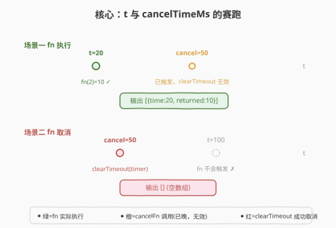
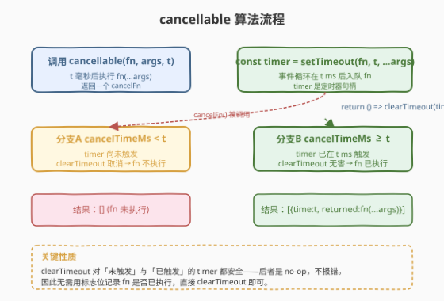
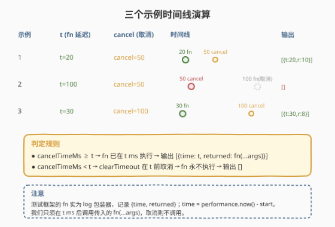

# LeetCode 执行可取消的延迟函数 题解

## 1. 题目概述

- **标题 / 题号**：执行可取消的延迟函数（#2715，easy）
- **链接**：https://leetcode.cn/problems/timeout-cancellation/
- **难度**：简单
- **标签**：闭包、定时器、`setTimeout`、JavaScript

**题意**：给定一个函数 `fn`、一个参数数组 `args` 和一个以毫秒为单位的超时时间 `t`，返回一个**取消函数** `cancelFn`。

在 `cancelTimeMs` 的延迟后，返回的取消函数 `cancelFn` 将被调用（外部安排 `setTimeout(cancelFn, cancelTimeMs)`）。

最初，函数 `fn` 的执行应该延迟 `t` 毫秒。

如果在 `t` 毫秒的延迟之前调用了 `cancelFn`，它应该取消 `fn` 的延迟执行。否则，如果在指定的延迟 `t` 内没有调用 `cancelFn`，则应执行 `fn`，并使用提供的 `args` 作为参数。

**示例 1**：

```text
输入：fn = (x) => x * 5, args = [2], t = 20
输出：[{"time": 20, "returned": 10}]
解释：
const cancelTimeMs = 50;
const cancelFn = cancellable((x) => x * 5, [2], 20);
setTimeout(cancelFn, cancelTimeMs);

取消操作被安排在延迟了 cancelTimeMs（50 毫秒）后进行，这发生在 fn(2) 在 20 毫秒时执行之后。
```

**示例 2**：

```text
输入：fn = (x) => x**2, args = [2], t = 100
输出：[]
解释：
const cancelTimeMs = 50;
const cancelFn = cancellable((x) => x**2, [2], 100);
setTimeout(cancelFn, cancelTimeMs);

取消操作被安排在延迟了 cancelTimeMs（50 毫秒）后进行，这发生在 fn(2) 在 100 毫秒时执行之前，导致 fn(2) 从未被调用。
```

**示例 3**：

```text
输入：fn = (x1, x2) => x1 * x2, args = [2,4], t = 30
输出：[{"time": 30, "returned": 8}]
解释：
const cancelTimeMs = 100;
const cancelFn = cancellable((x1, x2) => x1 * x2, [2,4], 30);
setTimeout(cancelFn, cancelTimeMs);

取消操作被安排在延迟了 cancelTimeMs（100 毫秒）后进行，这发生在 fn(2,4) 在 30 毫秒时执行之后。
```

**约束**：

- `fn` 是一个函数
- `args` 是一个有效的 JSON 数组
- `1 <= args.length <= 10`
- `20 <= t <= 1000`
- `10 <= cancelTimeMs <= 1000`

> 💡 本题是 LeetCode「30 天 JavaScript」系列，**仅提供 JavaScript / TypeScript 提交入口**。核心是 `setTimeout` + `clearTimeout` 的成对使用与**闭包捕获定时器句柄**，无算法复杂度可言，难点在理解「`clearTimeout` 对已触发/未触发的定时器都安全」这一性质。

## 2. 解题思路

### 2.1 暴力思路：标志位包裹

用一个 `cancelled` 布尔标志包裹 `fn`，`cancelFn` 调用时置位，`fn` 执行前先检查标志：

```javascript
function cancellable(fn, args, t) {
    let cancelled = false;
    setTimeout(() => {
        if (!cancelled) fn(...args);
    }, t);
    return () => { cancelled = true; };
}
```

可行，但**多此一举**：`clearTimeout` 本就提供了「撤销尚未触发的定时器」的能力，标志位等于重新发明轮子，且 `cancelled` 永远无法撤销已入队执行的回调（标志法与 `clearTimeout` 在「未触发」时等价，在「已触发」时都拦不住——后者靠 `clearTimeout` 是 no-op 安全，前者靠标志拦截入队前的检查点）。问题是标志法还要手动管理闭包变量，代码更长、状态更多。

### 2.2 核心观察：setTimeout 句柄 + clearTimeout 闭包



关键洞察：**`setTimeout` 返回一个定时器句柄 `timer`，`clearTimeout(timer)` 能撤销尚未触发的定时器**。把 `timer` 用闭包捕获进返回的 `cancelFn`，调用 `cancelFn` 即 `clearTimeout(timer)`——一行搞定。

两条路径只取决于 `cancelTimeMs` 与 `t` 的先后：

- **`cancelTimeMs < t`**：`cancelFn` 在 `fn` 触发前调用，`clearTimeout` 成功撤销 → `fn` 永不执行。
- **`cancelTimeMs ≥ t`**：`fn` 已在 `t` ms 触发完成，此时 `cancelFn` 调用 `clearTimeout` 撤销一个**已触发**的定时器——这是 **no-op（无操作且不报错）**，安全。

> ⚠️ **`clearTimeout` 的幂等性是本题的基石**：对一个已经触发过的 `timer` 调 `clearTimeout` 什么都不会发生，既不抛错也无副作用。因此**无需用标志位记录 fn 是否已执行**——直接 `clearTimeout(timer)` 即可覆盖两种场景。这是面试中最常被追问的点。

> 💡 **`setTimeout(fn, t, ...args)` 的第三参数**：JS 的 `setTimeout` 从第三个参数起会作为额外参数传给回调，故 `setTimeout(fn, t, ...args)` 等价于「t ms 后调用 `fn(...args)`」。这比 `setTimeout(() => fn(...args), t)` 少包一层箭头函数，常数更小、更直观。注意 `args` 是数组，需用展开运算符 `...args`。

### 2.3 算法流程图



三步：① 调用 `cancellable(fn, args, t)` → ② `const timer = setTimeout(fn, t, ...args)` 安排定时器并返回句柄 → ③ 返回 `() => clearTimeout(timer)`，闭包捕获 `timer`。`cancelFn` 被调用时分两种情况：未触发则成功取消，已触发则 `clearTimeout` 无害。

### 2.4 示例演算



| 示例 | t | cancelTimeMs | 关系 | 结果 |
|------|---|--------------|------|------|
| 1 | 20 | 50 | 50 ≥ 20 | `fn(2)=10` 在 20ms 执行 → `[{"time":20,"returned":10}]` |
| 2 | 100 | 50 | 50 < 100 | 50ms 取消，`fn` 永不执行 → `[]` |
| 3 | 30 | 100 | 100 ≥ 30 | `fn(2,4)=8` 在 30ms 执行 → `[{"time":30,"returned":8}]` |

> 💡 测试框架中传给 `cancellable` 的 `fn` 实为一个 `log` 包装器：它计算 `performance.now() - start` 作为 `time`，调用真正的题目函数得到 `returned`，push 进 `result` 数组。所以「输出」就是 `result` 数组——`fn` 执行过则有一条记录，没执行则是空数组。

## 3. 参考代码

### JavaScript（提交语言）

```javascript
/**
 * @param {Function} fn
 * @param {Array} args
 * @param {number} t
 * @return {Function}
 */
var cancellable = function(fn, args, t) {
    const timer = setTimeout(fn, t, ...args);
    return () => clearTimeout(timer);
};
```

> 💡 两行核心：`setTimeout` 安排定时器拿句柄，返回的闭包调 `clearTimeout`。`...args` 展开把数组元素逐个传给 `fn`，对应 `fn(x1, x2, ...)` 的形参列表。

### TypeScript

```typescript
type JSONValue = null | boolean | number | string | JSONValue[] | { [key: string]: JSONValue };
type Fn = (...args: JSONValue[]) => void

function cancellable(fn: Fn, args: JSONValue[], t: number): Function {
    const timer = setTimeout(fn, t, ...args);
    return () => clearTimeout(timer);
};
```

### Python（概念等价）

> 本题 LeetCode 仅开放 JS/TS，Python 版作概念对照。Python 用 `threading.Timer` 等价 `setTimeout`，`cancel()` 等价 `clearTimeout`。

```python
import threading
from typing import Callable, Any


def cancellable(fn: Callable, args: list, t: int) -> Callable[[], None]:
    timer = threading.Timer(t / 1000, fn, args=args)
    timer.start()
    return timer.cancel
```

> ⚠️ Python 的 `threading.Timer.cancel()` 同样「仅对未触发的定时器生效，已触发则 no-op」，与 `clearTimeout` 语义一致。注意 `Timer` 的时间单位是秒，需把毫秒 `t` 除以 1000。

## 4. 复杂度分析

| 维度 | 复杂度 | 说明 |
|------|--------|------|
| `cancellable` 时间 | $O(1)$ | `setTimeout` 注册一个宏任务，$O(1)$；展开 `args` $O(k)$（$k$=参数数，$k\le 10$） |
| `cancelFn` 时间 | $O(1)$ | `clearTimeout` 查表移除定时器，$O(1)$ |
| 空间 | $O(1)$ | 仅闭包捕获一个 `timer` 句柄（数值/对象引用） |

> 💡 本题无算法复杂度可言，本质是「正确使用平台 API」。真正考察的是对**事件循环**与**定时器生命周期**的理解。

## 5. 扩展：标志位法 vs clearTimeout 法 & AbortController

两种实现对比：

| 维度 | `clearTimeout` 法（本题解） | 标志位 `cancelled` 法 |
|------|-----------------------------|------------------------|
| 代码行数 | 2 行 | 4-5 行 |
| 额外状态 | 仅 `timer` 句柄 | `cancelled` 布尔 + `timer`（若不 clear 还会泄漏） |
| 已触发定时器是否泄漏 | 否，定时器已执行完从队列移除 | 若不配套 `clearTimeout`，定时器仍会入队执行（只是被标志拦下），多一次入队开销 |
| 能否在 fn 内做「取消后清理」 | 否，fn 直接触发，无检查点 | 是，可在 wrapper 内 `if (cancelled) return`，便于做清理/降级 |
| 适用场景 | 纯延迟执行+取消 | 需在取消时执行清理逻辑、或 fn 是异步需中途终止 |

**标志位法的适用场景**——取消时需做清理：

```javascript
function cancellable(fn, args, t) {
    let cancelled = false;
    const timer = setTimeout(() => {
        if (cancelled) return;          // 取消则不执行
        fn(...args);
    }, t);
    return () => {
        cancelled = true;
        clearTimeout(timer);             // 仍 clearTimeout 避免入队开销
    };
}
```

**现代 Web 的取消范式：`AbortController` / `AbortSignal`**。`fetch`、`setTimeout`（较新运行时）等异步 API 都接受一个 `signal`，`controller.abort()` 统一取消，无需手动 `clearTimeout`：

```javascript
function cancellable(fn, args, t) {
    const controller = new AbortController();
    setTimeout(() => fn(...args), t, { signal: controller.signal });
    return () => controller.abort();
}
```

> 💡 `AbortSignal` 是现代异步取消的「标准件」：一个信号源能同时取消 `fetch`、`setTimeout`、流读取等多个异步操作，且信号一经 abort 不可逆、对所有监听者广播。本题 `clearTimeout` 是其「单一定时器」的原始形态。

## 6. 面试要点

1. **为什么不需要标志位记录 fn 是否已执行？**

   > `clearTimeout` 对**已触发**的定时器是 no-op（无操作且不报错），对**未触发**的则撤销。所以无论 `cancelFn` 在 `fn` 触发前还是后调用，`clearTimeout(timer)` 都安全——前者取消、后者无害。标志位是多余的。

2. **`setTimeout(fn, t, ...args)` 与 `setTimeout(() => fn(...args), t)` 有何区别？**

   > 前者把 `args` 作为额外参数直接传给 `setTimeout`，由其 t ms 后调用 `fn(arg0, arg1, ...)`；后者多包一层箭头函数，先调度箭头函数、再在箭头内展开调用。功能等价，前者少一层闭包、常数更小。注意 `args` 是数组，必须 `...args` 展开，否则 `fn` 收到的是整个数组作单个参数。

3. **`clearTimeout` 传一个不存在的/已 clear 的 id 会怎样？**

   > 规范规定 `clearTimeout` 接受任意数值/句柄，找不到对应定时器则静默忽略，**不抛错**。所以重复 clear、clear 已触发的、clear `undefined` 都安全。这正是本题「cancelFn 可能在 fn 执行后调用」也能直接 `clearTimeout` 的依据。

4. **`fn` 是宏任务还是微任务？`cancelFn` 的调用与 `fn` 的执行顺序如何保证？**

   > `setTimeout` 注册的是**宏任务**。事件循环按调用时机决定先后：若 `cancelTimeMs < t`，则 `cancelFn` 的宏任务先入队执行，`clearTimeout` 撤销尚未到点的 `fn` 定时器；若 `cancelTimeMs ≥ t`，则 `fn` 宏任务先在 `t` ms 入队执行完，`cancelFn` 后到时 `clearTimeout` 已无效。两者都是宏任务，按时间顺序入队，无竞态。

5. **如果 `t` 为 0 或 `cancelTimeMs` 为 0 呢？**

   > `t=0` 时 `fn` 会在当前宏任务清空后、下一个事件循环立即执行（仍是宏任务，非同步）。若 `cancelTimeMs=0` 且 `cancelFn` 在同一同步代码块紧接 `cancellable` 后注册，则 `cancelFn` 的宏任务与 `fn` 的宏任务都在下一轮，按注册顺序 `fn` 先（`cancellable` 先注册），`clearTimeout` 来不及。本题约束 `t ≥ 20`、`cancelTimeMs ≥ 10`，不触发此边界，但理解宏任务入队顺序有助于排错。

> 💡 **一句话总结**：2715 = 「`setTimeout(fn, t, ...args)` 拿句柄，闭包返回 `() => clearTimeout(timer)`」。`clearTimeout` 对已/未触发定时器都安全，故无需标志位——这是本题唯一的「考点」。

## 同类练习题

| # | 题目 | 与本题的关联 |
|---|------|-------------|
| 2622 | [有时间限制的缓存](https://leetcode.cn/problems/cache-with-time-limit/) | `Map` + `setTimeout` 过期清理，覆盖 key 时必须 `clearTimeout` 旧定时器——与本题「`clearTimeout` 撤销」思想相通，且必须处理「已触发 vs 未触发」（[题解](../2601-2700/2622_有时间限制的缓存.md)） |
| 2621 | [睡眠函数](https://leetcode.cn/problems/sleep/) | 用 `setTimeout` 包成 `Promise`，`await` 后继续——把本题「t ms 后执行」升级为「t ms 后 resolve」，定时器与异步语义一脉相承（[题解](../2601-2700/2621_睡眠函数.md)） |
| 2637 | [有时间限制的 Promise 对象](https://leetcode.cn/problems/promise-time-limit/) | 给 Promise 加超时取消，超时则 reject——是本题「t 与 cancelTimeMs 赛跑」的 Promise 版，取消语义直接对应（[题解](../2601-2700/2637_有时间限制的Promise对象.md)） |
| 2676 | [节流](https://leetcode.cn/problems/throttle/) | 闭包 + `setTimeout` 管冷却窗口，首沿立即执行 / 尾沿续杯；同为「30 天 JS」闭包设计题，对照「闭包捕获定时器句柄控制行为」（[题解](../2601-2700/2676_节流.md)） |
| 2666 | [只允许一次函数调用](https://leetcode.cn/problems/allow-one-function-call/) | 闭包捕获 `called` 布尔标志，首次调用后置位拦截后续；与本题「闭包捕获句柄 + 一次性取消」的闭包封装思想一致（[题解](../2601-2700/2666_只允许一次函数调用.md)） |
