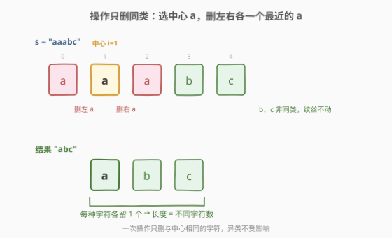
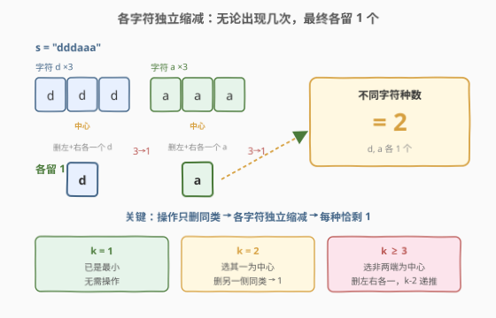
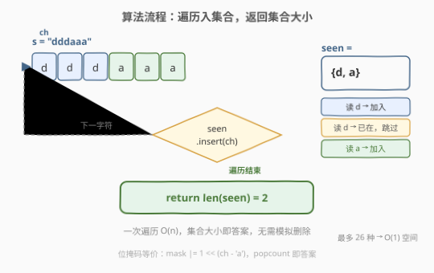
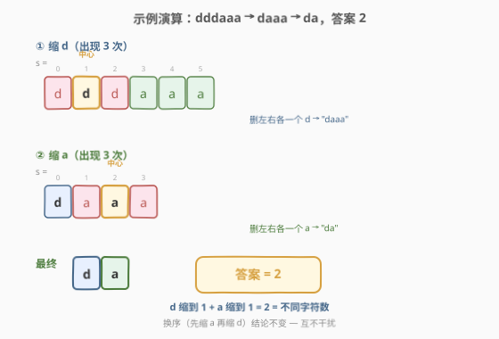

# LeetCode 最小化字符串长度 题解

## 1. 题目概述

- **标题 / 题号**：最小化字符串长度（#2716，easy）
- **链接**：https://leetcode.cn/problems/minimize-string-length/
- **难度**：简单
- **标签**：哈希表、字符串

**题意**：给你一个下标从 `0` 开始的字符串 `s`，重复执行下述操作**任意次**：

- 在字符串中选出一个下标 `i`，并使 `c` 为下标 `i` 处的字符。并在 `i` **左侧**（如果有）和**右侧**（如果有）各**删除**一个距离 `i` **最近**的字符 `c`。

请你通过执行上述操作任意次，使 `s` 的长度**最小化**。返回最小化字符串的长度。

**示例 1**：

```text
输入：s = "aaabc"
输出：3
解释：选择下标 1 处的字符 'a'，删除下标 0（左侧最近的 'a'）和下标 2（右侧最近的 'a'），
      字符串变为 "abc"，无法再缩短，最小长度为 3。
```

**示例 2**：

```text
输入：s = "cbbd"
输出：3
解释：选择下标 1 处的字符 'b'，左侧无 'b'，删除右侧下标 2 的 'b'，字符串变为 "cbd"，
      无法再缩短，最小长度为 3。
```

**示例 3**：

```text
输入：s = "dddaaa"
输出：2
解释：先选下标 1 的 'd'，删除下标 0、2 的 'd'，得到 "daaa"；
      再选下标 2 的 'a'，删除下标 1、3 的 'a'，得到 "da"，最小长度为 2。
```

**约束**：

- $1 \le \text{s.length} \le 100$
- `s` 仅由小写英文字母组成

> 💡 本题是 LeetCode 周赛 348 第一题。看似是一道字符串模拟题，实则藏着一个优雅的不变量：**操作只删除与"中心"相同的字符，不同字符之间互不干扰**。一旦看破这一点，答案就坍缩成一个哈希计数问题——统计 `s` 中有多少种不同字符即可。

## 2. 解题思路

### 2.1 暴力思路：逐次模拟操作

最朴素的直觉是按题意直接模拟：扫描字符串，找到一个出现次数 $\ge 2$ 的字符 `c`，选定其某个位置 `i`，再向左右各找最近的 `c` 并删除，然后重整下标、重复。

这条路能走通但有三个痛点：

| 痛点 | 说明 |
|------|------|
| **下标易错** | 每次删除后整串移位，左侧/右侧"最近 `c`"的下标需要重新定位，实现极易越界或漏删 |
| **复杂度偏高** | 每次操作需 $O(n)$ 扫描定位 + $O(n)$ 移位，共最多 $O(n)$ 次操作，总计 $O(n^2)$ |
| **看不出终止条件** | 模拟何时"无法再缩短"需额外判定，容易多删或漏停 |

更关键的是——**模拟把人困在"怎么删"的细节里，却忽略了"最终能删成什么样"的结构**。本题只需返回最小长度，不需要返回最终字符串，因此应从"不变量"角度切入。

### 2.2 核心观察：每个字符最终只剩一个，答案 = 不同字符数



破局的第一步是看清操作的"作用域"。仔细读题：选定下标 `i` 的字符 `c` 后，**删除的是 `i` 左右最近的那两个 `c`**——也就是说，一次操作**只会删除字符 `c`**，绝不会碰其他字符。这带来两条决定性的推论：

> 💡 **推论一（互不干扰）**：对字符 `c` 的操作只删 `c`，对字符 `d` 的操作只删 `d`。于是**每种字符的缩减过程彼此完全独立**，可以分开讨论。

> 💡 **推论二（中心不删）**：每次操作保留被选中的那个 `c`（中心），只删它左右的同类。因此任何一次操作都不会把字符 `c` 的数量减到 $0$——至少留一个"中心"。

把两条推论合起来，问题被拆成独立的子问题：**对单个字符 `c`，若它出现 $k$ 次，最少能缩到几个？**



设字符 `c` 出现 $k$ 次：

| $k$ | 能否缩到 1 | 操作过程 | 说明 |
|-----|-----------|----------|------|
| $k = 1$ | 已是 1，无需操作 | — | 天然最小 |
| $k = 2$ | ✅ 缩到 1 | 选其一为中心，删另一侧唯一的 `c` | 只一侧有同类，删一个，留一个 |
| $k \ge 3$ | ✅ 缩到 1 | 选"两侧都有同类"的中心，删左、右各一个 `c`，$k$ 减 $2$ | 重复直到 $k = 1$ 或 $2$，再归入上两行 |

核心论证：$k \ge 3$ 时一定存在一个出现位置"左右两侧各有至少一个 `c`"（取非两端的任一个即可），一次操作删 $2$ 个、留 $1$ 个，$k \to k-2$。递推下去，$k$ 奇数会走到 $1$，$k$ 偶数会走到 $2$ 再走到 $1$。**无论 $k$ 多大，最终都恰好剩 $1$ 个 `c`**。

再由推论二，操作永远删不掉最后那个"中心"，所以**不可能减到 $0$**——$1$ 就是单种字符的下界。

> ⚠️ **为什么不能减到 0？** 每次操作的"中心" `c` 自身不被删，它要么成为下一次操作的"邻居"被删，要么继续当"中心"留到最后。但当只剩 $1$ 个 `c` 时，它左右再无同类可删，操作链自然终止。因此 $1$ 是不可突破的下界。

综合：每种字符独立缩到恰好 $1$ 个，互不干扰。**最小化长度 = `s` 中不同字符的种数**。

### 2.3 算法流程图



实现极简，只有一个动作——**遍历 `s`，把每个字符塞进哈希集合，返回集合大小**：

1. 初始化空集合 `seen`；
2. 逐字符遍历 `s`，对每个 `ch` 执行 `seen.insert(ch)`（或 `seen.add(ch)`）；
3. 遍历结束，`len(seen)` 即为答案。

无需模拟任何删除、无需追踪下标、无需排序——一次遍历即可。

> 💡 由于 `s` 仅含 26 个小写字母，也可用一个 `int` 的低 26 位当位掩码（`mask |= 1 << (ch - 'a')`），最后数 `popcount(mask)`。这是哈希集合的极简等价物，常数更小。

### 2.4 示例演算



以**示例 3**（`s = "dddaaa"`）为例，分字符独立缩减：

| 阶段 | 字符 | 出现次数 | 操作 | 缩减后该字符数 |
|------|------|---------|------|---------------|
| ① 缩 `d` | `d` | $3$（下标 0,1,2） | 选下标 1 为中心，删下标 0、2 | $1$（留下标 1 的 `d`） |
| ② 缩 `a` | `a` | $3$（下标 1,2,3，相对新串） | 选中间 `a` 为中心，删左右各一个 `a` | $1$（留一个 `a`） |
| ③ 合并 | — | — | `d` 与 `a` 各留 1 个 | 共 $2$ 个 |

最终字符串 `"da"`，长度 $2$ ✓。即便操作顺序换成先缩 `a` 再缩 `d`，结论不变——这正是"互不干扰"的威力。

以**示例 1**（`s = "aaabc"`）为例：不同字符 $\{a, b, c\}$ 共 $3$ 种，答案 $3$ ✓。

以**示例 2**（`s = "cbbd"`）为例：不同字符 $\{c, b, d\}$ 共 $3$ 种，答案 $3$ ✓。

## 3. 参考代码

### C++（哈希集合）

```cpp
class Solution {
public:
    int minimizedStringLength(string s) {
        unordered_set<char> seen;
        for (char c : s) {
            seen.insert(c);
        }
        return seen.size();
    }
};
```

### C++（位掩码，极致常数）

```cpp
class Solution {
public:
    int minimizedStringLength(string s) {
        int mask = 0;
        for (char c : s) {
            mask |= 1 << (c - 'a');
        }
        return __builtin_popcount(mask);
    }
};
```

> 💡 `mask |= 1 << (c - 'a')` 把每个字母编码为一个独立位，`__builtin_popcount` 数 $1$ 的个数即不同字符数。26 位整数绰绰有余，无需集合、无需哈希，常数最优。

### Python

```python
class Solution:
    def minimizedStringLength(self, s: str) -> int:
        return len(set(s))
```

> 💡 Python 的 `set(s)` 直接以可迭代对象构造集合，一行即得不同字符数。内部就是一次遍历逐个 `add`，与 C++ 版逻辑完全一致。

## 4. 复杂度分析

| 维度 | 复杂度 | 说明 |
|------|--------|------|
| 时间复杂度 | $O(n)$ | 一次遍历 `s`，每个字符 $O(1)$ 入集合（平均） |
| 空间复杂度 | $O(1)$ | 最多 26 个小写字母，集合/位掩码大小有上界常数 |

> 💡 严格说哈希集合平均 $O(1)$、最坏 $O(\Sigma)$（$\Sigma$ 为字符集大小），但本题 $\Sigma = 26$ 是常数，故均摊/最坏都视作 $O(1)$ 空间。位掩码版连哈希开销都省了，是 $O(1)$ 时间均摊的最优形式。

## 5. 扩展：操作不变量与"能否减到 0"的边界

本题的精髓不在代码而在**不变量分析**。把操作的作用域拎清楚后，$O(n)$ 哈希计数是水到渠成的。这里把论证链条再收紧一遍，供面试时层层递进：

**链条一：操作只删同类**。读题——删除的是"距离 `i` 最近的字符 `c`"，而 `c` 就是 `s[i]` 本身。所以一次操作只可能删字符 `c`，异类字符安然无恙。⇒ **各字符独立缩减**。

**链条二：中心永不被删（当次）**。操作的"中心" `s[i]` 是保留项，删的是它左右的同类。⇒ 一次操作至少留 $1$ 个 `c`。

**链条三：剩 1 个时操作链终止**。当某字符只剩 $1$ 个，它左右再无同类，无法触发删除，操作链自然终止。⇒ **$1$ 是单字符下界，且可达**。

**链条四：$\ge 2$ 时总能继续缩**。$k = 2$ 选其一删另一；$k \ge 3$ 选非两端者删左右各一。⇒ $k \ge 2$ 时一定能减，且每次至少减 $1$（$k=2$）或减 $2$（$k\ge 3$），最终收敛到 $1$。

四条链条合龙：**每种字符最终恰剩 $1$ 个**，答案 = 不同字符种数。

> ⚠️ **易错点：以为能减到 0**。常见误区是觉得"既然能反复删，总能删光某个字符"。但操作的删除对象是"中心的同类邻居"，中心自身永远存活当次；当只剩 $1$ 个时无邻居可删，链终止。这是"删邻不删己"规则决定的硬下界。

另一个值得玩味的视角：如果把题面改成"删除 `i` 左右各一个**任意**字符"（不限同类），答案就完全不同——那变成纯粹的配对消除问题，与括号匹配/栈消除同构。本题的"只删同类"约束恰恰是让问题**变简单**的关键，它把全局耦合拆成了逐字符独立。

## 6. 面试要点

1. **为什么不同字符的操作互不干扰？**

   > 因为每次操作只删除与中心 `s[i]` 相同的字符 `c`，异类字符即便夹在中间也不会被删（它们不是"最近的 `c`"）。所以对 `a` 的操作不影响 `b` 的数量，各字符可独立缩减。

2. **为什么每个字符最终恰好剩 1 个，不能是 0？**

   > 一次操作保留被选中的"中心"`c`，只删它左右的同类。当某字符只剩 $1$ 个时，它左右没有同类可删，操作链终止。所以 $1$ 是不可突破的下界；而 $k \ge 2$ 时总能继续删（$k=2$ 删一个、$k\ge3$ 删两个），故必收敛到 $1$。

3. **模拟法为什么不如哈希计数？**

   > 模拟法困在"怎么删"的细节里：每次删除后下标移位、需重新定位最近同类、$O(n^2)$ 且易越界。而题目只要最小长度、不要最终串，从"不变量"角度切入——各字符独立缩到 $1$——直接得答案 = 不同字符数，$O(n)$ 一次遍历即可，代码也短得多。

4. **位掩码版比哈希集合版好在哪里？**

   > 本题字符集只有 26 个小写字母，用一个 `int` 的 26 位即可表示出现与否，`mask |= 1 << (c - 'a')` 入掩码、`__builtin_popcount` 数 $1$。省去哈希表的散列/冲突开销，常数更小、空间更紧凑，是字符集为小常数时的经典优化。

5. **如果字符集不限于 26 个小写字母（如任意 Unicode），解法还成立吗？**

   > 结论仍成立——答案仍是不重复字符的种数，只是位掩码不再适用（字符集太大），需回到哈希集合。时间仍 $O(n)$，空间从 $O(1)$ 变为 $O(\min(n, \Sigma))$（$\Sigma$ 为字符集大小）。

> 💡 **一句话总结**：2716 = "操作只删同类 → 各字符独立缩减 → 每种恰剩 1 个 → 答案 = 不同字符数"。考点在**不变量分析**而非模拟实现，看清"删邻不删己、同类才互删"两条性质，$O(n)$ 哈希计数即终局。

## 同类练习题

| # | 题目 | 与本题的关联 |
|---|------|-------------|
| 2704 | [相等还是不相等](https://leetcode.cn/problems/equal-objects/) | 同样是周赛简单题，考查对基本数据结构的直接运用，与本题"看似复杂实则一行"的命题风格一致 |
| 2710 | [移除字符串中的尾随零](https://leetcode.cn/problems/remove-trailing-zeros-from-a-string/) | 同为字符串操作类简单题，对比"从右扫描定位切点"与本题"遍历统计不同字符"，体会字符串题从模拟到观察的思路跃迁 |
| 389 | [找不同](https://leetcode.cn/problems/find-the-difference/) | 同为哈希表 + 字符串题，通过计数/集合定位差异字符，与本题"统计不同字符"共享哈希计数骨架 |
| 242 | [有效的字母异位词](https://leetcode.cn/problems/valid-anagram/) | 经典哈希计数题，与本题同属"遍历字符串 + 哈希表统计字符频次"家族，可对照计数与去重的不同用法 |
