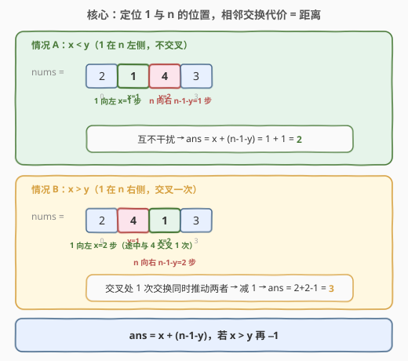
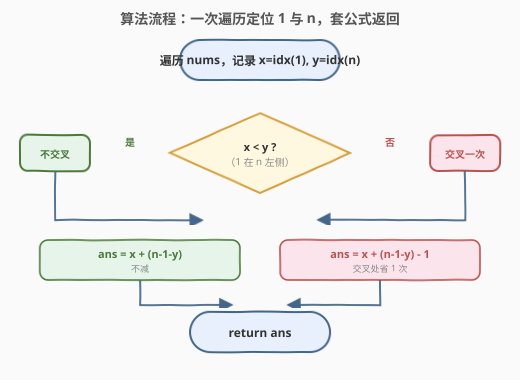
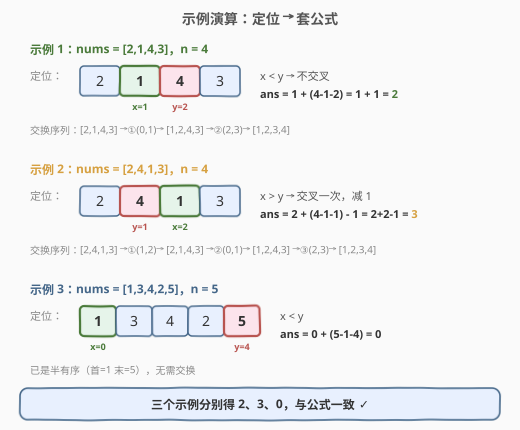

# 半有序排列

- **题目名称**：半有序排列
- **链接**：[2717. 半有序排列](https://leetcode.cn/problems/semi-ordered-permutation/)
- **难度**：简单
- **标签**：数组、模拟

## 1. 题目概述

给你一个下标从 **0** 开始、长度为 `n` 的整数排列 `nums`（即 `1` 到 `n` 每个数字恰好出现一次）。

如果排列的第一个数字等于 `1` 且最后一个数字等于 `n`，则称其为 **半有序排列**。你可以执行多次下述操作，直到 `nums` 变成半有序排列：

- 选择 `nums` 中**相邻**的两个元素，然后交换它们。

返回使 `nums` 变成半有序排列所需的**最小操作次数**。

**示例 1**：

```text
输入：nums = [2,1,4,3]
输出：2
解释：依次执行操作得到半有序排列：
1 - 交换下标 0 和下标 1 对应元素，排列变为 [1,2,4,3]。
2 - 交换下标 2 和下标 3 对应元素，排列变为 [1,2,3,4]。
不存在操作少于 2 次的方案。
```

**示例 2**：

```text
输入：nums = [2,4,1,3]
输出：3
解释：依次执行操作得到半有序排列：
1 - 交换下标 1 和下标 2 对应元素，排列变为 [2,1,4,3]。
2 - 交换下标 0 和下标 1 对应元素，排列变为 [1,2,4,3]。
3 - 交换下标 2 和下标 3 对应元素，排列变为 [1,2,3,4]。
不存在操作少于 3 次的方案。
```

**示例 3**：

```text
输入：nums = [1,3,4,2,5]
输出：0
解释：这个排列已经是一个半有序排列，无需执行任何操作。
```

**约束条件**：

- `2 <= nums.length == n <= 50`
- `1 <= nums[i] <= 50`
- `nums` 是一个**排列**

> 💡 半有序只要求首元素为 `1`、末元素为 `n`，**中间元素的顺序无所谓**。这意味着只需把 `1` 挪到最左、把 `n` 挪到最右，其余元素顺其自然即可——这是公式能成立的根本原因。

---

## 2. 解题思路

### 2.1 暴力思路

对排列状态做 BFS：每个状态是一组排列，每次枚举所有相邻对生成后继状态，首次到达「首为 1 末为 `n`」的状态即返回步数。状态数为 $n!$，对 $n=50$ 完全不可行。

或者逐次模拟相邻交换：反复扫描找出可推动方向的相邻对交换，直到 `1` 到首位、`n` 到末位。可行但若每次真去挪动数组则是 $O(n^2)$，且还需想清楚「何时 1 往左、何时 n 往右」的调度，多绕一层。

瓶颈在于：没意识到**交换次数就等于元素需要移动的距离**，把过程当成了「逐步搬运」而非「数格子算距离」。

### 2.2 核心观察：定位 1 与 n 的位置 + 相邻交换代价 = 距离



两条关键事实：

1. **把某元素经相邻交换移动 $d$ 格，恰好需要 $d$ 次交换**——每次交换只能让它在序列中前进 1 格，方向确定后路径唯一，交换数 = 位移数（其余元素被「挤」开一格，无需额外代价）。
2. **只需移动 1 和 n 两个元素**：半有序对中间元素无要求，把 1 挪到下标 0、把 `n` 挪到下标 $n-1$，其余元素自动就位，无需为它们额外花交换。

记 $x$ 为 `1` 的下标、$y$ 为 `n` 的下标：

- 把 `1` 移到下标 0：需要 $x$ 次相邻交换（向左）。
- 把 `n` 移到下标 $n-1$：需要 $n-1-y$ 次相邻交换（向右）。

两者是否独立取决于相对位置：

| 情况 | 关系 | 说明 | 答案 |
|------|------|------|------|
| `1` 在 `n` 左侧 | $x < y$ | 两者反向移动、路径不重叠，各算各的 | $x + (n-1-y)$ |
| `1` 在 `n` 右侧 | $x > y$ | `1` 左移途中必然与 `n` 相邻并交换一次，**这一次交换同时让 1 左移一格、n 右移一格**，等价于免费推动了 `n` 一次 | $x + (n-1-y) - 1$ |

> ⚠️ $n \ge 2$ 时 `1 ≠ n`，故 $x \ne y$，只有上述两种情况，无需再讨论 $x=y$。

> 💡 **「交叉省一次」的直觉**：当 `1` 在 `n` 右边，`1` 必须从 `n` 身上「跨」过去。跨越那一下是相邻交换，它同时完成了「1 左移」和「n 右移」两件事——本来这两步分属两个目标、各算一次，现在合并成一次，所以总数减 1。这等价于：先把 `1` 左移 $x$ 步，过程中 `n` 被挤右了 1 格（变成 $y+1$），再移 `n` 只需 $n-1-(y+1)=n-y-2$ 步，合计 $x+n-y-2=x+(n-1-y)-1$。

### 2.3 算法流程图



### 2.4 示例演算



| 示例 | nums | n | x=idx(1) | y=idx(n) | 关系 | 计算 | 结果 |
|------|------|---|----------|----------|------|------|------|
| 1 | `[2,1,4,3]` | 4 | 1 | 2 | $x<y$ | $1+(4-1-2)$ | **2** |
| 2 | `[2,4,1,3]` | 4 | 2 | 1 | $x>y$ | $2+(4-1-1)-1$ | **3** |
| 3 | `[1,3,4,2,5]` | 5 | 0 | 4 | $x<y$ | $0+(5-1-4)$ | **0** |

> 💡 示例 2 的交换序列正展示了「交叉省一次」：`[2,4,1,3]` →①交换(1,2)得 `[2,1,4,3]`（这一步正是 1 与 4 跨越的那次相邻交换）→②交换(0,1)→③交换(2,3)。第 ① 步同时把 1 往左、4 往右各推一格。

---

## 3. 参考代码

### C++

```cpp
class Solution {
public:
    int semiOrderedPermutation(vector<int>& nums) {
        int n = nums.size();
        int x = -1, y = -1;
        for (int i = 0; i < n; i++) {
            if (nums[i] == 1) x = i;
            else if (nums[i] == n) y = i;
        }
        return x < y ? x + (n - 1 - y) : x + (n - 1 - y) - 1;
    }
};
```

### Python

```python
class Solution:
    def semiOrderedPermutation(self, nums: List[int]) -> int:
        n = len(nums)
        x = nums.index(1)
        y = nums.index(n)
        return x + (n - 1 - y) - (1 if x > y else 0)
```

> 💡 `nums` 是排列，`1` 与 `n` 必存在；一轮遍历同时定位两者即可。Python 的 `list.index` 单次 $O(n)$，调两次仍是 $O(n)$，常数略大但更直观。

---

## 4. 复杂度分析

| 维度 | 复杂度 | 说明 |
|------|--------|------|
| 时间复杂度 | $O(n)$ | 单次遍历定位 `1` 与 `n` 的下标；公式计算 $O(1)$ |
| 空间复杂度 | $O(1)$ | 仅两个下标变量 `x`、`y` |

---

## 5. 扩展：为什么「只动 1 和 n」一定最优

半有序的约束只覆盖首末两位，对中间 $n-2$ 个位置无要求。把 `1` 挪到首位、`n` 挪到末位后，中间元素是被「挤」出来的某种排列，恰好满足约束——无需再为它们花任何交换。而任何方案都必须让 `1` 至少左移 $x$ 格、`n` 至少右移 $n-1-y$ 格才能就位（这是位移下界），故这两项之和（减去可能的一次交叉重叠）即全局下界，方案达到下界，必然最优。

更一般地，本题是「**目标位固定的相邻交换排序**」的退化：当只关心少数几个元素的就位而不关心整体顺序时，答案只取决于这几个元素的位置关系，不必模拟整个排列的重排过程。

---

## 6. 面试要点

1. **为什么交换次数就等于移动距离？**

   > 相邻交换每次最多让目标元素在序列中前进 1 格，且不交换其它无关元素时这是它唯一的推进方式；要推进 $d$ 格就必须 $\ge d$ 次交换。同时存在 $d$ 次顺序相邻交换即可完成（沿途依次与左侧元素换），所以恰好 $d$ 次——位移既是下界也是上界。

2. **为什么不用管中间元素的顺序？**

   > 半有序只要求 `nums[0]==1` 且 `nums[n-1]==n`，中间 $n-2$ 位任意。把 `1`、`n` 推到端点后中间元素被挤成某种排列，天然满足约束，无需额外交换。任何「额外整理中间顺序」的操作都是浪费，不会出现在最优解中。

3. **$x>y$ 时为什么正好减 1 而不是更多？**

   > `1` 从右往左移必然与 `n` 相邻并交换**恰好一次**（跨越那一下）。这一次交换同时完成「1 左移一格」与「n 右移一格」两个目标，被两段计数各算了一次，故总数多算了 1，减去即可。除此之外两段移动互不相交，无更多重叠。

4. **能否先移 `n` 再移 `1`，结果一样吗？**

   > 一样。无论先移谁，`1` 需左移 $x$ 格、`n` 需右移 $n-1-y$ 格，交叉次数只取决于 $x$ 与 $y$ 的大小关系，与移动先后无关。总代价 $=x+(n-1-y)-\mathbb{1}[x>y]$。

5. **若题目改成「整体升序」而非半有序，怎么办？**

   > 整体升序是经典的「相邻交换排序 = 逆序对数」问题，用归并排序数逆序对，$O(n\log n)$。半有序是其特例：只关心 `1` 与 `n` 两个元素的相对位置，退化为 $O(n)$ 定位 + $O(1)$ 公式。

> 💡 **一句话总结**：2717 = 「定位 $x=\text{idx}(1)$、$y=\text{idx}(n)$，套公式 $x+(n-1-y)-\mathbb{1}[x>y]$」。考点是把「相邻交换过程」抽象成「元素位移距离」，并识别交叉时的重叠计数。

---

## 7. 同类练习题

- [2340. 生成有效数组的最少交换次数](https://leetcode.cn/problems/minimum-adjacent-swaps-to-make-a-valid-array/)：相邻交换让最小元素到首位、最大元素到末位——与本题几乎同构，直接套相同的「定位 + 距离 + 交叉减 1」公式
- [1850. 邻位交换的最小次数](https://leetcode.cn/problems/minimum-adjacent-swaps-to-reach-the-kth-smallest-number/)：相邻交换把排列变为第 k 小排列，交换次数 = 逆序对差，同为「相邻交换代价 = 位移」的延伸
- [1703. 得到连续 K 个 1 的最少相邻交换次数](https://leetcode.cn/problems/minimum-adjacent-swaps-for-k-consecutive-ones/)：相邻交换把 K 个 1 聚成连续段，中位数贪心求位移之和——把「单元素位移」升级为「多元素到位」
- [1053. 交换一次的先前排列](https://leetcode.cn/problems/previous-permutation-with-one-swap/)：一次交换得到字典序前驱，关注排列中相邻/单次交换对顺序的影响，与本题的交换语义对照
- [31. 下一个排列](https://leetcode.cn/problems/next-permutation/)：排列变换的经典母题，理解排列下标与交换的关系，是 1850/1053 的上游基础
