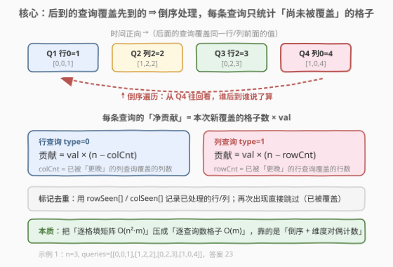
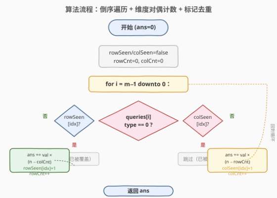
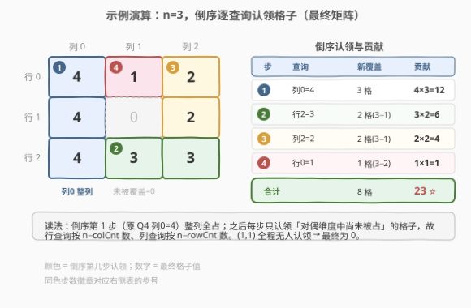

# LeetCode 查询后矩阵的和 题解

## 1. 题目概述

- **标题 / 题号**：查询后矩阵的和（#2718，medium）
- **链接**：https://leetcode.cn/problems/sum-of-matrix-after-queries/
- **难度**：中等
- **标签**：数组、哈希表

**题意**：给你一个整数 $n$ 和一个下标从 0 开始的二维数组 `queries`，其中 `queries[i] = [type_i, index_i, val_i]`。初始有一个 $n \times n$、元素全为 0 的矩阵。每个查询执行以下操作之一：

- 若 `type_i == 0`，将第 `index_i` 行的所有元素**覆盖**为 `val_i`（覆盖之前任何值）；
- 若 `type_i == 1`，将第 `index_i` 列的所有元素**覆盖**为 `val_i`。

执行完所有查询后，返回矩阵中所有整数的和。

**示例 1**：

```text
输入：n = 3, queries = [[0,0,1],[1,2,2],[0,2,3],[1,0,4]]
输出：23
解释：四次查询后矩阵为 [[4,1,2],[4,0,2],[4,3,3]]，元素之和为 23。
```

**示例 2**：

```text
输入：n = 3, queries = [[0,0,4],[0,1,2],[1,0,1],[0,2,3],[1,2,1]]
输出：17
解释：五次查询后矩阵为 [[1,4,1],[1,2,1],[3,3,1]]，元素之和为 17。
```

**约束**：

- $1 \le n \le 10^4$
- $1 \le \text{queries.length} \le 5 \times 10^4$
- $\text{queries}[i].\text{length} == 3$
- $0 \le \text{type}_i \le 1$
- $0 \le \text{index}_i < n$
- $0 \le \text{val}_i \le 10^5$

> 💡 注意 $n \le 10^4$ 这一关键约束：矩阵格子数可达 $10^8$，**不可能**真正维护 $n \times n$ 矩阵再求和（$O(n^2)$ 空间 / 时间都会爆）。突破口是「覆盖」语义——**后到的查询覆盖先到的**，逆着时间轴看，每条查询只对「尚未被后续查询覆盖」的格子负责。

## 2. 解题思路

### 2.1 暴力思路

老老实实维护 $n \times n$ 矩阵 `mat`，对每条查询把整行/整列填成 `val`，最后遍历求和：

- 时间 $O(n^2 + n \cdot m)$（$m$ 为查询数，每次覆盖 $n$ 格），$n=10^4, m=5\times10^4$ 时约 $5\times10^8$；
- 空间 $O(n^2) = 10^8$，内存爆。

> 💡 **瓶颈**：覆盖是「整行/整列」批量操作，且后到的会盖掉先到的。我们不需要知道每个格子最终是什么，只需知道「每条查询最终在多少个格子里存活」。把「逐格」视角换成「逐查询、数存活格子」即可。

### 2.2 核心观察：倒序处理 + 维度对偶计数



关键是「后到的覆盖先到的」。**从最后一条查询往前看**：处理某条查询时，凡是在它之后出现、且作用于「同一行/列」的查询，已经把对应格子定死了，本条查询动不了它们。于是：

- **行查询**（`type=0`，行 `index=val`）：本行只有那些**还没被「更晚的列查询」覆盖**的列才归本条管。存活格子数 = $n - \text{colCnt}$，其中 $\text{colCnt}$ 是「到目前为止（逆序看）已被列查询覆盖的列数」。
- **列查询**（`type=1`，列 `index=val`）：同理，存活格子数 = $n - \text{rowCnt}$，$\text{rowCnt}$ 是已被行查询覆盖的行数。

每条查询贡献 $\text{val} \times (\text{存活格子数})$。用两个布尔数组 `rowSeen[]`、`colSeen[]` 标记「本行/列是否已被更晚的查询覆盖过」——若已覆盖，本条查询**整条跳过**（它已被完全盖掉）。

> ⚠️ **为何是「对偶维度」计数？** 行查询覆盖的是一整行 $n$ 格，但其中属于「更晚列查询」的格子已被列查询占走，故按**列数** $\text{colCnt}$ 扣减；反之列查询按**行数** $\text{rowCnt}$ 扣减。行与列互为对偶维度，这是把 $O(n)$ 覆盖压成 $O(1)$ 贡献计算的关键。

### 2.3 算法流程



1. 初始化 `rowSeen[0..n-1]=false`、`colSeen[0..n-1]=false`、`rowCnt=colCnt=0`、`ans=0`；
2. **倒序**遍历 `i` 从 $m-1$ 到 $0$，取出 `(type, index, val)`：
   - `type == 0`（行查询）：若 `rowSeen[index]` 为真则跳过；否则 `ans += val * (n - colCnt)`，置 `rowSeen[index]=true`、`rowCnt++`；
   - `type == 1`（列查询）：若 `colSeen[index]` 为真则跳过；否则 `ans += val * (n - rowCnt)`，置 `colSeen[index]=true`、`colCnt++`；
3. 返回 `ans`。

### 2.4 示例演算



以示例 1 `n=3, queries = [[0,0,1],[1,2,2],[0,2,3],[1,0,4]]` 为例，倒序处理（$Q_4 \to Q_1$）：

- **倒序步 1**（$Q_4$ 列0=4）：此时无行被覆盖（$\text{rowCnt}=0$），整列 $0$ 共 $3$ 格归它 $\Rightarrow$ 贡献 $4 \times (3-0) = 12$，`colSeen[0]=true`、`colCnt=1`。
- **倒序步 2**（$Q_3$ 行2=3）：已被覆盖的列有 $\{0\}$（$\text{colCnt}=1$），行 $2$ 中列 $1$、列 $2$ 归它 $\Rightarrow$ 贡献 $3 \times (3-1) = 6$，`rowSeen[2]=true`、`rowCnt=1`。
- **倒序步 3**（$Q_2$ 列2=2）：已被覆盖的行有 $\{2\}$（$\text{rowCnt}=1$），列 $2$ 中行 $0$、行 $1$ 归它 $\Rightarrow$ 贡献 $2 \times (3-1) = 4$，`colSeen[2]=true`、`colCnt=2`。
- **倒序步 4**（$Q_1$ 行0=1）：已被覆盖的列有 $\{0,2\}$（$\text{colCnt}=2$），行 $0$ 中只剩列 $1$ 归它 $\Rightarrow$ 贡献 $1 \times (3-2) = 1$，`rowSeen[0]=true`、`rowCnt=2`。

合计 $12 + 6 + 4 + 1 = 23$，与最终矩阵 `[[4,1,2],[4,0,2],[4,3,3]]` 之和一致。注意 $(1,1)$ 自始至终没有任何查询认领，最终为 $0$。

## 3. 参考代码

### C++

```cpp
class Solution {
public:
    long long matrixSumQueries(int n, vector<vector<int>>& queries) {
        vector<char> rowSeen(n, 0), colSeen(n, 0);
        int rowCnt = 0, colCnt = 0;
        long long ans = 0;
        for (int i = (int)queries.size() - 1; i >= 0; --i) {
            int type = queries[i][0], index = queries[i][1], val = queries[i][2];
            if (type == 0) {                       // 行查询
                if (rowSeen[index]) continue;       // 已被更晚的行查询覆盖，整条跳过
                ans += (long long)val * (n - colCnt);
                rowSeen[index] = 1;
                ++rowCnt;
            } else {                                // 列查询
                if (colSeen[index]) continue;
                ans += (long long)val * (n - rowCnt);
                colSeen[index] = 1;
                ++colCnt;
            }
        }
        return ans;
    }
};
```

### Python

```python
class Solution:
    def matrixSumQueries(self, n: int, queries: List[List[int]]) -> int:
        row_seen = [False] * n
        col_seen = [False] * n
        row_cnt = col_cnt = 0
        ans = 0
        for t, idx, val in reversed(queries):
            if t == 0:                              # 行查询
                if row_seen[idx]:
                    continue                        # 已被更晚的行查询覆盖
                ans += val * (n - col_cnt)
                row_seen[idx] = True
                row_cnt += 1
            else:                                   # 列查询
                if col_seen[idx]:
                    continue
                ans += val * (n - row_cnt)
                col_seen[idx] = True
                col_cnt += 1
        return ans
```

> ⚠️ **两个易错点**：
> 1. **必须倒序遍历**：正序看「后续会覆盖哪些」需要预测未来，无法 $O(1)$ 转移；倒序看「已被覆盖」只需维护历史标记。方向错了整个逻辑崩塌。
> 2. **同维度重复的整行/列直接跳过**：若同一行被多次行查询，只有最晚（倒序最先遇到）的那条有效，之后的行查询 `rowSeen` 已为真，必须 `continue`，否则会重复计数。同理列查询。
> 3. **用 `long long` 防溢出**：$n=10^4, m=5\times10^4, \text{val}\le10^5$，最坏和约 $5\times10^9$，超过 32 位 int 上界，C++ 须用 `long long` 累加；Python 无此虑。

## 4. 复杂度分析

| 维度 | 复杂度 | 说明 |
|------|--------|------|
| 时间复杂度 | $O(m)$ | 倒序扫一遍 `queries`，每条 $O(1)$ 判定 + 贡献计算，与 $n$ 无关 |
| 空间复杂度 | $O(n)$ | 两个布尔数组 `rowSeen` / `colSeen` 各 $n$；若用 `bitset` 可压到 $O(n/64)$ |

> ⚠️ 本题的精髓是把「维护 $n \times n$ 矩阵」的 $O(n^2)$ 空间与 $O(nm)$ 时间，压成「逐查询 $O(1)$ 数存活格子」的 $O(m)$ 时间 + $O(n)$ 空间。靠的是「覆盖语义 ⇒ 倒序」与「整行/整列 ⇒ 对偶维度计数」两点组合——前者让每条查询只负责未被盖掉的部分，后者把「数 $n$ 个格子」变成「读一个计数器」。

## 5. 扩展：与「前向差分」覆盖模型的对照

本题是「覆盖（后到盖先到）」语义，必须倒序处理。对照一组「累加（后到加上先到）」语义的矩阵/区间题，它们走的是**前向差分 + 前缀和**：

| 维度 | 2718（覆盖） | 2536 / 1109（累加） |
|------|--------------|---------------------|
| 语义 | 后到**覆盖**先到 | 后到**叠加**到先到 |
| 处理方向 | 必须**倒序** | 正向即可 |
| 工具 | 布尔标记 + 对偶计数 | 差分 + 前缀和 |
| 单查询代价 | $O(1)$（数存活格子） | $O(1)$（差分两端） |
| 最终求值 | 边走边累加 `ans` | 末尾一次前缀和扫描 |

> 💡 **共性骨架**：都是「整行/整列（或区间）批量更新 + 末尾求总和」。「覆盖」要逆时间轴消除冲突、「累加」可用差分把区间更新摊到端点。记住语义决定方向：**覆盖 ⇒ 倒序；累加 ⇒ 差分**。

## 6. 面试要点

1. **为什么不能正序维护矩阵？为什么必须倒序？**

   > 正序看每条查询时，它覆盖的格子里有些之后会被更晚的查询再次覆盖，要预知「哪些格子最终归我」得向前看，无法 $O(1)$ 判定。倒序看时，「更晚的查询」都已在前面处理过并标记，本条查询只需查「同行/列是否已被标记」即可知道存活格子数，$O(1)$ 搞定。

2. **行查询用 `colCnt`、列查询用 `rowCnt`，为什么是对偶的？**

   > 行查询把整行 $n$ 格染成 `val`，但属于「更晚列查询」的格子已被列查询定死，所以按**列**扣减 $\text{colCnt}$；列查询把整列 $n$ 格染色，属于「更晚行查询」的格子已被行查询定死，所以按**行**扣减 $\text{rowCnt}$。行与列互为对偶维度，扣减时用「对方的计数器」。

3. **同一行被多次行查询会怎样？为什么要 `continue`？**

   > 同一行若有多条行查询，只有最晚（倒序最先遇到）那条的值能存活，更早的已被它完全覆盖。倒序遍历先遇到最晚那条，置 `rowSeen[index]=true`；之后遇到更早的同行查询，`rowSeen` 已真，直接 `continue` 跳过——否则会把同一批格子重复计入 `ans`。列查询同理。

4. **如果不倒序、改成「正序记录每行/列最后被哪条查询覆盖」可以吗？**

   > 可以，等价思路：正序扫一遍，用 `lastRow[index]` / `lastCol[index]` 记录每行/列「最后生效的查询值与序号」，最后再统一计算。但实现更绕（要比较序号、还要处理行/列交点的归属冲突）。倒序法天然用「先遇到即最终」消解了冲突，代码更短。两者本质都是「只认最后生效的那次」。

5. **数据范围上哪里容易踩坑？**

   > 两个坑：(1) $n \le 10^4$ 暗示不能开 $n \times n$ 矩阵（$10^8$ 内存），必须降维；(2) 答案可达约 $m \cdot n \cdot \text{val}$ 量级（实际受覆盖去重限制，但极端值仍可能到 $5\times10^9$），C++ 用 `long long` 累加防溢出。

> 💡 **一句话总结**：2718 = 覆盖语义 ⇒ 倒序；整行/整列 ⇒ 行列对偶计数（行查询扣列、列查询扣行）+ 布尔标记去重；$O(m)$ 时间解决 $n \le 10^4$ 的矩阵求和。

## 同类练习题

| # | 题目 | 与本题的关联 |
|---|------|-------------|
| 2536 | [子矩阵元素加 1](https://leetcode.cn/problems/increment-submatrices-by-one/) | 矩阵「累加」语义的范围批量更新，2D 差分范本，对照本题「覆盖」需倒序、彼题「累加」可前向差分 |
| 1109 | [航班预订统计](https://leetcode.cn/problems/corporate-flight-bookings/) | 1D 区间「累加」批量更新 + 前缀和求最终值，与本题「覆盖 + 末尾求和」同框架不同语义 |
| 3169 | [统计会议无会的天数](https://leetcode.cn/problems/count-days-without-meetings/) | 区间合并/统计「未被覆盖」的部分，与本题「只统计未被后续覆盖的格子」同思路的 1D 姊妹题 |
| 1893 | [检查是否区域内所有整数都被覆盖](https://leetcode.cn/problems/check-if-all-the-integers-in-a-range-are-covered/) | 区间覆盖判定的入门题，差分/标记法，承接「覆盖 ⇒ 标记」的思路 |
| 715 | [Range 模块](https://leetcode.cn/problems/range-module/) | 动态维护有重叠的覆盖区间并查询，进阶数据结构版（有序集合 / 懒标记线段树） |
