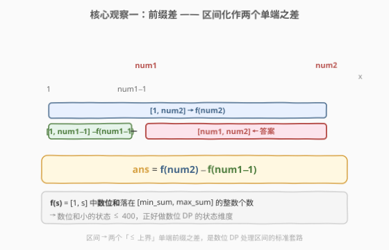
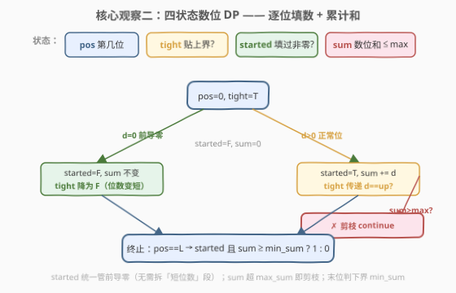
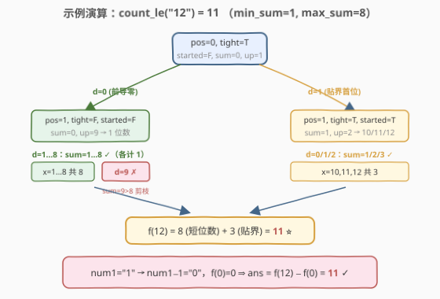

# 统计整数数目

- **题目名称**：统计整数数目
- **链接**：[2719. 统计整数数目](https://leetcode.cn/problems/count-of-integers/)
- **难度**：困难
- **标签**：数学、字符串、动态规划、数位 DP

## 1. 题目概述

给定两个**数字字符串** `num1`、`num2`，以及两个整数 `min_sum`、`max_sum`。如果一个整数 $x$ 满足：

- $num1 \le x \le num2$；
- $min_sum \le \text{digit\_sum}(x) \le max_sum$；

则称 $x$ 是一个**好整数**（$\text{digit\_sum}(x)$ 表示 $x$ 各位数字之和）。返回好整数的数目，答案很大，对 $10^9 + 7$ 取余。

**示例 1**：

```text
输入：num1 = "1", num2 = "12", min_sum = 1, max_sum = 8
输出：11
解释：1 到 12 中数位和在 [1,8] 的有 1,2,3,4,5,6,7,8,10,11,12，共 11 个。
```

**示例 2**：

```text
输入：num1 = "1", num2 = "5", min_sum = 1, max_sum = 5
输出：5
解释：1 到 5 数位和全在 [1,5]，共 5 个。
```

**约束条件**：

- $1 \le num1 \le num2 \le 10^{22}$（最长 22 位十进制数）
- $1 \le min_sum \le max_sum \le 400$

> ⚠️ 关键约束在两处：**$num2$ 高达 $10^{22}$**（22 位，远超 `long long` 上界 $9.2 \times 10^{18}$），所以必须按**字符串**处理、按**位**做 DP，不能转成整数枚举；**$max\_sum \le 400$** 极小，正好作为数位 DP 的状态维度——一位一位填数、累计数位和，到末位再判定是否落在 $[min\_sum, max\_sum]$ 内。

---

## 2. 解题思路

### 2.1 暴力思路：逐个数算数位和

最直白做法：遍历 $x \in [num1, num2]$，逐个把 $x$ 各位相加判是否在 $[min\_sum, max\_sum]$。但 $num2 \le 10^{22}$，区间长度可达 $10^{22}$，即使每数 $O(1)$ 也要 $10^{22}$ 次操作，根本无法跑完。

> 💡 **瓶颈**：线性枚举把「值」当主轴。换视角——既然每个数由若干位十进制数字组成，而**数位和 $\le 400$ 极小**，就改以「位」为主轴：从高到低逐位填数字、同步累计数位和，用 DP 把 $O(10^{22})$ 枚举压缩为对数级状态转移。这正是**数位 DP** 的典型场景，与 [233. 数字 1 的个数](../0201-0300/233_数字1的个数.md)、[2376. 统计特殊整数](../2301-2400/2376_统计特殊整数.md) 同源。

### 2.2 核心观察一：前缀差技巧



区间 $[num1, num2]$ 不好直接数位 DP（数位 DP 天然处理「$\le$ 某上界」）。把它拆成两个「$\le$ 上界」的计数之差：

$$ans = f(num2) - f(num1 - 1)$$

其中 $f(s)$ 表示 $[1,\ s]$ 中数位和落在 $[min\_sum, max\_sum]$ 的整数个数。$num1 - 1$ 是**大整数减一**（`num1` 是字符串，$num1 \ge 1$，减一后可能短一位或末几位借位变 9）。

> 💡 **为什么是 $num1 - 1$ 而非 $num1$？** $f(num1-1)$ 计的是 $[1, num1-1]$，相减后剩下 $[num1, num2]$，正好去掉 $num1$ 之前的所有数。这与 [1067. 范围内的数字计数](../1001-1100/1067_范围内的数字计数.md)「计数某个数字在 $[num1,num2]$ 出现次数 = $\le num2$ 的 − $\le num1-1$ 的」是同一手法——**把双端区间化作两个单端前缀之差**，是数位 DP 处理区间的标准套路。

### 2.3 核心观察二：四状态数位 DP



定义 $f(s)$ 的数位 DP 为：从高到低逐位填数字，记录四个状态：

| 状态 | 含义 | 取值 |
|------|------|------|
| `pos` | 当前填到第几位（$0 \dots L-1$） | $L \le 22$ |
| `tight` | 前面各位是否**贴住** $s$ 的上界前缀 | `True` / `False` |
| `started` | 是否已填过非零位（用于统一管前导零） | `True` / `False` |
| `sum` | 已填位的数位和（**超过 $max\_sum$ 即剪枝**） | $0 \dots max\_sum \le 400$ |

转移：在 `pos` 位枚举数字 $d \in [0,\ up]$（`up = s[pos]` 若 `tight`，否则 $9$）：

- **前导零**：`started=False` 且 $d=0$ 时，$0$ 是前导零，`started` 保持 `False`、`sum` 不变（$0$ 不计入数位和）、`tight` 降为 `False`（位数变短，必 $< s$）——天然归到「位数更少」的数，无需单独拆段。
- **正常位**：`started` 置 `True`，`sum += d`；若 `sum > max_sum` **直接剪枝**（该分支不可能再凑出合法和）；`tight` 传递为 `tight and (d == up)`。
- **终止**：`pos == L` 时，若 `started` 且 $sum \ge min\_sum$（`sum > max_sum` 已被剪掉，故此时 `sum <= max_sum` 必然成立）则计 $1$，否则 $0$。

> ⚠️ **两个剪枝/统一要点**：
> 1. **上界剪枝 `sum > max_sum` 跳过**：数位和只增不减，一旦超过 $max\_sum$，再填低位只会更大，整条分支必失败，提前 `continue` 砍掉。这是把 `sum` 状态空间压在 $[0, max\_sum] \le 401$ 内的关键——否则 `sum` 可达 $22 \times 9 = 198$，虽也不大，但剪枝让状态更紧。
> 2. **前导零用 `started` 统一处理**：不必像 [2376](../2301-2400/2376_统计特殊整数.md) 那样把「位数 $< L$」与「位数 $= L$」拆成两段手写——`started=False` 且填 $0$ 的分支自动表示位数更短的数，与同位数贴界分支共用一套 DP。

### 2.4 示例演算



以求 $f(12)$（$min\_sum=1,\ max\_sum=8$）为例，$s = \text{"12"}$，$L=2$。从根 $(pos=0, tight=T, started=F, sum=0)$ 出发，`up = 1`：

- **$d=0$（前导零）** → $(1, tight=F, started=F, sum=0)$，`up=9`，代表 1 位数 $x \in \{1,\dots,9\}$：
  - $d=1\dots8$：`sum = 1…8`，全 $\le 8$ 且 $\ge 1$ → 各计 $1$，共 **$8$** 个；
  - $d=9$：`sum = 9 > 8` → **剪枝** ✗。
- **$d=1$（贴界首位）** → $(1, tight=T, started=T, sum=1)$，`up = s[1] = 2`，代表 $x \in \{10,11,12\}$：
  - $d=0$ → $x=10$，`sum=1` ✓；
  - $d=1$ → $x=11$，`sum=2` ✓；
  - $d=2$（贴界）→ $x=12$，`sum=3` ✓；
  - 共 **$3$** 个。

合计 $f(12) = 8 + 3 = 11$；而 $num1=\text{"1"} \Rightarrow num1-1=\text{"0"}$，$f(0)=0$（没有 $x \in [1,0]$）。故 $ans = f(12) - f(0) = 11$ ✓。

> 💡 **看懂这棵树**：左子树（$d=0$ 前导零）自动涵盖了所有「1 位数」$1\dots9$——这正是 `started` 统一管前导零的好处，不用单独写「位数少」的公式段；右子树（$d=1$ 贴界）则枚举同位数的贴界后继。`sum>8` 的 $d=9$ 被剪掉，避免无意义深入。

---

## 3. 参考代码

### Python

```python
from functools import lru_cache

class Solution:
    def count(self, num1: str, num2: str, min_sum: int, max_sum: int) -> int:
        MOD = 10 ** 9 + 7

        def dec(s: str) -> str:
            # 大整数减一：num1 >= 1，结果 >= 0
            a = list(s)
            i = len(a) - 1
            while i >= 0 and a[i] == '0':      # 末尾 0 借位变 9
                a[i] = '9'
                i -= 1
            a[i] = chr(ord(a[i]) - 1)          # i >= 0，因 num1 >= 1
            res = ''.join(a).lstrip('0')
            return res if res else "0"

        def count_le(s: str) -> int:
            # 数位 DP：[1, s] 中数位和落在 [min_sum, max_sum] 的整数个数
            @lru_cache(None)
            def dfs(pos: int, tight: bool, started: bool, sm: int) -> int:
                if pos == len(s):
                    return 1 if (started and sm >= min_sum) else 0
                up = int(s[pos]) if tight else 9
                ans = 0
                for d in range(up + 1):
                    n_started = started or (d != 0)
                    n_sm = sm + d if n_started else sm   # 前导零不计入数位和
                    if n_sm > max_sum:                   # 超过上界，剪枝
                        continue
                    ans += dfs(pos + 1, tight and d == up, n_started, n_sm)
                return ans % MOD

            return dfs(0, True, False, 0) % MOD

        return (count_le(num2) - count_le(dec(num1))) % MOD
```

### C++

```cpp
class Solution {
public:
    int count(string num1, string num2, int min_sum, int max_sum) {
        const long long MOD = 1e9 + 7;
        string a = dec(num1);                       // num1 - 1（字符串大数减一）
        long long f2 = countLe(num2, min_sum, max_sum, MOD);
        long long f1 = countLe(a, min_sum, max_sum, MOD);
        return (int)((f2 - f1 + MOD) % MOD);        // 防负数
    }
private:
    // 字符串大整数减一（num1 >= 1，结果 >= 0）
    static string dec(const string& s) {
        string a = s;
        int i = (int)a.size() - 1;
        while (i >= 0 && a[i] == '0') { a[i] = '9'; --i; }  // 末尾 0 借位变 9
        a[i] -= 1;                                          // num1>=1 故 i>=0
        int k = 0;
        while (k < (int)a.size() - 1 && a[k] == '0') ++k;   // 去前导零
        return a.substr(k);
    }
    // 数位 DP：[1, s] 中数位和落在 [min_sum, max_sum] 的整数个数
    static long long countLe(const string& s, int min_sum, int max_sum, long long MOD) {
        int n = (int)s.size();
        // memo[pos][tight][started][sum]，sum 维开到 401（max_sum <= 400）
        static long long memo[24][2][2][401];
        memset(memo, -1, sizeof(memo));
        function<long long(int,int,int,int)> dfs = [&](int pos, int tight, int started, int sm) -> long long {
            if (pos == n) return (started && sm >= min_sum) ? 1 : 0;
            long long& res = memo[pos][tight][started][sm];
            if (res != -1) return res;
            int up = tight ? (s[pos] - '0') : 9;
            long long ans = 0;
            for (int d = 0; d <= up; ++d) {
                int n_started = started || (d != 0);
                int n_sm = n_started ? (sm + d) : sm;   // 前导零不计入数位和
                if (n_sm > max_sum) continue;          // 超过上界，剪枝
                ans = (ans + dfs(pos + 1, tight && (d == up), n_started, n_sm)) % MOD;
            }
            return res = ans;
        };
        return dfs(0, 1, 0, 0);
    }
};
```

> ⚠️ **实现细节**：
> 1. **大数减一**：`num1` 是字符串、可达 22 位，不能用整型减。`dec` 从末位借位：遇 `0` 变 `9` 继续借，遇非 `0` 减一停步；再去前导零。例 `"1000" → "0999" → "999"`，`"1" → "0"`。
> 2. **取余防负**：C++ 中 `(f2 - f1) % MOD` 可能为负，写 `(f2 - f1 + MOD) % MOD`；Python 的 `%` 天然非负，直接 `(f2 - f1) % MOD` 即可。
> 3. **记忆化范围**：`sum` 只在 $[0, max\_sum]$ 内流动（超界即剪枝），故 `memo` 第四维开 $401$ 够用；`pos` 维开 $24$（$L \le 22$）。

---

## 4. 复杂度分析

| 维度 | 复杂度 | 说明 |
|------|--------|------|
| 时间复杂度 | $O(L \cdot max\_sum)$ | 有效状态数 $\approx L \cdot 2 \cdot max\_sum$（`tight` 仅沿贴界路径有少量额外状态），每状态枚举 $\le 10$ 位数字，总计 $O(L \cdot max\_sum \cdot 10) = O(L \cdot max\_sum)$；调用两次 `countLe`，常数 $\times 2$ |
| 空间复杂度 | $O(L \cdot max\_sum)$ | 记忆化数组 `memo[L][2][2][max_sum+1]`，$\le 22 \times 2 \times 2 \times 401 \approx 3.5 \times 10^4$ 项；递归栈深 $O(L)$ |

> ⚠️ **与暴力 $O(num2)$ 的对比**：$num2 \le 10^{22}$，暴力约 $10^{22}$ 次；数位 DP 只 $22 \times 400 \approx 8800$ 状态、每状态 $O(10)$，约 $10^5$ 次运算。降维来自「按位 DP + 数位和小状态」——把无限大的值域压缩成位数 $\times$ 状态数的乘积，这正是数位 DP 一以贯之的核心。

---

## 5. 扩展：与前缀差计数家族的对照

本题是「**计数 $\Rightarrow$ 前缀差 $\Rightarrow$ 数位 DP**」三段式的一个标准实例。同一家族里，前缀差技巧与数位 DP 的搭配方式各有侧重：

| 题目 | 计什么 | 前缀差形式 | 数位 DP 的关键状态 |
|------|--------|------------|--------------------|
| **2719**（本题） | $[num1,num2]$ 中数位和在区间内的数 | $f(num2) - f(num1-1)$ | `sum`（数位和）+ `started`（前导零） |
| [1067. 范围内的数字计数](https://leetcode.cn/problems/digit-count-in-range/) | 数字 $d$ 在 $[num1,num2]$ 出现次数 | $\le num2$ − $\le num1-1$ | `count`（已出现次数）+ `started` |
| [233. 数字 1 的个数](https://leetcode.cn/problems/number-of-digit-one/) | $[1,n]$ 中数字 1 出现次数 | 单上界（不需差） | 按位分情况计数 |
| [2376. 统计特殊整数](https://leetcode.cn/problems/count-special-integers/) | $[1,n]$ 中各位互异的数 | 单上界（不需差） | `mask`（已用数字掩码）+ `started` |

> 💡 **共性骨架**：只要计数对象能写成「$x \le$ 上界 且 满足某逐位约束」，就可用数位 DP；若对象是**区间** $[a,b]$，再套前缀差 $f(b) - f(a-1)$ 即可。约束决定状态维度：数位和 → `sum`，去重 → `mask`，连续关系 → `prev`，**前导零几乎总用 `started` 统一管**。

---

## 6. 面试要点

1. **为什么用前缀差 $f(num2) - f(num1-1)$，而不是直接对 $[num1,num2]$ 做 DP？**

   > 数位 DP 天然处理「$\le$ 单个上界」——从高位逐位填、用 `tight` 标记贴界。区间 $[num1, num2]$ 是双端约束，下界 $num1$ 难以用单一 `tight` 表达。拆成两个单端前缀之差，每个都是标准数位 DP，复用同一套代码，只多一次「大数减一」。这是处理区间计数的通用套路，[1067](../1001-1100/1067_范围内的数字计数.md) 同源。

2. **`started` 状态在解决什么问题？能否去掉？**

   > 统一管前导零。若不区分前导零，则 $x=12$ 与 $x=012$（即位数少的 $12$）会被当成两个数，且首位填 $0$ 会让 `sum` 少算、`tight` 错乱。`started=False` 时填 $0$ 视为前导零——`sum` 不变、`started` 不变、`tight` 降为 `False`，自动归到「位数更短」的数。这样不必把「位数 $< L$」单独拆段手写公式，[2376](../2301-2400/2376_统计特殊整数.md) 第 5 节的通用框架也是这个思路。

3. **为什么 `sum > max_sum` 就能剪枝？`sum` 状态空间被压到多大？**

   > 数位和只增不减：一旦 `sum` 超过 $max\_sum$，再填低位只会更大，整条分支必然失败，提前 `continue` 砍掉。剪枝后 `sum` 只在 $[0, max\_sum] \subseteq [0, 400]$ 流动，故 `memo` 第四维开 $401$ 即可，总状态 $\le 22 \times 2 \times 2 \times 401 \approx 3.5 \times 10^4$。

4. **`num1 - 1` 为什么要专门写大数减一？能直接转 `long` 吗？**

   > $num2 \le 10^{22}$，22 位十进制远超 `long long`（$\approx 1.8 \times 10^{19}$，19 位）和 Python 任意精度虽能转但 DP 仍按字符串走。减一用字符串借位：末位遇 `0` 变 `9` 继续借、遇非 `0` 减一停步，再去前导零。`"1000" → "999"`、`"1" → "0"`。

5. **`min_sum` 与 `max_sum` 在 DP 里分别怎么用？**

   > `max_sum` 作为**上界剪枝**和 `sum` 状态上限——转移中 `sum > max_sum` 即砍，故到末位时 `sum <= max_sum` 必然成立，不必再判。`min_sum` 作为**下界判定**——只在末位（`pos == L`）检查 `sum >= min_sum`；中途不剪是因为低位还可能让 `sum` 涨到 $min\_sum$ 之上，提前剪会误杀。

> 💡 **一句话总结**：2719 = 前缀差 $f(num2)-f(num1-1)$（区间化两单端）+ 四状态数位 DP（`pos/tight/started/sum`，`started` 统一管前导零、`sum` 超 $max\_sum$ 即剪、末位判 $\ge min\_sum$）。$O(L \cdot max\_sum)$ 时间解决 $10^{22}$ 级计数。

---

## 7. 同类练习题

- [233. 数字 1 的个数](https://leetcode.cn/problems/number-of-digit-one/)（[站内题解](../0201-0300/233_数字1的个数.md)）：数位 DP 母题，按位分情况计数，本题「逐位填 + 累计」与之间源
- [1067. 范围内的数字计数](https://leetcode.cn/problems/digit-count-in-range/)（[站内题解](../1001-1100/1067_范围内的数字计数.md)）：同样用前缀差 $\le num2 - \le num1-1$ 处理区间计数，对照「区间→前缀差」手法的直接对照
- [2376. 统计特殊整数](https://leetcode.cn/problems/count-special-integers/)（[站内题解](../2301-2400/2376_统计特殊整数.md)）：数位 DP 通用框架（`tight/started/mask`），对照「约束换维度」——本题约束是数位和故用 `sum` 而非 `mask`
- [600. 不含连续 1 的非负整数](https://leetcode.cn/problems/non-negative-integers-without-consecutive-ones/)：数位 DP 加状态维度（`prev` 记上一位），展示「约束变复杂就加状态维」的标准出路
- [902. 最大为 N 的数字组合](https://leetcode.cn/problems/numbers-at-most-n-given-digit-set/)：数位 DP 模板，约束为「数字来自给定集合」，与本题「数字受数位和约束」对照同一框架的不同约束维度
