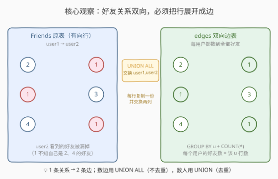
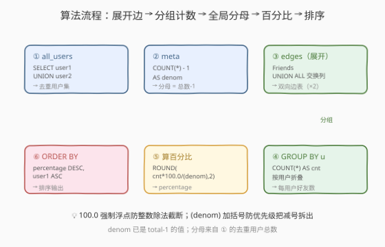
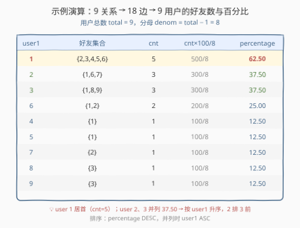

# LeetCode 受欢迎度百分比 题解

## 1. 题目概述

- **标题 / 题号**：受欢迎度百分比（#2720，hard）
- **链接**：https://leetcode.cn/problems/popularity-percentage/
- **难度**：困难
- **标签**：数据库、SQL、`UNION ALL`、`GROUP BY`、`COUNT`、`ROUND`、CTE、双向边展开、LeetCode 锁题

> ⚠️ 本题为 LeetCode 付费题，题意描述根据官方示例用例与 hints 重建，可能与官方题面有出入。下文「表结构 / 公式 / 输出列名 / 排序」均依据 `sampleTestCase` 与题目语义推理得出，若与官方题面有细节差异以官方为准。

**题意**：给定好友关系表 `Friends`，每行表示 `user1` 与 `user2` 互为好友（**友谊是双向的**）。编写 SQL 查询，对每个用户计算其**受欢迎度百分比**：

$$
\text{percentage} = \frac{\text{该用户的好友数}}{\text{用户总数} - 1} \times 100
$$

结果四舍五入保留 **2 位小数**。返回列 `(user1, percentage)`，按 `percentage` **降序**排列；并列时按 `user1` **升序**排列。

> 💡 **分母为何减 1**：受欢迎度衡量的是「除自己外的人里，有多少是你的好友」。分子是自己认识的好友数，分母是「不包含自己的其余用户数」= 用户总数 $- 1$。这样与所有人都是好友的用户可达 $100\%$，语义更直观。

**表结构**：

```text
Table: Friends
+-------------+------+
| Column Name | Type |
+-------------+------+
| user1        | int  |
| user2        | int  |
+-------------+------+
(user1, user2) 是该表主键。
每行包含一对好友关系，好友是双向的（user1 是 user2 的好友，反之亦然）。
```

**输出列**：`user1`（用户编号）、`percentage`（受欢迎度百分比）。

**示例 1**：

```text
输入：
Friends 表:
+-------+-------+
| user1 | user2 |
+-------+-------+
| 2     | 1     |
| 1     | 3     |
| 4     | 1     |
| 1     | 5     |
| 1     | 6     |
| 2     | 6     |
| 7     | 2     |
| 8     | 3     |
| 3     | 9     |
+-------+-------+

输出：
+-------+------------+
| user1 | percentage |
+-------+------------+
| 1     | 62.50      |
| 2     | 37.50      |
| 3     | 37.50      |
| 6     | 25.00      |
| 4     | 12.50      |
| 5     | 12.50      |
| 7     | 12.50      |
| 8     | 12.50      |
| 9     | 12.50      |
+-------+------------+
```

**解释**：

用户总数 = $\{1,2,3,4,5,6,7,8,9\}$ 共 $9$ 人，分母 = $9 - 1 = 8$。

| user1 | 好友集合 | 好友数 | $\frac{\text{好友数}}{8}\times 100$ | percentage |
|-------|----------|--------|-------------------------------------|------------|
| 1 | $\{2,3,4,5,6\}$ | 5 | $5/8\times 100$ | 62.50 |
| 2 | $\{1,6,7\}$ | 3 | $3/8\times 100$ | 37.50 |
| 3 | $\{1,8,9\}$ | 3 | $3/8\times 100$ | 37.50 |
| 6 | $\{1,2\}$ | 2 | $2/8\times 100$ | 25.00 |
| 4 | $\{1\}$ | 1 | $1/8\times 100$ | 12.50 |
| 5 | $\{1\}$ | 1 | $1/8\times 100$ | 12.50 |
| 7 | $\{2\}$ | 1 | $1/8\times 100$ | 12.50 |
| 8 | $\{3\}$ | 1 | $1/8\times 100$ | 12.50 |
| 9 | $\{3\}$ | 1 | $1/8\times 100$ | 12.50 |

> 💡 本题是 SQL **「无向图边表 → 双向展开 + 分组计数 + 全局总量做分母」招牌题**——核心三步：① 把每条好友关系 `(a,b)` 展开成双向边 `(a,b)` 与 `(b,a)`（`UNION ALL` 原表与列交换后的表）；② 按 `user` 分组 `COUNT(*)` 得每个用户的好友数；③ 用「用户总数 $-1$」做分母算百分比。难点在识别「友谊双向」必须做边表展开，以及分母要用 `UNION`（去重）统计的用户总数而非原始行数。

## 2. 解题思路

### 2.1 暴力思路：逐用户枚举好友

最直觉的过程式思路：先收集所有出现过的用户，再对每个用户遍历 `Friends` 表，凡在 `user1` 或 `user2` 列出现该用户的行，把对端用户加入其好友集合，最后用集合大小除以（用户总数 $-1$）。伪代码：

```text
users = set(Friends.user1) | set(Friends.user2)
total = len(users)
result = []
for u in users:
    friends = set()
    for (a, b) in Friends.rows:
        if a == u: friends.add(b)
        if b == u: friends.add(a)
    pct = round(len(friends) * 100 / (total - 1), 2)
    result.append((u, pct))
sort result by pct desc, u asc
```

逻辑正确，但「逐用户扫表」对应 SQL 的**相关子查询**，效率为 $O(U\cdot R)$（$U$ 用户数、$R$ 关系行数）。SQL 表达「每个用户的好友数」最自然的方式是**先展开双向边表，再分组计数**——一次展开 + 一次分组即可，线性 $O(U+R)$。

### 2.2 核心观察：双向边展开 + 分组计数 + 全局分母



**关键洞察**：好友关系是无向的，但表以**有向行**存储（一行 `(user1, user2)` 只说「user1 的好友里有 user2」）。要让「每个用户统计自己的好友数」这一分组计数成立，必须先把表补成**双向边表**——每行 `(a,b)` 同时产生 `(a→b)` 与 `(b→a)` 两条边。

1. **边表展开**：`SELECT user1 AS u, user2 AS friend FROM Friends` `UNION ALL` `SELECT user2 AS u, user1 AS friend FROM Friends`。展开后表里每个用户的每条好友关系都恰好占一行，`GROUP BY u` + `COUNT(*)` 即得该用户好友数。
2. **用户总数**：用 `SELECT user1 UNION SELECT user2`（注意是 `UNION` 去重）得到去重用户集，`COUNT(*)` 得 $U$，分母 $= U - 1$。
3. **百分比**：`ROUND(cnt * 100.0 / (U - 1), 2)`，注意 `100.0` 强制浮点、分母加括号 `(U-1)` 防运算符优先级出错。
4. **排序**：`ORDER BY percentage DESC, user1 ASC`。

> 💡 **为何边表展开用 `UNION ALL` 而用户总数用 `UNION`？**
> - **边表展开用 `UNION ALL`**：目的是「每条好友关系贡献两条边」，**不需要去重**（题目保证同一对好友不重复存储），`UNION ALL` 不做去重开销小、保留所有边用于 `COUNT`。
> - **用户总数用 `UNION`**：要数的是「**去重后**的不同用户数」，必须去重，故用 `UNION`（等价 `UNION DISTINCT`）。若误用 `UNION ALL` 统计用户数，会把同一用户因多次出现而重复计数，分母虚高、百分比偏低。

> ⚠️ **分母必须减 1 且用去重用户数**：常见错误有二。① 用原始行数当分母——一行是一对关系不是一个人，分母完全错。② 忘记减 1——分母多了「自己」，百分比系统性偏低（如示例 user 1 会算成 $5/9\approx 55.56$ 而非 $62.50$）。正确分母是「去重用户总数 $-1$」。

> ⚠️ **运算符优先级陷阱**：`cnt * 100 / total - 1` 会被解析成 `(cnt * 100 / total) - 1`（乘除优先于减），分母减 1 的意图完全落空。必须写成 `cnt * 100.0 / (total - 1)`，给分母加括号。

### 2.3 算法流程图



**逻辑执行步骤**：

| 步骤 | CTE/子句 | 作用 |
|------|----------|------|
| ① | `all_users`：`SELECT user1 UNION SELECT user2` | 收集所有用户（去重） |
| ② | `meta`：`COUNT(*) - 1 AS denom` | 算分母 = 用户总数 $-1$ |
| ③ | `edges`：`Friends` `UNION ALL` 列交换后的 `Friends` | 展开双向边表（每关系两行） |
| ④ | `GROUP BY u` + `COUNT(*)` | 每个用户的好友数 |
| ⑤ | `ROUND(cnt * 100.0 / denom, 2)` | 受欢迎度百分比（2 位小数） |
| ⑥ | `ORDER BY percentage DESC, user1 ASC` | 按百分比降序、并列按用户升序 |

### 2.4 示例演算

以示例 1 的 9 条好友关系为例，观察「双向边展开 → 分组计数 → 算百分比」的逐步过程：



**步骤 ①②：用户总数与分母**

$$
\text{all\_users} = \{1,2,3,4,5,6,7,8,9\},\quad \text{total} = 9,\quad \text{denom} = 8
$$

**步骤 ③：双向边展开（9 关系 → 18 边）**

| 原关系 | 贡献边 (u→friend) |
|--------|-------------------|
| (2,1) | (2→1), (1→2) |
| (1,3) | (1→3), (3→1) |
| (4,1) | (4→1), (1→4) |
| (1,5) | (1→5), (5→1) |
| (1,6) | (1→6), (6→1) |
| (2,6) | (2→6), (6→2) |
| (7,2) | (7→2), (2→7) |
| (8,3) | (8→3), (3→8) |
| (3,9) | (3→9), (9→3) |

**步骤 ④⑤：分组计数 + 百分比**

| u | 好友边（friend 列） | cnt | $\text{cnt}\times 100/8$ | percentage |
|---|---------------------|-----|--------------------------|------------|
| 1 | 2, 3, 4, 5, 6 | 5 | $500/8$ | 62.50 |
| 2 | 1, 6, 7 | 3 | $300/8$ | 37.50 |
| 3 | 1, 8, 9 | 3 | $300/8$ | 37.50 |
| 6 | 1, 2 | 2 | $200/8$ | 25.00 |
| 4 | 1 | 1 | $100/8$ | 12.50 |
| 5 | 1 | 1 | $100/8$ | 12.50 |
| 7 | 2 | 1 | $100/8$ | 12.50 |
| 8 | 3 | 1 | $100/8$ | 12.50 |
| 9 | 3 | 1 | $100/8$ | 12.50 |

**步骤 ⑥：排序**（`percentage` 降序，并列按 `user1` 升序）→ user 1 独占榜首，user 2、3 并列 37.50（2 在 3 前），以此类推，与示例输出一致。

> 💡 **user 2 与 user 3 并列**是本题的排序考点：两者好友数都是 3、百分比都是 37.50，并列时按 `user1` 升序，故 2 排在 3 前。若只按 `percentage` 排而不加并列兜底，并列行顺序不定，可能不符合预期。

## 3. 参考代码

### SQL（解法 A：UNION ALL 双向边展开 + CTE，推荐）

```sql
WITH all_users AS (
    SELECT user1 AS user FROM Friends
    UNION                       -- 去重，统计不同用户
    SELECT user2 FROM Friends
),
meta AS (
    SELECT COUNT(*) - 1 AS denom FROM all_users
),
edges AS (
    SELECT user1 AS u, user2 AS friend FROM Friends
    UNION ALL                   -- 不去重，每条关系贡献两条边
    SELECT user2, user1 FROM Friends
)
SELECT
    u AS user1,
    ROUND(COUNT(*) * 100.0 / (SELECT denom FROM meta), 2) AS percentage
FROM edges
GROUP BY u
ORDER BY percentage DESC, user1 ASC;
```

> 💡 **写法要点**：
> - **`all_users` 用 `UNION`**：去重统计不同用户总数，分母 = 总数 $-1$。
> - **`edges` 用 `UNION ALL`**：展开双向边，不去重（题目保证好友关系不重复存储），`COUNT(*)` 即好友数。
> - **`100.0` 强制浮点**：`COUNT(*)` 是整数，`100` 也是整数，`整数/整数` 在某些 SQL 方言（如 SQLite 整数除法）会截断为整数；写 `100.0` 保证浮点除法。
> - **分母加括号 `(denom)`**：`denom` 已是 `total - 1` 的值，避免运算符优先级把减号拆出去。
> - ✓ **最推荐**：CTE 分层清晰（用户集 / 分母 / 边表 / 计数 / 百分比），一次扫表展开 + 一次分组，标准 SQL 通用。

### SQL（解法 B：UNION 去重边表，防御重复反向关系）

```sql
WITH all_users AS (
    SELECT user1 AS user FROM Friends
    UNION
    SELECT user2 FROM Friends
),
meta AS (
    SELECT COUNT(*) - 1 AS denom FROM all_users
),
edges AS (
    SELECT user1 AS u, user2 AS friend FROM Friends
    UNION                       -- 去重边，防止 (a,b) 与 (b,a) 重复出现
    SELECT user2, user1 FROM Friends
)
SELECT
    u AS user1,
    ROUND(COUNT(*) * 100.0 / (SELECT denom FROM meta), 2) AS percentage
FROM edges
GROUP BY u
ORDER BY percentage DESC, user1 ASC;
```

> 💡 **解法 B 的思路**：与解法 A 唯一区别是 `edges` 用 `UNION`（去重）而非 `UNION ALL`。
>
> **何时用**：若数据可能把同一对好友以两种方向各存一行（即 `(a,b)` 与 `(b,a)` 同时存在），解法 A 的 `UNION ALL` 会让 user a 把 friend b 数两次，好友数虚高。解法 B 对 `(u, friend)` 边去重，即使有重复反向关系也能得到正确好友数。代价是 `UNION` 需排序去重，开销略大。
>
> **本题取舍**：示例数据中每对好友只存一行（无重复反向），解法 A 即正确且更快。若不确定数据规范，解法 B 更稳妥。

### SQL（解法 C：相关子查询逐用户计数，对照思路）

```sql
SELECT
    u AS user1,
    ROUND(
        (SELECT COUNT(*) FROM Friends f
         WHERE f.user1 = u OR f.user2 = u) * 100.0
        / ((SELECT COUNT(*) FROM (SELECT user1 FROM Friends UNION SELECT user2 FROM Friends) t) - 1),
        2
    ) AS percentage
FROM (SELECT user1 AS u FROM Friends UNION SELECT user2 FROM Friends) users
ORDER BY percentage DESC, user1 ASC;
```

> 💡 **解法 C 的思路**：对每个用户用相关子查询 `WHERE f.user1 = u OR f.user2 = u` 直接数「涉及该用户的关系行数」，因友谊双向，涉及该用户的一行即代表一个好友，故行数 = 好友数。分母用嵌套子查询算去重用户总数 $-1$。
>
> **与解法 A/B 的对比**：
> - **无需展开边表**：相关子查询用 `OR` 同时看两列，逻辑上等价于双向展开后计数。
> - **性能**：对每个用户扫一次 `Friends`，最坏 $O(U\cdot R)$；解法 A/B 展开后一次分组为 $O(U+R)$。数据量大时 A/B 更优。
> - **可读性**：解法 C 把「好友数」逻辑浓缩进一个 `OR` 条件，贴近人脑直觉，但嵌套子查询层级深、可读性较差。仅作对照写法帮助理解。

### Python（pandas）

```python
import pandas as pd

def popularity_percentage(friends: pd.DataFrame) -> pd.DataFrame:
    total = pd.concat([friends['user1'], friends['user2']]).nunique()
    edges = pd.concat([
        friends[['user1', 'user2']].rename(columns={'user1': 'u', 'user2': 'friend'}),
        friends[['user1', 'user2']].rename(columns={'user2': 'u', 'user1': 'friend'}),
    ])
    cnt = edges.groupby('u', as_index=False)['friend'].count()
    cnt['percentage'] = (cnt['friend'] * 100.0 / (total - 1)).round(2)
    cnt = cnt.rename(columns={'u': 'user1'})[['user1', 'percentage']]
    return cnt.sort_values(['percentage', 'user1'], ascending=[False, True]).reset_index(drop=True)
```

> 💡 **pandas 对照**：
> - `pd.concat([user1, user2]).nunique()`——对应 `SELECT user1 UNION SELECT user2` + `COUNT`（去重用户总数）。
> - 两次 `rename` + `concat`——对应 `UNION ALL` 列交换展开双向边表。
> - `.groupby('u')['friend'].count()`——对应 `GROUP BY u` + `COUNT(*)`（好友数）。
> - `* 100.0 / (total - 1)` + `.round(2)`——对应 `ROUND(cnt * 100.0 / denom, 2)`。
> - `.sort_values(['percentage','user1'], ascending=[False, True])`——对应 `ORDER BY percentage DESC, user1 ASC`。
> - 若担心重复反向关系，把 `.count()` 换成 `.nunique()` 即对应解法 B 的 `UNION` 去重边。

## 4. 复杂度分析

| 维度 | 解法 A（UNION ALL） | 解法 B（UNION 去重） | 解法 C（子查询） | pandas |
|------|---------------------|----------------------|------------------|--------|
| **时间** | $O(U+R)$ | $O(R\log R)$ | $O(U\cdot R)$（最坏） | $O(U+R)$ |
| **空间** | $O(U+R)$ | $O(U+R)$ | $O(U)$（无中间表） | $O(U+R)$ |
| **扫表次数** | 原表 2 次 | 原表 2 次 | 原表 $U+1$ 次 | 原表 1 次（concat 后处理） |
| **可读性** | ✓ CTE 分层清晰 | ✓ 同 A | △ 嵌套深 | ✓ 清晰 |
| **推荐度** | ✓ **首选** | ✓ 防御重复数据 | ✓ 对照/小数据 | ✓ 验证用 |

> - $U$ = 不同用户数，$R$ = `Friends` 行数。
> - **解法 A**：`UNION ALL` 展开 $2R$ 条边 $O(R)$，哈希分组 $O(R)$，去重用户集 $O(R)$，总体线性。
> - **解法 B**：`UNION` 需对 $2R$ 条边排序去重，$O(R\log R)$，略慢于 A，换来对重复反向关系的鲁棒性。
> - **解法 C**：相关子查询对每个用户扫一次 `Friends`，最坏 $O(U\cdot R)$；若 `(user1)`、`(user2)` 上有索引可降为 $O(U\log R)$，仍劣于 A/B。
> - **空间**：A/B 物化 $2R$ 条边表；C 无中间表，但需对每个用户维护子查询结果。

## 5. 扩展：无向图边表的常见展开范式

### 5.1 「关系双向」类问题的统一骨架

好友、关注（互关）、同事、连通等「无向关系」在关系型库里多以**有向行**存储（一行 `(a,b)`），统计个人指标时常需先展开双向边。统一模板：

```sql
WITH edges AS (                       -- 双向边展开
    SELECT src AS u, dst AS v FROM Rel
    UNION ALL
    SELECT dst, src FROM Rel
)
SELECT u, <聚合函数>(v) AS metric       -- 按用户分组聚合
FROM edges
GROUP BY u;
```

本题的 `<聚合函数>` 是 `COUNT(*)`，分母再用全局用户总数 $-1$ 规整成百分比。

### 5.2 用 `100.0` 避免整数除法截断

不同 SQL 方言对 `整数 / 整数` 的处理不同：MySQL 返回 `DECIMAL`（不截断），但 **SQLite 整数除法会截断**为整数（`5/8 → 0`）。LeetCode 的 pandas 题判题用 Python（无此问题），但 SQL 题可能跑在不同引擎。统一写 `cnt * 100.0 / denom`，`100.0` 让表达式提升为浮点，杜绝截断：

```sql
-- 危险（SQLite 下 5*100/8 → 500/8 → 62，截断丢 .50）
ROUND(cnt * 100 / denom, 2)
-- 安全（5*100.0/8 = 62.5 → ROUND 62.50）
ROUND(cnt * 100.0 / denom, 2)
```

### 5.3 若改为「好友覆盖率最高的用户」

把分母从「用户总数 $-1$」换成「该用户所在连通分量人数 $-1$」，即求**局部好友覆盖率**——需先求连通分量（`Friends` 当无向图，并查集 / 递归 CTE 找同分量用户集），再在每个分量内算占比。这是把「全局分母」升级为「分量分母」的变体，难度上一个台阶。

## 6. 面试要点

1. **友谊是双向的，为什么需要 `UNION ALL` 展开边表？**

   > 表以有向行存储，一行 `(user1, user2)` 只让 `user1` 在统计时看到 `user2`。要让每个用户都数到自己的好友，必须把每行复制一份并交换两列：`(a,b)` → `(a,b)` 与 `(b,a)`，这样 `GROUP BY` 任一用户时，其所有好友都恰出现一行。不展开会导致只统计到「作为 user1 时认识的人」，漏掉「作为 user2 时认识的人」。

2. **边表展开用 `UNION ALL`，统计用户总数却用 `UNION`，为什么不能都用 `UNION ALL`？**

   > 目的不同：边表展开要「每条关系贡献两条边」，**不该去重**（同一对好友不重复存储，去重反而漏边），用 `UNION ALL` 快且对。统计用户总数要「**去重后**的不同用户数」，若用 `UNION ALL`，多次出现的老用户会被重复计入，分母虚高、百分比偏低。口诀：**数边不去重，数人要去重**。

3. **分母为什么是「用户总数 $-1$」而不是行数或用户总数？**

   > 受欢迎度衡量「除自己外的人里有多少是好友」，分子是自己的好友数，分母是「不包含自己的其余用户数」= 去重用户总数 $-1$。用行数当分母完全错（一行是一对关系非一人）；用用户总数不减 1 会把「自己」算进分母，百分比系统性偏低（如示例 user 1 变 $55.56$ 而非 $62.50$）。

4. **`cnt * 100 / total - 1` 这么写有什么问题？**

   > 运算符优先级陷阱：乘除优先于减，会被解析成 `(cnt * 100 / total) - 1`，即先算百分比再减 1，分母减 1 的意图完全落空、结果也毫无意义。必须给分母加括号：`cnt * 100.0 / (total - 1)`。同时把 `100` 写成 `100.0` 防整数除法截断。

5. **解法 A 与解法 B（`UNION ALL` vs `UNION`）何时选哪个？**

   > 取决于数据是否可能把同一对好友以两种方向各存一行。若题目保证每对好友只存一行（规范数据），解法 A 的 `UNION ALL` 正确且更快（$O(U+R)$）。若数据可能含重复反向关系 `(a,b)` 与 `(b,a)`，`UNION ALL` 会让重复好友被数两次，此时解法 B 的 `UNION` 去重边才正确（$O(R\log R)$）。生产环境不确定数据规范时，解法 B 更稳妥。

> 💡 **一句话总结**：2720 是 SQL **「无向图双向边展开 + 全局分母百分比」招牌题**——核心模板「`Friends UNION ALL 列交换Friends` 展开双向边 → `GROUP BY u` + `COUNT(*)` 数好友 → `ROUND(cnt*100.0/(UNION去重用户数-1), 2)` 算百分比 → `ORDER BY percentage DESC, user1 ASC`」。最大要点：**数边用 `UNION ALL` 不去重、数人用 `UNION` 去重；分母是去重用户总数 $-1$；分母加括号防优先级坑、`100.0` 防整数除法截断**。

## 同类练习题

| # | 题目 | 与本题的关联 |
|---|------|-------------|
| 585 | [2016 年的投资](https://leetcode.cn/problems/investments-in-2016/) | `SUM` + 自连接对比全局均值，同为「分组聚合与全局量挂钩」——2720 用全局用户数做分母，585 用全局均值做阈值，巩固「分组量 vs 全局量」对比 |
| 608 | [树节点](https://leetcode.cn/problems/tree-node/) | `WHERE` 子查询判断节点类型（根/叶/中间），同为「逐实体用子查询分类计数」，对照 2720 的边表展开思路 |
| 1070 | [产品销售分析 III](https://leetcode.cn/problems/product-sales-analysis-iii/) | `GROUP BY` + `MIN` + 自连接取每组首行，巩固「分组后取聚合指标」骨架（2720 是 `COUNT`，1070 是 `MIN`） |
| 1211 | [查询结果的质量和占比](https://leetcode.cn/problems/queries-quality-and-percentage/) | `COUNT(rating<3)*100.0/COUNT(*)` + `ROUND(2)` 算每查询的差评占比，对照 2720 的分组百分比——同为「`GROUP BY` + `COUNT` + `ROUND` 百分比」骨架，分子是子集计数、分母是组内总量 |
| 1251 | [平均售价](https://leetcode.cn/problems/average-selling-price/)🔒 | `JOIN` + 按区间加权平均，同为「分组聚合 + 全局量做分母」混合型，巩固 CTE 分层与 `ROUND` |
