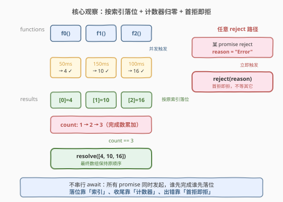
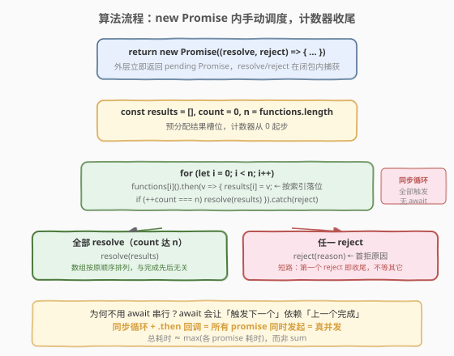
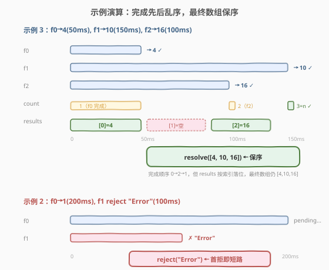

# 并行执行异步函数

- **题目名称**：并行执行异步函数
- **链接**：[2721. 并行执行异步函数](https://leetcode.cn/problems/execute-asynchronous-functions-in-parallel/)
- **难度**：中等
- **标签**：Promise、并发、`Promise.all` 手写、闭包、计数器

## 1. 题目概述

给定一个异步函数数组 `functions`，返回一个新的 promise 对象 `promise`。数组中的每个函数都不接受参数并返回一个 promise。所有的 promise 都应该**并行执行**。

`promise` **resolve** 条件：

- 当所有从 `functions` 返回的 promise 都成功的并行解析时。`promise` 的解析值应该是一个按照它们在 `functions` 中的顺序排列的 promise 的解析值数组。`promise` 应该在数组中的所有异步函数并行执行完成时解析。

`promise` **reject** 条件：

- 当任何从 `functions` 返回的 promise 被拒绝时。`promise` 也会被拒绝，并返回第一个拒绝的原因。

**请在不使用内置的 `Promise.all` 函数的情况下解决。**

**示例 1**：

```text
输入：functions = [
  () => new Promise(resolve => setTimeout(() => resolve(5), 200))
]
输出：{"t": 200, "resolved": [5]}
解释：promiseAll(functions).then(console.log); // [5]
     单个函数在 200 毫秒后以值 5 成功解析。
```

**示例 2**：

```text
输入：functions = [
    () => new Promise(resolve => setTimeout(() => resolve(1), 200)),
    () => new Promise((resolve, reject) => setTimeout(() => reject("Error"), 100))
]
输出：{"t": 100, "rejected": "Error"}
解释：由于其中一个 promise 被拒绝，返回的 promise 也在同一时间被拒绝并返回相同的错误。
```

**示例 3**：

```text
输入：functions = [
    () => new Promise(resolve => setTimeout(() => resolve(4), 50)),
    () => new Promise(resolve => setTimeout(() => resolve(10), 150)),
    () => new Promise(resolve => setTimeout(() => resolve(16), 100))
]
输出：{"t": 150, "resolved": [4, 10, 16]}
解释：所有的 promise 都成功执行。当最后一个 promise 被解析时，返回的 promise 也被解析了。
```

**约束条件**：

- 函数 `functions` 是一个返回 promise 的函数数组
- $1 \leq \text{functions.length} \leq 10$

> 💡 本题是 LeetCode「30 天 JavaScript」系列题目，考点不在算法复杂度，而在 **手写 `Promise.all`**——理解「并发触发、按索引落位、计数器收尾、首拒即拒」四要素。下文以 JS 为提交语言，并给出 Python 的概念等价实现。

---

## 2. 解题思路

### 2.1 暴力思路：`for` 循环里串行 `await`

最直觉的写法是在 `async` 函数里用 `for` 循环逐个 `await`：

```text
async function promiseAll(functions) {
    const results = [];
    for (const fn of functions) {
        results.push(await fn());
    }
    return results;
}
```

逻辑能拿到正确结果，但**不满足「并行执行」**——`await fn()` 会等当前 promise resolve 后才触发下一个 `fn()`，promise 是**串行**发起的。若三个函数分别耗时 50ms / 150ms / 100ms，串行总耗时 $50 + 150 + 100 = 300$ms，而题目期望并发总耗时 $\max(50, 150, 100) = 150$ms。这是「手写 `Promise.all`」与「手写串行收集」的核心分水岭。

### 2.2 核心观察：并发触发 + 按索引落位 + 计数器收尾 + 首拒即拒



关键洞察：要**并发**就不能用 `await` 串行触发——必须在一个同步循环里把所有函数**立刻调用一遍**（每个 `fn()` 立刻返回一个 pending promise，并发计时同时开始），再用 `.then`/`.catch` 给每个 promise 挂回调收集结果。四个要点：

| 要点 | 做法 | 为什么 |
|------|------|--------|
| **并发触发** | 同步 `for` 循环里调 `functions[i]()`，无 `await` | 循环是同步的，几微秒内全部触发，promise 同时开始计时 |
| **按索引落位** | `.then(v => { results[i] = v })` 闭包捕获 `i` | 完成先后无序，但落位靠「原始下标」保证最终数组保序 |
| **计数器收尾** | `if (++count === n) resolve(results)` | 不知谁是最后一个，用计数器判定「全部完成」时机 |
| **首拒即拒** | `.catch(reject)` 任一 reject 立即 reject 外层 | `resolve`/`reject` 一经调用即定型，后续调用被忽略，天然实现短路 |

> 💡 **为何闭包捕获 `i` 是关键**：若写成 `.then(v => results.push(v))`，结果会按**完成先后**排列而非原始顺序（如示例 3 完成顺序是 0→2→1，push 会得到 `[4, 16, 10]` 而非 `[4, 10, 16]`）。必须用 `let i` 闭包捕获下标，把值写到 `results[i]`——**完成先后乱序，落位靠索引保序**。

> ⚠️ **首拒即拒的安全性**：`new Promise` 的 `resolve`/`reject` 是「首次调用生效，后续忽略」的。即使某个 promise 在 reject 之后才 resolve，它的 `.then` 回调里调 `resolve(results)` 也会被静默忽略，不会把已 rejected 的外层 promise 改回 fulfilled。因此无需额外标志位防「reject 后再 resolve 覆盖」。

### 2.3 算法流程图



**逻辑执行步骤**：

| 步骤 | 代码 | 作用 |
|------|------|------|
| ① | `return new Promise((resolve, reject) => { ... })` | 立即返回 pending Promise，闭包内捕获 `resolve`/`reject` |
| ② | `const results = [], count = 0, n = functions.length` | 预分配结果槽位，计数器从 0 起步 |
| ③ | `for (let i = 0; i < n; i++)` 同步循环 | 无 `await`，几微秒内全部触发，真并发 |
| ④ | `functions[i]().then(v => { results[i] = v; if (++count === n) resolve(results) })` | 按索引落位 + 计数达 n 时收尾 |
| ⑤ | `.catch(reject)` | 任一 reject 立即 reject 外层（首拒即短路） |

### 2.4 示例演算



**示例 3（全部 resolve）**：三个函数 $f_0 \to 4(50\text{ms})$、$f_1 \to 10(150\text{ms})$、$f_2 \to 16(100\text{ms})$。

| 时刻 | 事件 | results | count | 动作 |
|------|------|---------|-------|------|
| 0ms | 同步循环触发全部 | `[_, _, _]` | 0 | 三个 promise 同时发起 |
| 50ms | $f_0$ resolve 4 | `[4, _, _]` | 1 | `results[0]=4`，未达 $n=3$ |
| 100ms | $f_2$ resolve 16 | `[4, _, 16]` | 2 | `results[2]=16`，未达 3 |
| 150ms | $f_1$ resolve 10 | `[4, 10, 16]` | 3 | `count===n` → `resolve([4,10,16])` |

> 💡 **完成顺序是 0→2→1（乱序），最终数组却是 [4,10,16]（保序）**——这正是「按索引落位」的威力：谁先完成无所谓，每个值都写到自己的 `results[i]` 槽位，最后一次性 resolve 整个数组。若误用 `push`，会得到 `[4,16,10]`。

**示例 2（首拒即拒）**：$f_0 \to 1(200\text{ms})$、$f_1 \to \text{reject("Error")}(100\text{ms})$。

| 时刻 | 事件 | 动作 |
|------|------|------|
| 0ms | 同步循环触发全部 | 两个 promise 同时发起 |
| 100ms | $f_1$ reject "Error" | `.catch(reject)` → 外层立即 reject("Error")，短路 |
| 200ms | $f_0$ resolve 1 | `.then` 调 `resolve` 被忽略（外层已 rejected） |

> 💡 **总耗时 100ms 而非 200ms**：外层在 $f_1$ reject 的瞬间（100ms）就 reject 了，不等 $f_0$ 完成。这是「首拒即拒」的短路语义，与 `Promise.all` 行为一致。

---

## 3. 参考代码

### JavaScript（提交语言：计数器手写版，推荐）

```javascript
/**
 * @param {Array<Function>} functions
 * @return {Promise<any>}
 */
var promiseAll = function (functions) {
    return new Promise((resolve, reject) => {
        const n = functions.length;
        const results = new Array(n);
        let count = 0;

        for (let i = 0; i < n; i++) {
            functions[i]().then(
                (v) => {
                    results[i] = v;
                    if (++count === n) {
                        resolve(results);
                    }
                },
                (e) => reject(e)
            );
        }
    });
};
```

> 💡 **写法要点**：
> - **`return new Promise`**：不用 `async`，因为我们不能 `await`（一 await 就串行），需要在同步循环里手动调度。
> - **`let i` + `results[i] = v`**：闭包捕获循环下标，按索引落位保序；若用 `var i` 或 `push` 都会出错（`var` 无块级作用域，回调执行时 `i` 已是终值）。
> - **`.then(onFulfilled, onRejected)`**：把成功/失败回调都传给 `.then`，等价于 `.then(v => ...).catch(reject)`，但只挂一条链，更简洁。
> - **`++count === n`**：先自增再比较，最后一个完成的 promise 触发 `resolve(results)`。
> - **空数组边界**：若 `functions` 为空（本题约束 $n \geq 1$ 不触发），`count` 永远到不了 $n$，需在循环外补 `if (n === 0) resolve([])`；本题 $n \geq 1$ 可省。

**TypeScript 版本**（带类型约束）：

```typescript
type Fn<T> = () => Promise<T>;

function promiseAll<T>(functions: Fn<T>[]): Promise<T[]> {
    return new Promise<T[]>((resolve, reject) => {
        const n = functions.length;
        const results: T[] = new Array(n);
        let count = 0;

        for (let i = 0; i < n; i++) {
            functions[i]().then(
                (v: T) => {
                    results[i] = v;
                    if (++count === n) {
                        resolve(results);
                    }
                },
                (e: unknown) => reject(e)
            );
        }
    });
}
```

### Python（概念等价）

> 本题 LeetCode 仅开放 JS/TS，Python 版作概念对照。Python 的 `asyncio` 与 JS 的 Promise 模型同构：`asyncio.gather` 即 `Promise.all`，手动实现同理——并发创建 Task，按索引落位，计数器收尾。

```python
import asyncio


async def promise_all(functions):
    n = len(functions)
    results = [None] * n
    done = 0

    async def runner(i, coro):
        nonlocal done
        results[i] = await coro
        done += 1

    await asyncio.gather(*(runner(i, fn()) for i, fn in enumerate(functions)))
    return results
```

> ⚠️ Python 中 `asyncio.gather` 默认「首拒即拒」（`return_exceptions=False`），与 JS 的 `Promise.all` 一致；若传 `return_exceptions=True` 则等价于 `Promise.allSettled`。手动版用 `gather` 调度 + `nonlocal` 计数，语义与 JS 版一一对应。

---

## 4. 复杂度分析

| 维度 | 复杂度 | 说明 |
|------|--------|------|
| **时间** | $O(\max_i t_i)$ | 所有 promise 并发触发，总等待时间取决于最慢的那个，而非所有耗时之和 |
| **空间** | $O(n)$ | 预分配 `results` 数组（$n$ 个槽位）+ 计数器，$n = \text{functions.length}$ |

> 💡 **为何时间是 $\max$ 不是 $\sum$**：同步循环几微秒内触发全部 `fn()`，各 promise 同时开始计时并发执行，外层 promise 在最后一个 resolve/reject 时定型。若误用串行 `await`，时间退化为 $\sum_i t_i$——这是「并发」与「串行」的本质区别。
>
> 若误用串行 `await`，$n=3$、各 50/150/100ms 时串行需 300ms，并发只需 150ms，相差一倍。

---

## 5. 扩展：Promise 组合器的四姊妹

`Promise.all` 只是 Promise 静态方法「四姊妹」之一，理解本题后可顺带掌握其余三个，区别全在「何时定型 / 收集什么」：

### 5.1 四姊妹对比

| 方法 | 定型时机 | 结果值 | 等价语义 |
|------|----------|--------|----------|
| `Promise.all` | 全部 resolve 或 任一 reject | resolve → 值数组；reject → 首拒原因 | **「全成功才成功，一败俱败」** |
| `Promise.allSettled` | 全部定型（不论成功/失败） | `{status, value/reason}` 数组 | 「等全部尘埃落定，无一短路」 |
| `Promise.race` | 任一 promise 定型（resolve 或 reject） | 首个定型的值或原因 | 「谁先结束谁说了算」 |
| `Promise.any` | 任一 resolve 或 全部 reject | resolve → 首个成功值；全 reject → `AggregateError` | 「只要一个成功就行，全失败才失败」 |

### 5.2 手写 `Promise.allSettled`（对照本题）

`allSettled` 不短路、不 reject，把每个 promise 的结局包成 `{status, value/reason}`：

```javascript
var promiseAllSettled = function (functions) {
    return new Promise((resolve) => {
        const n = functions.length;
        const results = new Array(n);
        let count = 0;

        const settle = (i, outcome) => {
            results[i] = outcome;
            if (++count === n) resolve(results);
        };

        for (let i = 0; i < n; i++) {
            functions[i]().then(
                (v) => settle(i, { status: "fulfilled", value: v }),
                (e) => settle(i, { status: "rejected", reason: e })
            );
        }
    });
};
```

> 💡 与 `promiseAll` 的差异：① 没有 `reject` 参数（永不 reject 外层）；② 成功/失败都走 `settle`，区别只在打包的 `outcome` 结构；③ 计数器照样收尾，但「全部定型」而非「全部成功」。

### 5.3 手写 `Promise.race`（最简）

`race` 只要任一 promise 定型（不论 resolve/reject）就立即把外层定型为同样的值/原因，其余忽略：

```javascript
var promiseRace = function (functions) {
    return new Promise((resolve, reject) => {
        for (const fn of functions) {
            fn().then(resolve, reject);
        }
    });
};
```

> 💡 极简：每个 promise 都直接 `then(resolve, reject)`，谁先定型谁先调，后续调用被 `Promise` 忽略。无需计数器、无需 results 数组。

---

## 6. 面试要点

1. **为什么不能用 `for` 循环里 `await` 串行收集？**

   > `await fn()` 会暂停循环直到当前 promise resolve，下一个 `fn()` 才被调用，promise 是**串行**发起的，总耗时是各 promise 耗时之和 $\sum t_i$。而 `Promise.all` 要求**并发**——所有 promise 同时开始计时，总耗时是最慢那个 $\max t_i$。要并发，必须在一个同步循环里全部触发，再用 `.then` 回调异步收集结果。

2. **为什么必须用 `results[i] = v` 而不是 `results.push(v)`？**

   > promise 完成的先后顺序与触发顺序无关（耗时短的先 resolve）。`push` 会按**完成先后**排列，导致结果顺序与 `functions` 原顺序不一致（如示例 3 完成顺序 0→2→1，push 得 `[4,16,10]` 而非 `[4,10,16]`）。用闭包捕获的原始下标 `i` 写到 `results[i]`，谁先完成无所谓，最终数组按原索引保序。

3. **`resolve`/`reject` 多次调用会怎样？为什么不用标志位防「reject 后再 resolve」？**

   > `new Promise` 的 `resolve`/`reject` 是「首次调用生效，后续静默忽略」的。即使 reject 之后某个 promise 才 resolve 并调用 `resolve(results)`，该调用被忽略，外层保持 rejected 状态不变。因此无需额外标志位，天然实现短路安全。

4. **首拒即拒时，其它还在 pending 的 promise 会被取消吗？**

   > 不会。Promise 一旦发起就不可取消，它们仍会跑完（resolve 或 reject），只是结果被外层忽略。这是 JS Promise 与 Python `asyncio.Task.cancel()`、Rust `Future::abort` 的区别——JS 标准库无取消机制。若需真正取消，要用 `AbortController` 配合 fetch 等 API。

5. **`.then(onFulfilled, onRejected)` 与 `.then(...).catch(...)` 有何区别？**

   > `.then(a, b)` 的第二个参数 `b` 只捕获**前一步 promise**（即 `functions[i]()`）的 reject；而 `.catch` 会捕获**整条链**（包括 `onFulfilled` 里抛的错）。本题 `onFulfilled` 里只做赋值和计数，不会抛错，两者等价。但若 `onFulfilled` 可能抛错，`.catch` 会误把它的错当原 promise 的 reject，语义不同。

> 💡 **一句话总结**：2721 = 手写 `Promise.all`——「同步循环并发触发 + `.then` 闭包按索引落位 + 计数器判定全部完成 + `.catch`/第二参数首拒即拒」。本质是用闭包和计数器在 `new Promise` 里手动调度异步收集，绕开 `await` 的串行陷阱。

---

## 7. 同类练习题

- [2723. 两个 Promise 对象相加](https://leetcode.cn/problems/add-two-promises/)：两个 Promise 求和，串行 `await` 即可——是理解 `await` 串行语义的前置，对照 2721 为何不能用串行 `await`（[题解](../2701-2800/2723_两个Promise对象相加.md)）
- [2637. 有时间限制的 Promise 对象](https://leetcode.cn/problems/promise-time-limit/)：`Promise.race` 在 `fn` 与超时 promise 间赛跑——是 `Promise.race`（任一定型）的招牌题，对照 2721 的 `Promise.all`（全部定型）（[题解](../2601-2700/2637_有时间限制的Promise对象.md)）
- [2636. Promise 对象池](https://leetcode.cn/problems/promise-pool/)：控制并发池上限，手动调度 N 个 promise——承接 2721 的并发调度思想，加入「限流」维度（[题解](../2601-2700/2636_Promise对象池.md)）
- [2715. 执行可取消的延迟函数](https://leetcode.cn/problems/timeout-cancellation/)：`setTimeout` + `clearTimeout` 定时器生命周期，与 2721 同属「30 天 JS」异步系列，从 Promise 组合转向定时器取消（[题解](../2701-2800/2715_执行可取消的延迟函数.md)）
