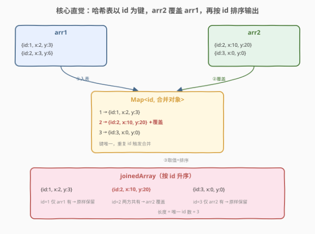
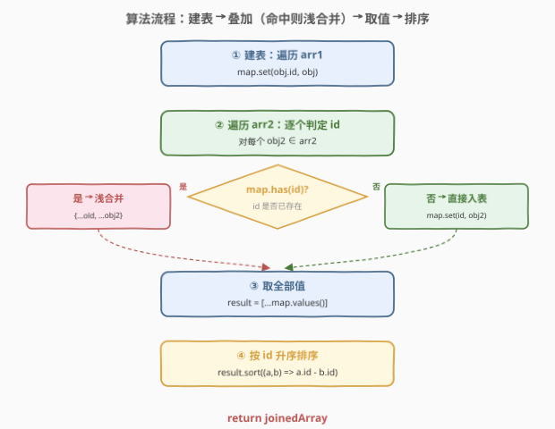
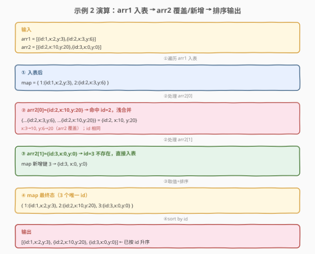

# LeetCode 根据 ID 合并两个数组 题解

## 1. 题目概述

- **标题 / 题号**：根据 ID 合并两个数组（#2722，medium）
- **链接**：https://leetcode.cn/problems/join-two-arrays-by-id/
- **难度**：中等
- **标签**：哈希表、数组、对象合并、排序

**题意**：现给定两个数组 `arr1` 和 `arr2`，返回一个新的数组 `joinedArray`。两个输入数组中的每个对象都包含一个 `id` 字段。

`joinedArray` 是一个通过 `id` 将 `arr1` 和 `arr2` 连接而成的数组。`joinedArray` 的长度应为唯一值 `id` 的长度。返回的数组应按 `id` **升序** 排序。

如果一个 `id` 存在于一个数组中但不存在于另一个数组中，则该对象应包含在结果数组中且不进行修改。

如果两个对象共享一个 `id`，则它们的属性应进行合并：

- 如果一个键只存在于一个对象中，则该键值对应包含在该对象中。
- 如果一个键在两个对象中都包含，则 `arr2` 中的值应覆盖 `arr1` 中的值。

**示例 1**：

```text
输入：
arr1 = [
    {"id": 1, "x": 1},
    {"id": 2, "x": 9}
],
arr2 = [
    {"id": 3, "x": 5}
]
输出：
[
    {"id": 1, "x": 1},
    {"id": 2, "x": 9},
    {"id": 3, "x": 5}
]
解释：没有共同的 id，因此将 arr1 与 arr2 简单地连接起来。
```

**示例 2**：

```text
输入：
arr1 = [
    {"id": 1, "x": 2, "y": 3},
    {"id": 2, "x": 3, "y": 6}
],
arr2 = [
    {"id": 2, "x": 10, "y": 20},
    {"id": 3, "x": 0, "y": 0}
]
输出：
[
    {"id": 1, "x": 2, "y": 3},
    {"id": 2, "x": 10, "y": 20},
    {"id": 3, "x": 0, "y": 0}
]
解释：id 为 1 和 id 为 3 的对象在结果数组中保持不变。id 为 2 的两个对象合并在一起。arr2 中的键覆盖 arr1 中的值。
```

**示例 3**：

```text
输入：
arr1 = [
    {"id": 1, "b": {"b": 94}, "v": [4, 3], "y": 48}
]
arr2 = [
    {"id": 1, "b": {"c": 84}, "v": [1, 3]}
]
输出：
[
    {"id": 1, "b": {"c": 84}, "v": [1, 3], "y": 48}
]
解释：具有 id 为 1 的对象合并在一起。对于键 "b" 和 "v"，使用 arr2 中的值。由于键 "y" 只存在于 arr1 中，因此取 arr1 的值。
```

**约束**：

- `arr1` 和 `arr2` 都是有效的 JSON 数组；
- 在 `arr1` 和 `arr2` 中都有唯一的键值 `id`；
- $2 \le \text{JSON.stringify(arr1).length} \le 10^6$；
- $2 \le \text{JSON.stringify(arr2).length} \le 10^6$。

> 💡 本题是 LeetCode「30 天 JavaScript」系列题目，**仅提供 JavaScript / TypeScript 提交入口**，核心考察**哈希表按 `id` 归并 + 浅合并（spread）+ 排序**。它本质是数据库 `JOIN` 操作在 JS 对象数组上的简化版：以 `id` 为主键，`arr2` 是「右表」覆盖「左表」`arr1`。示例 3 的嵌套值 `b`、`v` 用 arr2 整体替换（非深合并）是关键考点——`{...a, ...b}` 的浅合并语义恰好匹配。

## 2. 解题思路

### 2.1 暴力思路：双重遍历逐个匹配

对 `arr2` 的每个对象，线性扫描 `arr1` 找 `id` 相同者：找到则合并，找不到则新增。最后把所有对象按 `id` 排序。时间 $O(n \cdot m)$（$n$、$m$ 分别为两数组长度），当两数组都到 $10^5$ 量级时平方级退化明显。

瓶颈在于「查找同 `id` 对象」这一步被反复线性扫描，而 `id` 在各自数组内唯一，天然适合用哈希表 $O(1)$ 定位。

### 2.2 核心观察：哈希表归并 + 浅合并



`id` 在 `arr1`、`arr2` 内各自唯一，是天然的哈希键。整体只需三步：

| 步骤 | 动作 | 复杂度 |
|------|------|--------|
| **① 建表** | 遍历 `arr1`，`map.set(obj.id, obj)` | $O(n)$ |
| **② 叠加** | 遍历 `arr2`：命中则浅合并 `{...old, ...obj2}`，否则直入 | $O(m)$ |
| **③ 取值排序** | `[...map.values()]` 后按 `id` 升序 `sort` | $O(k \log k)$ |

其中 $k$ 为唯一 `id` 数（$k \le n + m$）。

**浅合并的语义**：`{...a, ...b}` 产生新对象，`b` 的键覆盖 `a` 的同键，`a` 独有的键保留。这正是题目「`arr2` 覆盖 `arr1`、`arr1` 独有键保留」的精确描述——一次 spread 即完成合并，无需递归下钻。示例 3 中 `b` 是嵌套对象、`v` 是数组，浅合并将它们整体替换（`b` 从 `{b:94}` 变 `{c:84}`、`v` 从 `[4,3]` 变 `[1,3]`），与「使用 arr2 中的值」一致。

> 💡 **为什么是浅合并而非深合并？** 题目明确「如果一个键在两个对象中都包含，则 `arr2` 中的值应覆盖 `arr1` 中的值」——覆盖即整体替换，不递归到嵌套层内部逐键合并。`{...a, ...b}` 与 `Object.assign({}, a, b)` 都是浅合并，语义完全匹配。若误用深合并（递归合并嵌套对象），示例 3 会得到 `{id:1, b:{b:94,c:84}, v:[1,3], y:48}`——`b` 变成两对象键的并集，与官方输出 `{b:{c:84}}` 不符。

> ⚠️ **合并顺序：先 arr1 后 arr2。** 浅合并 `{...arr1Obj, ...arr2Obj}` 保证 `arr2` 的键覆盖 `arr1`。若顺序写反（`{...arr2Obj, ...arr1Obj}`），`arr1` 反而覆盖 `arr2`，与题意相悖。建表阶段先放 `arr1`、叠加阶段用 `arr2` 覆盖，正是这一顺序的自然体现。

### 2.3 算法流程图



决策发生在**叠加阶段**：对每个 `obj2 ∈ arr2`，查 `map.has(obj2.id)`——

- **是**（已存在）：取出旧对象，浅合并后写回 `map.set(id, {...old, ...obj2})`；
- **否**（不存在）：直接 `map.set(id, obj2)` 新增。

两条分支汇合后统一进入「取值 + 排序」。`Map` 天然按插入顺序保留键值，但题目要求按 `id` 升序，故必须显式 `sort`。

### 2.4 示例演算



以**示例 2** 逐步演算：

| 阶段 | 处理对象 | map 状态 | 说明 |
|------|----------|----------|------|
| ① 入表 | `arr1[0]` id=1 | `{1:{id:1,x:2,y:3}}` | 首个，直接入表 |
| ① 入表 | `arr1[1]` id=2 | `{1:{...}, 2:{id:2,x:3,y:6}}` | 直接入表 |
| ② 叠加 | `arr2[0]` id=2 | `{1:{...}, 2:{id:2,x:10,y:20}}` | 命中 id=2 → 浅合并，x:3→10、y:6→20 |
| ② 叠加 | `arr2[1]` id=3 | `{1:{...}, 2:{...}, 3:{id:3,x:0,y:0}}` | 不存在 → 新增 |
| ③④ 取值排序 | `[...values()]` + sort | 输出 3 个对象 | 按 id 升序：1, 2, 3 |

> 💡 **排序的必要性**：`Map` 的迭代顺序是**插入顺序**，不是键的数值升序。本题先插 id=1、2，再插 id=3，恰好升序；但若 `arr2` 先出现更小 id（如先插 id=0 再插 id=3），`map.values()` 就不是升序。故 `[...map.values()].sort((a,b) => a.id - b.id)` 是必经一步，不能省。

## 3. 参考代码

### JavaScript / TypeScript（提交语言）

```javascript
/**
 * @param {Array} arr1
 * @param {Array} arr2
 * @return {Array}
 */
var join = function (arr1, arr2) {
    // ① 建表：arr1 全部入表，id 为键
    const map = new Map();
    for (const obj of arr1) {
        map.set(obj.id, obj);
    }
    // ② 叠加：arr2 命中则浅合并（arr2 覆盖 arr1），否则新增
    for (const obj of arr2) {
        if (map.has(obj.id)) {
            map.set(obj.id, { ...map.get(obj.id), ...obj });
        } else {
            map.set(obj.id, obj);
        }
    }
    // ③ 取值并按 id 升序排序
    return [...map.values()].sort((a, b) => a.id - b.id);
};
```

TypeScript 版（带类型标注）：

```typescript
type JSONValue = null | boolean | number | string | JSONValue[] | { [key: string]: JSONValue };
type ArrayType = { "id": number } & Record<string, JSONValue>;

function join(arr1: ArrayType[], arr2: ArrayType[]): ArrayType[] {
    const map = new Map<number, ArrayType>();
    for (const obj of arr1) {
        map.set(obj.id, obj);
    }
    for (const obj of arr2) {
        if (map.has(obj.id)) {
            map.set(obj.id, { ...map.get(obj.id)!, ...obj });
        } else {
            map.set(obj.id, obj);
        }
    }
    return [...map.values()].sort((a, b) => a.id - b.id);
}
```

> 💡 **合并可简化为无条件覆盖**：叠加阶段其实不必先判 `has`——直接 `map.set(id, { ...map.get(id), ...obj })` 即可。当 `id` 不存在时 `map.get(id)` 返回 `undefined`，`{...undefined, ...obj}` 等价于 `{...obj}`（spread `undefined` 被当作空对象），结果正确。但显式判 `has` 语义更清晰，且避免对每条 `arr2` 对象都新建一个壳对象（命中时才合并、未命中直接引用原对象），在大数据量下更省内存。两种写法均 AC。

> ⚠️ **`sort` 比较器必须用数值减法**。`sort((a, b) => a.id - b.id)` 按 `id` 数值升序；若漏写比较器（裸 `sort()`），JS 默认按 **UTF-16 字符串**排序，`id=10` 会排在 `id=2` 之前（"1" < "2"），导致顺序错误。这与 [912. 排序数组](../0901-1000/912_排序数组.md) 中「`sort` 默认字典序」的坑同源。

### Python（概念等价）

> 本题 LeetCode 仅开放 JS/TS，Python 版作概念对照。核心结构一致：字典建表、`**` 解包浅合并、按 `id` 排序。

```python
def join(arr1: list[dict], arr2: list[dict]) -> list[dict]:
    # ① 建表：arr1 全部入表，id 为键
    table = {obj["id"]: obj for obj in arr1}
    # ② 叠加：arr2 命中则浅合并（arr2 覆盖 arr1），否则新增
    for obj in arr2:
        if obj["id"] in table:
            table[obj["id"]] = {**table[obj["id"]], **obj}
        else:
            table[obj["id"]] = obj
    # ③ 取值并按 id 升序排序
    return sorted(table.values(), key=lambda o: o["id"])
```

> 💡 **JS `spread` 与 Python `**` 的对应**：`{...a, ...b}` 对应 `{**a, **b}`，都是浅合并、后者覆盖前者。注意 Python 中 `sorted(..., key=lambda o: o["id"])` 是稳定排序，与 JS `sort((a,b) => a.id - b.id)` 语义一致（`id` 唯一故稳定性不影响结果）。

## 4. 复杂度分析

| 维度 | 复杂度 | 说明 |
|------|--------|------|
| 时间复杂度 | $O((n+m) \log (n+m))$ | 建表 $O(n)$ + 叠加 $O(m)$ + 排序 $O(k \log k)$，$k$ 为唯一 id 数（$k \le n+m$），排序为主导项 |
| 空间复杂度 | $O(n+m)$ | `Map` 存储全部唯一 id 的对象，输出结构与输入同阶 |

> 💡 若 `id` 取值范围稠密或可映射到连续区间，理论上可用数组下标代替 `Map` 实现 $O(n+m)$ 线性时间（计数排序思想），但题目未给 `id` 上界，`Map` 是通用安全选择。排序项 $O(k \log k)$ 在实际约束（`JSON.stringify` 长度 $\le 10^6$）下完全可接受。

## 5. 扩展：浅合并 vs 深合并

- **浅合并（本题所需）**：`{...a, ...b}` 只看顶层键，`b` 的键整体覆盖 `a`。示例 3 中 `b: {b:94}` 被 `b: {c:84}` 整体替换为 `{c:84}`，不合并到 `{b:94, c:84}`。
- **深合并**：递归到嵌套对象内部逐键合并。常见于配置合并（如 `lodash.merge`），但**非**本题语义。若题目改为深合并，示例 3 输出会变成 `{id:1, b:{b:94,c:84}, v:[1,3], y:48}`——`b` 变两对象键的并集。
- **数组值的合并**：题目未定义「两个数组值如何合并」，故一律整体替换（`v` 从 `[4,3]` 变 `[1,3]`）。若要求「数组合并取并集」，则需额外规则，已超出本题范围。
- **空值处理**：浅合并不区分 `undefined` 与未定义键——`{...{x:1}, ...{x:undefined}}` 得 `{x:undefined}`，`x` 仍存在。本题输入为合法 JSON（无 `undefined`），不触发此边界。

> 💡 工程实践中，对象数组的「按主键 JOIN」是数据处理的常见模式——SQL 的 `LEFT JOIN`/`FULL JOIN`、Pandas 的 `merge(on=...)` 都是同型操作。本题用 `Map` + spread 在 JS 里手搓了一个最小版 `JOIN`，掌握它就抓住了「键归并」类题目的母题。

## 6. 面试要点

1. **为什么用 `Map` 而不是普通对象 `{}` 做哈希表？**

   > `Map` 的键可以是任意类型（含数字），且键的顺序为**插入顺序**、`size` 属性直接给出元素数。普通对象的键会被强制转为字符串（`obj[1]` 与 `obj["1"]` 同键），虽然本题 `id` 是数字、转字符串后仍唯一不冲突，但 `Map` 语义更清晰、避免隐式类型转换的坑。此外 `Map` 在频繁增删时性能优于普通对象。

2. **浅合并 `{...a, ...b}` 与 `Object.assign({}, a, b)` 有何区别？**

   > 两者**完全等价**：都返回新对象，`b` 的键覆盖 `a` 的同键。区别仅在写法——spread 是语法、`Object.assign` 是方法。`Object.assign` 的第一个参数是目标对象（会被修改），故要传 `{}` 作为空目标以避免污染 `a`。本题用 spread 更简洁。

3. **为什么必须显式 `sort`，不能依赖 `Map` 的顺序？**

   > `Map` 的迭代顺序是**插入顺序**，不是键的数值升序。本题先插 `arr1` 的 id、再插 `arr2` 的新 id，若 `arr2` 出现比已有更小的 id，`values()` 就不是升序。题目要求按 `id` 升序输出，故 `[...values()].sort((a,b) => a.id - b.id)` 是必经一步。

4. **示例 3 中嵌套对象 `b` 为什么不深合并？**

   > 题目明确「`arr2` 中的值应覆盖 `arr1` 中的值」——覆盖即整体替换，不递归到嵌套层内部逐键合并。`{...a, ...b}` 的浅合并语义恰好如此：`b: {b:94}` 被 `b: {c:84}` 整体替换为 `{c:84}`。若深合并会得到 `{b:94, c:84}`，与官方输出 `{c:84}` 不符。

5. **能否不排序，在建表时即保持升序？**

   > 可以用平衡 BST 或跳表实现「有序字典」，使插入即有序，省去末尾排序。但 JS 标准库无此结构，手写成本远高于「`Map` + 末尾一次 `sort`」。考虑到排序项 $O(k \log k)$ 在实际约束下可接受，`Map` + `sort` 是简洁与效率的最佳平衡。

> 💡 **一句话总结**：2722 = 「`Map` 以 id 归并 + spread 浅合并（arr2 覆盖 arr1）+ 按 id 升序 sort」。建表 $O(n)$、叠加 $O(m)$、排序 $O(k \log k)$，空间 $O(n+m)$。浅合并是关键考点——嵌套值整体替换而非递归合并，`{...a, ...b}` 一次到位。

## 同类练习题

| # | 题目 | 与本题的关联 |
|---|------|-------------|
| 2631 | [分组](https://leetcode.cn/problems/group-by/)（[题解](../2601-2700/2631_分组.md)） | 按回调键把数组归并为对象，与本题按 `id` 归并同属「哈希表键归并」家族——一个分组、一个合并覆盖 |
| 2675 | [将对象数组转换为矩阵](https://leetcode.cn/problems/array-of-objects-to-matrix/)（[题解](../2601-2700/2675_将对象数组转换为矩阵.md)） | 对象数组拍平为二维矩阵，同属「对象数组结构变换」家族，一拍平一合并 |
| 2628 | [完全相等的 JSON 对象](https://leetcode.cn/problems/json-deep-equal/)（[题解](../2601-2700/2628_完全相等的JSON对象.md)） | 递归判定两 JSON 对象深度相等，与本题「浅合并」形成对照——一深一浅，理解何时该递归下钻 |
| 2700 | [两个对象之间的差异](https://leetcode.cn/problems/differences-between-two-objects/)（[题解](../2701-2800/2700_两个对象之间的差异.md)） | 递归求两对象的键值差异，与本题「合并两对象」互为逆操作——一合分一差异 |
| 2625 | [扁平化嵌套数组](https://leetcode.cn/problems/flatten-deeply-nested-array/)（[题解](../2601-2700/2625_扁平化嵌套数组.md)） | 递归按深度拍平嵌套数组，同属「30 天 JS」系列，巩固对对象/数组递归遍历的运用 |
