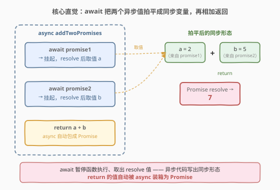
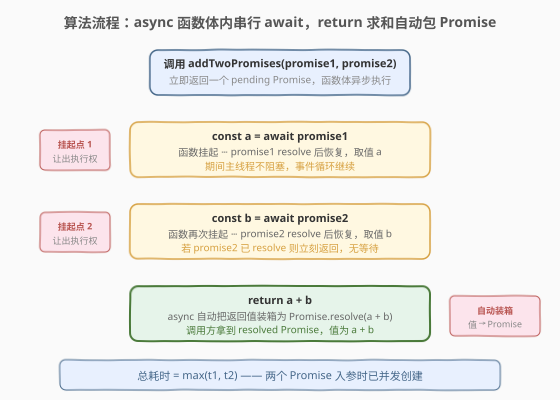
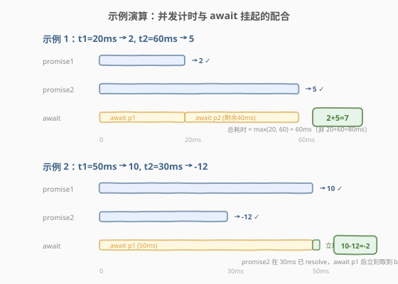

# 两个 Promise 对象相加

- **题目名称**：两个 Promise 对象相加
- **链接**：[2723. Add Two Promises](https://leetcode.cn/problems/add-two-promises/)
- **难度**：简单
- **标签**：Promise、async/await、`Promise.all`

## 1. 题目概述

给定两个 promise 对象 `promise1` 和 `promise2`，返回一个新的 promise。`promise1` 和 `promise2` 都会被解析为一个数字。返回的 Promise 应该解析为这两个数字的和。

**示例 1**：

```text
输入：
promise1 = new Promise(resolve => setTimeout(() => resolve(2), 20)),
promise2 = new Promise(resolve => setTimeout(() => resolve(5), 60))
输出：7
解释：两个输入的 Promise 分别解析为值 2 和 5。返回的 Promise 应该解析为 2 + 5 = 7。
     返回的 Promise 解析的时间不作为判断条件。
```

**示例 2**：

```text
输入：
promise1 = new Promise(resolve => setTimeout(() => resolve(10), 50)),
promise2 = new Promise(resolve => setTimeout(() => resolve(-12), 30))
输出：-2
解释：两个输入的 Promise 分别解析为值 10 和 -12。返回的 Promise 应该解析为 10 + -12 = -2。
```

**约束条件**：

- `promise1` 和 `promise2` 都是被解析为一个数字的 promise 对象
- 本题仅开放 JavaScript / TypeScript 提交

> 💡 本题是 LeetCode「30 天 JavaScript」系列题目，考点不在算法复杂度，而在 **Promise 组合**——理解「两个异步值如何聚合为一个异步值」。核心是 `async/await` 让异步代码写出同步形态，或用 `Promise.all` 并发等待再求和。下文以 JS 为提交语言，并给出 Python 的概念等价实现。

---

## 2. 解题思路

### 2.1 暴力思路：`.then()` 链式嵌套

最原始的写法：在 `promise1` 的 `.then` 回调里再取 `promise2` 的值，最后返回两者之和：

```text
promise1.then(v1 => promise2.then(v2 => v1 + v2))
```

逻辑正确，但**回调地狱**（callback hell）——两层嵌套，可读性差。如果将来要从「两个 Promise」扩展到「N 个 Promise 求和」，嵌套层数线性增长，每加一个就多一层缩进，代码迅速失控。这是 `async/await` 语法诞生前 Promise 组合的痛点。

### 2.2 核心观察：`async/await` 把异步拍平为同步



关键洞察：`async` 函数**自动返回一个 Promise**，其 resolve 值就是函数 `return` 的值；函数体内的 `await` 会**暂停执行直到被 await 的 Promise resolve**，并把 resolve 值取出为普通变量。

因此只需三步：

| 步骤 | 代码 | 语义 |
|------|------|------|
| ① await 第一个 | `const a = await promise1;` | 等 `promise1` resolve，取值为 `a` |
| ② await 第二个 | `const b = await promise2;` | 等 `promise2` resolve，取值为 `b` |
| ③ 求和返回 | `return a + b;` | `async` 函数自动把返回值包成 Promise |

> 💡 **`async` 函数的返回值自动装箱**：`async function f() { return 5; }` 返回的不是数字 `5`，而是 `Promise.resolve(5)`。调用方拿到的一定是 Promise——这正是题目要求的返回类型。无需手动 `return Promise.resolve(a + b)`。

> ⚠️ **`await` 是串行等待**：`await promise1` 完成后才开始 `await promise2`。当两个 Promise **同时开始 resolve 计时**（在调用 `addTwoPromises` 之前已创建），`await` 的串行不影响总耗时——`promise1` 在 20ms resolve，此时 `promise2` 已同时跑了 20ms，再 await 它只需等剩余时间。但若两个 Promise 在 `await` 时才创建，串行 await 会比并发慢。本题约束 promise 在函数入参时已创建，故串行 await 安全。

### 2.3 算法流程图



`addTwoPromises` 被调用时，返回一个 **pending 的 Promise**（因为 async 函数立即返回 Promise，内部代码异步执行）。函数体内 `await promise1` 挂起 → `promise1` resolve 取值 `a` → `await promise2` 挂起 → `promise2` resolve 取值 `b` → `return a + b` → 外层 Promise resolve 为 `a + b`。

### 2.4 示例演算



| 示例 | promise1 | promise2 | await 顺序 | a | b | 输出 |
|------|----------|----------|-----------|---|---|------|
| 1 | 20ms → 2 | 60ms → 5 | 等 20ms 取 2，再等剩余 40ms 取 5 | 2 | 5 | `7` |
| 2 | 50ms → 10 | 30ms → -12 | 等 50ms 取 10，再立刻取 -12（早已 resolve） | 10 | -12 | `-2` |

> 💡 **示例 1 的时间线**：`promise1` 在 20ms resolve，`promise2` 在 60ms resolve。`await promise1` 挂起 20ms 取到 `2`，此时 `promise2` 已并发跑了 20ms，`await promise2` 只需再等 40ms 取到 `5`，总耗时 60ms（= `max(20, 60)`，而非 `20 + 60 = 80`）。示例 2 同理：`promise2` 在 30ms 就 resolve 了，`await promise1` 挂起 50ms 取到 `10` 后，`await promise2` 立刻返回 `-12`（早已 resolve），总耗时 50ms。

---

## 3. 参考代码

### JavaScript（提交语言：async/await）

```javascript
/**
 * @param {Promise} promise1
 * @param {Promise} promise2
 * @return {Promise}
 */
var addTwoPromises = async function (promise1, promise2) {
    const a = await promise1;
    const b = await promise2;
    return a + b;
};
```

> 💡 `async` 关键字让函数自动返回 Promise，`await` 取出两个 Promise 的 resolve 值，`return a + b` 自动 resolve 为 `a + b`。三行代码，无回调嵌套。

**TypeScript 版本**（带类型约束）：

```typescript
type P = Promise<number>;

async function addTwoPromises(promise1: P, promise2: P): P {
    const a = await promise1;
    const b = await promise2;
    return a + b;
};
```

### Python（概念等价）

> 本题 LeetCode 仅开放 JS/TS，Python 版作概念对照。Python 的 `asyncio` 与 JS 的 Promise 模型同构：`await` 取异步结果，`async def` 返回 coroutine。

```python
import asyncio


async def add_two_promises(promise1, promise2):
    a = await promise1
    b = await promise2
    return a + b
```

> ⚠️ Python 中 `asyncio.Future` / `Task` 对应 JS 的 Promise，`await` 语义一致。但 Python 需在事件循环中运行 coroutine（`asyncio.run(...)`），JS 的 Promise 由运行时事件循环自动驱动。

---

## 4. 复杂度分析

| 维度 | 复杂度 | 说明 |
|------|--------|------|
| **时间** | $O(\max(t_1, t_2))$ | 两个 Promise 已在入参时创建并并发计时，串行 `await` 的总等待时间为两者 resolve 时间的较大值，而非之和 |
| **空间** | $O(1)$ | 仅持有两个 resolve 值 `a`、`b` 的引用 |

> 💡 若两个 Promise 在 `await` 处才创建（非入参时），串行 `await` 会退化至 $O(t_1 + t_2)$。此时应改用 `Promise.all` 并发等待（见第 5 节）。

---

## 5. 扩展：`Promise.all` 并发等待与 N 个 Promise 求和

### 5.1 `Promise.all` 版本

`Promise.all([p1, p2])` 返回一个新 Promise，**并发**等待所有输入 Promise resolve，全部完成后 resolve 为结果数组（保持顺序）。适合需要严格并发语义的场景：

```javascript
var addTwoPromises = async function (promise1, promise2) {
    const [a, b] = await Promise.all([promise1, promise2]);
    return a + b;
};
```

> 💡 `Promise.all` 的优势在「N 个 Promise 求和」时凸显——无论多少个，都是一行 `Promise.all` + 一行解构/`reduce`。且 `Promise.all` 保证并发：即使 Promise 在 `await` 处才创建，也会同时发起。

### 5.2 两种写法对比

| 维度 | 串行 `await`（本题解） | `Promise.all` |
|------|----------------------|----------------|
| 代码简洁度 | 三行，直观 | 两行，需解构 |
| 并发语义 | 隐式（依赖 Promise 已创建） | 显式（`Promise.all` 保证并发） |
| N 个泛化 | 需写 N 个 `await` | `await Promise.all(arr)` + `reduce` |
| 短路行为 | 一个 reject 不影响另一个已发起的 | 一个 reject 立即 reject 整体（不等其它） |

### 5.3 N 个 Promise 求和

```javascript
async function sumPromises(promises) {
    const values = await Promise.all(promises);
    return values.reduce((acc, v) => acc + v, 0);
}
```

> 💡 `Promise.all` + `reduce` 是异步聚合的标准范式：先并发等待全部完成，再同步归约。对应到同步世界就是 `arr.reduce(add)`，只是前置一层 `await Promise.all`。

---

## 6. 面试要点

1. **`async` 函数的返回值是什么？为什么不用手动包 `Promise.resolve`？**

   > `async` 函数**总是返回 Promise**——`return x` 等价于 `return Promise.resolve(x)`，`throw e` 等价于 `return Promise.reject(e)`。这是语言层面的自动装箱，故题目要求「返回一个 Promise」时只需 `async` + `return`，无需手动包装。

2. **串行 `await` 与 `Promise.all` 在本题中有区别吗？**

   > 本题中两个 Promise 在 `addTwoPromises` 被调用前已创建并开始计时，串行 `await` 的总耗时是 $\max(t_1, t_2)$（并发已跑），与 `Promise.all` 相同。但若 Promise 在 `await` 处才创建（如 `await fetch(url1)` 再 `await fetch(url2)`），串行会退化至 $t_1 + t_2$，此时必须用 `Promise.all` 保证并发。

3. **如果 `promise1` reject 了会怎样？**

   > `await promise1` 会抛出 reject 值，`async` 函数自动将其转为返回的 Promise 的 reject。调用方拿到一个 rejected Promise。若要容错，可用 `try/catch` 包裹 `await`，或用 `Promise.allSettled` 等待全部完成（无论 fulfilled/rejected）。

4. **`Promise.all` 中一个 Promise reject 会影响其它吗？**

   > `Promise.all` **短路**：任一输入 reject，整体立即 reject，不再等待其它 Promise（但其它 Promise 已发起的不会被取消，只是结果被忽略）。若需「等全部完成再处理」，用 `Promise.allSettled`——返回 `{status, value/reason}` 数组，无短路。

5. **为什么 `await` 能把异步代码写成同步形态？它阻塞了主线程吗？**

   > `await` 不阻塞主线程，它只是**让出当前 async 函数的执行权**——把后续代码挂为一个微任务，等被 await 的 Promise resolve 后在下一个微任务周期恢复执行。主线程在等待期间继续处理事件循环。这是「异步非阻塞」的本质：代码形态像同步，执行机制是异步。

> 💡 **一句话总结**：2723 = 「`async` 函数内 `await` 两个 Promise 取值，`return a + b` 自动包 Promise」。本质是异步值的同步式组合，是 Promise 链式调用的语法糖。

---

## 7. 同类练习题

- [2621. 睡眠函数](https://leetcode.cn/problems/sleep/)：用 `setTimeout` 包成 Promise 再 `await`，把「t ms 后执行」升级为「t ms 后 resolve」——是理解 `await` 暂停语义的前置练习（[题解](../2601-2700/2621_睡眠函数.md)）
- [2637. 有时间限制的 Promise 对象](https://leetcode.cn/problems/promise-time-limit/)：`Promise.race` 在 `fn` 与超时 Promise 间赛跑——是 `Promise.all`（全部等待）的对照面（任一完成），同为 Promise 组合范式（[题解](../2601-2700/2637_有时间限制的Promise对象.md)）
- [2636. Promise 对象池](https://leetcode.cn/problems/promise-pool/)：用 `Promise.all` 管理并发池，控制同时运行的 Promise 数量——是「N 个 Promise 调度」的进阶，承接本题的 `Promise.all` 思想（[题解](../2601-2700/2636_Promise对象池.md)）
- [2715. 执行可取消的延迟函数](https://leetcode.cn/problems/timeout-cancellation/)：`setTimeout` + `clearTimeout` 的定时器管理，与本题同属「30 天 JS」异步系列，从 Promise 组合转向定时器生命周期（[题解](../2701-2800/2715_执行可取消的延迟函数.md)）
- [2665. 计数器 II](https://leetcode.cn/problems/counter-ii/)（[题解](../2601-2700/2665_计数器II.md)）：闭包封装私有状态，同为「30 天 JS」设计题，对照「闭包捕获」与「async/await 捕获」两种异步值封装模式
