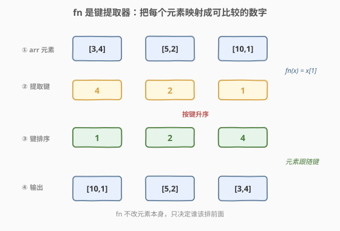
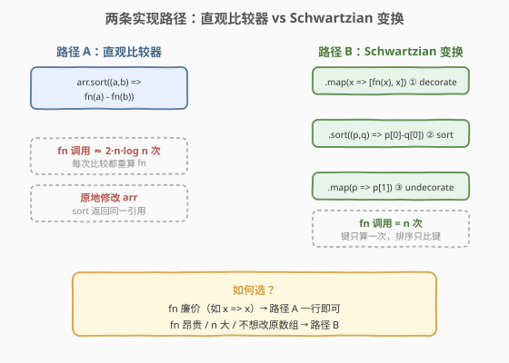
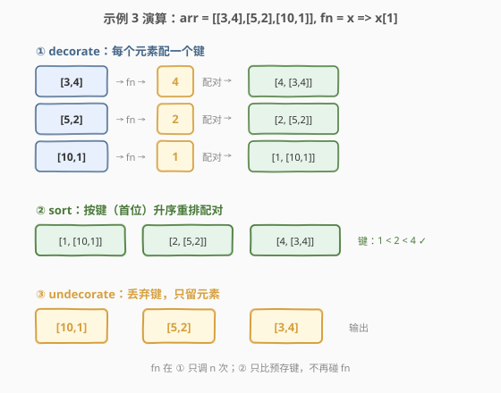

# 排序方式

- **题目名称**：排序方式
- **链接**：[2724. 排序方式](https://leetcode.cn/problems/sort-by/)
- **难度**：简单
- **标签**：JavaScript、数组、排序、高阶函数、Schwartzian 变换

## 1. 题目概述

给定一个数组 `arr` 和一个函数 `fn`，返回一个**排序后的数组** `sortedArr`。`fn` 接收数组元素并**返回一个数字**，这些数字决定了 `sortedArr` 的顺序——`sortedArr` 必须按 `fn` 的输出值**升序**排列。你可以假设对于给定数组，`fn` 不会返回重复的数字。

**示例 1**：

```text
输入：arr = [5, 4, 1, 2, 3], fn = (x) => x
输出：[1, 2, 3, 4, 5]
解释：fn 只是返回传入的数字，因此数组按升序排序。
```

**示例 2**：

```text
输入：arr = [{"x": 1}, {"x": 0}, {"x": -1}], fn = (d) => d.x
输出：[{"x": -1}, {"x": 0}, {"x": 1}]
解释：fn 返回 "x" 键的值，因此数组根据该值排序。
```

**示例 3**：

```text
输入：arr = [[3, 4], [5, 2], [10, 1]], fn = (x) => x[1]
输出：[[10, 1], [5, 2], [3, 4]]
解释：数组按照索引为 1 处的数字升序排序。
```

**约束条件**：

- `arr` 是一个有效的 JSON 数组
- `fn` 是一个函数，返回一个数字
- $1 \le \text{arr.length} \le 5 \times 10^5$

> 💡 本题是 LeetCode「30 天 JavaScript」系列题目，**仅提供 JavaScript / TypeScript 提交入口**，核心考察**高阶函数 + 排序比较器**。它把"排序"从"按元素本身比"升级为"按 `fn` 提取的键比"——这正是 `Array.prototype.sort` 接受比较器的真正用途。下文以 JS 为提交语言，并给出 Python / C++ 概念等价实现，最后讨论把 `fn` 调用次数从 $O(n \log n)$ 降到 $O(n)$ 的 **Schwartzian 变换**。

---

## 2. 解题思路

### 2.1 暴力思路：手写排序，每次比较都调 fn

最"朴素"的写法是手写一个冒泡 / 选择排序，每次比较两个元素时都调 `fn(a)` 与 `fn(b)` 决定先后：

```javascript
var sortBy = function(arr, fn) {
    const a = [...arr];            // 拷贝避免改原数组
    for (let i = 0; i < a.length; i++)
        for (let j = 0; j < a.length - 1 - i; j++)
            if (fn(a[j]) > fn(a[j + 1])) {   // 每次比较调 2 次 fn
                [a[j], a[j + 1]] = [a[j + 1], a[j]];
            }
    return a;
};
```

这能给出正确结果，但有两个明显短板：(1) 冒泡本身是 $O(n^2)$ 比较，$n$ 最大 $5\times10^5$ 时直接超时；(2) `fn` 在每次比较中被**重复调用**——同一个元素的键会被算很多遍，哪怕它根本没动过位置。当 `fn` 廉价（如 `x => x`）时这浪费可忽略，但当 `fn` 涉及属性访问或计算时就是放大器。

### 2.2 核心观察：fn 是键提取器——借力 `Array.prototype.sort` 的比较器



关键洞察是换一个视角看 `fn`：**它不是"比较时才用的判据"，而是"把元素映射成可比较键"的提取器**。每个元素 `x` 经 `fn(x)` 得到一个数字键，排序的目标就是让元素按这个键升序排列——元素本身只是"跟着键走"。

`Array.prototype.sort` 接受一个**比较器** `(a, b) => sign`，返回负数表示 `a` 在前、正数表示 `b` 在前。既然 `fn` 返回数字，直接用 `fn(a) - fn(b)` 作为比较结果即可——差的正负天然给出先后：

| 比较器返回值 | 含义 | 排序结果 |
|--------------|------|----------|
| `fn(a) - fn(b) < 0` | `a` 的键更小 | `a` 排在 `b` 前（升序） |
| `fn(a) - fn(b) > 0` | `a` 的键更大 | `b` 排在 `a` 前 |
| `fn(a) - fn(b) === 0` | 键相等 | 相对顺序由稳定性决定 |

于是核心解法只有一行：

```javascript
return arr.sort((a, b) => fn(a) - fn(b));
```

> 💡 **为什么 `fn(a) - fn(b)` 而不是 `fn(a) > fn(b)`？** 因为 `sort` 的比较器要返回**数字**（负 / 零 / 正），不是布尔。`>` 返回布尔，会被 coerce 成 `0` / `1`——丢失了"负数"这一半信号，所有"应排前"的情况都变成 `0`（视作相等），排序会塌掉。`a - b` 是数值比较器的标准写法，三态完整。

> ⚠️ **题目保证 `fn` 不返回重复数字**，故比较器不会返回 `0`，**稳定性在此题无关紧要**——即便用不稳定的快排实现，结果也唯一。这也是为什么本题能放心用 `a - b`：没有相等键就不存在"相等时谁先"的歧义。

> ⚠️ **`sort` 会原地修改 `arr`** 并返回同一引用。题面只要求"返回排序后的数组"，未禁止修改输入，故可直接用；若需保护原数组，先 `[...arr].sort(...)` 浅拷贝再排。

**进一步优化：Schwartzian 变换（decorate-sort-undecorate）**。上面一行解法虽借到了引擎的 $O(n \log n)$ 排序，但比较器里 `fn(a)`、`fn(b)` 会在**每次比较**时被调用——排序约做 $O(n \log n)$ 次比较，每次调 2 次 `fn`，合计 `fn` 被调用 $\approx 2n\log n$ 次。若 `fn` 昂贵或 $n = 5\times10^5$ 很大，这是可观的浪费。

经典优化是 **Schwartzian 变换**（源自 Perl / Raku 社区，又名 decorate-sort-undecorate）：先把每个元素和它的键**配对**（decorate），然后只对预存的键排序（sort），最后丢掉键只留元素（undecorate）。这样 `fn` 只在 decorate 阶段调用恰好 $n$ 次，sort 阶段只比数字不再碰 `fn`：

$$
\underbrace{[x_1, x_2, \dots, x_n]}_{\text{arr}}
\xrightarrow{\text{decorate}}
\underbrace{[(k_1,x_1), (k_2,x_2), \dots]}_{k_i = \text{fn}(x_i)}
\xrightarrow{\text{sort by } k_i}
[(k_{(1)},x_{(1)}), \dots]
\xrightarrow{\text{undecorate}}
[x_{(1)}, x_{(2)}, \dots]
$$

### 2.3 算法流程图



两条路径都正确，差别在 **`fn` 调用次数**与**是否动原数组**：

| 维度 | 路径 A：直观比较器 | 路径 B：Schwartzian 变换 |
|------|--------------------|---------------------------|
| **写法** | `arr.sort((a,b) => fn(a) - fn(b))` | `map→配对, sort→比键, map→拆对` |
| **`fn` 调用次数** | $\approx 2n\log n$（每次比较重算） | $n$（decorate 阶段一次算清） |
| **排序复杂度** | $O(n \log n)$ 比较，每次 $O(1)$（fn 廉价时） | $O(n \log n)$ 比较，纯数字比较 |
| **原数组** | 原地修改 | 不动（全程新建数组） |
| **总时间** | $O(n \log n \cdot c_{\text{fn}})$ | $O(n \cdot c_{\text{fn}} + n \log n)$ |
| **适用** | `fn` 廉价、不在乎改原数组 | `fn` 昂贵 / $n$ 大 / 需保护输入 |

> 💡 当 $c_{\text{fn}}$（单次 `fn` 调用成本）远大于常数时，路径 B 的 $O(n \cdot c_{\text{fn}})$ 主项远小于路径 A 的 $O(n \log n \cdot c_{\text{fn}})$——这就是 Schwartzian 变换的价值所在。即便 `fn` 廉价，路径 B 也能省下 $\approx 2\log n$ 倍的函数调用开销，对 $n = 5\times10^5$ 是可观的常数优化。

### 2.4 示例演算



以**示例 3** `arr = [[3,4],[5,2],[10,1]]`、`fn = x => x[1]` 为例，走一遍 Schwartzian 三步：

| 步 | 动作 | 状态 |
|----|------|------|
| ① decorate | 每个元素配键 `fn(x)` | `[[4,[3,4]], [2,[5,2]], [1,[10,1]]]` |
| ② sort | 按首位键升序重排配对 | `[[1,[10,1]], [2,[5,2]], [4,[3,4]]]` |
| ③ undecorate | 丢弃键，只留元素 | `[[10,1], [5,2], [3,4]]` |

键序列从 `4, 2, 1`（无序）变为 `1, 2, 4`（升序），元素跟着键走，最终输出 `[[10,1],[5,2],[3,4]]`，与示例一致。注意 ① 只调了 3 次 `fn`（每个元素一次），② 排序时只比预存的数字键，不再碰 `fn`——这是 Schwartzian 变换省调用的根本所在。

> 💡 路径 A（直观比较器）在同一示例上调 `fn` 的次数取决于排序引擎的比较次数。V8 的 TimSort 对 3 个元素约比较 2~3 次，每次 2 次调用，合计 4~6 次——比路径 B 的 3 次多。$n$ 越大这个比例越悬殊（$\approx 2\log n$ 倍）。

---

## 3. 参考代码

### JavaScript / TypeScript（提交语言）

**路径 A：直观比较器（一行解法）**

```javascript
/**
 * @param {Array} arr
 * @param {Function} fn
 * @return {Array}
 */
var sortBy = function(arr, fn) {
    return arr.sort((a, b) => fn(a) - fn(b));
};
```

TypeScript 版：

```typescript
type JSONValue = null | boolean | number | string | JSONValue[] | { [key: string]: JSONValue };
type Fn = (value: JSONValue) => number

function sortBy(arr: JSONValue[], fn: Fn): JSONValue[] {
    return arr.sort((a, b) => fn(a) - fn(b));
};
```

> 💡 这是本题最直接的写法，也是 30 天 JS 系列期望的"会用 `sort` 比较器"答案。题目保证键无重复，故无需担心稳定性与相等处理。

**路径 B：Schwartzian 变换（fn 调用降至 $O(n)$）**

```javascript
/**
 * @param {Array} arr
 * @param {Function} fn
 * @return {Array}
 */
var sortBy = function(arr, fn) {
    return arr
        .map(x => [fn(x), x])            // ① decorate：配 [键, 元素]
        .sort((p, q) => p[0] - q[0])     // ② sort：只比预存键
        .map(p => p[1]);                 // ③ undecorate：丢键留元素
};
```

> ⚠️ **路径 B 不修改原数组**——`map` 产生新数组，`sort` 排序的是这个中间数组，原 `arr` 不受影响。若提交环境对"原地修改输入"敏感（如示例驱动复用同一 `arr`），路径 B 更安全。代价是多分配一个长度 $n$ 的配对数组，空间 $O(n)$。

### Python（概念等价）

> 本题 LeetCode 仅开放 JS / TS，Python 版作概念对照。Python 的 `sorted` 接受 `key=` 参数，它**天生就是 Schwartzian 变换**——内部对每个元素算一次 key 缓存，再按 key 排序，无需手写 decorate/undecorate。这与 JS 必须显式 `map-sort-map` 形成对照：Python 把优化做进了语言。

```python
from typing import List, Callable, Any

class Solution:
    def sortBy(self, arr: List[Any], fn: Callable[[Any], float]) -> List[Any]:
        # key=fn：内部对每个元素调一次 fn 缓存为键，再按键排序（Schwartzian 内建）
        return sorted(arr, key=fn)
```

> 💡 **`key=` vs 比较器**。Python 3 移除了 `cmp` 比较器参数，只保留 `key=`——这是有意为之：`key` 模式天然 Schwartzian（每元素算一次 key），比"比较器每次重算"更高效也更易推理。JS 的 `sort` 只有比较器接口，要做 Schwartzian 得手写 `map-sort-map`；要等价的"键模式"可借助 `Intl.Collator` 等专用对象。两语言设计哲学不同：Python 用 `key` 表达"按什么排"，JS 用比较器表达"谁该在前"。

### C++（概念等价）

> C++ `std::sort` 同样只有比较器接口，没有 `key` 参数。Schwartzian 变换需手写：先构造 `std::pair<键, 索引>` 数组排序，再按索引取原元素。C++17 起也可用 `std::ranges` 与投影（projection）`std::ranges::sort(arr, {}, fn)` 把 `fn` 作为投影直接传入，编译器内部等价于 decorate。

```cpp
#include <vector>
#include <algorithm>
#include <functional>

// 概念等价：手写 Schwartzian（C++14）
template <typename T, typename F>
std::vector<T> sortBy(std::vector<T> arr, F fn) {
    std::vector<std::pair<double, T>> deco;
    deco.reserve(arr.size());
    for (const auto& x : arr) deco.emplace_back(fn(x), x);     // decorate
    std::sort(deco.begin(), deco.end(),
              [](const auto& a, const auto& b) { return a.first < b.first; }); // sort
    std::vector<T> out;
    out.reserve(arr.size());
    for (auto& p : deco) out.push_back(std::move(p.second));  // undecorate
    return out;
}
```

> ⚠️ C++ 的 `std::sort` 不保证稳定（采用 introsort），但题目保证键无重复，故无影响。若键可重复且需稳定，应改用 `std::stable_sort`。

---

## 4. 复杂度分析

| 维度 | 路径 A（直观比较器） | 路径 B（Schwartzian） |
|------|----------------------|------------------------|
| **时间复杂度** | $O(n \log n \cdot c_{\text{fn}})$ | $O(n \cdot c_{\text{fn}} + n \log n)$ |
| **空间复杂度** | $O(\log n)$（排序栈，原地） | $O(n)$（配对数组） |
| **`fn` 调用次数** | $\approx 2n\log n$ | $n$ |

> 💡 两种路径的**排序比较次数都是 $O(n \log n)$**，差别只在比较时是否要重新调用 `fn`。当 $c_{\text{fn}} = O(1)$（如 `x => x`），两者渐近相同，路径 A 因常数更小（无 map 开销）反而更快；当 $c_{\text{fn}}$ 较大（如 `fn` 涉及哈希 / 字符串计算），路径 B 的 $n$ 次 `fn` 调用相比路径 A 的 $2n\log n$ 次是显著节省——$n = 5\times10^5$ 时 $\log n \approx 19$，约 38 倍差距。

---

## 5. 扩展：Schwartzian 变换与稳定排序

**Schwartzian 变换的起源与命名。** 这个技巧由 Perl 社区命名，纪念 Raku（原 Perl 6）设计师 Randal L. Schwartz。它又叫 **decorate-sort-undecorate（DSD）**：decorate 给每个元素"装饰"一个可比较的键，sort 按键排序，undecorate 把装饰剥掉。本质上它利用了一个事实——**键的计算与键的比较是可分离的**，而朴素比较器把它们耦合在了一起。

**什么时候 Schwartzian 才划算？** 判据是 $c_{\text{fn}}$ 相对比较大：

- `fn = x => x`（恒等）：$c_{\text{fn}} \approx 0$，路径 A 一行最简，路径 B 的两次 `map` 反而是负担。
- `fn = x => x.field`（属性访问）：$c_{\text{fn}}$ 仍小，路径 A 一般够用。
- `fn` 涉及字符串解析、哈希、复杂算术：$c_{\text{fn}}$ 显著，路径 B 省下的 $2\log n$ 倍调用是大头。
- $n$ 巨大（$10^5$ 量级以上）：即便 $c_{\text{fn}}$ 小，$\log n \approx 17\sim 20$ 倍放大也值得优化。

**稳定性与本题。** ES2019 起 `Array.prototype.sort` 强制要求**稳定**（stable）。但本题保证 `fn` 不返回重复数字，意味着比较器不会返回 `0`——没有"键相等"的情况，稳定性无从体现，任何排序实现（含不稳定的快排）结果都唯一。若放宽"键可重复"这一假设，则稳定性变得重要：相等键的元素应保持原相对顺序。Schwartzian 变换配合稳定排序天然满足此性质——decorate 时按原顺序配对，稳定排序下相等键的配对保持原序，undecorate 后即原序。

> 💡 **Python 的 `key=` 把 Schwartzian 做进了语言。** `sorted(arr, key=fn)` 等价于路径 B 但无需手写三步——CPython 内部对每个元素算一次 `fn(x)` 缓存为元组的第一个元素，排序时只比缓存键，排序完丢弃。这是 Python 设计哲学的体现：把常见优化模式固化为语言/标准库特性，避免用户重复手写。JS 的 `sort` 只给比较器接口，要做同样优化须显式 `map-sort-map`——这也是为什么本题"路径 A"是默认答案，而"路径 B"是进阶优化。

---

## 6. 面试要点

1. **为什么比较器用 `fn(a) - fn(b)` 而不是 `fn(a) > fn(b)`？**

   > `sort` 的比较器要返回**数字**（负 / 零 / 正三态），不是布尔。`>` 返回布尔会被强转为 `0` 或 `1`，丢掉"负数"那一半信号——所有"应排在前"的情况都变成 `0`（被视作相等），排序结果会塌掉。`a - b` 是数值比较器标准写法，正负零三态完整，正确表达升序。

2. **Schwartzian 变换省在哪里？朴素比较器多调了多少次 `fn`？**

   > 省在"键的计算与比较解耦"。朴素比较器在每次比较时都重新调 `fn(a)` / `fn(b)`，排序做 $O(n \log n)$ 次比较、每次 2 次调用，合计 $\approx 2n\log n$ 次；Schwartzian 在 decorate 阶段一次算清每个元素的键（共 $n$ 次），sort 阶段只比预存键不再碰 `fn`。比值约 $2\log n$ 倍，$n = 5\times10^5$ 时约 38 倍。

3. **题目为什么强调"`fn` 不返回重复数字"？这影响了什么？**

   > 它保证比较器不会返回 `0`，即没有"键相等"的情况，因此**稳定性无关紧要**——即便用不稳定的快排实现，结果也唯一确定。这放宽了实现选择：不必拘泥于稳定排序，任何 $O(n \log n)$ 引擎都行。若键可重复，则相等键元素的相对顺序由排序稳定性决定，需用稳定排序（ES2019+ 的 `sort` 已强制稳定）。

4. **`arr.sort(...)` 修改了原数组，这有问题吗？怎么避免？**

   > `Array.prototype.sort` 原地修改并返回同一引用。题面只要求"返回排序后的数组"，未禁止改输入，故直接用合法。若需保护原数组（如调用方复用 `arr`），浅拷贝再排：`[...arr].sort(...)`。Schwartzian 变换天然不动原数组——全程操作新建的配对数组，原 `arr` 不受影响。

5. **Python 的 `sorted(arr, key=fn)` 和 JS 的 Schwartzian 是一回事吗？**

   > 是，Python 把 Schwartzian 变换做进了语言。`key=fn` 内部对每个元素调一次 `fn` 缓存为键、按缓存键排序、丢弃键——与 JS 手写的 `map-sort-map` 三步等价，但由 CPython C 层实现，无需用户显式写。这也解释了为何 Python 移除了 `cmp` 比较器只留 `key`：`key` 模式天然 Schwartzian，更高效也更易推理；JS 只给比较器接口，要做同样优化须手写。

> 💡 **一句话总结**：2724 = 「`fn` 是键提取器 + `sort((a,b) => fn(a)-fn(b))` 比较器」。一行解法借力引擎 $O(n\log n)$ 排序；进阶用 Schwartzian 变换 `map-sort-map` 把 `fn` 调用从 $2n\log n$ 降到 $n$。题目保证键无重复，稳定性无关，`a-b` 三态比较器即足够。

---

## 7. 同类练习题

- [2626. 数组归约运算](https://leetcode.cn/problems/array-reduce-transformation/)：`reduce` 高阶函数的手写实现，与本题同属 30 天 JS「数组高阶函数」家族（map / filter / reduce / sort 四件套）
- [2634. 过滤数组中的元素](https://leetcode.cn/problems/filter-elements-from-array/)：`filter` 高阶函数手写，与本题同属数组高阶函数家族，一筛选一排序
- [2629. 函数组合](https://leetcode.cn/problems/function-composition/)：高阶函数（函数接收函数、返回函数），与本题同属 30 天 JS 函数式编程基础
- [912. 排序数组](https://leetcode.cn/problems/sort-an-array/)：排序算法母题，手撕快排 / 归并 / 堆排，对照本题"借力 `sort` 引擎"与"手写排序"两条路径
- [1636. 按照频率将数组升序排序](https://leetcode.cn/problems/sort-array-by-increasing-frequency/)：键提取 + 多级排序的算法版变体（先统计频率作键，再按频率升序、同频降序），巩固"按提取键排序"的范式
