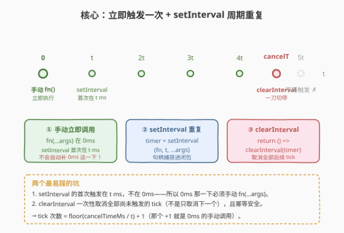
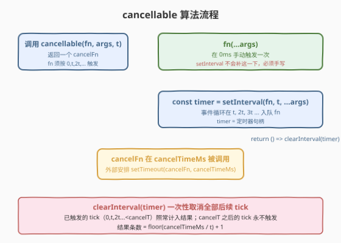
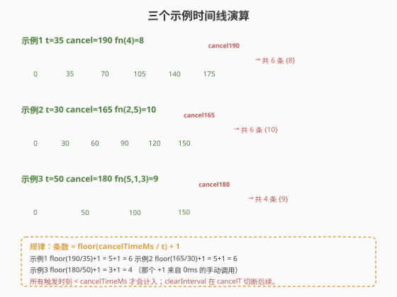

# 间隔取消

- **题目名称**：间隔取消
- **链接**：[2725. Interval Cancellation](https://leetcode.cn/problems/interval-cancellation/)
- **难度**：简单
- **标签**：闭包、定时器、`setInterval`、`clearInterval`、JavaScript

## 1. 题目概述

现给定一个函数 `fn`、一个参数数组 `args` 和一个时间间隔 `t`，返回一个**取消函数** `cancelFn`。

在经过 `cancelTimeMs` 毫秒的延迟后，将调用返回的取消函数 `cancelFn`（外部安排 `setTimeout(cancelFn, cancelTimeMs)`）。

函数 `fn` 应**立即**使用参数 `args` 调用，然后**每隔 `t` 毫秒**调用一次，直到在 `cancelTimeMs` 毫秒时调用 `cancelFn`。

**示例 1**：

```text
输入：fn = (x) => x * 2, args = [4], t = 35, cancelT = 190
输出：
[
   {"time": 0, "returned": 8},
   {"time": 35, "returned": 8},
   {"time": 70, "returned": 8},
   {"time": 105, "returned": 8},
   {"time": 140, "returned": 8},
   {"time": 175, "returned": 8}
]
解释：const cancelTimeMs = 190; const cancelFn = cancellable((x) => x * 2, [4], 35);
      setTimeout(cancelFn, cancelTimeMs);
      每隔 35ms 调用 fn(4)，直到 t=190ms 取消。第一次调用在 0ms。
```

**示例 2**：

```text
输入：fn = (x1, x2) => (x1 * x2), args = [2, 5], t = 30, cancelT = 165
输出：
[
   {"time": 0, "returned": 10},
   {"time": 30, "returned": 10},
   {"time": 60, "returned": 10},
   {"time": 90, "returned": 10},
   {"time": 120, "returned": 10},
   {"time": 150, "returned": 10}
]
解释：每隔 30ms 调用 fn(2, 5)，直到 t=165ms 取消。
```

**示例 3**：

```text
输入：fn = (x1, x2, x3) => (x1 + x2 + x3), args = [5, 1, 3], t = 50, cancelT = 180
输出：
[
   {"time": 0, "returned": 9},
   {"time": 50, "returned": 9},
   {"time": 100, "returned": 9},
   {"time": 150, "returned": 9}
]
解释：每隔 50ms 调用 fn(5, 1, 3)，直到 t=180ms 取消。
```

**约束条件**：

- `fn` 是一个函数
- `args` 是一个有效的 JSON 数组
- `1 <= args.length <= 10`
- `30 <= t <= 100`
- `10 <= cancelTimeMs <= 500`

> 💡 本题是 LeetCode「30 天 JavaScript」系列，**仅提供 JavaScript / TypeScript 提交入口**。核心是 `setInterval` + `clearInterval` 的成对使用与**闭包捕获定时器句柄**，无算法复杂度可言。它和 [2715. 执行可取消的延迟函数](../2701-2800/2715_执行可取消的延迟函数.md)（`setTimeout` 版）是姊妹题——把「延迟一次」换成「周期重复」。

---

## 2. 解题思路

### 2.1 暴力思路：递归 setTimeout + 标志位

周期触发最直觉的写法是「用 `setTimeout` 递归自调用 + 一个 `cancelled` 标志包裹」：

```javascript
function cancellable(fn, args, t) {
    let cancelled = false;
    const tick = () => {
        if (cancelled) return;
        fn(...args);
        setTimeout(tick, t);
    };
    fn(...args);      // 0ms 立即一次
    setTimeout(tick, t);
    return () => { cancelled = true; };
}
```

可行，但**多此一举**：`setInterval` 本就是为「周期重复」准备的内置 API，递归 `setTimeout` 等于手搓一个粗糙版；而且 `cancelled` 标志无法撤销**已经入队**的下一拍 `setTimeout`，回调仍会被事件循环取出、再在第一行被标志拦下——多一次入队开销。`clearInterval` 直接从定时器表里摘掉句柄，连取出都不必。

### 2.2 核心观察：setInterval 句柄 + clearInterval 闭包



关键洞察有两条：

1. **`setInterval(fn, t, ...args)` 返回一个定时器句柄 `timer`，它会在 `t, 2t, 3t, ...` 反复触发 `fn`**，`clearInterval(timer)` 能一次性撤销**全部尚未触发的 tick**。把 `timer` 用闭包捕获进返回的 `cancelFn`，调用 `cancelFn` 即 `clearInterval(timer)`——一行收尾。

2. **`setInterval` 的首次触发在 `t` 毫秒，不在 `0` 毫秒**。而题目要求 `fn` 在 `0ms` 就执行一次，所以这一下必须**手动 `fn(...args)` 补上**。这是本题与 2715 最大的差别——2715 的 `setTimeout` 本身就负责那唯一一次调用，无需手动补；这里 `setInterval` 漏了 `0ms`，得自己补。

> ⚠️ **`clearInterval` 的幂等性是本题的基石**：对一个已经触发过若干次、或已被 clear 的 `timer` 调 `clearInterval` 什么都不会发生，既不抛错也无副作用。因此**无需用标志位记录已触发多少次**——直接 `clearInterval(timer)` 即可切断后续。这一点与 `clearTimeout` 一致，是面试中最常被追问的点。

> 💡 **`setInterval(fn, t, ...args)` 的第三参数**：与 `setTimeout` 一样，从第三个参数起会作为额外参数传给回调，故 `setInterval(fn, t, ...args)` 等价于「每隔 t ms 调用 `fn(...args)`」。比 `setInterval(() => fn(...args), t)` 少包一层箭头函数。注意 `args` 是数组，需用展开运算符 `...args`。

### 2.3 算法流程图



四步：① 调用 `cancellable(fn, args, t)` → ② `fn(...args)` 手动在 0ms 触发一次 → ③ `const timer = setInterval(fn, t, ...args)` 安排 `t, 2t, 3t ...` 的周期触发并返回句柄 → ④ 返回 `() => clearInterval(timer)`，闭包捕获 `timer`。`cancelFn` 在 `cancelTimeMs` 被调用时，`clearInterval` 切断 `cancelTimeMs` 之后的所有 tick；`cancelTimeMs` 之前已触发的 tick 照常计入结果数组。

### 2.4 示例演算



| 示例 | t | cancelTimeMs | 触发时刻（ms） | 次数 | 结果 |
|------|---|--------------|----------------|------|------|
| 1 | 35 | 190 | 0, 35, 70, 105, 140, 175 | 6 | 6 条 `{returned: 8}` |
| 2 | 30 | 165 | 0, 30, 60, 90, 120, 150 | 6 | 6 条 `{returned: 10}` |
| 3 | 50 | 180 | 0, 50, 100, 150 | 4 | 4 条 `{returned: 9}` |

**规律**：结果条数 = $\lfloor \text{cancelTimeMs} / t \rfloor + 1$，那个 `+1` 正是 `0ms` 的手动调用；`setInterval` 贡献的 tick 都严格满足时刻 $k \cdot t < \text{cancelTimeMs}$。

- 示例 1：$\lfloor 190/35 \rfloor + 1 = 5 + 1 = 6$
- 示例 2：$\lfloor 165/30 \rfloor + 1 = 5 + 1 = 6$
- 示例 3：$\lfloor 180/50 \rfloor + 1 = 3 + 1 = 4$

> 💡 测试框架中传给 `cancellable` 的 `fn` 实为一个 `log` 包装器：它计算 `performance.now() - start` 作为 `time`，调用真正的题目函数得到 `returned`，push 进 `result` 数组。所以「输出」就是 `result` 数组——`fn` 触发过几次就有几条记录。

---

## 3. 参考代码

### JavaScript（提交语言）

```javascript
/**
 * @param {Function} fn
 * @param {Array} args
 * @param {number} t
 * @return {Function}
 */
var cancellable = function(fn, args, t) {
    fn(...args);
    const timer = setInterval(fn, t, ...args);
    return () => clearInterval(timer);
};
```

> 💡 三行核心：① `fn(...args)` 补 0ms 那一下 → ② `setInterval` 拿句柄安排周期触发 → ③ 返回的闭包调 `clearInterval`。`...args` 展开把数组元素逐个传给 `fn`，对应 `fn(x1, x2, ...)` 的形参列表。

### TypeScript

```typescript
type JSONValue = null | boolean | number | string | JSONValue[] | { [key: string]: JSONValue };
type Fn = (...args: JSONValue[]) => void

function cancellable(fn: Fn, args: JSONValue[], t: number): Function {
    fn(...args);
    const timer: ReturnType<typeof setInterval> = setInterval(fn, t, ...args);
    return () => clearInterval(timer);
};
```

### Python（概念等价）

> 本题 LeetCode 仅开放 JS/TS，Python 版作概念对照。Python 无内置 `setInterval`，用后台线程循环 `sleep(t/1000)` 模拟，`threading.Event` 等价 `clearInterval`。

```python
import threading
from typing import Callable, Any


def cancellable(fn: Callable, args: list, t: int) -> Callable[[], None]:
    stopped = threading.Event()

    def loop():
        fn(*args)
        while not stopped.wait(t / 1000):
            fn(*args)

    threading.Thread(target=loop, daemon=True).start()
    return stopped.set
```

> ⚠️ `stopped.wait(timeout)` 在超时返回 `False`、被 `set` 唤醒返回 `True`。故 `while not stopped.wait(t/1000)` 在「未取消且到点」时循环执行 `fn`、在「被 set 唤醒」时退出循环——语义等价于 `clearInterval` 切断后续 tick。注意时间是秒，需把毫秒 `t` 除以 1000。

---

## 4. 复杂度分析

| 维度 | 复杂度 | 说明 |
|------|--------|------|
| `cancellable` 时间 | $O(1)$ | `fn(...args)` 同步调用一次 $O(k)$（$k$=参数数，$k\le 10$），`setInterval` 注册一个周期宏任务 $O(1)$ |
| `cancelFn` 时间 | $O(1)$ | `clearInterval` 查表移除定时器，$O(1)$ |
| 空间 | $O(1)$ | 仅闭包捕获一个 `timer` 句柄（数值/对象引用） |

> 💡 本题无算法复杂度可言，本质是「正确使用平台 API」。真正考察的是对**事件循环**与**周期定时器生命周期**的理解。

---

## 5. 扩展：setInterval vs 递归 setTimeout & AbortSignal

两种实现对比：

| 维度 | `setInterval` 法（本题解） | 递归 `setTimeout` + 标志位 |
|------|----------------------------|----------------------------|
| 代码行数 | 3 行 | 8-10 行 |
| 额外状态 | 仅 `timer` 句柄 | `cancelled` 布尔 + 多个 setTimeout 句柄泄漏 |
| 已入队的下一拍是否被拦 | 是，`clearInterval` 从表里摘除 | 否，回调仍会被取出、靠标志在第一行拦下，多一次入队 |
| 触发间隔精度 | 固定 `t`（按注册时刻算，不随 `fn` 耗时漂移） | 受 `fn` 自身执行耗时影响而漂移（`fn` 后才开始下一拍计时） |
| 适用场景 | 固定频率轮询、心跳 | 需「上一拍执行完再计下一拍」的背压场景 |

**递归 `setTimeout`（无标志、更精确的背压版）**：

```javascript
function cancellable(fn, args, t) {
    fn(...args);
    let timer = setTimeout(function tick() {
        fn(...args);
        timer = setTimeout(tick, t);
    }, t);
    return () => clearTimeout(timer);
}
```

> 💡 这种写法「上一拍 `fn` 执行完才开始计下一拍的 `t`」，间隔 = `fn` 耗时 + `t`，适合 `fn` 是耗时任务、不允许重叠的场景。代价是漂移更大、代码更长。`setInterval` 则是「按注册时刻每 `t` 触发一次」，`fn` 耗时不影响间隔（但若 `fn` 耗时 > `t`，事件循环会让多次回调连续触发、可能堆积）。

**现代 Web 的取消范式：`AbortController` / `AbortSignal`**。`setInterval` 不直接吃 `signal`，但可用 `signal.addEventListener('abort', ...)` 桥接：

```javascript
function cancellable(fn, args, t) {
    const controller = new AbortController();
    fn(...args);
    const timer = setInterval(fn, t, ...args);
    controller.signal.addEventListener('abort', () => clearInterval(timer));
    return () => controller.abort();
}
```

> 💡 `AbortSignal` 是现代异步取消的「标准件」：一个信号源能同时取消 `fetch`、流读取、定时器等多个异步操作，且信号一经 abort 不可逆、对所有监听者广播。本题 `clearInterval` 是其「单一周期定时器」的原始形态。

---

## 6. 面试要点

1. **为什么 `fn(...args)` 必须手动调一次？`setInterval` 不能包办吗？**

   > `setInterval(fn, t, ...args)` 的首次触发在 `t` 毫秒，**不在 0 毫秒**。而题目要求 `fn` 在 `0ms` 就执行一次（示例 1 输出首条 `{"time":0,"returned":8}`）。所以这一下必须手动 `fn(...args)` 补上，否则会漏掉 0ms 这条记录、且总条数少 1。这是本题与 2715（`setTimeout` 版）最大的差别。

2. **`clearInterval` 传一个已经触发过若干次的 `timer` 会怎样？**

   > 规范规定 `clearInterval` 找到对应定时器则移除、找不到则静默忽略，**不抛错**。已触发过的 tick 已经执行完毕、不在队列里，`clearInterval` 只切断**尚未触发**的后续 tick。所以无论 `cancelFn` 在第几次 tick 之后调用，`clearInterval(timer)` 都安全——已触发的照常计入结果，未触发的全部取消。

3. **`setInterval` 的间隔是「固定 t」还是「上一拍结束再等 t」？**

   > 是「按注册时刻每 `t` 触发一次」的固定间隔，**不随 `fn` 耗时漂移**。但若某次 `fn` 执行耗时 > `t`，事件循环会在它结束后让积压的回调连续触发（甚至同一 tick 多次），可能堆积。需「上一拍结束再计下一拍」则用递归 `setTimeout`（见第 5 节），代价是漂移更大。

4. **结果条数怎么快速推算？**

   > $\lfloor \text{cancelTimeMs} / t \rfloor + 1$。`+1` 来自 0ms 的手动调用，`setInterval` 贡献的是满足 $k \cdot t < \text{cancelTimeMs}$ 的所有 $k \ge 1$。例如 `cancelTimeMs=190, t=35`：$\lfloor 190/35 \rfloor = 5$（k=1..5 对应 35,70,105,140,175），加 0ms 共 6 条。

5. **`fn` 是宏任务还是微任务？多个 tick 会不会并发执行？**

   > `setInterval` 注册的是**宏任务**，JS 单线程，同一时刻只有一个 tick 在跑，**不会并发**。若 `fn` 是同步的，各 tick 严格按 `t, 2t, ...` 顺序入队执行；若 `fn` 内部启动了异步操作，则多个异步操作的完成顺序不受 `setInterval` 控制，需自行用计数器/队列管理。本题 `fn` 是同步纯函数，无此问题。

> 💡 **一句话总结**：2725 = 「`fn(...args)` 补 0ms + `setInterval(fn, t, ...args)` 拿句柄 + 闭包返回 `() => clearInterval(timer)`」。`clearInterval` 一次性取消全部后续 tick 且幂等安全，故无需标志位——这是本题唯一的「考点」。

---

## 7. 同类练习题

- [2715. 执行可取消的延迟函数](https://leetcode.cn/problems/timeout-cancellation/)：`setTimeout` + `clearTimeout` 的姊妹题，把本题「周期重复」退化为「延迟一次」，对照「`setInterval` 首次在 t ms、需手动补 0ms」vs「`setTimeout` 本身就负责那唯一一次」（[题解](../2701-2800/2715_执行可取消的延迟函数.md)）
- [2622. 有时间限制的缓存](https://leetcode.cn/problems/cache-with-time-limit/)：`Map` + `setTimeout` 过期清理，覆盖 key 时必须 `clearTimeout` 旧定时器——与本题「`clearInterval` 撤销」思想相通，且必须处理「已触发 vs 未触发」
- [2676. 节流](https://leetcode.cn/problems/throttle/)：闭包 + `setTimeout` 管冷却窗口，首沿立即执行 / 尾沿续杯；同为「30 天 JS」闭包设计题，对照「闭包捕获定时器句柄控制行为」
- [2621. 睡眠函数](https://leetcode.cn/problems/sleep/)：用 `setTimeout` 包成 `Promise`，`await` 后继续——把「t ms 后执行」升级为「t ms 后 resolve」，定时器与异步语义一脉相承
- [2666. 只允许一次函数调用](https://leetcode.cn/problems/allow-one-function-call/)：闭包捕获 `called` 布尔标志，首次调用后置位拦截后续；与本题「闭包捕获句柄 + 一次性取消」的闭包封装思想一致
