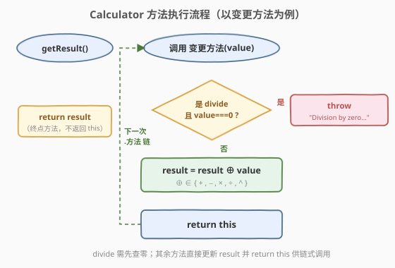
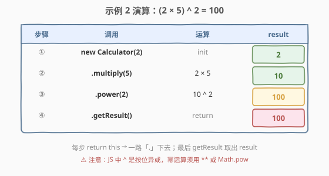

# 使用方法链的计算器

- **题目名称**：使用方法链的计算器
- **链接**：[2726. Calculator with Method Chaining](https://leetcode.cn/problems/calculator-with-method-chaining/)
- **难度**：简单
- **标签**：JavaScript、类设计、方法链、Fluent Interface、面向对象

## 1. 题目概述

设计一个 `Calculator` 类，提供加法、减法、乘法、除法和乘方等数学运算，并支持**连续操作的方法链式调用**。构造函数接受一个数字作为 `result` 的初始值。

`Calculator` 类应包含以下方法：

- `add` - 将给定的数字 `value` 与 `result` 相加，并返回更新后的 `Calculator` 对象。
- `subtract` - 从 `result` 中减去给定的数字 `value`，并返回更新后的 `Calculator` 对象。
- `multiply` - 将 `result` 乘以给定的数字 `value`，并返回更新后的 `Calculator` 对象。
- `divide` - 将 `result` 除以给定的数字 `value`，并返回更新后的 `Calculator` 对象。如果传入的值为 `0`，则抛出错误 `"Division by zero is not allowed"`。
- `power` - 计算 `result` 的幂，指数为给定的数字 `value`，并返回更新后的 `Calculator` 对象（`result = result ^ value`）。
- `getResult` - 返回 `result` 的值。

结果与实际结果相差在 $10^{-5}$ 范围内的解被认为是正确的。

**示例 1**：

```text
输入：actions = ["Calculator", "add", "subtract", "getResult"], values = [10, 5, 7]
输出：8
解释：new Calculator(10).add(5).subtract(7).getResult() // 10 + 5 - 7 = 8
```

**示例 2**：

```text
输入：actions = ["Calculator", "multiply", "power", "getResult"], values = [2, 5, 2]
输出：100
解释：new Calculator(2).multiply(5).power(2).getResult() // (2 * 5) ^ 2 = 100
```

**示例 3**：

```text
输入：actions = ["Calculator", "divide", "getResult"], values = [20, 0]
输出："Division by zero is not allowed"
解释：new Calculator(20).divide(0).getResult() // 20 / 0，由于不能除以零，因此应抛出错误。
```

**约束条件**：

- `actions` 是一个有效的 JSON 字符串数组
- `values` 是一个有效的 JSON 字符串数组
- $2 \le \text{actions.length} \le 2 \times 10^4$
- $1 \le \text{values.length} \le 2 \times 10^4 - 1$
- `actions[i]` 是 `"Calculator"`、`"add"`、`"subtract"`、`"multiply"`、`"divide"`、`"power"` 和 `"getResult"` 其中的元素
- 第一个操作总是 `"Calculator"`
- 最后一个操作总是 `"getResult"`

> 💡 本题是 LeetCode「30 天 JavaScript」系列题目，**仅提供 JavaScript / TypeScript 提交入口**，核心考察**面向对象 + 方法链（Fluent Interface）**。要点只有两个：① 变更方法返回 `this` 以串成链；② `divide` 遇零抛出指定错误。但藏着一个 JS 语言陷阱——题面写的 `result ^ value` 是**数学幂**记号，而 JS 中 `^` 是**按位异或**，实现必须用 `**` 或 `Math.pow`，否则必挂。本文以 JS 为提交语言，并给出 Python / C++ 概念等价实现。

---

## 2. 解题思路

### 2.1 暴力思路：不返回 this，每步断链

最朴素的写法是老老实实实现每个方法更新 `result`、但不返回任何东西：

```javascript
class Calculator {
    constructor(value) { this.result = value; }
    add(value)      { this.result += value; }
    subtract(value) { this.result -= value; }
    multiply(value) { this.result *= value; }
    divide(value)   { this.result /= value; }
    power(value)    { this.result **= value; }
    getResult()     { return this.result; }
}
```

单步调用没问题——`new Calculator(10).add(5)` 能正确把 `result` 改成 15。但方法链 `new Calculator(10).add(5).subtract(7)` 直接抛 `TypeError: Cannot read properties of undefined`：因为 `add(5)` 返回 `undefined`，对 `undefined` 再 `.subtract(7)` 自然崩了。**断链就断在「方法没返回接收者」**。这正是本题唯一的设计考点。

### 2.2 核心观察：Fluent Interface —— 变更方法返回 `this`


关键洞察：**方法链的本质，是每个变更方法在修改内部状态后，返回对象自身（`this`）**，使下一次 `.方法` 调用仍然落回同一个对象上。这种「返回 `this` 以便串联」的模式叫 **Fluent Interface**（流畅接口 / 链式 API），由 Martin Fowler 命名——jQuery 的 `$(...).show().fadeIn().css(...)`、Java 的 `StringBuilder.append(...).append(...)` 都是它的经典身影。

于是每个变更方法的体形是固定的两步：

| 步 | 动作 | 目的 |
|----|------|------|
| ① | `this.result ⊕= value`（⊕ 为对应运算） | 更新内部状态 |
| ② | `return this` | 把自身交还，供下一次 `.方法` 链接 |

`this` 是 JS 类方法中指向**当前实例**的引用。返回它 ≠ 返回副本——调用方拿到的就是**同一个对象**，`result` 在链上逐步累加，直到 `getResult()` 把最终值取出来。

> 💡 **为什么 `getResult` 不返回 `this`？** 因为它是**终点方法**——链到此为止，要的是计算结果而非继续链接。终点方法返回值（`this.result`），变更方法返回 `this`：这一区分是 Fluent Interface 的通用约定——「中间步骤返回 `this`，末端步骤返回数据」。

> ⚠️ **`divide` 的特例**：它是唯一不能无条件「更新 + 返回 this」的方法——除以零在数学上无定义，必须拦在更新之前抛错。注意抛错后方法**既不更新 `result` 也 不返回 `this`**，链就此中断并把错误冒泡给调用方。题面要求抛出的字符串精确为 `"Division by zero is not allowed"`，差一个字符都不通过。

> ⚠️ **`^` 陷阱（本题最易踩的坑）**：题面写 `result = result ^ value`，这是**数学幂记号**（$\text{result}^{\text{value}}$）。但 JS 中 `^` 是**按位异或**（bitwise XOR）——`10 ^ 2 === 8`（异或），`10 ** 2 === 100`（幂）。若照抄 `^`，示例 2 的 `(2*5)^2` 会得到 `10 ^ 2 = 8` 而非 `100`，必挂。实现必须用**指数运算符 `**`** 或 `Math.pow(result, value)`。这与 C/C++（`^` 同样是异或，幂用 `std::pow`）、Python（`**` 才是幂）的语义对照：JS 的幂运算符也是 `**`，与 Python 一致。

### 2.3 算法流程图



变更方法的执行是一条「先查零、再更新、再返回 this」的单链，外加 `divide` 的零除分支：

1. **调用 `方法(value)`**：进入某个变更方法；
2. **菱形判定**：若是 `divide` 且 `value === 0` → **抛出** `"Division by zero is not allowed"`，链终止；
3. 否则 **`result = result ⊕ value`**（⊕ 随方法取 `+`、`-`、`×`、`÷`、`^`），`power` 用 `**` 而非 `^`；
4. **`return this`** → 把自身交还，下一次 `.方法` 接续；
5. 链末端 **`getResult()`** 直接 `return result`，取值结束。

`getResult` 是旁路：它不参与「更新 + 返回 this」循环，只读 `result` 并返回。

### 2.4 示例演算



以**示例 2** `new Calculator(2).multiply(5).power(2).getResult()` 为例，逐链演算：

| 步 | 调用 | 运算 | result | 是否返回 this |
|----|------|------|--------|---------------|
| ① | `new Calculator(2)` | init | $2$ | —（构造返回新对象） |
| ② | `.multiply(5)` | $2 \times 5$ | $10$ | ✓（链不断） |
| ③ | `.power(2)` | $10^{2}$ | $100$ | ✓（链不断） |
| ④ | `.getResult()` | return | 返回 $100$ | ✗（终点取值） |

`result` 从 $2 \to 10 \to 100$ 单调推进，前 3 步都返回 `this` 让链延续，最后 `getResult` 把 $100$ 取出来。注意第 ③ 步用 `**` 而非 `^`：`10 ** 2 = 100`，若误用 `10 ^ 2` 会得到 `8`（按位异或），整条链就错了。

> 💡 **示例 3 的链为何崩在 `divide`**：`new Calculator(20).divide(0)` 在 `divide` 内部命中零除分支，直接 `throw "Division by zero is not allowed"`——`divide` 既没更新 `result` 也没返回 `this`，方法链在此被异常打断，`getResult()` 永远拿不到执行权。测试框架用 `try/catch` 捕获这个抛出值并把它作为输出，故示例 3 输出即错误字符串本身。

---

## 3. 参考代码

### JavaScript / TypeScript（提交语言）

```javascript
class Calculator {
    /**
     * @param {number} value
     */
    constructor(value) {
        this.result = value;
    }

    /**
     * @param {number} value
     * @return {Calculator}
     */
    add(value) {
        this.result += value;
        return this;
    }

    /**
     * @param {number} value
     * @return {Calculator}
     */
    subtract(value) {
        this.result -= value;
        return this;
    }

    /**
     * @param {number} value
     * @return {Calculator}
     */
    multiply(value) {
        this.result *= value;
        return this;
    }

    /**
     * @param {number} value
     * @return {Calculator}
     */
    divide(value) {
        if (value === 0) throw "Division by zero is not allowed";
        this.result /= value;
        return this;
    }

    /**
     * @param {number} value
     * @return {Calculator}
     */
    power(value) {
        this.result **= value;        // 幂运算用 **，绝不能用 ^
        return this;
    }

    /**
     * @return {number}
     */
    getResult() {
        return this.result;
    }
}
```

TypeScript 版：

```typescript
class Calculator {
    private result: number;

    constructor(value: number) {
        this.result = value;
    }

    add(value: number): Calculator {
        this.result += value;
        return this;
    }

    subtract(value: number): Calculator {
        this.result -= value;
        return this;
    }

    multiply(value: number): Calculator {
        this.result *= value;
        return this;
    }

    divide(value: number): Calculator {
        if (value === 0) throw "Division by zero is not allowed";
        this.result /= value;
        return this;
    }

    power(value: number): Calculator {
        this.result **= value;
        return this;
    }

    getResult(): number {
        return this.result;
    }
}
```

> 💡 **核心就一句**：每个变更方法末尾 `return this`。去掉所有 `return this`，单步调用照常工作，但方法链立刻断——这就是 Fluent Interface 的全部魔法。`divide` 多一道零除前置检查，`power` 用 `**` 而非 `^`，仅此而已。

> ⚠️ **抛字符串还是抛 `Error` 对象？** 题面示例 3 的输出是字符串 `"Division by zero is not allowed"`。LeetCode 的 JS 判题框架会捕获异常：若抛的是字符串，直接用它作输出；若抛的是 `new Error(msg)`，框架取 `err.message`。两种写法都能通过本题，但**抛字符串不符合 JS 最佳实践**（调用方拿到的是原始值而非 Error 栈），生产代码应 `throw new Error("Division by zero is not allowed")`。这里为贴合题面、避免任何判题差异，直接抛字符串。

### Python（概念等价）

> 本题 LeetCode 仅开放 JS/TS，Python 版作概念对照。Python 的方法链写法与 JS 完全同构——用 `return self` 替代 `return this`。Python 的 `**` 本就是幂运算（无需警惕 `^`，Python 里 `^` 也是按位异或，但幂用 `**` 是语言入门常识）。零除用 `raise ZeroDivisionError(...)`，Python 内建除零也会抛 `ZeroDivisionError`，语义天然对齐。

```python
class Calculator:
    def __init__(self, value: float):
        self.result = value

    def add(self, value: float) -> "Calculator":
        self.result += value
        return self

    def subtract(self, value: float) -> "Calculator":
        self.result -= value
        return self

    def multiply(self, value: float) -> "Calculator":
        self.result *= value
        return self

    def divide(self, value: float) -> "Calculator":
        if value == 0:
            raise ZeroDivisionError("Division by zero is not allowed")
        self.result /= value
        return self

    def power(self, value: float) -> "Calculator":
        self.result **= value
        return self

    def get_result(self) -> float:
        return self.result
```

```python
# 用法：链式调用，与 JS 同构
c = Calculator(2).multiply(5).power(2)
print(c.get_result())   # 100
```

### C++（概念等价）

> C++ 的方法链用 `return *this`（返回引用而非拷贝）。`std::pow` 做幂运算——C++ 没有 `**` 运算符，`^` 同样是按位异或。零除抛 `std::runtime_error`，与 JS 抛字符串语义对应。

```cpp
#include <stdexcept>
#include <cmath>

class Calculator {
public:
    Calculator(double value) : result_(value) {}

    Calculator& add(double value)      { result_ += value;            return *this; }
    Calculator& subtract(double value) { result_ -= value;            return *this; }
    Calculator& multiply(double value) { result_ *= value;            return *this; }
    Calculator& divide(double value) {
        if (value == 0) throw std::runtime_error("Division by zero is not allowed");
        result_ /= value;
        return *this;
    }
    Calculator& power(double value) { result_ = std::pow(result_, value); return *this; }

    double getResult() const { return result_; }

private:
    double result_;
};
```

> ⚠️ **C++ 必须返回引用 `Calculator&`**，若返回值 `Calculator`（非引用）会拷贝出新对象，链上每一步操作的是不同的副本，最终 `getResult` 取到的是末尾那个副本的状态——与「同一对象逐步累加」的语义相悖。`return *this` 配合返回类型 `Calculator&` 是 C++ Fluent Interface 的标准写法（`std::cout << a << b` 的链式插入用的就是同一机制：`operator<<` 返回 `std::ostream&`）。

---

## 4. 复杂度分析

| 维度 | 复杂度 | 说明 |
|------|--------|------|
| 单次方法时间 | $O(1)$ | 一次算术运算 + 一次 `return this`，均为常数操作；`divide` 多一次零比较 |
| 整条链时间 | $O(n)$ | $n = \text{actions.length}$；每个动作 $O(1)$，链长 $n$ 则总 $O(n)$ |
| 空间 | $O(1)$ | 仅维护一个 `result` 字段；方法链不额外分配对象（全程同一实例） |

> 💡 本题无算法复杂度可言，本质是「正确组织类的状态与方法返回值」。$n \le 2\times10^4$ 的约束只是为了允许长链，每步 $O(1)$ 即可轻松通过。真正考察的是**面向对象设计直觉**——把「返回 `this`」内化为肌肉记忆。

---

## 5. 扩展：Fluent Interface 与可变/不可变两种风格

**Fluent Interface 的本质。** 它是一种让 API 读起来像自然语言句子的设计风格：每个方法返回一个可继续接收下一步调用的对象，串成 `a.f().g().h()` 的链。关键不在「返回 `this`」这一具体写法，而在「方法有副作用后仍返回一个可链对象」这一约定。它由 Martin Fowler 在 2005 年的一篇博客中命名，代表作是 jMock、jQuery 与 Java 8 的 `Stream`。

**可变（return this）vs 不可变（return new）两种实现。** 本题的链是**可变风格**——所有方法改的是同一个对象的 `result`，`return this` 把同一引用往下传。它的对立面是**不可变风格**：每个方法**不改自身**，而是返回一个**新对象**承载结果：

```javascript
// 不可变风格：每步返回新对象，原对象不变
class Calculator {
    constructor(value) { this.result = value; }
    add(v)      { return new Calculator(this.result + v); }
    subtract(v) { return new Calculator(this.result - v); }
    multiply(v) { return new Calculator(this.result * v); }
    divide(v)   {
        if (v === 0) throw "Division by zero is not allowed";
        return new Calculator(this.result / v);
    }
    power(v)    { return new Calculator(this.result ** v); }
    getResult()  { return this.result; }
}
```

两种风格的取舍：

| 维度 | 可变（return this） | 不可变（return new） |
|------|---------------------|----------------------|
| **空间** | $O(1)$，全程一个对象 | $O(n)$，每步新建一个对象 |
| **共享引用安全性** | 危险：若两个变量持有同一对象，一方链式改 `result` 会影响另一方 | 安全：原对象永不变，各引用互不干扰 |
| **可回溯中间态** | 不能：中间状态被覆盖 | 能：链上每个中间对象都还在，可回看 |
| **典型代表** | `StringBuilder`、`jQuery`、本题 | Java `Stream`、`String`、`Optional`、JS 数组的 `map/filter` |

> 💡 **为什么本题选可变风格？** 因为 `Calculator` 表达的是「一个计算器逐步运算」的物理过程——状态随每步变化是天经地义的，中间态无需保留。`StringBuilder` 同理：它就是用来攒一个字符串的，中间形态无意义，可变更高效。反之，`Stream` 和 `String` 选不可变，是因为它们要支持「同一个流被多处引用、同一段字符串被多个变量共享」——可变会引发难以追踪的副作用，不可变以空间换安全。

**方法链 vs 函数式管道。** 二者形似（都写成 `a.f().g()` 或 `g(f(a))` 的链），神不同：

- **方法链（Fluent Interface）**：方法是对象上的成员，靠 `return this` 串联，操作的是**可变状态**；调用方持有对象引用，链在改它。
- **函数式管道**：数据是不可变值，函数是纯函数，靠 `|>` 或 `compose` 把上一步的**返回值**喂给下一步；没有「对象状态」概念，每步都是值变换。

JS 的 `arr.map().filter().reduce()` 是个有趣的混血——`map/filter` 返回**新数组**（不可变管道语义），但写在方法链语法上。理解了这个区别，就能解释为什么 `arr.map(...)` 后 `arr` 本身没变（不可变），而 jQuery 的 `$(el).addClass().show()` 后 `el` 被改了（可变）。

> 💡 工程实践中，决定用可变还是不可变 Fluent Interface 的判据是「**中间态是否有意义、对象是否被多处共享**」。计算器、累加器、生成器这类「过程性状态机」用可变 `return this`；集合、配置、表达式这类「值语义数据」用不可变 `return new`。本题属前者，故 `return this` 是正解。

---

## 6. 面试要点

1. **为什么每个变更方法要 `return this`？不返回会怎样？**

   > 方法链靠「前一个方法返回值成为后一个方法的接收者」串联。若 `add` 不返回 `this`，其返回值是 `undefined`，`new Calculator(10).add(5).subtract(7)` 就成了 `undefined.subtract(7)`，抛 `TypeError: Cannot read properties of undefined`。`return this` 把当前实例交还，下一次 `.方法` 仍调到同一对象，链才不断。这是 Fluent Interface 的唯一约定。

2. **题面写的 `result ^ value`，JS 里能用 `^` 实现幂运算吗？**

   > 绝不能。JS 中 `^` 是**按位异或**（bitwise XOR），`10 ^ 2 === 8`，不是 $10^2=100$。题面的 `^` 是数学幂记号。JS 的幂运算符是 `**`（ES2016 起），或用 `Math.pow(result, value)`。照抄 `^` 会让示例 2 的 `(2*5)^2` 得到 `8` 而非 `100`。C++ 同理（`^` 是异或，幂用 `std::pow`），Python 的幂则是 `**`。这是本题最常被踩的坑。

3. **`divide(0)` 为什么用 `throw` 而不是返回一个错误值？抛字符串和抛 `Error` 对象有区别吗？**

   > 因为「除以零」在数学上无定义，不能用某个数字假装代表它（返回 `NaN` / `Infinity` 会让链继续错误地推进）。`throw` 中断方法链、把异常冒泡给调用方，是表达「这个操作根本无法完成」的标准手段。题面要求抛出的字符串精确为 `"Division by zero is not allowed"`——直接 `throw "该字符串"` 能通过判题；生产代码更规范的是 `throw new Error(msg)`，判题框架会取 `err.message`，两者本题都过，但抛字符串不符合 JS 最佳实践（调用方丢失栈帧）。

4. **`divide` 抛错后，`result` 会变吗？方法链会怎样？**

   > 不会变，且链会中断。`divide` 的实现是**先查零、后更新**——命中零除分支直接 `throw`，根本没执行到 `this.result /= value` 这行，故 `result` 保持抛错前的值。同时 `throw` 使 `divide` 既不返回 `this` 也不正常结束，链就此打断，后续方法（包括 `getResult`）拿不到执行权。测试框架在外层 `try/catch` 捕获这个抛出值作为输出，故示例 3 输出即错误字符串。

5. **可变（return this）和不可变（return new）两种实现，怎么选？**

   > 判据是「中间态是否有意义、对象是否被多处共享」。`Calculator` 表达一个计算器逐步运算的过程，中间态无意义、且通常不被多处共享，用可变 `return this` 更高效（$O(1)$ 空间）。若对象会被多个变量引用且需保持各引用独立（如配置对象、表达式 AST），用不可变 `return new` 更安全——原对象永不变，副作用隔离。`StringBuilder` 选可变、`String` 选不可变，正是同一判据的两面。

> 💡 **一句话总结**：2726 = 「变更方法 `return this` 串成链 + `divide` 零除抛错 + 幂用 `**` 而非 `^`」。Fluent Interface 的全部魔法就是 `return this` 让下一次 `.方法` 落到同一对象；`getResult` 是终点方法只取值不再返回 `this`。踩坑点唯一：JS 的 `^` 是异或不是幂。

---

## 7. 同类练习题

- [2695. 包装数组](https://leetcode.cn/problems/array-wrapper/)：设计一个类，`constructor` 接收数组、实现 `valueOf` 与 `toString`——与本题同属「30 天 JS」类设计家族，一学方法链一学隐式转换
- [2665. 计数器 II](https://leetcode.cn/problems/counter-ii/)：`createCounter(init)` 返回带 `increment/decrement/reset/call` 的有状态对象，可用闭包或类实现——与本题「方法操作内部状态」同构，对照「闭包 vs 类」两种封装
- [2622. 有时间限制的缓存](https://leetcode.cn/problems/cache-with-time-limit/)：`class` + `Map` + `setTimeout` 设计带过期的键值存储——与本题同属「30 天 JS」类设计题，一学状态链式更新一学定时器生命周期（[题解](../2601-2700/2622_有时间限制的缓存.md)）
- [2676. 节流](https://leetcode.cn/problems/throttle/)：闭包捕获冷却窗口与定时器句柄，返回的包装函数按首沿/尾沿策略调度——与本题同属「闭包/对象捕获状态控制行为」家族，巩固「状态 + 方法」封装思想（[题解](../2601-2700/2676_节流.md)）
