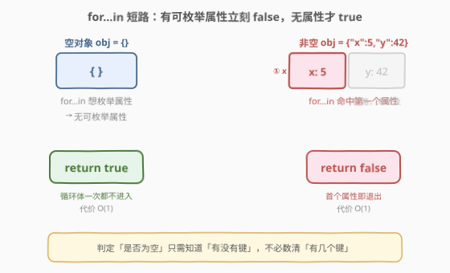
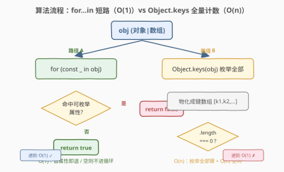
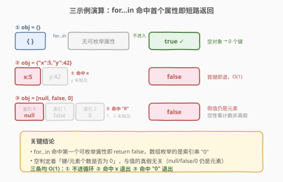

# 判断对象是否为空

- **题目名称**：判断对象是否为空
- **链接**：[2727. 判断对象是否为空](https://leetcode.cn/problems/is-object-empty/)
- **难度**：简单
- **标签**：JavaScript、对象、数组、JSON、短路枚举

## 1. 题目概述

给定一个**对象或数组**，判断它是否为空。

- 一个**空对象**不包含任何键值对。
- 一个**空数组**不包含任何元素。

你可以假设对象或数组是通过 `JSON.parse` 解析得到的。

**示例 1**：

```text
输入：obj = {"x": 5, "y": 42}
输出：false
解释：这个对象有两个键值对，所以它不为空。
```

**示例 2**：

```text
输入：obj = {}
输出：true
解释：这个对象没有任何键值对，所以它为空。
```

**示例 3**：

```text
输入：obj = [null, false, 0]
输出：false
解释：这个数组有 3 个元素，所以它不为空。
```

**约束条件**：

- `obj` 是一个有效的 JSON 对象或数组
- $2 \le \text{len}(\text{JSON.stringify}(obj)) \le 10^5$

> 💡 本题是 LeetCode「30 天 JavaScript」系列题目，**仅提供 JavaScript / TypeScript 提交入口**，核心考察**对象/数组的空判定**与进阶的 **$O(1)$ 短路枚举**。下文以 JS 为提交语言，并给出 Python / C++ 概念等价实现，最后讨论 `for...in` 短路相对 `Object.keys` 全量计数的优势，以及示例 3「假值仍是元素」这一典型陷阱。

---

## 2. 解题思路

### 2.1 暴力思路：序列化比长度 / 全量数键

最直观的写法是把「空」翻译成「键的数量为 0」：

```javascript
var isEmpty = function(obj) {
    return Object.keys(obj).length === 0;   // 数组与对象统一处理
};
```

这能过全部用例，而且**一个表达式同时覆盖对象和数组**——因为对数组 `Object.keys([null,false,0])` 返回 `['0','1','2']`（把索引当字符串键），对空数组返回 `[]`。但它的代价是 `Object.keys` 必须**枚举全部可枚举属性**后才能 `.length`，对 $n$ 个键的对象是 $O(n)$——哪怕只想知道「有没有键」，也得先把所有键数完。

另一种"暴力"是序列化比长度：

```javascript
var isEmpty = function(obj) {
    return JSON.stringify(obj) === '{}' || JSON.stringify(obj) === '[]';
};
```

`{}` 和 `[]` 的序列化结果长度都是 2，但 `JSON.stringify` 是 $O(n)$ 全量序列化，且依赖序列化字面量这一脆弱实现细节（嵌套空对象等边界易踩坑），不推荐。

### 2.2 核心观察：`for...in` 短路即 $O(1)$



关键洞察是**判定「是否为空」只需知道「有没有键」，而不需要知道「有几个键」**。`for...in` 语句遍历可枚举字符串属性，但只要在**第一次迭代**就 `return false` 即可短路退出——非空时 $O(1)$；空对象/空数组没有可枚举属性，循环体一次都不执行，直接落到 `return true`，同样是 $O(1)$。

| 输入 | 可枚举属性 | `for...in` 行为 | 结果 | 代价 |
|------|-----------|-----------------|------|------|
| `{}` | 无 | 循环不进入 | `true` | $O(1)$ |
| `[]` | 无 | 循环不进入 | `true` | $O(1)$ |
| `{"x":5,"y":42}` | `x`、`y` | 命中 `x` 立即返回 | `false` | $O(1)$（未触及 `y`） |
| `[null,false,0]` | `0`、`1`、`2` | 命中 `"0"` 立即返回 | `false` | $O(1)$（未触及 `1`、`2`） |

> ⚠️ **为什么 `for...in` 对 `JSON.parse` 的结果是安全的？** `for...in` 会遍历**继承来的**可枚举属性。但 `JSON.parse` 产物是 `Object.create(null)` 风格的纯数据对象（数组同理），**原型链上无可枚举属性**，因此不会把继承属性误判为「自己的键」。这正是题目特意强调「假设 `obj` 由 `JSON.parse` 得到」的原因——它排除了 `for...in` 误枚举原型属性的风险。

> 💡 **示例 3 的陷阱：假值仍是元素。** `[null, false, 0]` 的三个元素全是假值（falsy），但**它们是真实存在的数组元素**——空判定看的是「元素个数是否为 0」，而非「元素是否为真」。`for...in` 对该数组会命中索引 `"0"` 立即返回 `false`，正好躲开了「假值当空」的误判。任何试图用 `!obj`、`obj.length` 配合真值判断的写法都会在此翻车。

### 2.3 算法流程图



两条路径都正确，差别在**是否需要枚举到结尾**：

| 维度 | 路径 A：`for...in` 短路 | 路径 B：`Object.keys` 计数 |
|------|------------------------|---------------------------|
| **写法** | `for (const _ in obj) return false; return true;` | `Object.keys(obj).length === 0` |
| **数组/对象** | 统一（`for...in` 对数组枚举索引串） | 统一（`Object.keys` 对数组返回索引串） |
| **非空代价** | $O(1)$（首个属性即返回） | $O(n)$（枚举全部键） |
| **空代价** | $O(1)$（无属性，不进入循环） | $O(1)$（无键，但仍有调用开销） |
| **额外空间** | $O(1)$ | $O(n)$（生成键数组） |
| **进阶要求** | ✅ 满足 $O(1)$ | ❌ 不满足 |

> 💡 `Object.keys` 内部本质就是「收集所有可枚举自有属性到数组」，它**没有短路接口**——哪怕你只想要 `.length === 0`，它也会把全部键物化成一个新数组再取长度。`for...in` 则把「要不要继续」的控制权交给你，第一次迭代即可决定退出。

### 2.4 示例演算



以三个示例走一遍 `for...in` 短路：

| 示例 | 输入 | `for...in` 第一个命中的属性 | 行为 | 输出 |
|------|------|---------------------------|------|------|
| ① | `{}` | （无） | 循环不进入，落到 `return true` | `true` |
| ② | `{"x":5,"y":42}` | `"x"` | 命中即 `return false`，`"y"` 未被触及 | `false` |
| ③ | `[null,false,0]` | `"0"`（索引串） | 命中即 `return false`，假值 `null`/`false`/`0` 仍是元素 | `false` |

> 💡 示例 ②中 `for...in` 只枚举到 `"x"` 就返回了，`"y"` 自始至终未被访问——这就是短路的本质：**判定非空不需要数清有多少键，只要抓到第一个即可**。示例 ③最关键：数组索引在 `for...in` 里以字符串 `"0"`、`"1"`、`"2"` 出现，命中 `"0"` 即刻返回 `false`，证明数组元素的存在性与其值的真假无关。

---

## 3. 参考代码

### JavaScript / TypeScript（提交语言）

**路径 A：`for...in` 短路（$O(1)$ 进阶解法）**

```javascript
/**
 * @param {Object|Array} obj
 * @return {boolean}
 */
var isEmpty = function(obj) {
    for (const _ in obj) {
        return false;          // 命中第一个可枚举属性即判定非空
    }
    return true;               // 无可枚举属性 → 空
};
```

TypeScript 版：

```typescript
type JSONValue = null | boolean | number | string | JSONValue[] | { [key: string]: JSONValue };
type Obj = Record<string, JSONValue> | JSONValue[];

function isEmpty(obj: Obj): boolean {
    for (const _ in obj) {
        return false;
    }
    return true;
};
```

> 💡 这是本题进阶问「能否 $O(1)$ 解决」的标准答案。`for...in` 对数组枚举的是**索引（字符串形式）**，对对象枚举的是**键**，二者统一处理，无需 `Array.isArray` 分支。

**路径 B：`Object.keys` 计数（直观但 $O(n)$）**

```javascript
/**
 * @param {Object|Array} obj
 * @return {boolean}
 */
var isEmpty = function(obj) {
    return Object.keys(obj).length === 0;   // 数组与对象统一，索引当键
};
```

> ⚠️ 路径 B 写法简洁、可读性高，是多数人第一反应，但**不满足进阶的 $O(1)$ 要求**：`Object.keys` 会枚举全部自有可枚举属性并物化成新数组，非空时为 $O(n)$ 时间 + $O(n)$ 空间。当只需「空否」判定时，这是不必要的全量开销。

### Python（概念等价）

> 本题 LeetCode 仅开放 JS / TS，Python 版作概念对照。Python 中字典用 `not d`（空字典布尔值为假）、列表用 `not lst` 即可判定空——但 `bool()` 对**非空容器恒真**，正好绕开示例 ③「假值元素」陷阱（Python 不会把 `[None, False, 0]` 当空，它有 3 个元素）。

```python
from typing import Union, Any, Dict, List

class Solution:
    def isEmpty(self, obj: Union[Dict[str, Any], List[Any]]) -> bool:
        return len(obj) == 0
```

> 💡 Python 的 `len()` 对 `dict` / `list` 都是 $O(1)$（容器维护长度计数器），所以 Python 不存在「$O(n)$ 数键」的问题——这是动态语言实现差异：JS 的 `Object.keys` 是即时枚举，Python 的 `__len__` 是维护的属性。若要在 Python 模拟「短路」语义，可用 `any(True for _ in obj)`（生成器惰性，命中第一个即停），但 `len() == 0` 已是 $O(1)$，无需绕路。

### C++（概念等价）

> C++ 无统一的对象/数组容器。JSON 场景下常用 `nlohmann::json`，其 `empty()` 方法对对象（无键）和数组（无元素）统一返回是否为空，$O(1)$。

```cpp
#include <nlohmann/json.hpp>
using json = nlohmann::json;

class Solution {
public:
    // obj 由 JSON.parse 得到 → 用 nlohmann::json 表达
    bool isEmpty(const json& obj) {
        return obj.empty();   // 对象无键或数组无元素皆返回 true
    }
};
```

> 💡 `nlohmann::json::empty()` 对 `object`（`size()==0`）和 `array`（`size()==0`）统一返回 `true`，底层是维护的 size 字段，$O(1)$。这呼应了「空判定应走维护的计数、而非全量枚举」这一设计原则。

---

## 4. 复杂度分析

| 维度 | 路径 A（`for...in` 短路） | 路径 B（`Object.keys` 计数） |
|------|--------------------------|------------------------------|
| **时间复杂度** | $O(1)$ | $O(n)$ |
| **空间复杂度** | $O(1)$ | $O(n)$（键数组） |
| **是否满足进阶 $O(1)$** | ✅ 是 | ❌ 否 |

> 💡 两种路径对**空输入**都接近 $O(1)$（A 不进循环、B 无键不枚举）；差距集中在**非空输入**：A 命中首个属性即返回，B 必须枚举全部 $n$ 个键。$n$ 上界 $10^5$ 时，B 每次调用都做全量枚举，A 则恒为常数——这就是进阶要求 $O(1)$ 的意义所在。

---

## 5. 扩展：`for...in`、`Object.keys` 与原型链

**`for...in` vs `Object.keys` 的边界。** 两者都枚举「可枚举字符串属性」，但口径不同：

- `for...in`：遍历**自身 + 原型链上**所有可枚举字符串属性（不含 `Symbol`）。
- `Object.keys`：只返回**自有**可枚举字符串属性（不含原型链、不含 `Symbol`）。

本题强调「`obj` 由 `JSON.parse` 得到」正是为了消除这一差异——`JSON.parse` 产出的对象/数组原型链上无可枚举属性，`for...in` 与 `Object.keys` 枚举的集合相同，短路判定才无歧义。若 `obj` 是任意对象（如带自定义原型的类实例），`for...in` 可能枚举到继承属性而误判非空，此时应改用 `Object.keys` 或加 `obj.hasOwnProperty(k)` 守卫。

**用 `Reflect.ownKeys` / `Object.getOwnPropertyNames` 行不行？** 可以，`Object.getOwnPropertyNames(obj).length === 0` 同样能判空，但它枚举**不可枚举自有属性**，对 `JSON.parse` 产物与 `Object.keys` 等价，且仍是 $O(n)$ 全量——不满足进阶。`Reflect.ownKeys` 额外含 `Symbol` 键，但 `JSON.parse` 产物无 `Symbol` 键，本题场景下与 `Object.keys` 无差别。

**示例 3 的更深层启示：空性 vs 真值性。** `[null, false, 0]` 全是假值却非空，揭示了一个易混点——**容器的「空」是结构属性（元素/键的计数为 0），与元素的值无关**。这与「空字符串 `""`」「`0` 是假值」属不同维度：后者是值的真值性，前者是容器的计数性。判定容器空否，永远走「计数 / 枚举」，而非对元素求布尔。

> 💡 **设计原则：判定与遍历分离。** 当只需要「有没有」（存在性）时，应选**短路**接口（`for...in` + 早返回、`some`、`find`），而非「全量收集再判断」（`Object.keys`、`filter`）。本题是这一原则的最小例子：`for...in` 把「是否继续」交给调用方，第一次迭代即可退出；`Object.keys` 剥夺了这个控制权，强制全量物化。

---

## 6. 面试要点

1. **进阶问「能否 $O(1)$」的答案是什么？为什么 `Object.keys` 不行？**

   > 用 `for...in` 短路：`for (const _ in obj) return false; return true;`。非空时命中第一个可枚举属性即返回 $O(1)$；空时循环不进入直接 `return true` 也是 $O(1)$。`Object.keys(obj).length === 0` 虽写法更直观，但它必须枚举全部自有可枚举属性并物化成新数组再取长度，非空时为 $O(n)$ 时间 + $O(n)$ 空间，不满足进阶要求。

2. **`for...in` 对数组和对象分别枚举什么？为什么本题能统一处理？**

   > 对对象枚举**键**，对数组枚举**索引（以字符串形式，如 `"0"`、`"1"`）**。两者都是「可枚举字符串属性」，故 `for...in` 命中任一即说明非空，无需 `Array.isArray` 分支。`Object.keys` 同理——对数组返回索引串数组，对对象返回键数组，所以 `.length === 0` 也能统一判空。

3. **题目为什么强调「`obj` 由 `JSON.parse` 得到」？这排除了什么风险？**

   > 排除了 `for...in` 误枚举**原型链继承属性**的风险。`for...in` 会遍历自身加原型链上所有可枚举属性；若 `obj` 是带自定义原型的类实例，原型上的可枚举方法/属性会被枚举到，导致空对象被误判为非空。`JSON.parse` 产物原型链上无可枚举属性，`for...in` 枚举集合退化为「自有可枚举属性」，与 `Object.keys` 一致，短路判定才可靠。

4. **示例 3 `[null, false, 0]` 为什么不是空？这暴露了什么易错点？**

   > 它有 3 个元素，元素个数不为 0，故非空。三个值全是假值（falsy），但这**不影响空性**——容器的「空」是计数属性（元素/键个数是否为 0），与元素的值无关。这暴露了「把值的真值性误当容器的空性」的易错点：任何用 `!obj`、对元素求布尔的写法都会在此翻车。`for...in` 命中索引 `"0"` 即返回 `false`，正好绕开此陷阱。

5. **`JSON.stringify(obj).length <= 2` 能判空吗？为什么不推荐？**

   > 能：`{}` 和 `[]` 序列化长度都是 2，非空容器序列化更长。但它 $O(n)$ 全量序列化，远比短路枚举贵；且依赖序列化字面量这一脆弱实现细节——嵌套空对象 `{"a":{}}` 序列化为 `{"a":{}}`（长度 7）虽判对，但若改用自定义 `toJSON` 或有非可序列化值时行为会变。它把「结构判定」退化成「文本匹配」，可读性与健壮性都差，仅作反面教材。

> 💡 **一句话总结**：2727 = 「`for...in` 命中首个可枚举属性即返回 `false`，否则 `true`」。判定空只需「有没有键」而非「有几个键」——短路枚举把全量 $O(n)$ 降到 $O(1)$。`JSON.parse` 产物原型链干净，保证 `for...in` 与 `Object.keys` 等价；示例 ③提醒「空性看计数、不看元素真假」。

---

## 7. 同类练习题

- [2705. 精简对象](https://leetcode.cn/problems/compact-object/)：递归删除对象/数组中的假值，与本题同属 30 天 JS「对象」系列，一判空一去空值，巩固对象/数组递归遍历
- [2677. 分块数组](https://leetcode.cn/problems/chunk-array/)：按大小把数组切分成子数组，与本题同属 30 天 JS 数组操作系列，涉及 `length` 与边界处理
- [2703. 返回传递的参数的长度](https://leetcode.cn/problems/return-length-of-arguments-passed/)：用 `arguments.length` 取参数个数，与本题「计数判空」同源，都是「长度/计数」语义的最小练习
- [2626. 数组归约运算](https://leetcode.cn/problems/array-reduce-transformation/)：手写 `reduce` 遍历数组，与本题同属 30 天 JS「数组高阶函数」家族，一归约一判空
- [2634. 过滤数组中的元素](https://leetcode.cn/problems/filter-elements-from-array/)：手写 `filter` 依谓词筛选，与本题同属数组遍历系列，对照「短路判定」与「全量收集」两种遍历模式
