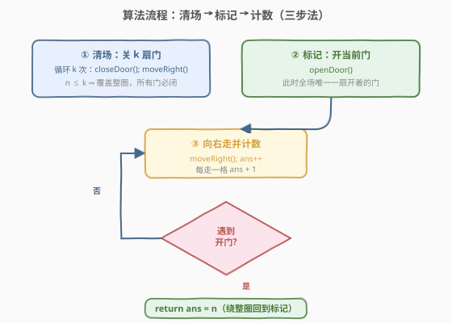

# LeetCode 计算一个环形街道上的房屋数量 题解

## 1. 题目概述

- **标题 / 题号**：计算一个环形街道上的房屋数量（#2728，easy）
- **链接**：https://leetcode.cn/problems/count-houses-in-a-circular-street/
- **难度**：简单
- **标签**：数组、交互

> ⚠️ 本题为 LeetCode 付费题，题意描述根据官方示例用例与 hints 重建，可能与官方题面有出入。核心 API 与三步法解题思路来自官方 hints，可信度较高。

**题意**：环形街道上有 $n$ 间房屋，首尾相接围成一圈，每间房有一扇门，门的状态为**开**（`1`）或**关**（`0`）。你站在其中某一间房前，但**不知道 $n$ 是多少**，也不知道自己在圈里的位置。判题系统提供一个 `Street` 对象，封装了对当前房屋与街道的操作：

| 方法 | 作用 |
|------|------|
| `openDoor()` | 打开**当前**所在房屋的门 |
| `closeDoor()` | 关闭**当前**所在房屋的门 |
| `isDoorOpen()` | 返回当前房屋的门是否打开（`true`/`false`） |
| `moveRight()` | 向右移动到下一间房；街道是环形的，走到末尾后回到第一间 |

此外给你一个整数 $k$。题目保证**房屋总数 $n$ 不超过 $k$**（即 $n \le k$），$k$ 是已知的规模上界。请返回这条环形街道上的房屋总数 $n$。

**示例 1**：

```text
输入：doors = [0,0,0,0], k = 10
输出：4
解释：4 间房围成圈。虽有初始全闭，仍按"清场-标记-计数"三步：关 10 扇门（绕两圈半，全闭），开当前门作标记，右移计数 4 步回到标记门 ⇒ n = 4。
```

**示例 2**：

```text
输入：doors = [1,0,1,1,0], k = 5
输出：5
解释：5 间房，初始门状态为 开·闭·开·开·闭。先关 5 扇门（绕一圈把所有门都关上），再开当前门作唯一标记，右移 5 步回到标记门 ⇒ n = 5。
```

**约束条件（重建）**：

- 房屋数 $n \ge 1$，门状态 $\text{doors}[i] \in \{0, 1\}$（`0` 关 / `1` 开）
- $n \le k$，$k$ 为已知的规模上界（这是"关 $k$ 扇门必覆盖整圈"的前提）
- $n, k$ 规模可达 $10^5$ 量级，因此总操作次数需控制在 $O(k)$ 以内

> 💡 三个官方 hints 一字不差地给出了算法骨架：(1) 朝一个方向移动并关 $k$ 扇门；(2) 打开当前房屋的门；(3) 朝一个方向移动并计数，直到遇到那扇打开的门。本题就是把这个骨架翻译成代码并讲清"为什么这样做一定对"。

## 2. 解题思路

### 2.1 朴素思路：开门即计数？会被初始开门的房"误停"

最直觉的做法是：**打开当前门作标记 → 一直 `moveRight` 计数 → 直到再遇到一扇开着的门就停**，计数值即 $n$。这依赖一个隐含假设——"全场只有我刚才开的那一扇门是开的"。

但示例 2 的初始状态是 `开·闭·开·开·闭`，本来就有 3 扇门开着。若直接标记就走，你还没绕回标记门，就会先撞上**另一扇本来就开着的门**，提前误停，计数偏小。所以朴素法的病根是：**初始门状态未知且可能有开门的房，标记不唯一**。

> ⚠️ 一句话：朴素法失败于"标记不唯一"。要让"标记 + 绕圈计数"成立，必须先**把全场所有门都关上**，再开门做唯一标记。

### 2.2 核心观察：先"清场"再"标记"再"计数"


三步法对应解决朴素法的病根：

1. **清场**：循环 $k$ 次，每次 `closeDoor()` 后 `moveRight()`。因为题目保证 $n \le k$，连续关 $k$ 扇门（沿环移动 $k$ 格）必然**覆盖整圈**——每间房至少被关过一次，故 $k$ 步后全场所有门都是关闭状态。
2. **标记**：在清场后所处的当前房执行 `openDoor()`，这是全场**唯一**一扇开着的门，作为绕圈计数的"起跑线/终点线"。
3. **计数**：循环 `moveRight()` 且 `ans++`，直到 `isDoorOpen()` 为真（回到标记门）。因为是环形且全场仅此一扇门开，从标记门出发绕一整圈恰好走 $n$ 步回到它，`ans` 即为 $n$。

> 💡 关键不变式：**清场后全场仅标记门为开**。这使得计数阶段遇到的开门一定是标记门本身，$n$ 步必回，计数唯一且正确。$n \le k$ 是"关 $k$ 扇门必覆盖整圈"的充要保证——若 $k < n$，关 $k$ 扇门可能漏掉某间房，标记就不唯一了。

### 2.3 算法流程图



流程要点：

- **清场循环**固定跑 $k$ 次：`closeDoor(); moveRight();`。关一扇关着的门是幂等的，所以"多关几次"无害，只要保证 $\ge n$ 次覆盖整圈即可——用 $k$（已知上界）正是为了"无需知道 $n$ 也能保证覆盖"。
- **标记**仅一次 `openDoor()`，打开当前所处房屋的门。
- **计数循环**先 `moveRight()` 再 `ans++` 再判 `isDoorOpen()`：走一步记一次，遇到开门即停。注意是**先走后判**，保证回到标记门那一刻才停，`ans` 恰好等于走过的格数 $n$。

### 2.4 示例演算

![示例演算：doors=[1,0,1,1,0], k=5（n=5）](../images/p2728_example_walkthrough.svg)

以**示例 2** `doors = [1,0,1,1,0], k = 5`（$n=5$）为例，设初始站在 `idx0`：

| 阶段 | 操作 | 门状态（idx0..4） | 当前位置 | 说明 |
|------|------|-------------------|----------|------|
| 初始 | — | `1 0 1 1 0` | idx0 | 3 扇门本就开着，标记不唯一 |
| ①清场 | 关5扇门 | `0 0 0 0 0` | idx0 | $k=n=5$，绕一圈把门全关上，落回 idx0 |
| ②标记 | openDoor | `1 0 0 0 0` | idx0 | idx0 成为全场唯一开门的房 |
| ③计数 | 右移计数 | `1 0 0 0 0` | idx0 | idx1→2→3→4→0，第 5 步遇开门停 |

计数阶段逐步：`moveRight` 到 idx1（闭，ans=1）→ idx2（闭，2）→ idx3（闭，3）→ idx4（闭，4）→ idx0（**开**，5）停。$\text{ans}=5=n$ $\checkmark$

> 💡 注意第①步关 5 扇门恰好绕一整圈（因 $n=5=k$），所以清场后**落回原位 idx0**。若 $k>n$（如示例 1 的 $k=10,n=4$），清场会绕多圈，最终落在 `idx (k mod n)` 处——但这无关紧要，因为标记门唯一，计数阶段绕一整圈必回标记门，与清场落点无关。

## 3. 参考代码

### C++

```cpp
/**
 * // This is the Street's API interface.
 * // You should not implement it, or speculate about its implementation
 * class Street {
 * public:
 *     void openDoor();
 *     void closeDoor();
 *     bool isDoorOpen();
 *     void moveRight();
 * };
 */
class Solution {
public:
    int houseCount(Street* street, int k) {
        // ① 清场：关 k 扇门，n<=k 保证覆盖整圈，全场变闭
        for (int i = 0; i < k; ++i) {
            street->closeDoor();
            street->moveRight();
        }
        // ② 标记：开当前门，全场唯一一扇开门
        street->openDoor();
        // ③ 计数：右移并计数，直到回到那扇开着的门
        int ans = 0;
        while (true) {
            street->moveRight();
            ++ans;
            if (street->isDoorOpen()) break;
        }
        return ans;
    }
};
```

### Python

```python
# """
#  This is the Street's API interface.
#  You should not implement it, or speculate about its implementation
#  class Street:
#     def openDoor(self) -> None: ...
#     def closeDoor(self) -> None: ...
#     def isDoorOpen(self) -> bool: ...
#     def moveRight(self) -> None: ...
# """
class Solution:
    def houseCount(self, street: 'Street', k: int) -> int:
        # ① 清场：关 k 扇门，n<=k 保证覆盖整圈，全场变闭
        for _ in range(k):
            street.closeDoor()
            street.moveRight()
        # ② 标记：开当前门，全场唯一一扇开门
        street.openDoor()
        # ③ 计数：右移并计数，直到回到那扇开着的门
        ans = 0
        while True:
            street.moveRight()
            ans += 1
            if street.isDoorOpen():
                break
        return ans
```

> 💡 代码与官方 hints 一一对应：循环 $k$ 次"关门+右移"＝清场；一次 `openDoor`＝标记；`while` 先走后判＝计数。三步顺序不可乱：清场必须在标记之前（否则标记会被后续关门覆盖）；标记必须在计数之前（否则没有唯一终点）。计数循环用 `while True ... break` 比 `do-while` 语义更贴近"先走后判"。

## 4. 复杂度分析

| 维度 | 复杂度 | 说明 |
|------|--------|------|
| 时间复杂度 | $O(k)$ | 清场循环 $k$ 次 `close+move`；计数循环至多 $n \le k$ 次 `move+查`；合计 $\le 2k$ 次操作 |
| 空间复杂度 | $O(1)$ | 仅用常数个标量 `ans/i`，不存任何数组 |

> 💡 时间界由 $k$（而非 $n$）决定，因为不知道 $n$、只能用已知上界 $k$ 来"保底覆盖整圈"。若已知 $n$，清场只需 $n$ 次即可，总操作 $O(n)$；但交互场景下 $n$ 未知，$O(k)$ 是无法避免的代价——这正是 $n \le k$ 这一保证的设计意义。

## 5. 扩展：双向版与"标记唯一性"思想

本题的进阶版 [2753. 环形街道数房屋 II](https://leetcode.cn/problems/count-houses-in-a-circular-street-ii/) 在 `Street` 接口里**新增了 `moveLeft()`**，并放宽/改变门状态与 $k$ 的约束，要求用更小的代价（更少的移动次数）完成计数。其核心仍可归结为同一思想：

- **"标记唯一 + 绕圈计数"** 是交互式"数未知环形结构规模"的通用范式。无论单向还是双向，本质都是先制造一个**全场唯一的可识别标记**，再沿确定方向走一圈回到标记，步数即规模。
- 单向版用"关 $k$ 扇门"清场来保证标记唯一（代价 $O(k)$）；双向版允许左右移动后，可通过更精巧的开/关门序列减少总移动次数，把代价压到接近 $O(n)$。

> ⚠️ 这一思想在更广的交互题里反复出现：[489. 扫地机器人](https://leetcode.cn/problems/robot-room-cleaner/) 用"标记已扫格 + 回溯"探索未知网格；[2061. 清扫机器人清扫的格数](https://leetcode.cn/problems/number-of-spaces-cleaning-robot-cleaned/) 沿固定路径清扫并计数。它们的共同骨架都是"**不知规模 ⇒ 制造可识别标记/状态 ⇒ 确定性遍历并计数直到回到已知状态**"。

## 6. 面试要点

1. **为什么必须先"清场"再"标记"？能否反过来？**

   > 不能。若先 `openDoor` 标记、再关门清场，标记门会在清场循环里被 `closeDoor` 关掉，标记就没了。三步顺序"清场→标记→计数"不可乱：清场在标记之前保证标记不被覆盖，标记在计数之前保证有唯一终点。

2. **关 $k$ 扇门为什么能保证"全场都关上"？**

   > 因为题目保证 $n \le k$。沿环移动 $k$ 格，访问的 $k$ 间房（模 $n$）覆盖了 $0..n-1$ 全部位置至少一次（$k$ 个连续位置模 $n$ 当 $k\ge n$ 时必覆盖全集）。每间房至少被 `closeDoor` 一次，关门幂等，故全场变闭。

3. **计数循环为什么是"先走后判"，而不是"先判后走"？**

   > 标记门此刻是开的。若先 `isDoorOpen` 判，第一步就为真会立即停，`ans=0`，错。先 `moveRight` 走出标记门、再 `ans++`、再判，才能保证"绕一整圈回到标记门那一刻才停"，`ans` 恰为 $n$。

4. **如果 $k < n$（即不满足题目保证）会怎样？**

   > 清场只关了 $k$ 扇门，可能漏掉某间本就开门的房，导致全场不止标记门一扇开门。计数阶段会提前撞上那扇漏网的开门，`ans < n`，结果错误。所以 $n \le k$ 是算法正确性的**充要前提**，不是可有可无的约束。

5. **时间复杂度为什么是 $O(k)$ 而不是 $O(n)$？能否做到 $O(n)$？**

   > 不知道 $n$，只能用已知上界 $k$ 保底覆盖整圈，清场固定 $k$ 步，故 $O(k)$。这是"未知规模"场景的固有代价。若题目额外给出 $n$，清场只需 $n$ 步、计数 $n$ 步，总 $O(n)$；但交互题不给 $n$，$O(k)$ 已是最优上界保证。

## 同类练习题

| # | 题目 | 与本题的关联 |
|---|------|-------------|
| 2753 | [环形街道数房屋 II](https://leetcode.cn/problems/count-houses-in-a-circular-street-ii/) | 本题直接进阶版，`Street` 新增 `moveLeft()`，需用更少移动次数计数，"标记唯一 + 绕圈"思想的双向升级 |
| 489 | [扫地机器人](https://leetcode.cn/problems/robot-room-cleaner/) | 交互式探索未知空间的经典母题，同样"不知规模，靠标记/回溯遍历全场" |
| 2061 | [清扫机器人清扫的格数](https://leetcode.cn/problems/number-of-spaces-cleaning-robot-cleaned/) | 机器人沿固定路径清扫并计数空间，与本题"沿环形街道计数房屋"结构相近 |
| 918 | [环形子数组的最大和](https://leetcode.cn/problems/maximum-sum-circular-subarray/) | 环形结构的取模索引与"绕圈"思想，对照本题的环形遍历（套路不同但共享"环形"语境） |
