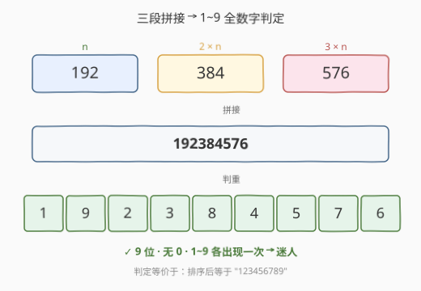
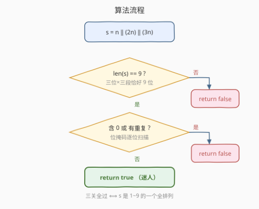
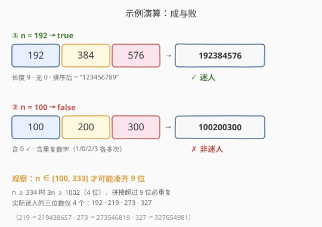

# 判断一个数是否迷人

- **题目名称**：判断一个数是否迷人
- **链接**：[2729. 判断一个数是否迷人](https://leetcode.cn/problems/check-if-the-number-is-fascinating/)
- **难度**：简单
- **标签**：哈希表、数学

## 1. 题目概述

给你一个三位数整数 `n`。如果将 `n`、`2 * n`、`3 * n` **连接**后得到的数字**恰好**包含数字 `1` 到 `9` 各一次且不包含任何 `0`，则称 `n` 是**迷人的**，返回 `true`，否则返回 `false`。

**连接**两个数字表示把它们首尾相接连在一起，例如 `121` 和 `371` 连接得到 `121371`。

**示例 1**：

```text
输入：n = 192
输出：true
解释：将 n = 192、2 * n = 384、3 * n = 576 连接，得到 192384576，恰好包含 1 到 9 各一次。
```

**示例 2**：

```text
输入：n = 100
输出：false
解释：将 n = 100、2 * n = 200、3 * n = 300 连接，得到 100200300，不符合条件。
```

**约束条件**：

- `100 <= n <= 999`

> 💡 这是一道**模拟 + 全数字（pandigital）判定**题：本质就是「拼字符串，然后判断它是不是 `1~9` 的一个排列」。难点不在算法，而在于把判定条件想全——长度、零、重复三者缺一不可。

---

## 2. 解题思路

### 2.1 直接思路：拼起来检查

最朴素的办法就是照题意模拟：把 `n`、`2n`、`3n` 转成字符串拼接，然后判断拼接结果是否恰好是 `1~9` 各一次。判定可以拆成三条：

1. **长度恰好为 9**：三位数 × 三段，只有三段都是三位数时总长才是 9。
2. **不含 `0`**：出现 `0` 直接淘汰。
3. **无重复数字**：9 个数字都取自 `1~9` 且互不相同，等价于恰好把 `1~9` 各用一次。

> 💡 这三条可以合成一句：**拼接结果排序后等于 `"123456789"`**。因为一个 9 位的、不含 0、无重复的数字串，排序后必然是 `123456789`；反之若排序结果等于它，就同时保证了长度、无 0、无重复。

### 2.2 核心观察：1~9 全数字（pandigital）判定



上图以 `n = 192` 为例展示判定逻辑：

- `n=192`、`2n=384`、`3n=576` 三段拼接成 `192384576`。
- 把它逐位铺开，9 个格子里的数字是 `{1,9,2,3,8,4,5,7,6}`，正好是 `1~9` 的一个重排，无 0、无重复 → 迷人。

**判定等价关系**：

$$
\text{迷人} \;\Longleftrightarrow\; \text{sort}(n\Vert 2n\Vert 3n) = \texttt{"123456789"}
$$

其中 $\Vert$ 表示字符串拼接。这个等价把三步合成一步，写起来极简。

### 2.3 位掩码：一次扫描提前终止

排序版需要构造完整字符串再排序，常数略大。若想**边扫边判、遇到 0 或重复立即返回 false**，可用**位掩码**：用一个整数的第 `d` 位记录数字 `d` 是否出现过（`1 <= d <= 9`）。扫描每个数字 `d`：

- 若 `d == 0`：直接 `return false`（含 0）。
- 若 `mask & (1 << d)` 非零：该数字已出现过，`return false`（重复）。
- 否则 `mask |= (1 << d)` 记录。

全部扫完且长度为 9 即迷人。这是哈希表判重的「位压缩」版，`1~9` 共 9 个数字，一个 `int` 即可装下。



### 2.4 示例演算



- **`n = 192`**：`192 ‖ 384 ‖ 576 = 192384576`，长度 9、无 0、排序为 `123456789` → `true`。
- **`n = 100`**：`100 ‖ 200 ‖ 300 = 100200300`，含 `0` 且有大量重复 → `false`。

> ⚠️ **一个值得注意的范围事实**：要让三段拼接恰好 9 位，需要 `n`、`2n`、`3n` 都是三位数，即 `3n <= 999`，也就是 `n <= 333`。当 `n >= 334` 时 `3n >= 1002`（四位数），拼接超过 9 位，必然产生重复，必然不迷人。所以候选范围其实被压缩到 `[100, 333]`。在这个区间内，真正迷人的三位数**只有 4 个**：`192、219、273、327`（见第 5 节）。

---

## 3. 参考代码

### 方法一：拼接 + 排序比对（最简洁）

### C++

```cpp
class Solution {
public:
    bool isFascinating(int n) {
        string s = to_string(n) + to_string(2 * n) + to_string(3 * n);
        sort(s.begin(), s.end());
        return s == "123456789";
    }
};
```

### Python

```python
class Solution:
    def isFascinating(self, n: int) -> bool:
        s = "".join(sorted(str(n) + str(2 * n) + str(3 * n)))
        return s == "123456789"
```

### 方法二：位掩码一次扫描（提前终止）

### C++

```cpp
class Solution {
public:
    bool isFascinating(int n) {
        string s = to_string(n) + to_string(2 * n) + to_string(3 * n);
        if (s.size() != 9) return false;          // 长度关
        int mask = 0;
        for (char c : s) {
            int d = c - '0';
            if (d == 0) return false;             // 含 0
            int bit = 1 << d;
            if (mask & bit) return false;         // 重复
            mask |= bit;
        }
        return true;
    }
};
```

### Python

```python
class Solution:
    def isFascinating(self, n: int) -> bool:
        s = str(n) + str(2 * n) + str(3 * n)
        if len(s) != 9:
            return False
        mask = 0
        for c in s:
            d = ord(c) - ord('0')
            if d == 0:
                return False
            bit = 1 << d
            if mask & bit:
                return False
            mask |= bit
        return True
```

> 💡 还有一种「集合」写法同样简洁：`return len(s) == 9 and set(s) == set("123456789")`。`set(s)` 恰好等于 `{1..9}` 时，再加上长度为 9，就保证无 0、无重复、恰好各一次。与方法一互为镜像：一个「排序后比串」，一个「集合比集合」。

---

## 4. 复杂度分析

| 维度 | 方法 | 复杂度 | 说明 |
|------|------|--------|------|
| 时间复杂度 | 排序比对 | $O(1)$ | 拼接串至多 12 字符，排序 $O(12\log 12)$ 为常数 |
| 空间复杂度 | 排序比对 | $O(1)$ | 只存一个至多 12 字符的字符串 |
| 时间复杂度 | 位掩码 | $O(1)$ | 单次扫描至多 12 字符，常数次位运算 |
| 空间复杂度 | 位掩码 | $O(1)$ | 仅一个 `int` 掩码 |

> ⚠️ 严格说，`n` 是三位数，拼接串长度在 `[7, 12]` 之间（`100100200` 最短 9 位、`99919982997` 最长 12 位），均与 $n$ 无关，故一切复杂度都是 $O(1)$。

---

## 5. 扩展：迷人的数（Fascinating Numbers）

**迷人的数**是一个经典的趣味数论概念：一个 $k$ 位数 $n$，若把 $n, 2n, \dots, kn$ 依次连接后得到一个「$1\sim 9k$ 全数字」（即恰好包含 $1$ 到 $9k$ 各一次且无 $0$），则称 $n$ 迷人。本题是 $k=3$ 的特例。

**为什么三位迷人数只有 4 个？** 由第 2.4 节，候选 $n \in [100, 333]$。逐一枚举这 234 个值，真正满足全数字条件的只有：

| $n$ | $2n$ | $3n$ | 拼接结果 |
|-----|------|------|----------|
| 192 | 384 | 576 | 192384576 |
| 219 | 438 | 657 | 219438657 |
| 273 | 546 | 819 | 273546819 |
| 327 | 654 | 981 | 327654981 |

可以看到它们的拼接结果互为 `1~9` 的不同排列。一个有趣的副产物：**把任意一个迷人数的拼接结果从中间切开，前 3 位就是 $n$，中间 3 位是 $2n$，后 3 位是 $3n$**，且 $2n$、$3n$ 恰好是把 $n$ 的数字位做了某种置换——例如 `327 → 654 → 981`，每位都 `+3`（模 9 处理）。

> 💡 利用「只有 4 个答案」这一事实，本题还有一种「打表特判」解法：`return n == 192 or n == 219 or n == 273 or n == 327;`。$O(1)$ 且零常数。但它丧失了「模拟判定」的普适性，面试时不建议作为主答，仅可作为补充观察。

---

## 6. 面试要点

1. **判定「迷人」的三条条件能否合并成一条？**

   - 能。拼接结果排序后等于 `"123456789"` 一条即可，因为它同时保证了长度为 9、无 0、无重复。

2. **为什么长度必须是 9？多一位或少一位会怎样？**

   - `1~9` 共 9 个不同数字，要各出现一次至少需要 9 位；多于 9 位则必有重复（鸽巢原理），少于 9 位则必有缺失。所以长度恰为 9 是必要条件。

3. **位掩码法和排序法相比优势在哪？**

   - 位掩码能**提前终止**：一旦遇到 0 或重复就立即返回，不必扫完全串；排序法必须完整排序后才能比较。但本题串长 $\le 12$，二者常数都极小，差异可忽略，选可读性更好的即可。

4. **能否不转字符串、纯整数处理？**

   - 能。可以写一个循环不断 `n % 10` 取末位、`n /= 10` 摘出每位数字，对 `n`、`2n`、`3n` 都这么做，累加位数并维护掩码。但写起来更繁琐，且三位数本身就要靠十进制表示，转字符串是最自然的方式。

5. **如果题目推广到「$k$ 位数 $n$，连接 $n\sim kn$ 判定 $1\sim 9k$ 全数字」，思路还成立吗？**

   - 完全成立。核心仍是「拼接 + 全数字判定」，只是候选长度从 9 变为 $9k$，掩码位数随之扩展。$k=3$ 时唯一迷人的三位数恰是上表四个。

---

## 7. 同类练习题

- [1291. 顺次数](https://leetcode.cn/problems/sequential-digits/)：枚举由连续递增数字位组成的数，与「迷人数」同为按数字位规则生成/判定
- [202. 快乐数](https://leetcode.cn/problems/happy-number/)（[题解](../0201-0300/202_快乐数.md)）：反复拆数位求平方和迭代，数位操作族
- [9. 回文数](https://leetcode.cn/problems/palindrome-number/)（[题解](../0001-0100/9_回文数.md)）：反转一半数字判回文，承接本题的数位拆分思路
- [231. 2 的幂](https://leetcode.cn/problems/power-of-two/)（[题解](../0201-0300/231_2的幂.md)）：`n & (n-1)` 单比特判定，位运算判重家族
- [172. 阶乘后的零](https://leetcode.cn/problems/factorial-trailing-zeroes/)（[题解](../0101-0200/172_阶乘后的零.md)）：统计末尾零个数，数论与数位计数
