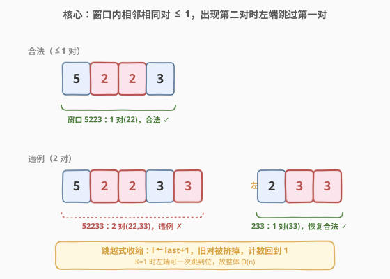
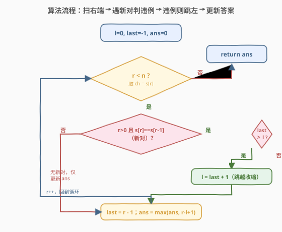
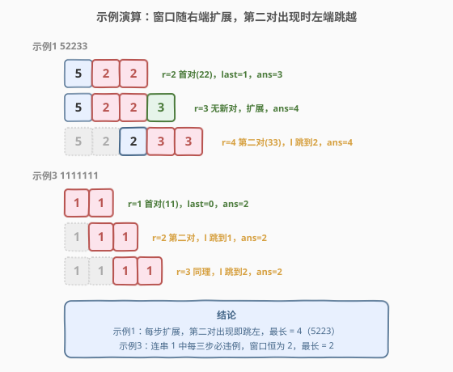

# LeetCode 找到最长的半重复子字符串 题解

## 1. 题目概述

- **标题 / 题号**：找到最长的半重复子字符串（#2730，medium）
- **链接**：https://leetcode.cn/problems/find-the-longest-semi-repetitive-substring/
- **难度**：中等
- **标签**：字符串、滑动窗口

**题意**：给你一个下标从 **0** 开始的字符串 `s`，只包含 `0` 到 `9` 的数字字符。

如果一个字符串 `t` 中**至多有一对**相邻字符是相等的，那么称 `t` 是 **半重复的**。例如 `"0010"`、`"002020"`、`"0123"`、`"2002"` 和 `"54944"` 是半重复字符串；而 `"00101022"`（相邻相同对是 `00` 和 `22`）和 `"1101234883"`（相邻相同对是 `11` 和 `88`）不是半重复字符串。

请你返回 `s` 中最长 **半重复** 子字符串的长度。

**示例 1**：

```text
输入：s = "52233"
输出：4
解释：最长的半重复子字符串是 "5223"。整个字符串 "52233" 有两个相邻的相同数字对 22 和 33，但最多只能选取一个。
```

**示例 2**：

```text
输入：s = "5494"
输出：4
解释：s 是一个半重复字符串。
```

**示例 3**：

```text
输入：s = "1111111"
输出：2
解释：最长的半重复子字符串是 "11"。子字符串 "111" 有两个相邻的相同数字对，但最多允许选取一个。
```

**约束**：

- `1 <= s.length <= 50`
- `'0' <= s[i] <= '9'`

> 💡 「半重复」的本质约束是窗口内 **相邻相同对的数量 ≤ 1**。这是经典的「至多 K 个违例」型滑动窗口，其中 $K=1$，违例 = 相邻相同对。理解了这一点，本题就是「维持窗口内某计数 ≤ K，越界时收缩左端」的标准模板。

## 2. 解题思路

### 2.1 暴力思路：枚举所有子串

最朴素的思路：枚举所有子串 $(i, j)$，对每个子串统计内部相邻相同对的数量，若 $\le 1$ 则用其长度更新答案。

枚举子串 $O(n^2)$ 个，每个判定 $O(n)$，总计 $O(n^3)$。题面 hint 也提示「$n$ 很小，可以直接检查每个子串」——对 $n \le 50$ 完全可行。

瓶颈在于：没意识到窗口的合法性是**单调可维护**的——右端每扩展一格，违例计数只会 +1 或不变；当违例变成 2，左端只需跳到「上一个相邻相同对」之后即可一次性修复，不必逐格挪动、也不必反复重新统计。这能把 $O(n^3)$ 直接压到 $O(n)$。

### 2.2 核心观察：维护「至多一对」的滑动窗口，左端跳到上一对之后



维护窗口 $[l, r]$，使其始终满足「相邻相同对数量 $\le 1$」。用一个变量 `last` 记录**窗口内当前那一对**的起始下标（即 `last` 满足 $s[\text{last}] = s[\text{last}+1]$，且它是窗口里唯一的一对；没有对时记 `last = -1`）。

右端 $r$ 从左到右扩展。当 $r>0$ 且 $s[r] = s[r-1]$ 时出现一个新的相邻相同对：

| 情况 | 含义 | 动作 |
|------|------|------|
| `last < l`（窗口内原本没有对） | 这是第一对，合法 | 仅更新 `last = r-1` |
| `last >= l`（窗口内已有一对） | 这是第二对，违例 | 把 $l$ 跳到 `last + 1`，使旧对 $(\text{last}, \text{last}+1)$ 被挤出窗口；再更新 `last = r-1` |

> ⚠️ 关键：左端不是逐格右移，而是**直接跳到 `last + 1`**。因为窗口里至多只有一对（旧的那对），挤掉它就立刻恢复合法，中间没有其它对需要回避；逐格挪反而无效。这正是「跳越式收缩」把复杂度从 $O(n^2)$ 降到 $O(n)$ 的根因——左端总共也只跳 $n$ 次量级。

> 💡 **为什么 `last+1` 而不是 `last+2`？** 跳到 `last+1` 后，窗口起点是 `last+1`，元素 `s[last]` 被排除，对 $(\text{last}, \text{last}+1)$ 不再完整，旧对被消除。此时窗口里唯一剩下的对就是新的 $(r-1, r)$，计数回到 1，合法。跳到 `last+2` 会白白丢掉 `s[last+1]`，使窗口变短、答案偏小，是错的。

### 2.3 算法流程图



### 2.4 示例演算



**示例 1：`s = "52233"`**

| r | s[r] | 新对? | last | l | 窗口 | 动作 | ans |
|---|------|-------|------|---|------|------|-----|
| 0 | 5 | — | -1 | 0 | `5` | 初始 | 1 |
| 1 | 2 | 否 | -1 | 0 | `52` | 无对，扩展 | 2 |
| 2 | 2 | 是 (22) | -1→1 | 0 | `522` | 第一对，记 last=1 | 3 |
| 3 | 3 | 否 | 1 | 0 | `5223` | 无新对，扩展 | 4 |
| 4 | 3 | 是 (33) | 1→3 | 0→2 | `233` | 已有对(last=1≥l=0)，l 跳到 2；记 last=3 | 4 |

最终答案 **4** $\checkmark$（窗口 `"5223"` 含一对 22）。

**示例 3：`s = "1111111"`**

| r | 新对? | last | l | 窗口 | 动作 | ans |
|---|-------|------|---|------|------|-----|
| 0 | — | -1 | 0 | `1` | 初始 | 1 |
| 1 | 是 | -1→0 | 0 | `11` | 第一对，记 last=0 | 2 |
| 2 | 是 | 0→1 | 0→1 | `11` | 已有对，l 跳到 1；记 last=1 | 2 |
| 3 | 是 | 1→2 | 1→2 | `11` | 同上，l 跳到 2 | 2 |
| 4 | 是 | 2→3 | 2→3 | `11` | l 跳到 3 | 2 |

之后同理，答案始终 **2** $\checkmark$（每两个相邻 1 构成一对，第三位必引入第二对，故最长只能容纳 2 个字符）。

> 💡 示例 3 是理解「跳越收缩」的最佳用例：每当第三位 1 出现，旧对被挤掉、新对顶上，窗口长度永远卡在 2，正好对应「半重复」只允许一对的语义。

## 3. 参考代码

### C++

```cpp
class Solution {
public:
    int longestSemiRepetitiveSubstring(string s) {
        int n = s.size(), ans = 0;
        int l = 0, last = -1;            // last = 窗口内当前那一对的起始下标，-1 表示无对
        for (int r = 0; r < n; r++) {
            if (r > 0 && s[r] == s[r - 1]) {        // 出现新的相邻相同对
                if (last >= l) l = last + 1;        // 已有一对：左端跳过旧对
                last = r - 1;                        // 记录新对起始
            }
            ans = max(ans, r - l + 1);
        }
        return ans;
    }
};
```

### Python

```python
class Solution:
    def longestSemiRepetitiveSubstring(self, s: str) -> int:
        ans = l = 0
        last = -1                          # 窗口内当前那一对的起始下标，-1 表示无对
        for r, ch in enumerate(s):
            if r > 0 and ch == s[r - 1]:   # 出现新的相邻相同对
                if last >= l:              # 已有一对：左端跳过旧对
                    l = last + 1
                last = r - 1                # 记录新对起始
            ans = max(ans, r - l + 1)
        return ans
```

> 💡 `last >= l` 同时充当「窗口内是否已有对」的判据：初始 `last = -1 < l = 0` 表示无对；跳左后 `last` 仍指向旧对位置而 `l` 已越过它，故 `last < l` 又回到「无对」状态，下一对出现时不会再跳。一个变量身兼两职，无需额外计数器。

## 4. 复杂度分析

| 维度 | 复杂度 | 说明 |
|------|--------|------|
| 时间复杂度 | $O(n)$ | 右端 $r$ 单调递增遍历一遍；左端 $l$ 仅在出现第二对时跳跃，累计跳跃次数不超过 $n$，整体仍 $O(n)$ |
| 空间复杂度 | $O(1)$ | 仅维护 `l`、`last`、`ans` 三个标量 |

> 💡 若用「枚举所有子串」的暴力法，时间 $O(n^3)$（或用相邻相同对前缀和优化到 $O(n^2)$）。本题 $n \le 50$，暴力也能过，但滑动窗口把上限拉到 $O(n)$，思路可迁移到 $n$ 更大的同类题。

## 5. 扩展：「至多 K 个违例」型滑动窗口

本题是「至多 $K$ 个违例」型滑动窗口在 $K=1$ 时的特例。这类问题的统一框架：

- 维护窗口 $[l, r]$ 与窗口内「违例」计数 `cnt`；
- 扩展 $r$，若新元素增加违例则 `cnt++`；
- 当 `cnt > K` 时收缩 $l$ 直到 `cnt <= K`；
- 每步用窗口长度更新答案。

「违例」的定义随题而变：本题违例 = 相邻相同对，$K=1$；1004 题违例 = 翻转为 0 的个数，$K$ 为给定值；424 题违例 = 非 majority 字符数，$K$ 为替换次数。

> ⚠️ 本题能用 `last`「跳越式收缩」是因为 $K=1$ 时窗口里至多一个违例，挤掉它即恢复合法，左端可一次跳到位。当 $K>1$ 时窗口可能含多个违例，通常需逐格收缩 $l$（每次可能减少一个违例），无法一步跳过。所以「跳越式」是 $K=1$ 的特殊优化，一般 $K$ 仍用标准逐格收缩。

### 5.1 若问题改为「至多 K 对相邻相同」

只需把 `last` 升级为一个**队列**，存窗口内所有相邻相同对的起始下标。当队首对使 `cnt > K` 时，$l$ 跳到队首 + 1 并出队。$K=1$ 时队列退化为单变量 `last`，即本题写法。这是把「单对」推广到「多对」的自然延伸。

## 6. 面试要点

1. **为什么左端可以「跳」而不是逐格挪？**

   > 窗口里至多只有一个相邻相同对（旧对）。出现第二对时，只要把 $l$ 跳到旧对之后（`last+1`），旧对就被挤掉，违例计数立刻回到 1，无需逐格试探。逐格挪反而低效且无意义——中间位置不会让计数更早合法。这是 $K=1$ 的特殊红利。

2. **`last` 为什么用 `>= l` 判断，而不是单独维护一个 count？**

   > `last` 同时记录了对的位置和「窗口内是否有对」：当 `last >= l` 表示该对仍在窗口内（有对），`last < l` 表示对已被挤出（无对）。一个变量身兼两职，省去独立计数器。跳左后 `last` 指向旧位置、`l` 已越过，天然回到「无对」状态。

3. **为什么是 `l = last + 1` 而不是 `last + 2`？**

   > 跳到 `last+1` 时窗口起点为 `last+1`，`s[last]` 被排除，对 $(\text{last}, \text{last}+1)$ 不完整而被消除。若跳到 `last+2` 会连 `s[last+1]` 也丢掉，窗口变短、可能漏掉更长答案，故错。

4. **暴力 $O(n^3)$ 为什么在本题也能过？**

   > $n \le 50$，$n^3 = 1.25 \times 10^5$，远低于时限。但面试中应主动给出 $O(n)$ 滑动窗口解法以体现对「单调性 / 跳越收缩」的识别，并说明该思路可扩展到 $n$ 更大的场景。

5. **若字符串包含任意字符（不只数字），算法需要改动吗？**

   > 不需要。算法只依赖「相邻两字符是否相等」的判定，与字符集无关。数字字符的限制只是题面设定，不影响滑动窗口的通用性。

> 💡 **一句话总结**：2730 = 「至多 1 个相邻相同对」的滑动窗口，$K=1$ 时左端可跳越式收缩到 `last+1`，整体 $O(n)$。

## 同类练习题

| # | 题目 | 与本题的关联 |
|---|------|-------------|
| 1004 | [最大连续1的个数 III](https://leetcode.cn/problems/max-consecutive-ones-iii/) | 「至多 K 个 0」的最长连续 1，标准 at-most-K 滑动窗口模板，把本题的 $K=1$ 推广到任意 $K$ |
| 2024 | [考试的最大困扰度](https://leetcode.cn/problems/maximize-the-confusion-of-an-exam/) | 至多 K 次翻转使连续同答案最长，与 1004 同构，对比「违例 = 不同字符」的另一种定义 |
| 424 | [替换后的最长重复字符](https://leetcode.cn/problems/longest-repeating-character-replacement/)（[题解](../0401-0500/424_替换后的最长重复字符.md)） | 至多 K 次替换使同一字符最长，违例 = 非 majority 字符数，at-most-K 的经典变体 |
| 1156 | [单字符重复子串的最大长度](https://leetcode.cn/problems/swap-for-longest-repeated-character-substring/) | 至多 1 次交换使单字符重复子串最长，$K=1$ 的近亲，但交换语义比相邻相同对更复杂 |
| 2213 | [由单个字符重复组成的最长子字符串](https://leetcode.cn/problems/longest-substring-of-one-repeating-character/) | 允许至多一次操作合并同字符段，线段树 + 滑动窗口，承接「至多 1 次修复」的思想 |
