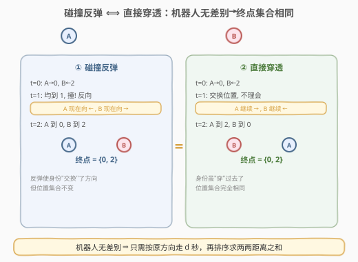
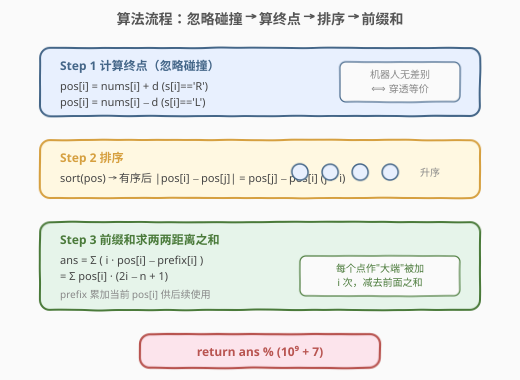
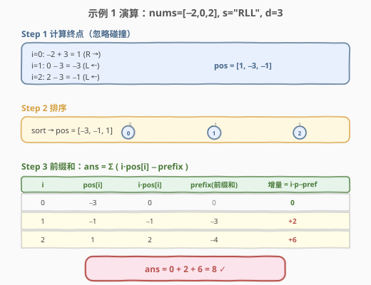

# LeetCode 移动机器人 题解

## 1. 题目概述

- **标题 / 题号**：移动机器人（#2731，medium）
- **链接**：https://leetcode.cn/problems/movement-of-robots/
- **难度**：中等
- **标签**：脑筋急转弯、数组、前缀和、排序

**题意**：有一些机器人分布在一条无限长的数轴上，初始坐标用一个下标从 **0** 开始的整数数组 `nums` 表示。每个机器人以每秒钟一单位的速度移动，方向由字符串 `s` 给出：`'L'` 表示往左（数轴负方向），`'R'` 表示往右（数轴正方向）。

当两个机器人相撞时，它们**立即**沿着原本相反的方向移动（即交换方向），过程不消耗时间。当两个机器人在同一时刻占据相同的位置时，就会相撞。

返回指令重复执行 `d` 秒后，所有机器人之间两两距离之和。由于答案可能很大，将答案对 $10^9 + 7$ 取余后返回。

**注意**：

- 坐标在 `i` 和 `j` 的两个机器人，$(i,j)$ 和 $(j,i)$ 视为相同的坐标对，机器人**无差别**。
- 相撞时立即改变方向，不消耗时间。
- 两机器人在同一时刻占据相同位置即相撞。

**示例 1**：

```text
输入：nums = [-2,0,2], s = "RLL", d = 3
输出：8
解释：
1 秒后，机器人位置为 [-1,-1,1]，下标 0 往左、下标 1 往右。
2 秒后，机器人位置为 [-2,0,0]，下标 1 往左、下标 2 往右。
3 秒后，机器人位置为 [-3,-1,1]。
距离：abs(-3-(-1))=2, abs(-3-1)=4, abs(-1-1)=2，总和 = 8。
```

**示例 2**：

```text
输入：nums = [1,0], s = "RL", d = 2
输出：5
解释：
1 秒后位置 [2,-1]，2 秒后位置 [3,-2]，距离 = abs(-2-3) = 5。
```

**约束**：

- $2 \le \text{nums.length} \le 10^5$
- $-2 \times 10^9 \le \text{nums}[i] \le 2 \times 10^9$
- $0 \le d \le 10^9$
- $\text{nums.length} = \text{s.length}$
- `s` 只包含 `'L'` 和 `'R'`
- `nums[i]` 互不相同

> 💡 本题核心是一个**经典脑筋急转弯**：机器人相撞反弹 ⟺ 穿透而过。因为机器人**无差别**，相撞交换方向等价于两个机器人"穿"过对方继续沿原方向前进——最终位置集合完全相同。因此只需忽略碰撞、各自走 `d` 秒算终点，再排序用**前缀和**求两两距离之和。

## 2. 解题思路

### 2.1 暴力思路：逐秒模拟

最直觉的写法是逐秒模拟：每秒所有机器人按各自方向走一步，检测是否有同位置机器人相撞（同位置则交换方向），重复 `d` 秒后计算两两距离之和。

这能给出正确结果，但有两个致命短板：(1) `d` 最大 $10^9$，逐秒模拟直接超时；(2) 即便只模拟相撞，最坏情况相撞次数也可能很多。题目数据规模（$n \le 10^5$、$d \le 10^9$）明确要求 $O(n \log n)$ 级别的解法，逐秒模拟不可行。

### 2.2 核心观察：相撞反弹 ⟺ 穿透而过



关键洞察是换一个视角看"相撞反弹"：因为机器人**无差别**（题目明确说明 $(i,j)$ 与 $(j,i)$ 视为相同坐标对），两个机器人相撞后交换方向，其效果与两个机器人**直接穿过对方**继续沿原方向前进**完全等价**。

以机器人 A 在位置 0 向右、B 在位置 2 向左、$d=2$ 为例：

| 场景 | t=0 | t=1 | t=2 | 终点集合 |
|------|-----|-----|-----|----------|
| **碰撞反弹** | A→0, B←2 | 均到 1，撞! 反向 | A 到 0, B 到 2 | $\{0, 2\}$ |
| **直接穿透** | A→0, B←2 | 交换位置，不理会 | A 到 2, B 到 0 | $\{0, 2\}$ |

两种场景终点集合完全相同！反弹只是让"身份"与方向发生了交换，但既然机器人无差别，谁是谁不重要——**位置集合不变**。

> 💡 这就是经典的"**蚂蚁过杆**"问题：$n$ 只蚂蚁在杆上相向而行，相撞后各自掉头，与它们互相穿过对方，在任意时刻杆上蚂蚁的**位置集合**完全一致。本题把蚂蚁换成了机器人，加了一个"求两两距离之和"的目标。

于是**第一步**只需忽略所有碰撞，让每个机器人按原始方向走 $d$ 秒：

$$
\text{pos}[i] = \begin{cases} \text{nums}[i] + d & s[i] = \text{'R'} \\ \text{nums}[i] - d & s[i] = \text{'L'} \end{cases}
$$

### 2.3 算法流程图



三步走：

1. **算终点**：忽略碰撞，每个机器人按原方向走 $d$ 秒。
2. **排序**：将终点排序后，任意 $j > i$ 的 $|\text{pos}[j] - \text{pos}[i]| = \text{pos}[j] - \text{pos}[i]$（去绝对值）。
3. **前缀和求和**：对每个 $i$，它作为"大端"被加了 $i$ 次（与前面 $i$ 个点配对）、作为"小端"被减了 $n-1-i$ 次，净贡献为 $\text{pos}[i] \cdot (2i - n + 1)$。用前缀和避免双重循环：

$$
\text{ans} = \sum_{i=0}^{n-1} \bigl( i \cdot \text{pos}[i] - \text{prefix}_i \bigr), \quad \text{prefix}_i = \sum_{k=0}^{i-1} \text{pos}[k]
$$

> 💡 排序后去绝对值是关键：无序时 $|a-b|$ 需判断大小，$O(n^2)$ 配对无可避免；有序后 $j > i$ 必有 $\text{pos}[j] \ge \text{pos}[i]$，距离就是差值，前缀和能把每对代价降到 $O(1)$ 摊还。

### 2.4 示例演算



以**示例 1**（`nums = [-2,0,2]`, `s = "RLL"`, `d = 3`）为例：

**Step 1 算终点**（忽略碰撞）：

| i | nums[i] | s[i] | pos[i] |
|---|---------|------|--------|
| 0 | −2 | R | −2 + 3 = **1** |
| 1 | 0 | L | 0 − 3 = **−3** |
| 2 | 2 | L | 2 − 3 = **−1** |

**Step 2 排序**：`pos = [1, −3, −1]` → 排序 → `pos = [−3, −1, 1]`

**Step 3 前缀和**：逐行累加 `增量 = i·pos[i] − prefix`：

| i | pos[i] | i·pos[i] | prefix(前缀和) | 增量 |
|---|--------|----------|----------------|------|
| 0 | −3 | 0 | 0 | 0 |
| 1 | −1 | −1 | −3 | +2 |
| 2 | 1 | 2 | −4 | +6 |

$$\text{ans} = 0 + 2 + 6 = 8 \quad \checkmark$$

> 💡 第 1 行增量 $= 1 \times (-1) - (-3) = 2$，即点 1（值 −1）与点 0（值 −3）的距离 $|-1-(-3)| = 2$；第 2 行增量 $= 2 \times 1 - (-4) = 6$，即点 2（值 1）与前面两点的距离之和 $(1-(-3)) + (1-(-1)) = 4 + 2 = 6$。逐行增量恰好是"当前点与所有前序点距离之和"。

## 3. 参考代码

### C++

```cpp
class Solution {
public:
    int sumDistance(vector<int>& nums, string s, int d) {
        const int MOD = 1e9 + 7;
        int n = nums.size();
        vector<long long> pos(n);
        for (int i = 0; i < n; i++) {
            pos[i] = (long long)nums[i] + (s[i] == 'R' ? d : -d);
        }
        sort(pos.begin(), pos.end());
        long long ans = 0, prefix = 0;
        for (int i = 0; i < n; i++) {
            ans = ((ans + (long long)i * pos[i] - prefix) % MOD + MOD) % MOD;
            prefix += pos[i];
        }
        return (int)ans;
    }
};
```

> ⚠️ `nums[i]` 范围 $[-2 \times 10^9, 2 \times 10^9]$，加上 $d$（最大 $10^9$）后会超出 `int` 范围，必须先转 `long long` 再运算。`pos[i]` 可正可负，`(long long)i * pos[i] - prefix` 可能为负，C++ 负数取模仍为负，故每步 `(x % MOD + MOD) % MOD` 归正。

### Python

```python
class Solution:
    def sumDistance(self, nums: List[int], s: str, d: int) -> int:
        MOD = 10**9 + 7
        pos = sorted(nums[i] + (d if s[i] == 'R' else -d) for i in range(len(nums)))
        ans = 0
        prefix = 0
        for i, p in enumerate(pos):
            ans = (ans + i * p - prefix) % MOD
            prefix += p
        return ans
```

> 💡 Python 大整数无溢出，`%` 对负数天然返回非负结果，无需额外归正。`sorted(...)` 内部等价 Schwartzian 变换，只算一次键。

## 4. 复杂度分析

| 维度 | 复杂度 | 说明 |
|------|--------|------|
| 时间复杂度 | $O(n \log n)$ | 排序 $O(n \log n)$ 为主项；算终点 $O(n)$、前缀和遍历 $O(n)$ |
| 空间复杂度 | $O(n)$ | 存 `pos` 数组；前缀和只用一个滚动变量 |

> 💡 排序是瓶颈，$n = 10^5$ 时 $\log n \approx 17$，总比较约 $1.7 \times 10^6$ 次。逐秒模拟则是 $O(n \cdot d)$，$d = 10^9$ 时完全不可行——这正是"穿透等价"这个脑筋急转弯的价值：把 $O(nd)$ 降到 $O(n \log n)$。

## 5. 扩展：前缀和求两两距离之和的公式推导

排序后，所有 $j > i$ 满足 $\text{pos}[j] \ge \text{pos}[i]$，距离 $|\text{pos}[j] - \text{pos}[i]| = \text{pos}[j] - \text{pos}[i]$。所求：

$$
S = \sum_{0 \le i < j \le n-1} (\text{pos}[j] - \text{pos}[i])
$$

**方法一（前缀和）**：固定 $j$ 为"大端"，它减去前面所有较小的点：

$$
S = \sum_{j=1}^{n-1} \bigl( j \cdot \text{pos}[j] - \sum_{i=0}^{j-1} \text{pos}[i] \bigr) = \sum_{j=1}^{n-1} \bigl( j \cdot \text{pos}[j] - \text{prefix}_j \bigr)
$$

其中 $\text{prefix}_j = \sum_{i=0}^{j-1} \text{pos}[i]$，用滚动变量 $O(1)$ 维护。

**方法二（系数法）**：每个 $\text{pos}[i]$ 作为"大端"被加 $i$ 次、作为"小端"被减 $n-1-i$ 次，净系数 $i - (n-1-i) = 2i - n + 1$：

$$
S = \sum_{i=0}^{n-1} \text{pos}[i] \cdot (2i - n + 1)
$$

两种方法等价（交换求和顺序即可互推）。前缀和写法在循环里更自然、不易错；系数法一步到位、代码更短，但需注意正负号。本题采用前缀和写法。

> ⚠️ 当 $\text{pos}[i]$ 有负值时（本题常见，终点可在数轴负侧），两种公式仍然成立——排序保证的是相对大小关系，差值 $|\text{pos}[j] - \text{pos}[i]|$ 仍等于 $\text{pos}[j] - \text{pos}[i]$（$j > i$）。关键是取模时处理负数。

## 6. 面试要点

1. **为什么相撞反弹等价于穿透？**

   > 机器人**无差别**（题目明示 $(i,j)$ 与 $(j,i)$ 相同）。相撞后交换方向，等价于两个机器人穿过对方继续沿原方向走——位置集合不变，只是"身份"与方向对调。既然不关心谁是谁，终点集合完全一致。

2. **为什么要排序？前缀和省在哪里？**

   > 无序时求 $\sum |a_i - a_j|$ 是 $O(n^2)$。排序后 $j > i$ 必有 $\text{pos}[j] \ge \text{pos}[i]$，绝对值变成差值，每个点作为"大端"只需减去前缀和（前面所有点之和）一次，$O(1)$ 摊还，总计 $O(n)$。排序 $O(n \log n)$ 成为主项。

3. **终点位置可能为负吗？取模怎么处理？**

   > 可能。`nums[i]` 最小 $-2 \times 10^9$，往左走 $d$ 后可达 $-3 \times 10^9$。C++ 中负数 `%` 正数仍为负，需 `(x % MOD + MOD) % MOD` 归正；Python 的 `%` 天然非负。同时 `nums[i] + d` 可能溢出 `int`，C++ 须先转 `long long`。

4. **答案最大多大？为什么必须取模？**

   > 配对数 $\binom{n}{2} \approx 5 \times 10^9$，每对距离最大 $6 \times 10^9$，乘积约 $3 \times 10^{19}$，超出 64 位整数上界（$9.2 \times 10^{18}$）。故必须**逐项取模**，不能累加完再取。Python 大整数虽不溢出，取模仍能控制数值规模、加速运算。

5. **如果机器人有差别（带编号），还能用穿透等价吗？**

   > 不能直接用。有编号时相撞反弹会让"编号与位置"的对应关系改变，终点集合虽相同但编号错位，题目若问"第 $i$ 号机器人的位置"则需模拟。本题问的是"两两距离之和"（只依赖位置集合），故等价成立。

> 💡 **一句话总结**：2731 = 「相撞反弹 ⟺ 穿透（机器人无差别）+ 排序去绝对值 + 前缀和求两两距离之和」。脑筋急转弯把 $O(nd)$ 模拟降到 $O(n \log n)$，前缀和把 $O(n^2)$ 配对降到 $O(n)$ 遍历。

## 同类练习题

| # | 题目 | 与本题的关联 |
|---|------|-------------|
| 1503 | [所有蚂蚁掉下来前的最后一刻](https://leetcode.cn/problems/last-moment-before-all-ants-fall-out-of-a-plank/) | 经典"蚂蚁过杆"问题，同样利用"相撞反弹 ⟺ 穿透"等价，求最后一只蚂蚁掉落时刻 |
| 2602 | [使数组元素全部相等的最少操作次数](https://leetcode.cn/problems/minimum-operations-to-make-all-array-elements-equal/) | 排序 + 前缀和求"每个目标值下所有点到目标的距离之和"，与本题的前缀和求两两距离技术同构 |
| 462 | [最小操作次数使数组元素相等 II](https://leetcode.cn/problems/minimum-moves-to-equal-array-elements-ii/) | 排序后取中位数最小化距离之和，同样是"排序 + 距离和"家族，对照"求和"与"求最小"两种目标 |
| 1551 | [使数组中所有元素相等的最小操作数](https://leetcode.cn/problems/minimum-operations-to-make-array-equal/) | 等差数列取中位数的最少操作数数学公式版，巩固"距离之和在中位数处取极值"的结论 |
