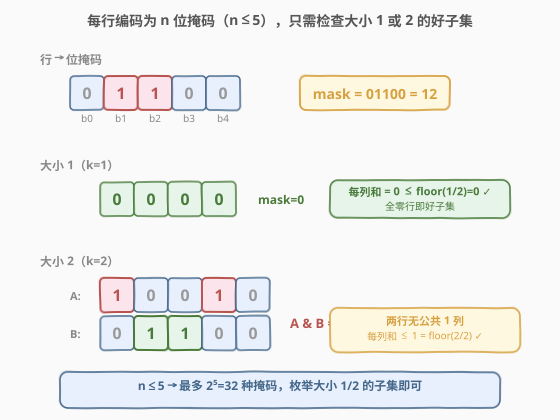
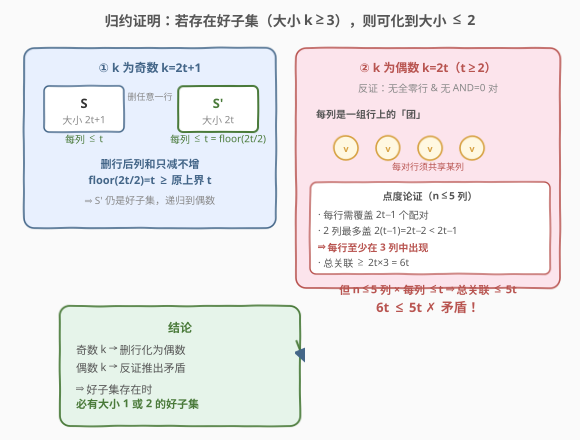
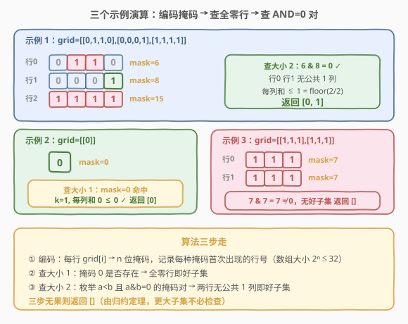

# LeetCode 找到矩阵中的好子集 题解

## 1. 题目概述

- **标题 / 题号**：找到矩阵中的好子集（#2732，hard）
- **链接**：https://leetcode.cn/problems/find-a-good-subset-of-the-matrix/
- **难度**：困难
- **标签**：位运算、数组、哈希表、矩阵

**题意**：给你一个下标从 **0** 开始大小为 $m \times n$ 的二进制矩阵 `grid`。从原矩阵中选出若干行构成一个行的**非空**子集，如果子集中**任何一列**的和至多为子集大小的一半，那么称这个子集是**好子集**。更正式地，若选出的行子集大小（行数）为 $k$，则每一列的和至多为 $\lfloor k/2 \rfloor$。

请你返回一个整数数组，包含好子集的行下标，**升序**返回。若有多个好子集可返回任意一个；若无好子集返回空数组。

**示例 1**：

```text
输入：grid = [[0,1,1,0],[0,0,0,1],[1,1,1,1]]
输出：[0,1]
解释：选第 0、1 行，子集大小 k=2，floor(2/2)=1。
  第 0 列和 = 0+0 = 0 ≤ 1
  第 1 列和 = 1+0 = 1 ≤ 1
  第 2 列和 = 1+0 = 1 ≤ 1
  第 3 列和 = 0+1 = 1 ≤ 1
```

**示例 2**：

```text
输入：grid = [[0]]
输出：[0]
解释：选第 0 行，子集大小 k=1，floor(1/2)=0，第 0 列和 = 0 ≤ 0。
```

**示例 3**：

```text
输入：grid = [[1,1,1],[1,1,1]]
输出：[]
解释：无法得到好子集。
```

**约束**：

- $m = \text{grid.length}$
- $n = \text{grid[i].length}$
- $1 \le m \le 10^4$
- $1 \le n \le 5$
- $\text{grid[i][j]}$ 为 $0$ 或 $1$

> ⚠️ **关键信号**：$n \le 5$ 是本题的「题眼」。每行只有至多 5 个 0/1，可压缩为一个 $n$ 位掩码（值域 $0 \sim 2^n-1 \le 31$），全矩阵至多 32 种不同行模式。把「在 $m \le 10^4$ 行里选子集」直接降维成「在 $\le 32$ 种掩码里选」，这是后续一切优化的前提。

## 2. 解题思路

### 2.1 暴力思路

最朴素的做法：枚举所有行的非空子集（共 $2^m - 1$ 个），对每个子集检查每列和是否 $\le \lfloor k/2 \rfloor$。$m = 10^4$ 时 $2^m$ 是天文数字，完全不可行。

瓶颈在于：没有利用 $n \le 5$ 这一极小列数约束——行数虽多，但**行的种类极少**（至多 32 种掩码）。若能证明「好子集存在 $\Leftrightarrow$ 存在大小为 1 或 2 的好子集」，则只需在 32 种掩码里检查 $O(2^n)$ 级别的组合，规模骤降。

### 2.2 核心观察：行编码为位掩码，只需检查大小 1 或 2 的子集



将每行 `grid[i]` 编码为一个 $n$ 位整数掩码：第 $j$ 位为 `grid[i][j]`。由于 $n \le 5$，掩码取值仅 $0 \sim 2^n - 1$（至多 32 种）。用数组 `firstIdx[mask]` 记录每种掩码**首次出现的行号**。

**大小 1 的好子集**：$k = 1$，$\lfloor 1/2 \rfloor = 0$，要求每列和 $\le 0$，即选出的行**全为 0**（掩码 $= 0$）。只需检查 `firstIdx[0]` 是否存在。

**大小 2 的好子集**：$k = 2$，$\lfloor 2/2 \rfloor = 1$，要求每列和 $\le 1$，即两行在任意列不能**同时为 1**，等价于 $\text{mask}_a \mathbin{\&} \text{mask}_b = 0$。只需枚举所有掩码对 $(a, b)$，$a < b$，检查 $a \mathbin{\&} b = 0$ 且两者都出现过。

> 💡 「两行无公共 1 列」$\Leftrightarrow$ $a \mathbin{\&} b = 0$，是把列和约束 $\le 1$ 精确翻译成位运算的关键。位与为 0 意味着两行的 1 完全分布在不同列上，叠加后每列至多一个 1。

#### 2.2.1 归约定理：好子集存在则必有大小 1 或 2 的

题目提示「可证明好子集存在时必有大小 1 或 2 的」。下面给出完整证明，这是只检查这两种大小的理论依据。



设 $S$ 是大小为 $k$ 的好子集，每列和 $\le \lfloor k/2 \rfloor$。

- **$k = 1$**：每列和 $\le 0$，行全零（掩码 $= 0$）。
- **$k = 2$**：每列和 $\le 1$，两行掩码位与为 0。
- **$k$ 为奇数 $k = 2t+1$（$t \ge 1$）**：$\lfloor k/2 \rfloor = t$，每列和 $\le t$。**删掉任意一行**得到 $S'$，大小 $2t$，每列和只减不增仍 $\le t = \lfloor 2t/2 \rfloor$，故 $S'$ 仍是好子集。归约到偶数情形。
- **$k$ 为偶数 $k = 2t$（$t \ge 2$）**：$\lfloor k/2 \rfloor = t$，每列和 $\le t$。**反证**：假设 $S$ 中既无全零行、又无位与为 0 的行对（即每对行至少共享一个「同为 1」的列）。

  把每个列 $c$ 看作覆盖「该列为 1 的行」的团，设该列有 $s_c \le t$ 个 1。这 $\le n \le 5$ 个团必须覆盖全部 $\binom{2t}{2}$ 个行对。

  考察任意一行 $v$：它与 $2t-1$ 行配对，都需被某列覆盖。$v$ 所在的一个列最多覆盖 $s_c - 1 \le t - 1$ 个配对。**两个列最多覆盖 $2(t-1) = 2t-2 < 2t-1$ 个配对**，不够！所以 $v$ 必须出现在**至少 3 个列**中。

  对所有 $2t$ 行求和：行-列关联总数 $\ge 2t \times 3 = 6t$。但关联总数 $= \sum_c s_c \le n \cdot t \le 5t$（$n \le 5$ 列、每列 $\le t$）。于是 $6t \le 5t$，对 $t \ge 1$ 矛盾！✗

  故假设不成立：$S$ 中必有全零行或位与为 0 的行对，即存在大小 1 或 2 的好子集。

> 💡 证明的精髓在偶数情形的「点度论证」：每个行（点）需要覆盖 $2t-1$ 个配对，两列不够必须 $\ge 3$ 列，于是 $2t$ 个点共需 $\ge 6t$ 次列关联，而 $n \le 5$ 列×每列 $\le t$ 个 1 只能提供 $\le 5t$ 次，$6t > 5t$ 直接矛盾。这把「$n \le 5$」用到了极致——正是列数极小才让总关联数不够。

### 2.3 算法流程图

算法分三步：编码掩码 → 查大小 1（全零行）→ 查大小 2（位与为 0 的掩码对）。



### 2.4 示例演算

**示例 1**：`grid = [[0,1,1,0],[0,0,0,1],[1,1,1,1]]`，$n = 4$。

| 行 | 内容 | 掩码（b0..b3） | 首次行号 |
|----|------|----------------|----------|
| 0 | 0,1,1,0 | $0110_2 = 6$ | `firstIdx[6]=0` |
| 1 | 0,0,0,1 | $1000_2 = 8$ | `firstIdx[8]=1` |
| 2 | 1,1,1,1 | $1111_2 = 15$ | `firstIdx[15]=2` |

- 查大小 1：`firstIdx[0]` 不存在。
- 查大小 2：$6 \mathbin{\&} 8 = 0110_2 \mathbin{\&} 1000_2 = 0$ ✓。返回 $[\min(0,1), \max(0,1)] = [0,1]$。

**示例 2**：`grid = [[0]]`，$n = 1$。行 0 掩码 $= 0$。查大小 1：`firstIdx[0] = 0` 命中，返回 $[0]$。

**示例 3**：`grid = [[1,1,1],[1,1,1]]`，$n = 3$。两行掩码均为 $111_2 = 7$，`firstIdx[7] = 0`。查大小 1 无果；查大小 2：唯一出现过的掩码 $7$，$7 \mathbin{\&} 7 = 7 \ne 0$，无好对。返回 $[]$。

> ⚠️ 注意大小 2 只需检查**不同掩码**之间的配对：相同非零掩码 $a \mathbin{\&} a = a \ne 0$，必非好对；而 $a = 0$ 已在大小 1 处理。故枚举 $a < b$ 即可。

## 3. 参考代码

### C++

```cpp
class Solution {
public:
    vector<int> goodSubsetofBinaryMatrix(vector<vector<int>>& grid) {
        int m = grid.size(), n = grid[0].size();
        vector<int> firstIdx(1 << n, -1);          // firstIdx[mask] = 首次出现的行号
        for (int i = 0; i < m; i++) {
            int mask = 0;
            for (int j = 0; j < n; j++)
                if (grid[i][j]) mask |= 1 << j;     // 第 j 位 = 第 j 列
            if (firstIdx[mask] == -1) firstIdx[mask] = i;
        }
        // 大小 1：全零行
        if (firstIdx[0] != -1) return {firstIdx[0]};
        // 大小 2：枚举 a < b 且 a & b == 0 的掩码对
        int full = 1 << n;
        for (int a = 1; a < full; a++) {
            if (firstIdx[a] == -1) continue;
            for (int b = a + 1; b < full; b++) {
                if (firstIdx[b] == -1) continue;
                if ((a & b) == 0) {
                    int i = firstIdx[a], j = firstIdx[b];
                    return {min(i, j), max(i, j)};
                }
            }
        }
        return {};
    }
};
```

### Python

```python
class Solution:
    def goodSubsetofBinaryMatrix(self, grid: List[List[int]]) -> List[int]:
        m, n = len(grid), len(grid[0])
        first_idx = [-1] * (1 << n)              # first_idx[mask] = 首次出现的行号
        for i, row in enumerate(grid):
            mask = 0
            for j, v in enumerate(row):
                if v:
                    mask |= 1 << j               # 第 j 位 = 第 j 列
            if first_idx[mask] == -1:
                first_idx[mask] = i
        # 大小 1：全零行
        if first_idx[0] != -1:
            return [first_idx[0]]
        # 大小 2：枚举 a < b 且 a & b == 0 的掩码对
        full = 1 << n
        for a in range(1, full):
            if first_idx[a] == -1:
                continue
            for b in range(a + 1, full):
                if first_idx[b] == -1:
                    continue
                if (a & b) == 0:
                    i, j = first_idx[a], first_idx[b]
                    return [i, j] if i < j else [j, i]
        return []
```

> 💡 用定长数组 `firstIdx`（大小 $2^n \le 32$）而非哈希表，既免去哈希开销，又让「枚举 $a < b$」天然有序、避免重复。`firstIdx[mask] == -1` 兼作「掩码未出现」的哨兵，只需一轮扫描即可建表。

## 4. 复杂度分析

| 维度 | 复杂度 | 说明 |
|------|--------|------|
| 时间复杂度 | $O(mn + 4^n)$ | 扫描 $m$ 行编码掩码 $O(mn)$；枚举掩码对 $O\!\left(\binom{2^n}{2}\right) = O(4^n)$。$n \le 5$ 时 $4^5 = 1024$，可忽略，整体 $O(mn)$ |
| 空间复杂度 | $O(2^n)$ | `firstIdx` 数组大小 $2^n \le 32$ |

> 💡 若不归约、直接枚举子集是 $O(2^m)$ 不可行；归约后只查大小 1/2，规模从 $2^{10^4}$ 降到 $\binom{32}{2} = 496$，这是「小值域位编码 + 归约定理」的双重红利。

## 5. 扩展：归约思想与点度论证

本题的证明有两层值得提炼的技巧：

**第一层——奇偶归约**。面对「子集大小 $k$ 任意」的搜索空间，先证明「$k$ 大时可缩小」：奇数删一行变偶数（列和只减不增，下取整阈值不降）；偶数再单独处理。这种「把一般 $k$ 归约到 $k \le 2$」的手法，在组合优化里很常见（如「若最优解存在则存在小规模最优解」）。

**第二层——点度计数导出矛盾**。偶数情形的核心是「假设所有行对都被某列覆盖」后，用**总关联数**的两端夹逼：下界来自「每行需 $\ge 3$ 列」（$6t$），上界来自「$\le 5$ 列 × 每列 $\le t$」（$5t$），$6t > 5t$ 矛盾。这类「按点求度、两端计数」的论证是图论覆盖问题的经典武器（类似 Kolmós 界、二分图度数论证）。

> ⚠️ 该证明**强依赖 $n \le 5$**：若列数更大，上界 $n \cdot t$ 可能 $\ge 6t$，矛盾不再成立，大小 1/2 的结论也会失效。数据范围与算法/证明是绑定的——这正是本题把 $n$ 压到 5 的设计意图。

## 6. 面试要点

1. **为什么 $n \le 5$ 是关键，而不是 $m \le 10^4$？**

   > 行数 $m$ 大但行**种类**少：$n \le 5$ 意味着每行是 5 位掩码，至多 32 种。把「选行子集」降为「选掩码」，搜索空间从 $2^m$ 缩到 $\binom{32}{2}$。面试中看到某一维 $\le 20$（尤其 $\le 5$）应本能想到位编码/状压。

2. **如何想到「只需查大小 1 或 2」？**

   > 题面 hints 直接给了。但即便没有，也可从「列和约束 $\le \lfloor k/2 \rfloor$ 随 $k$ 增长而放宽」猜到「小 $k$ 更难满足、大 $k$ 更宽松」，进而反推「若大 $k$ 能满足，小 $k$ 大概率也能」。再用归约证明补全严格性。

3. **大小 2 为什么检查 $a \mathbin{\&} b = 0$ 而不是逐列求和？**

   > $a \mathbin{\&} b = 0$ 等价于「两行在任一列不同时为 1」，即叠加后每列和 $\le 1 = \lfloor 2/2 \rfloor$。位运算把 $n$ 次列比较压成一次按位与，常数极小且语义清晰。

4. **偶数情形的「每行至少在 3 列」是怎么来的？**

   > 一行要和 $2t-1$ 行配对全被覆盖；它所在的每个列覆盖 $\le t-1$ 个配对；两列最多 $2(t-1) = 2t-2 < 2t-1$，不够，故需 $\ge 3$ 列。关键是用「两列不够」逼出下界 3。

5. **若 $n$ 放大到 20，算法还成立吗？**

   > 归约定理依赖 $n \le 5$（点度论证的上界 $5t$ 来自 5 列）。$n=20$ 时上界 $20t \ge 6t$，矛盾不成立，大小 1/2 不再充分，需要别的思路。但掩码枚举 $4^{20}$ 也已爆炸。这说明本题是「小 $n$」特化题，不要盲目推广。

> 💡 **一句话总结**：2732 = $n \le 5$ → 行编 5 位掩码 + 归约证明「好子集存在 $\Rightarrow$ 存在大小 1/2」→ 查全零行（大小 1）+ 查位与为 0 的掩码对（大小 2），$O(mn + 4^n)$。

## 同类练习题

| # | 题目 | 与本题的关联 |
|---|------|-------------|
| 187 | [重复的 DNA 序列](https://leetcode.cn/problems/repeated-dna-sequences/)（[站内题解](../0101-0200/187_重复的DNA序列.md)） | 4 碱基用 2 bit 编码、10-mer 压成 20 位整数做滚动哈希，与本题「行 → $n$ 位掩码」同构，都是「小字符集 → 位编码」 |
| 526 | [优美的排列](https://leetcode.cn/problems/beautiful-arrangement/)（[站内题解](../0501-0600/526_优美的排列.md)） | $n \le 15$ 的状压 DP，同样利用「小值域 → 位编码 → 枚举 $2^n$ 个状态」，对比「计数」与「判定」两种用法 |
| 1 | [两数之和](https://leetcode.cn/problems/two-sum/)（[站内题解](../0001-0100/1_两数之和.md)） | 哈希表一次遍历找满足条件的配对，是本题「枚举掩码对查 $a \mathbin{\&} b = 0$」的母题级关联 |
| 454 | [四数相加 II](https://leetcode.cn/problems/4sum-ii/)（[站内题解](../0401-0500/454_四数相加%20II.md)） | 分组 + 哈希找满足等式的配对（meet-in-the-middle），与本题「把 4 个数组降成两组哈希配对」思路一致 |
| 753 | [破解保险箱](https://leetcode.cn/problems/cracking-the-safe/)（[站内题解](../0701-0800/753_破解保险箱.md)） | $n-1$ 位串作图节点、$n$ 位密码作边，位串编码思想，同样依赖「小值域 → 位表示」 |
