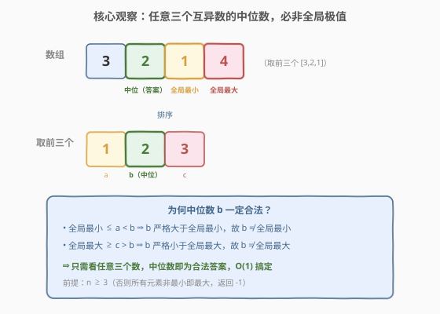
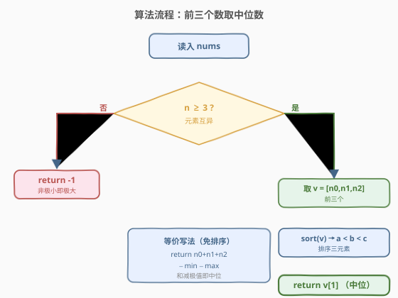
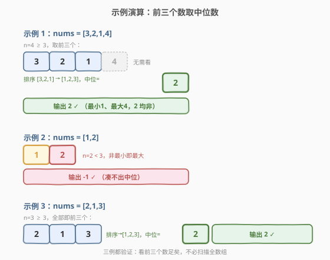

# 既不是最小值也不是最大值

- **题目名称**：既不是最小值也不是最大值
- **链接**：[2733. 既不是最小值也不是最大值](https://leetcode.cn/problems/neither-minimum-nor-maximum/)
- **难度**：简单
- **标签**：数组、排序

## 1. 题目概述

给你一个整数数组 `nums`，数组由**互不相同的正整数**组成。请你找出并返回数组中**任意一个**既不是**最小值**也不是**最大值**的数字；如果不存在这样的数字，返回 **`-1`**。

**示例 1**：

```text
输入：nums = [3,2,1,4]
输出：2
解释：最小值是 1，最大值是 4。因此 2 或 3 都是有效答案。
```

**示例 2**：

```text
输入：nums = [1,2]
输出：-1
解释：不存在既不是最大值也不是最小值的数字，返回 -1。
```

**示例 3**：

```text
输入：nums = [2,1,3]
输出：2
解释：2 既不是最小值也不是最大值，本例唯一有效答案。
```

**约束条件**：

- $1 \le \text{nums.length} \le 100$
- $1 \le \text{nums[i]} \le 100$
- `nums` 中的所有数字**互不相同**

> 💡 关键前提是「**元素互异**」——它保证任意三个数必然有严格的大小序，中位数概念才成立。若允许重复，前三个数可能出现 `[1,1,2]`，此时排序中位 `1` 仍可能是全局最小值，思路需退化到「找全局 min/max 再扫描」。

---

## 2. 解题思路

### 2.1 暴力思路：找全局极值再扫描

最直觉的写法：先一轮扫描求出全局最小 `mn` 与全局最大 `mx`，再一轮扫描返回第一个满足 $x \neq mn$ 且 $x \neq mx$ 的元素；找不到返回 `-1`。

```python
mn, mx = min(nums), max(nums)
for x in nums:
    if x != mn and x != mx:
        return x
return -1
```

时间 $O(n)$、空间 $O(1)$，对 $n \le 100$ 绰绰有余。但它**必须看完全数组**才能确定极值——其实「互异 + 至少 3 个元素」这个条件，已经隐含了一个更强的事实：根本不必扫全数组，**任意三个数的中位数就一定是合法答案**。

### 2.2 核心观察：任意三个数的中位数必非全局极值



设从数组中任取三个互异数，排序后为 $a < b < c$，则 $b$ 是这三个数的中位数。由于全局最小值是**整个数组**的最小，而 $a$ 只是其中之一，故：

$$\text{全局最小} \le a < b \quad\Rightarrow\quad b > \text{全局最小} \quad\Rightarrow\quad b \neq \text{全局最小}$$

对称地：

$$\text{全局最大} \ge c > b \quad\Rightarrow\quad b < \text{全局最大} \quad\Rightarrow\quad b \neq \text{全局最大}$$

所以**中位数 $b$ 既不是全局最小也不是全局最大**，必为合法答案。换句话说，只要 $n \ge 3$，看**任意三个数**（比如前三个）排序取中位即可，完全不用管数组剩下的部分。

> ⚠️ 前提是 $n \ge 3$：当 $n \le 2$ 时，每个元素非最小即最大，凑不出「中位」，故返回 `-1`。这正是示例 2 返回 `-1` 的根本原因——不是「碰巧没有」，而是「元素不足三个，结构上不可能有」。

### 2.3 算法流程图



逻辑非常短：判 $n \ge 3$ → 取前三个 → 排序 → 返回中位。还可用「和减极值」免排序：$b = a+b+c - \min - \max$（三个数的和去掉最小与最大，剩的就是中位数）。

### 2.4 示例演算



**示例 1：`nums = [3,2,1,4]`**

$n=4 \ge 3$，取前三个 $[3,2,1]$，排序得 $[1,2,3]$，中位 $=2$。全局最小 $1$、最大 $4$，$2$ 介于其间 $\Rightarrow$ 返回 $2$ $\checkmark$。第 4 个数 $4$ 根本没参与判断。

**示例 2：`nums = [1,2]`**

$n=2 < 3$，凑不出中位数，每个元素非最小即最大 $\Rightarrow$ 返回 $-1$ $\checkmark$。

**示例 3：`nums = [2,1,3]`**

$n=3 \ge 3$，前三个即全部 $[2,1,3]$，排序得 $[1,2,3]$，中位 $=2$ $\Rightarrow$ 返回 $2$ $\checkmark$。

> 💡 注意示例 1 的全局最大是 $4$（在第 4 位），但算法只看前三个就能给出正确答案——这正是「中位数 $b$ 严格大于全局最小、严格小于全局最大」论证的力量：无论剩余元素如何极端，都不会让中位数变成极值。

---

## 3. 参考代码

### C++

```cpp
class Solution {
public:
    int findNonMinOrMax(vector<int>& nums) {
        if (nums.size() < 3) return -1;
        // 取前三个，排序后返回中位
        vector<int> v = {nums[0], nums[1], nums[2]};
        sort(v.begin(), v.end());
        return v[1];
    }
};
```

等价的「和减极值」免排序写法（同样 $O(1)$）：

```cpp
class Solution {
public:
    int findNonMinOrMax(vector<int>& nums) {
        if (nums.size() < 3) return -1;
        int a = nums[0], b = nums[1], c = nums[2];
        return a + b + c - min({a, b, c}) - max({a, b, c});
    }
};
```

### Python

```python
class Solution:
    def findNonMinOrMax(self, nums: List[int]) -> int:
        if len(nums) < 3:
            return -1
        return sorted(nums[:3])[1]
```

> 💡 若坚持「找极值再扫描」的暴力版，Python 一行 `return next((x for x in nums if x != (mn := min(nums)) and x != (mx := max(nums))), -1)` 也可，但需 $O(n)$ 扫描全数组。本题的精髓正是发现**互异 + $n\ge3$ 时前三个数的中位已足够**，把 $O(n)$ 降到 $O(1)$。

---

## 4. 复杂度分析

| 维度 | 复杂度 | 说明 |
|------|--------|------|
| 时间复杂度 | $O(1)$ | 只取前三个元素，排序/比较均为常数操作，与 $n$ 无关 |
| 空间复杂度 | $O(1)$ | 仅维护三个标量，无额外数据结构 |

> 💡 与暴力法（$O(n)$）对比：本题 $n \le 100$，实测无差异，但思路本质不同——暴力法必须看完所有数才能确定极值；中位数法只看三个数，靠的是「互异」前提提供的结构性保证。当 $n$ 极大（如 $10^7$）时，$O(1)$ 的优势才真正显现。

---

## 5. 扩展：如果元素允许重复

题目保证互异，中位数法才成立。若**允许重复**（如 `nums = [1,1,2]`），前三个排序为 $[1,1,2]$，中位 $1$ 恰是全局最小，思路失效。此时退化到两阶段扫描：

1. 一轮求 `mn = min(nums)`、`mx = max(nums)`（$O(n)$）；
2. 一轮找首个 $x$ 满足 $mn < x < mx$（严格介于，等号不算），找不到返回 `-1`。

注意要 $\text{cnt}(\text{出现}\neq mn \text{且}\neq mx) \ge 1$，即数组中至少存在 3 个「值域不同」的值。若全数组只有 1 或 2 种不同值，则无解。这承接了「**互异**」前提为何被写进约束——它把「至少 3 种值」直接转化为「至少 3 个元素」，让中位数法可用。

---

## 6. 面试要点

1. **为什么只看前三个数就够？**

   > 互异前提下，任取三个数 $a<b<c$，中位 $b$ 严格大于 $a\ge$ 全局最小、严格小于 $c\le$ 全局最大，故 $b$ 既非全局最小也非全局最大。全局极值无论多极端，都不会让局部中位变成极值。

2. **$n \ge 3$ 的判断可以省掉吗？**

   > 不能。$n \le 2$ 时数组只有 1~2 个元素，每个非最小即最大，不存在「第三个」取中位。省掉会越界访问 `nums[2]`，且逻辑上也不会有合法答案。

3. **「互异」条件若不成立会怎样？**

   > 前三个可能出现重复，排序后中位可能与最小/最大重合（如 `[1,1,2]` 中位 `1` 仍是全局最小），论证失效。需退化为「求全局极值再严格扫描」。

4. **「和减极值」和「排序取中位」哪个更好？**

   > 都 $O(1)$。排序三个数写法更直观易懂；和减极值省一次排序、更「数学」，但可读性略低。面试看个人偏好，关键是讲清「三个数的中位数」这个洞察。

5. **这题和「求第 k 小/大」是一类吗？**

   > 形似神不同。求第 $k$ 小需在全数组上定序（快选 $O(n)$ 或堆 $O(n\log k)$）；本题要的只是「非两个端点的任意一个」，靠互异前提退化成「三个数的中位」，无需全数组排序。本题是 $k=2$（去掉最小最大两端）且答案任取其一的特例。

---

## 7. 同类练习题

- [2706. 购买两块巧克力](https://leetcode.cn/problems/buy-two-chocolates/)（[题解](../2701-2800/2706_购买两块巧克力.md)）：一次扫描维护两个最小值。与本题「看前三个取中位」同属「常数个极值」的线性/常数操作，可对比 $O(n)$ 与 $O(1)$ 的取舍
- [414. 第三大的数](https://leetcode.cn/problems/third-maximum-number/)：一次扫描维护前 3 个不同最大值。本题是「去两端取中位」的 $k=3$ 特例，414 是「留前 3 大」且需去重，可对比常数极值模板的变体
- [215. 数组中的第K个最大元素](https://leetcode.cn/problems/kth-largest-element-in-an-array/)：求第 $k$ 大需在全数组定序。本题 $k$ 为常数且答案任取其一，靠互异前提跳过定序，可对比「常数 $k$」与「一般 $k$」的复杂度分水岭
- [1365. 有多少小于当前数字的数字](https://leetcode.cn/problems/how-many-numbers-are-smaller-than-the-current-number/)：对每个数统计比它小的个数。与本题「判断某数是否介于两端」都依赖相对大小关系，可对比「全局比较」与「局部三数比较」的思路
- [2656. K 个元素的最大和](https://leetcode.cn/problems/maximum-sum-with-exactly-k-elements/)：从数组选 $k$ 个使和最大。与本题「三个数取中位」对称——一个取最大端、一个取非端点中位，可对比取极值与取中位的不同贪心
