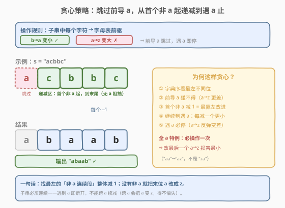
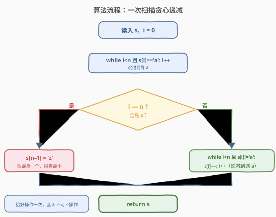
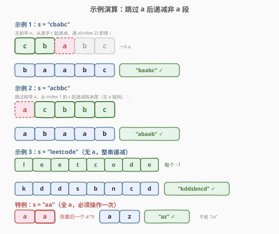

# LeetCode 执行子串操作后的字典序最小字符串 题解

## 1. 题目概述

- **标题 / 题号**：执行子串操作后的字典序最小字符串（#2734，medium）
- **链接**：https://leetcode.cn/problems/lexicographically-smallest-string-after-substring-operation/
- **难度**：中等
- **标签**：贪心、字符串

**题意**：给你一个仅由小写英文字母组成的字符串 `s`。在**一步操作**中，你可以完成以下行为：

- 选择 `s` 的**任一非空子串**（可以是整个字符串），将子串中的**每一个字符**替换为英文字母表中的**前一个**字符。例如 `'b'` 用 `'a'` 替换，`'a'` 用 `'z'` 替换。

返回执行上述操作**恰好一次**后可以获得的**字典序最小**的字符串。

> 💡 关键点：`'a'` 的前驱不是更小的字母，而是**绕回到 `'z'`**——这会让字符**变大**。因此 `'a'` 是"碰不得"的，贪心的核心矛盾正在于此。

**示例 1**：

```text
输入：s = "cbabc"
输出："baabc"
解释：选择下标 0 到 1 的子串 "cb" 执行操作，'c'→'b'、'b'→'a'，得到 "baabc"。
```

**示例 2**：

```text
输入：s = "acbbc"
输出："abaab"
解释：选择下标 1 到 4 的子串 "cbbc" 执行操作，'c'→'b'、'b'→'a'、'b'→'a'、'c'→'b'，得到 "abaab"。
```

**示例 3**：

```text
输入：s = "leetcode"
输出："kddsbncd"
解释：选择整个字符串执行操作，每个字符各减 1。
```

**约束**：

- $1 \le \text{s.length} \le 3 \times 10^5$
- `s` 仅由小写英文字母组成

## 2. 解题思路

### 2.1 暴力思路：枚举所有子串

最直觉的写法：枚举所有子串 $[l, r]$，对每个子串执行操作（每个字符减 1，`'a'` 变 `'z'`），取字典序最小者。子串数 $O(n^2)$，每次比较 $O(n)$，总计 $O(n^3)$，对 $n = 3 \times 10^5$ 完全不可行。

暴力想清楚后能提炼出一个事实：**操作的代价是非均匀的**——非 `'a'` 字符减 1 会**变小**（字典序更优），而 `'a'` 减 1 变 `'z'` 会**变大**（字典序更差）。于是问题归结为：找一个子串，让"变小的收益"最大化、"变大的损失"最小化。

### 2.2 核心观察：贪心——跳过前导 a，从首个非 a 递减到遇 a 止



字典序比较的规则是**从左到右找第一个不同字符**，谁小谁就小。因此要让结果最小，应让**最左的能变小的位置尽早变小**。基于操作代价的非均匀性，可得三条贪心决策：

1. **前导 `'a'` 跳过**：开头的 `'a'` 不能碰。若把 `'a'` 纳入操作子串，它会变 `'z'`，远比 `'a'` 大，字典序立刻变差。所以操作子串的起点必须在前导 `'a'` **之后**。

2. **从首个非 `'a'` 字符起开始递减**：这是最左的"能变小"的位置。从这里开始操作，能让结果在该位置变小一个台阶，是字典序上最靠左的改进；若从更晚的位置开始，这个位置不变，结果字典序更大。因此起点锁定为**首个非 `'a'` 字符**。

3. **遇到 `'a'` 立即停止**：从起点开始，每个非 `'a'` 字符减 1 都让字符串更小，应当继续。但一旦遇到 `'a'`，若纳入操作则 `'a'→'z'` 反弹变大，得不偿失，故**在 `'a'` 前截断**子串。

> ⚠️ 子串必须连续——遇到 `'a'` 即断开，**不能跨 `'a'` 续减**。例如 `"bca"`：从 `'b'` 起递减到 `'c'`（得 `"ab"`）后遇到 `'a'` 必须停，结果是 `"aba"`；若贪心续减跨过 `'a'`，会得到 `"abz"`（末位 `'a'→'z'`），反而更差。

**全 `'a'` 特例**：题目要求**恰好操作一次**，全 `'a'` 时不得不动。任意子串都是纯 `'a'`，操作后全变 `'z'`。要让损害最小，应选**最短的子串（长度 1）**且放在**最右**位置：改最后一个 `'a'` 为 `'z'`，使变差的位置尽量靠右（字典序靠右的差异影响更小）。例如 `"aa"` → `"az"`（不是 `"za"`）。

### 2.3 算法流程图



逻辑只有一次线性扫描：指针 `i` 跳过前导 `'a'`；若 `i == n`（全 `'a'`）则改末位为 `'z'`；否则从 `i` 起逐字符减 1，直到遇到 `'a'` 或到末尾。

### 2.4 示例演算



**示例 1：`s = "cbabc"`**

无前导 `'a'`，从首字 `'c'` 起递减：`'c'→'b'`、`'b'→'a'`，到 `index 2` 遇 `'a'` 停。后缀 `"bc"` 不动 $\Rightarrow$ `"baabc"` $\checkmark$。

**示例 2：`s = "acbbc"`**

跳过前导 `'a'`（`index 0`），从 `index 1` 的 `'c'` 起递减到末尾（无 `'a'` 阻挡）：`'c'→'b'`、`'b'→'a'`、`'b'→'a'`、`'c'→'b'` $\Rightarrow$ `"abaab"` $\checkmark$。

**示例 3：`s = "leetcode"`**

无前导 `'a'` 且整串无 `'a'`，整串递减：`'l'→'k'`、`'e'→'d'`、…$\Rightarrow$ `"kddsbncd"` $\checkmark$。

**特例：`s = "aa"`**

全 `'a'`，必须操作。改最后一个 `'a'→'z'` $\Rightarrow$ `"az"` $\checkmark$（若改第一个则得 `"za"`，字典序更大）。

> 💡 三条主线示例分别覆盖了"遇 `'a'` 截断"、"前导 `'a'` 跳过后递减到末尾"、"整串无 `'a'` 全减"三种情况，加上全 `'a'` 特例，构成完整的分支覆盖。

## 3. 参考代码

### C++

```cpp
class Solution {
public:
    string smallestString(string s) {
        int n = s.size(), i = 0;
        while (i < n && s[i] == 'a') i++;      // 跳过前导 a
        if (i == n) s[n - 1] = 'z';             // 全 a：改末位
        else {
            while (i < n && s[i] != 'a') {      // 从首个非 a 递减到遇 a
                s[i]--;
                i++;
            }
        }
        return s;
    }
};
```

### Python

```python
class Solution:
    def smallestString(self, s: str) -> str:
        t = list(s)
        n = len(t)
        i = 0
        while i < n and t[i] == 'a':            # 跳过前导 a
            i += 1
        if i == n:                              # 全 a：改末位
            t[n - 1] = 'z'
        else:
            while i < n and t[i] != 'a':         # 从首个非 a 递减到遇 a
                t[i] = chr(ord(t[i]) - 1)
                i += 1
        return ''.join(t)
```

> 💡 C++ 中 `s[i]--` 直接对 `char` 做减法：`'c'`→`'b'`、`'b'`→`'a'`，由于只在非 `'a'` 字符上执行（`'b'`–`'z'`），减 1 后仍是合法小写字母，不会越界。Python 需 `chr(ord(c) - 1)` 显式转换。

## 4. 复杂度分析

| 维度 | 复杂度 | 说明 |
|------|--------|------|
| 时间复杂度 | $O(n)$ | 指针 `i` 单调递增，至多扫一遍字符串，每个字符访问常数次 |
| 空间复杂度 | $O(1)$（C++ 原地）/ $O(n)$（Python 转 list） | C++ 直接修改原 `string`；Python 因字符串不可变需转列表，输出不计 |

> 💡 与暴力 $O(n^3)$ 对比：贪心把"选子串"这一步从枚举降为一次线性扫描，靠的是对操作代价非均匀性的洞察——非 `'a'` 减小是收益、`'a'` 变 `'z'` 是损失，于是最优子串必然是"最左非 `'a'` 连续段"。

## 5. 扩展：如果允许操作 0 次或多次

题面要求**恰好一次**，这导致全 `'a'` 时被迫把一个 `'a'` 改成 `'z'`。若改为**至多一次**（可以不操作），则全 `'a'` 时直接返回原串即可，无需任何改动——这也是为什么特例分支 `i == n` 的处理方式完全由"恰好一次"这个约束驱动。

若允许**多次操作**，则每个非 `'a'` 连续段可反复减 1 直至全变 `'a'`（`'a'` 不能再减，会变 `'z'` 变差），最终所有非 `'a'` 字符都变成 `'a'`，结果是原串中 `'a'` 保留、其余字符全变 `'a'`。但此时子串跨越 `'a'` 仍有损失，所以仍需"按 `'a'` 分段递减"，贪心结构与本题一致。

## 6. 面试要点

1. **为什么遇到 `'a'` 要立即停？**

   > `'a'` 的前驱是 `'z'`，纳入操作会让该位从 `'a'`（最小字母）跳到 `'z'`（最大字母），字典序严重变差。子串必须连续，遇到 `'a'` 截断才能保住已获得的递减收益。

2. **全 `'a'` 时为什么改最后一个而非第一个？**

   > 字典序从左到右比较，改越左的位置损害越大。改最后一个 `'a'→'z'`，使变差的位置尽量靠右，其余位置仍为 `'a'`，结果 `"…az"` 比改第一个得到的 `"za…"` 字典序更小。

3. **"首个非 `'a'`"这个起点能换成"任意非 `'a'`"吗？**

   > 不能。若跳过更左的非 `'a'` 字符而从更晚的位置开始，那个被跳过的字符不变，而它本可以变小——字典序上"靠左的改进"永远优于靠右的，所以起点必须是最左的非 `'a'`。

4. **这段贪心有"反悔"的可能吗？**

   > 没有。这是经典的"局部最优 = 全局最优"结构：每个非 `'a'` 字符减 1 都严格改善字典序，且改善是累加的；`'a'` 是改善的硬边界（减则变差）。不存在"少减一个换更大收益"的权衡，贪心无需回溯。

5. **这题和"字典序最小"类贪心的共同点？**

   > 都是"从左到右贪心，优先改善最左位置"。区别在于改善手段：本题靠"子串整体减 1"且受 `'a'` 边界约束；402（移掉 K 位数字）靠"删除高位大数字"；316（去除重复字母）靠"单调栈在保证去重的前提下压低高位"。核心范式一致：**最左优先 + 局部代价分析**。

## 同类练习题

| # | 题目 | 与本题的关联 |
|---|------|-------------|
| 316 | [去除重复字母](https://leetcode.cn/problems/remove-duplicate-letters/) | 单调栈贪心求字典序最小，保证每个字母恰好出现一次。与本题同为"字典序最小 + 贪心"，但靠栈维护而非单次扫描，可对比"最左优先"的不同实现 |
| 402 | [移掉 K 位数字](https://leetcode.cn/problems/remove-k-digits/) | 删 K 个字符使剩余数最小。与本题同为"字典序最小 + 贪心"，靠删高位大数字改善最左，可对比"改善手段"的差异 |
| 1663 | [具有给定数值的最小字符串](https://leetcode.cn/problems/smallest-string-with-a-given-numeric-value/) | 构造长度为 n、字符值之和为 k 的字典序最小字符串。贪心从左填最小字符、不够时从右补 'z'，与本题"最左优先 + 末位兜底"思路呼应 |
| 1323 | [6 和 9 组成的最大数字](https://leetcode.cn/problems/maximum-69-number/) | 把至多一个 6 改成 9 使数最大。是本题的"最大版"镜像——一个靠减 1 求最小、一个靠 6→9 求最大，都是"恰好改一次"的贪心，可对比方向相反的贪心决策 |
