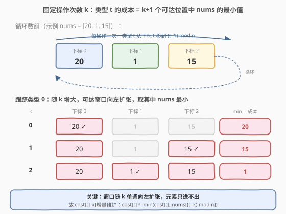
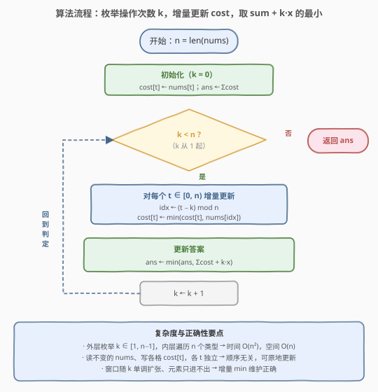

# LeetCode 收集巧克力 题解

## 1. 题目概述

- **标题 / 题号**：收集巧克力（#2735，medium）
- **链接**：https://leetcode.cn/problems/collecting-chocolates/
- **难度**：中等
- **标签**：数组、枚举

**题意**：给你一个下标从 **0** 开始、长度为 `n` 的整数数组 `nums`，`nums[i]` 表示**收集位于下标 `i` 处的巧克力所需成本**。每个巧克力对应一个不同的类型，最初位于下标 `i` 的巧克力对应第 `i` 个类型。

在**一步操作**中，你可以用成本 `x` 执行下述行为：

- 同时修改**所有**巧克力的类型，将下标 `i` 处巧克力的类型 `i` 改为类型 `(i + 1) mod n`（即所有类型整体「向前旋转」一格）。

假设可以执行任意次操作，请返回收集**所有类型**巧克力所需的最小成本。

**示例 1**：

```text
输入：nums = [20,1,15], x = 5
输出：13
解释：最开始类型为 [0,1,2]。
  - 用成本 1 购买第 1 个类型（位置 1 的巧克力）；
  - 操作一次（成本 5），类型变为 [1,2,0]，用成本 1 购买第 2 个类型；
  - 操作一次（成本 5），类型变为 [2,0,1]，用成本 1 购买第 0 个类型。
总成本 = 1 + 5 + 1 + 5 + 1 = 13，为最优方案。
```

**示例 2**：

```text
输入：nums = [1,2,3], x = 4
输出：6
解释：不做任何操作，按原始成本收集全部三种类型，总成本 = 1+2+3 = 6。
```

**约束**：

- $1 \le \text{nums.length} \le 1000$
- $1 \le \text{nums[i]} \le 10^9$
- $1 \le x \le 10^9$

> 💡 收集成本 `nums[i]` 只与**位置**有关，与该位置当前是哪个类型无关——这是建模的关键：我们关心的是「某类型在旋转过程中会出现在哪些位置」，从而在这些位置的 `nums` 中取最小。

## 2. 解题思路

### 2.1 暴力思路

把「每次操作后是否收集某类型」的所有决策树枚举一遍。状态空间随 `n` 指数增长，且操作与收集可任意交错，直接搜索完全不可行。

瓶颈在于：操作是**全局**的（一次旋转所有类型），但每个类型的「最便宜位置」其实只依赖**总操作次数**，并不依赖收集的先后顺序。这说明可以剥离出只与「操作次数 $k$」相关的子问题。

### 2.2 核心观察：固定操作次数 $k$，每个类型的最优成本独立取最小



**第一步：旋转的位移规律。** 每次操作把下标 `i` 处的类型改成 `(i+1) mod n`，等价于「类型 `t` 原在下标 `t`，操作 `s` 次后它出现在下标 `(t - s) \bmod n`」。即类型 `t` 每操作一次就**向前移动一格**（在循环数组上下标减 1）。

**第二步：固定总操作次数 $k$。** 若总共做 $k$ 次操作，那么在操作次数为 $0, 1, \dots, k$ 的任意时刻都可收集某类型。对类型 `t`，它在这 $k+1$ 个时刻分别出现在下标：

$$t,\;(t-1)\bmod n,\;(t-2)\bmod n,\;\dots,\;(t-k)\bmod n$$

收集它的成本就是这 $k+1$ 个位置的 `nums` 中的**最小值**（每收集一种类型只挑它最便宜的那个时刻）。这 $k+1$ 个下标在循环数组上是一段**长度为 $k+1$、以 `t` 为右端点向左延伸的窗口**。

> ⚠️ 注意：类型 `t` 与起始位置 `t` 是一一对应的（初始 `t` 在位置 `t`）。所以「对每个类型 `t` 取窗口最小」等价于「对每个起始下标 `t` 取循环窗口最小」——窗口在所有 `t` 上滑动，恰好遍历所有类型。

**第三步：枚举 $k$ 取最优。** 操作本身的总成本是 $k \cdot x$（每步固定 $x$），与收集决策无关。于是固定 $k$ 的总成本为：

$$\text{cost}(k) = \underbrace{\sum_{t=0}^{n-1} \min_{s=0}^{k}\, \text{nums}\big[(t-s)\bmod n\big]}_{\text{各类型最优收集成本之和}} \;+\; k\cdot x$$

只需枚举 $k \in [0,\, n-1]$，取 $\text{cost}(k)$ 的最小值。

> 💡 **为什么 $k$ 枚举到 $n-1$ 就够？** 旋转 $n$ 次后所有类型回到原位，$k=n$ 与 $k=0$ 的可达位置集合完全相同，却多花了 $n\cdot x$ 的操作成本，严格更劣。故 $k \in [0, n-1]$ 即为完整解空间（与官方 hint「最多旋转 N 次」一致）。

### 2.3 算法流程图



**增量优化**：当 $k$ 从 $k-1$ 变为 $k$ 时，类型 `t` 的窗口只**新增一个位置** $(t-k)\bmod n$。维护数组 `cost[t]` 表示「当前 `t` 的窗口最小值」，则每轮只需：

$$\text{cost}[t] \gets \min\big(\text{cost}[t],\;\text{nums}[(t-k)\bmod n]\big)$$

读的是原始 `nums`（不变），写的是 `cost`，各 `t` 之间互不影响，顺序无关。整体从 $O(n^3)$（每轮重新算窗口最小）降到 $O(n^2)$。

### 2.4 示例演算

![示例 1 演算：nums=[20,1,15], x=5，枚举 k=0/1/2](../images/p2735_example_walkthrough.svg)

以**示例 1**（`nums = [20,1,15]`，`x = 5`，`n = 3`）为例，下标取模均为正（循环数组）：

| k | cost 数组（每轮新增位置后取 min） | sum | + k·x | cost(k) |
|---|----------------------------------|-----|-------|---------|
| 0 | `[20, 1, 15]`（窗口={t}） | 36 | 0 | 36 |
| 1 | `[15, 1, 1]`（新增 (t-1)%3） | 17 | 5 | 22 |
| 2 | `[1, 1, 1]`（新增 (t-2)%3） | 3 | 10 | **13** |

$k=2$ 时三类型都能以成本 1 收集（位置 1 的巧克力最便宜，旋转后它依次出现在三种类型的可达窗口内），总成本 $3 + 2\times 5 = 13$ $\checkmark$。

**示例 2**（`nums = [1,2,3]`，`x = 4`）：`k=0` 时 `sum=6`，已是最优；`k\ge1` 后收集成本下降但 $k\cdot x$ 增长更快，$\text{cost}(1)=4+4=8 > 6$，故答案为 $6$ $\checkmark$。

> 💡 直觉：枚举 $k$ 是在「**用操作换更便宜的收集位置**」与「**操作本身要花钱**」之间权衡。当 `x` 很大时一次操作就够本（示例 1），当 `x` 很大时不操作更划算（示例 2）。枚举 $k$ 自然覆盖这条权衡曲线的最低点。

## 3. 参考代码

### C++

```cpp
class Solution {
public:
    long long minCost(vector<int>& nums, int x) {
        int n = nums.size();
        // cost[t] = 类型 t 在当前窗口(k+1 个可达位置)内的最小收集成本
        vector<long long> cost(nums.begin(), nums.end());
        long long ans = 0;
        for (int t = 0; t < n; t++) ans += cost[t];   // k = 0
        for (int k = 1; k < n; k++) {
            long long sum = 0;
            for (int t = 0; t < n; t++) {
                int idx = ((t - k) % n + n) % n;      // 循环下标取正
                cost[t] = min(cost[t], (long long)nums[idx]);
                sum += cost[t];
            }
            ans = min(ans, sum + (long long)k * x);
        }
        return ans;
    }
};
```

### Python

```python
class Solution:
    def minCost(self, nums: List[int], x: int) -> int:
        n = len(nums)
        cost = nums[:]                      # k = 0：窗口只有位置 t 自身
        ans = sum(cost)
        for k in range(1, n):
            for t in range(n):
                cost[t] = min(cost[t], nums[(t - k) % n])   # 窗口新增一个位置
            ans = min(ans, sum(cost) + k * x)
        return ans
```

> 💡 Python 的 `%` 对负数返回非负结果，`(t - k) % n` 直接得到合法循环下标；C++ 需 `((t - k) % n + n) % n` 归正。也可写 `idx = (t - k % n + n) % n` 减少一次取模。

## 4. 复杂度分析

| 维度 | 复杂度 | 说明 |
|------|--------|------|
| 时间复杂度 | $O(n^2)$ | 外层枚举 $k \in [1, n-1]$，内层遍历 $n$ 个类型各 $O(1)$ 更新；$n \le 1000$ 时约 $10^6$ 次操作 |
| 空间复杂度 | $O(n)$ | 仅维护 `cost` 数组，复用原始 `nums` |

> 💡 还可用单调队列求循环滑窗最小做到 $O(n^2)$ 不变常数更优，或用稀疏表预处理后 $O(n\log n)$ 查询。但 $n \le 1000$ 下增量 $O(n^2)$ 已足够，且代码极简——这是「枚举 + 增量」范式在该量级下的甜区。

## 5. 扩展：单调队列优化思路

若 $n$ 放大到 $10^5$，外层枚举 $k$ 的 $O(n^2)$ 不再可行，但本题 $n \le 1000$ 故不必。思路备忘：对每个起点 $t$，随着 $k$ 增大窗口单调向左扩张、元素只进不出，可用单调队列维护窗口最小，单类型 $O(n)$，整体仍 $O(n^2)$ 但常数更小；进一步用 ST 表预处理区间最小后，每个 $k$ 的求和降为 $O(n)$ 次 $O(1)$ 查询，总 $O(n\log n)$ 预处理 + $O(n^2)$ 查询——仍受限于「枚举 $k$」。真正线性需结合 $k\cdot x$ 与收集和的单调性做三分/决策单调性分析，已超出本题范围。

## 6. 面试要点

1. **为什么操作次数 $k$ 枚举到 $n-1$ 就够？**

   > 旋转 $n$ 次后类型回到原位，$k=n$ 与 $k=0$ 的可达位置集合相同，却多花 $n\cdot x$，严格更劣。因此 $k \in [0, n-1]$ 是完整且无冗余的解空间。

2. **为什么固定 $k$ 后各类型可以独立取最小？**

   > 操作是全局的，但收集本身不改变类型分布。固定 $k$ 次操作后，类型 `t` 的可达位置集合 $\{(t-s)\bmod n \mid 0\le s\le k\}$ 只依赖 $k$，与其他类型在何时被收集无关，故各类型独立地在自己的 $k+1$ 个可达位置中取 `nums` 最小。

3. **增量更新 `cost[t]` 为什么正确、与顺序无关？**

   > 每轮新增位置 $(t-k)\bmod n$，更新 `cost[t] = min(cost[t], nums[(t-k)%n])` 只读不变的 `nums`、只写自己这一格 `cost[t]`，各 `t` 互不依赖，所以遍历顺序任意、可原地更新。

4. **数据溢出要注意什么？**

   > $n \le 1000$，$\text{nums[i]}, x \le 10^9$，最坏 $\sum\text{cost} \le 1000 \times 10^9 = 10^{12}$，$k\cdot x \le 1000 \times 10^9 = 10^{12}$，总和可达 $2\times 10^{12}$，超过 32 位 `int` 上界。C++ 中 `cost`、`sum`、`ans` 与 `k*x` 都须用 `long long`。

5. **这题的本质是什么范式？**

   > 「枚举决策变量 + 增量维护」：把看似随机的操作-收集交错，归约为只依赖单一参数 $k$ 的子问题，再枚举 $k$ 取最优。与「枚举阈值验证」（875 珂珂、1011 送包裹）同属枚举家族，区别在于本题的「验证」退化为对循环数组窗口最小的增量维护。

## 同类练习题

| # | 题目 | 与本题的关联 |
|---|------|-------------|
| 2607 | [使子数组元素和相等](https://leetcode.cn/problems/make-k-subarray-sums-equal/)（[题解](../2601-2700/2607_使子数组元素和相等.md)） | 循环数组旋转 + 按同余分组取最小。与本题「循环旋转后元素到哪些位置、取窗口最小」同构，可对比「按 $k$ 索引分组」与「按 $\gcd$ 同余分组」 |
| 918 | [环形子数组的最大和](https://leetcode.cn/problems/maximum-sum-circular-subarray/)（[题解](../0901-1000/918_最大环形子数组和.md)） | 循环数组上的极值问题，用 $total - \min$ 转化。与本题「循环下标取模 + 窗口极值」共享循环数组建模思想 |
| 189 | [轮转数组](https://leetcode.cn/problems/rotate-array/)（[题解](../0101-0200/189_轮转数组.md)） | 旋转操作的纯实现，理解 `(i+k) mod n` 的位移规律。本题正是建立在该位移规律之上，可对照「旋转的几何意义」 |
| 875 | [爱吃香蕉的珂珂](https://leetcode.cn/problems/koko-eating-bananas/)（[题解](../0801-0900/875_爱吃香蕉的珂珂.md)） | 枚举速度 $k$ + $O(n)$ 验证取最优。同属「枚举决策变量 + 验证」范式，可对比本题的增量验证与该题的二分验证 |
| 1011 | [在 D 天内送达包裹的能力](https://leetcode.cn/problems/capacity-to-ship-packages-within-d-days/)（[题解](../1001-1100/1011_在D天内送达包裹的能力.md)） | 枚举运载力 + 贪心验证。与 875 同为二分答案枚举范式的代表，可对照「枚举 + 验证」家族的不同验证策略 |
