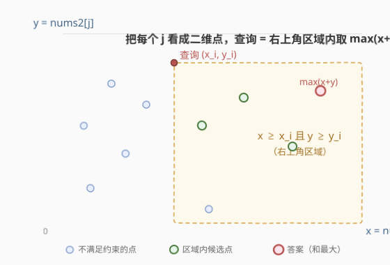
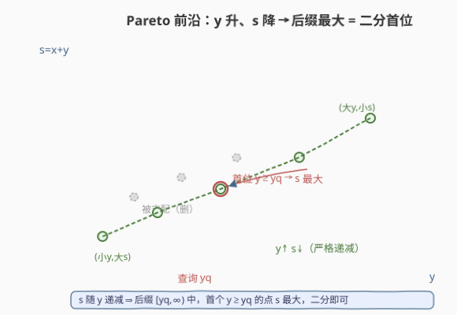
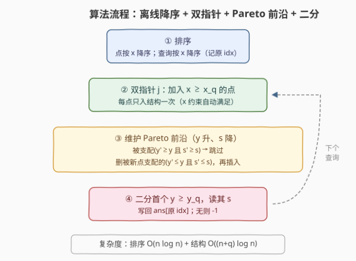
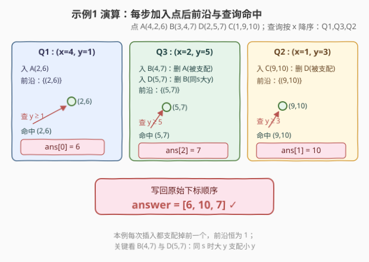

# 最大和查询

- **题目名称**：最大和查询
- **链接**：[2736. 最大和查询](https://leetcode.cn/problems/maximum-sum-queries/)
- **难度**：困难
- **标签**：栈、树状数组、线段树、数组、二分查找、排序、单调栈

## 1. 题目概述

给定长度为 $n$、下标从 $0$ 开始的两个整数数组 `nums1` 与 `nums2`，再给定下标从 $1$ 开始的二维数组 `queries`，其中 `queries[i] = [x_i, y_i]`。

对于第 $i$ 个查询，在所有满足 $\text{nums1}[j] \ge x_i$ **且** $\text{nums2}[j] \ge y_i$ 的下标 $j\;(0 \le j < n)$ 中，求 $\text{nums1}[j] + \text{nums2}[j]$ 的**最大值**；若不存在满足条件的 $j$，返回 $-1$。返回数组 `answer`。

**示例 1**：

```text
输入：nums1 = [4,3,1,2], nums2 = [2,4,9,5], queries = [[4,1],[1,3],[2,5]]
输出：[6,10,7]
解释：
  查询1 x=4,y=1：j=0 (4,2) 满足，和=6
  查询2 x=1,y=3：j=2 (1,9) 满足，和=10
  查询3 x=2,y=5：j=3 (2,5) 满足，和=7
```

**示例 2**：

```text
输入：nums1 = [3,2,5], nums2 = [2,3,4], queries = [[4,4],[3,2],[1,1]]
输出：[9,9,9]
解释：j=2 (5,4) 同时满足三个查询，和=9。
```

**示例 3**：

```text
输入：nums1 = [2,1], nums2 = [2,3], queries = [[3,3]]
输出：[-1]
解释：没有任何 j 同时满足 nums1[j]>=3 且 nums2[j]>=3。
```

**约束条件**：

- $\text{nums1.length} = \text{nums2.length} = n$
- $1 \le n \le 10^5$
- $1 \le \text{nums1}[i],\,\text{nums2}[i] \le 10^9$
- $1 \le \text{queries.length} \le 10^5$，每个查询长度为 $2$
- $1 \le x_i,\,y_i \le 10^9$

> 💡 把每个下标 $j$ 看成一个**二维点** $P_j = (x_j, y_j) = (\text{nums1}[j],\,\text{nums2}[j])$，其"价值" $s_j = x_j + y_j$。查询就是：「在右上角区域 $x \ge x_i,\, y \ge y_i$ 内的所有点中，取 $s$ 的最大值」。这就是经典的**二维正交范围最值查询**离线版。

---

## 2. 解题思路

### 2.1 暴力思路：逐查询扫描

最直觉：对每个查询遍历全部 $n$ 个点，筛出满足 $x_j \ge x_i$ 且 $y_j \ge y_i$ 的，取最大 $s_j$。

时间 $O(n \cdot q)$，当 $n=q=10^5$ 时约 $10^{10}$ 次运算，**必然超时**。瓶颈在于：每个查询都从零开始扫描，相同点被重复考察了 $q$ 次。我们需要让每个点**只被处理常数次**。

### 2.2 核心观察：离线 + 按 $x$ 降序双指针 + $y$ 的 Pareto 前沿



关键有三步转化：

**第一步：离线 + 按 $x$ 降序排序查询。** 查询没有强制在线，可重排顺序。把查询按 $x_i$ **降序**排序后处理。同时把点也按 $x_j$ **降序**排序。这样，处理到查询 $(x_i, y_i)$ 时，所有满足 $x_j \ge x_i$ 的点构成一个"前缀"——用一个指针 $j$ 单调向右推进，**每个点只入数据结构一次**，$x$ 维约束就自动满足了。

> ⚠️ 别忘了给查询记录原始下标 `idx`，排序后还要把答案写回 `ans[idx]`。

**第二步：数据结构只需回答「$y \ge y_i$ 中 $s$ 的最大值」。** $x$ 约束交给入结构时机后，结构里存的点都满足 $x \ge x_i$，只需在它们的 $y$ 维上做"后缀最大"。朴素用线段树 / 树状数组（坐标压缩 $y$，区间最大）即可，$O(\log n)$ 查询。这思路简单直接，**Python 解法就走这条路**（见 §3 Python）。

**第三步（更优）：维护 $y$ 的 Pareto 前沿，把后缀最大降到 $O(\log n)$ 且常数更小。** 这是官方提示的方向。观察：若一个点 $(y_a, s_a)$ 存在另一个点 $(y_b, s_b)$ 满足 $y_b \ge y_a$ **且** $s_b \ge s_a$，则 $(y_a, s_a)$ **永远不会成为任何查询的答案**——任何能选到 $a$ 的查询（$y_i \le y_a$）也一定能选到 $b$（$y_i \le y_a \le y_b$），而 $s_b \ge s_a$。于是 $a$ 被 $b$ **支配**，可直接丢弃。

只保留**不被任何点支配**的点，它们构成 Pareto 前沿。在 $(y, s)$ 平面上，这条前沿的形状是：

- $y$ **严格递增**（$y$ 越大门槛越高）
- $s$ **严格递减**（$y$ 大的点反而 $s$ 小，否则小的会被支配）



这条单调性带来一个**漂亮性质**：查询 $y \ge y_i$ 时，前沿中满足条件的最小 $y$ 位置（即首个 $y \ge y_i$）**正是 $s$ 最大的位置**——因为 $s$ 随 $y$ 递减，$y$ 越小 $s$ 越大。于是查询 = 二分找首个 $y \ge y_i$，直接读其 $s$。

**插入新点 $(y, s)$ 时维护前沿**（三步）：

1. **被支配检查**：找首个 $y' \ge y$ 的位置。若该位置 $y' = y$ 且 $s' \ge s$（同 $y$ 已有更优），或 $y' > y$ 且 $s' \ge s$（更大 $y$ 还有更大 $s$），则新点被支配，**跳过**。
2. **删除被新点支配的旧点**：所有 $y' \le y$ 且 $s' \le s$ 的点被新点支配（新点 $y$ 更大、$s$ 更大）。利用"$s$ 随 $y$ 递减"，这些点是从插入位置往前、$s$ 单调上升序列中连续的一段 $\le s$ 的尾段，**连续弹出**即可。
3. **插入**新点。由于每次插入最多删除若干点、且每个点至多被删一次，**均摊 $O(1)$ 次删除**，配合平衡 BST 单次 $O(\log n)$，总 $O((n+q)\log n)$。

> 💡 C++ 用 `std::map<int,int>`（红黑树）实现：`lower_bound` 二分 $O(\log n)$，`erase` 删除 $O(\log n)$。Python 标准库无平衡 BST，故走线段树路线（§3 Python），两者复杂度同阶。

### 2.3 算法流程图



### 2.4 示例演算



**示例 1**：`nums1=[4,3,1,2]`, `nums2=[2,4,9,5]`, `queries=[[4,1],[1,3],[2,5]]`

点集 $(x,y,s=x+y)$：$A(4,2,6),\; B(3,4,7),\; C(1,9,10),\; D(2,5,7)$。按 $x$ 降序排点：$A,B,D,C$。查询按 $x$ 降序排（保留原下标）：$Q_1(x\!=\!4,y\!=\!1,\text{idx}\!=\!0),\; Q_3(x\!=\!2,y\!=\!5,\text{idx}\!=\!2),\; Q_2(x\!=\!1,y\!=\!3,\text{idx}\!=\!1)$。

| 处理查询 | 入结构的新点 | Pareto 前沿（$y$ 升,$s$ 降） | 查询 $y\ge y_i$ | 二分命中 | 写回答案 |
|----------|-------------|------------------------------|----------------|----------|----------|
| $Q_1(4,1)$ | $A\to(y\!=\!2,s\!=\!6)$ | $\{(2,6)\}$ | $y\ge1$ | $(2,6)$ | $\text{ans}[0]=6$ |
| $Q_3(2,5)$ | $B\to(4,7)$：支配删 $A$（$y_A\!=\!2\le4,\,s_A\!=\!6\le7$） | $\{(4,7)\}$ | | | |
| | $D\to(5,7)$：支配删 $B$（$y_B\!=\!4\le5,\,s_B\!=\!7\le7$） | $\{(5,7)\}$ | $y\ge5$ | $(5,7)$ | $\text{ans}[2]=7$ |
| $Q_2(1,3)$ | $C\to(9,10)$：支配删 $D$（$s_D\!=\!7\le10$） | $\{(9,10)\}$ | $y\ge3$ | $(9,10)$ | $\text{ans}[1]=10$ |

写回原始顺序得 `[6,10,7]` ✓。

> ⚠️ 注意 $B(4,7)$ 与 $D(5,7)$ 的 **$s$ 相同**但 $D$ 的 $y=5> B$ 的 $y=4$。按支配定义（$y'\ge y$ 且 $s'\ge s$）：$D$ **支配** $B$（$y_D\ge y_B$ 且 $s_D\ge s_B$），故删 $B$ 留 $D$；反向不成立（$y_B=4\not\ge5$）。这正是查询 $y\ge5$ 仍能命中 $D$ 的关键——若误删 $D$，$Q_3$ 会错误返回 $-1$。**同 $s$ 时大 $y$ 支配小 $y$**，是插入逻辑里"$s'\le s$"用 $\le$ 而非 $<$ 的原因。

---

## 3. 参考代码

### C++（`std::map` 实现 Pareto 前沿）

```cpp
class Solution {
public:
    vector<int> maximumSumQueries(vector<int>& nums1, vector<int>& nums2,
                                  vector<vector<int>>& queries) {
        int n = nums1.size(), q = queries.size();
        vector<pair<int,int>> pts(n);
        for (int i = 0; i < n; i++) pts[i] = {nums1[i], nums2[i]};
        // 点按 x 降序
        sort(pts.begin(), pts.end(),
             [](const auto& a, const auto& b){ return a.first > b.first; });
        // 查询按 x 降序，记录原始下标
        vector<int> order(q);
        iota(order.begin(), order.end(), 0);
        sort(order.begin(), order.end(),
             [&](int a, int b){ return queries[a][0] > queries[b][0]; });

        vector<int> ans(q);
        map<int,int> mp;          // key=y(升序), val=s(严格降序)
        int j = 0;
        for (int oi = 0; oi < q; oi++) {
            int i = order[oi];
            int xq = queries[i][0], yq = queries[i][1];
            // 把所有 x >= xq 的点加入前沿
            while (j < n && pts[j].first >= xq) {
                int y = pts[j].second;
                long long s = (long long)pts[j].first + pts[j].second;
                j++;
                auto it = mp.lower_bound(y);
                // 1) 同 y 已存在
                if (it != mp.end() && it->first == y) {
                    if (it->second >= s) continue;      // 旧者更优，跳过
                    it = mp.erase(it);                   // 删旧同 y，续判下一项
                }
                // 2) 被 y'>y 且 s'>=s 的点支配 -> 跳过
                if (it != mp.end() && it->second >= s) continue;
                // 3) 删除被新点支配的：y'<=y 且 s'<=s（连续尾段）
                while (it != mp.begin()) {
                    auto pv = prev(it);
                    if (pv->second <= s) it = mp.erase(pv);
                    else break;
                }
                mp.insert(it, {y, (int)s});              // 提示位置插入 O(1) 摊还
            }
            // 查询：首个 y>=yq，其 s 即最大
            auto it = mp.lower_bound(yq);
            ans[i] = (it != mp.end()) ? it->second : -1;
        }
        return ans;
    }
};
```

> 💡 `s` 用 `long long` 计算（$2\times10^9$ 仍在 `int` 范围内，但相加瞬间安全起见用 `long long`，存入 `map` 时转回 `int`）。`mp.erase` 返回下一迭代器，避免迭代器失效。`mp.insert(it, ...)` 用 `it` 作提示，摊还 $O(1)$。

### Python（坐标压缩 + 线段树区间最大）

Python 标准库无平衡 BST，改用**线段树**：把所有 $y$（`nums2` 与查询 $y_i$）离散化，线段树维护每个 $y$ 位置上 $s$ 的最大值，查询即后缀 $[y_i, +\infty)$ 的区间最大。

```python
class Solution:
    def maximumSumQueries(self, nums1: List[int], nums2: List[int],
                           queries: List[List[int]]) -> List[int]:
        import bisect
        # 坐标压缩：收集所有可能的 y
        ys_all = sorted(set(nums2) | {q[1] for q in queries})
        m = len(ys_all)
        def rank(v: int) -> int:       # 首个 >= v 的下标
            return bisect.bisect_left(ys_all, v)

        # 迭代式线段树：单点更新取 max，区间 [l,r) 最大
        size = 1
        while size < m:
            size <<= 1
        seg = [-1] * (2 * size)

        def update(i: int, val: int) -> None:
            i += size
            if val > seg[i]:
                seg[i] = val
                i >>= 1
                while i:
                    seg[i] = seg[2 * i] if seg[2 * i] >= seg[2 * i + 1] else seg[2 * i + 1]
                    i >>= 1

        def query(l: int, r: int) -> int:   # [l, r)
            res = -1
            l += size
            r += size
            while l < r:
                if l & 1:
                    if seg[l] > res: res = seg[l]
                    l += 1
                if r & 1:
                    r -= 1
                    if seg[r] > res: res = seg[r]
                l >>= 1
                r >>= 1
            return res

        n, q = len(nums1), len(queries)
        pts = sorted(zip(nums1, nums2), key=lambda p: -p[0])   # x 降序
        order = sorted(range(q), key=lambda i: -queries[i][0])
        ans = [-1] * q
        j = 0
        for i in order:
            xq, yq = queries[i]
            while j < n and pts[j][0] >= xq:
                x, y = pts[j]
                j += 1
                update(rank(y), x + y)                          # 同 y 取 max
            lo = rank(yq)
            ans[i] = query(lo, m) if lo < m else -1             # 后缀最大
        return ans
```

---

## 4. 复杂度分析

| 维度 | 复杂度 | 说明 |
|------|--------|------|
| 时间复杂度 | $O\big((n+q)\log n\big)$ | 排序 $O(n\log n+q\log q)$；每个点至多入结构 1 次、被删 1 次，每次 `lower_bound`/`erase`/`insert` 均 $O(\log n)$；每查询二分 $O(\log n)$ |
| 空间复杂度 | $O(n)$ | Pareto 前沿 / 线段树规模不超过点数 $n$ |

> 💡 两种解法同阶。Pareto 前沿版常数更小、空间更紧（前沿通常远小于 $n$）；线段树版思路更直白、不依赖支配论证，适合作为"保底正确"的实现。

---

## 5. 扩展：线段树与单调表为何等价

线段树在每个 $y$ 位置存"该 $y$ 上 $s$ 的最大"，查询后缀最大，**天然丢弃了被支配的点**——因为被支配的点永远不会成为任何后缀的"最大"（总有更大 $s$ 的更大 $y$ 盖过它）。所以线段树**隐式**维护了 Pareto 前沿，只是用 $O(n)$ 空间显式铺开所有 $y$ 槽位，而单调表只存前沿本身。

更进一步，可用**树状数组**（BIT）做后缀最大：把下标反转（`i -> m-i`），后缀最大即转化为前缀最大，BIT 维护前缀 $\max$ 即可，代码更短。三种做法本质同构，选哪种取决于语言工具与常数要求：

- C++ 有 `std::map` → 单调表，最优雅；
- Python 无 BST → 线段树 / BIT；
- 若 $y$ 值域小或不离散化 → 直接线段树覆盖值域。

---

## 6. 面试要点

1. **为什么把查询按 $x$ 降序排序就能去掉 $x$ 维约束？**

   > 降序处理后，当前查询的 $x_i$ 只会越来越小，"满足 $x_j\ge x_i$ 的点集"只增不减。用一个指针 $j$ 单调推进，新满足的点直接加入结构，旧点仍在结构里——$x$ 维约束被"加入时机"自动保证，结构内只需处理 $y$ 维。

2. **Pareto 前沿为何"$y$ 升、$s$ 降"？**

   > 若存在两点 $y_a<y_b$ 但 $s_a\le s_b$，则 $a$ 被 $b$ 支配（$b$ 的 $y$ 更大且 $s$ 更大），$a$ 应被删。故留下来的点必满足 $y$ 升则 $s$ 严格降。这条单调性让"后缀最大"退化成"二分首位"。

3. **插入时被支配检查为什么要看"首个 $y'\ge y$"？**

   > 支配新点 $(y,s)$ 需 $y'\ge y$ 且 $s'\ge s$。前沿 $s$ 随 $y$ 降，故所有 $y'\ge y$ 的点中 $s$ 最大的是**首个 $y'\ge y$**（最小 $y'$）。只需看它是否 $s'\ge s$ 即可判定。

4. **C++ 用 `std::map`，Python 为什么换线段树？**

   > Python 标准库无平衡 BST（`bisect`+`list` 的插入/删除是 $O(n)$，最坏 $O(n^2)$ 会超时）。线段树单点更新 + 区间最大 $O(\log n)$，无需维护支配关系也能得到正确后缀最大，是 Python 的稳妥选择。

5. **相同 $s$ 的两个点会互相支配吗？**

   > 会，且方向看 $y$。如 $A(y=4,s=7)$ 与 $B(y=5,s=7)$：$B$ 支配 $A$（$y_B\ge y_A$ 且 $s_B\ge s_A$），删 $A$ 留 $B$。因为查询 $y\ge5$ 只有 $B$ 能命中，留 $A$ 会导致错误返回 $-1$。

---

## 7. 同类练习题

- [1847. 最近房间](https://leetcode.cn/problems/closest-room/)：查询按约束（房间尺寸）降序排序 + 有序集合二分找最近 id。和本题"离线降序 + 单调结构二分"几乎同构，只是把"$\max s$"换成"最近 id"
- [2251. 花期内花的数目](https://leetcode.cn/problems/number-of-flowers-in-full-bloom/)：把人按时间排序、花区间端点排序，双指针/差分统计。同属"离线 + 排序 + 数据结构"范式，可对比降序与升序的取舍
- [1697. 检查边长度限制路径是否存在](https://leetcode.cn/problems/checking-existence-of-edge-length-limited-paths/)：查询按长度限制升序排序 + 边按权升序加入并查集。离线排序 + 增量入结构的经典，可对比"并查集"与"单调表"两种增量结构
- [1182. 与目标颜色间的最短距离](https://leetcode.cn/problems/shortest-distance-to-target-color/)：按颜色分桶预处理位置数组，查询二分找最近位置。同属"离线/预处理 + 二分"思路，可对比"按值分桶"与"按 $y$ 前沿"
- [2080. 区间内查询数字的频次](https://leetcode.cn/problems/range-frequency-queries/)：按值分桶存下标，区间频次二分。与本题"维护值域上的有序结构 + 二分查询"思路相通，可对比在线设计与离线批处理
