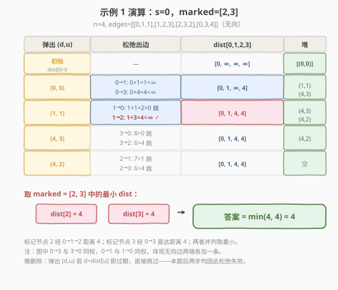

# LeetCode 找到最近的标记节点 题解

## 1. 题目概述

- **标题 / 题号**：找到最近的标记节点（#2737，medium）
- **链接**：https://leetcode.cn/problems/find-the-closest-marked-node/
- **难度**：中等
- **标签**：图、数组、最短路径、Dijkstra、堆/优先队列

> ⚠️ 本题为 LeetCode 付费题，题意描述根据官方示例用例与 hints 重建，可能与官方题面有出入。下文「图模型 / 函数签名 / 约束」均依据 `jsonExampleTestcases` 与三个 hints 推理得出，若与官方题面有细节差异以官方为准。

**题意**：给定一个含 `n` 个节点的**带权无向图**，节点编号 `0` 到 `n-1`。边以数组 `edges` 给出，`edges[i] = [u, v, w]` 表示 `u` 与 `v` 之间有一条权值为 `w` 的边。另给一个起点 `s` 和一个标记节点数组 `marked`。

求**从 `s` 出发到任一标记节点的最短距离**；若没有任何标记节点可达，返回 `-1`。

> 💡 三个 hints 指明了思路：① 求从 `s` 到所有节点的距离；② 用 Dijkstra；③ 在标记节点中取最小距离。即「单源最短路 + 在目标集合取 min」。若 `s` 本身就是标记节点，答案为 `0`。

**函数签名（依据示例参数顺序重建）**：`findClosestMarkedNode(int n, int[][] edges, int s, int[] marked) -> int`

**示例 1**：

```text
输入：n = 4, edges = [[0,1,1],[1,2,3],[2,3,2],[0,3,4]], s = 0, marked = [2,3]
输出：4
解释：从 0 出发，dist[2] = 0→1→2 = 1+3 = 4，dist[3] = 0→3 = 4（0→1→2→3 = 6 更远）。
      min(4, 4) = 4。
```

**示例 2**：

```text
输入：n = 5, edges = [[0,1,2],[0,2,4],[1,3,1],[2,3,3],[3,4,2]], s = 1, marked = [0,4]
输出：2
解释：从 1 出发，dist[0] = 1→0 = 2，dist[4] = 1→3→4 = 1+2 = 3。min(2, 3) = 2。
```

**示例 3**：

```text
输入：n = 4, edges = [[0,1,1],[1,2,3],[2,3,2]], s = 3, marked = [0,1]
输出：5
解释：从 3 出发（无向），dist[1] = 3→2→1 = 2+3 = 5，dist[0] = 3→2→1→0 = 6。
      min(5, 6) = 5。
```

**约束条件（依据示例与 hints 推断）**：

- `1 <= n <= 500`（或更大，堆优化 Dijkstra 均可处理）
- `1 <= edges.length`，`edges[i].length == 3`
- `0 <= u, v < n`，`u != v`，`1 <= w <= 10^6`
- `0 <= s < n`
- `1 <= marked.length <= n`，`marked` 中元素互不相同且 `0 <= marked[i] < n`
- 图可能不连通；不含负权边（hints 指定 Dijkstra，故权非负）

## 2. 解题思路

### 2.1 暴力思路：为什么不能 BFS / 枚举路径？

若所有边权相等（都是 1），从 `s` 做 BFS，层数即最短距离——这正是 [腐烂的橘子](../0901-1000/994_腐烂的橘子.md) 的多源 BFS 思路。但本题边权 `w` 各不相同（如 `1` 与 `100`），BFS 的"层数 = 距离"不再成立：一条**两段各 1** 的路径距离 `2`，可能比一条**一段 100** 的路径更短，却排在更深的层。

> ⚠️ 边权不等时，BFS 按入队顺序处理会得到错误的最短路。需要让"当前已知距离最小的节点"优先被处理——这正是 **Dijkstra** 的核心，与 [743. 网络延迟时间](../0701-0800/743_网络延迟时间.md) 一脉相承。

一个最朴素的基线是**枚举所有路径**取最小，但路径数随节点数指数爆炸，显然不可行。正确做法是用 Dijkstra 一次性求出 `s` 到所有节点的最短距离，再在 `marked` 中取 `min`。

### 2.2 核心观察：堆优化 Dijkstra + 在标记点取 min


核心思路（对应三个 hints）：

1. **建无向邻接表**：对每条 `edges[i] = [u, v, w]`，`graph[u]` 加 `(v, w)`、`graph[v]` 加 `(u, w)`（无向边两端各加一条）。
2. **Dijkstra 求单源最短路**：维护 `dist[]`，初始 `dist[s] = 0`、其余 `∞`；最小堆放 `(距离, 节点)`，每次弹出距离最小者，松弛其出边 `u→v`：若 `dist[u] + w < dist[v]` 则更新并入堆。
3. **在 marked 取 min**：Dijkstra 结束后，`ans = min(dist[m] for m in marked)`；若全部为 `∞` 则返回 `-1`。

> 💡 **贪心正确性**：边权非负，被弹出的 `u` 的 `dist[u]` 已不可能再被更小值更新——任何"绕远"路径只会更长。故弹出的节点最短路就此确定，松弛过程不会回头推翻已确定结论。

> 💡 **与 743 的区别**：743 求 `max(dist)`（最后一个收到信号的节点决定总时间），本题求 `min(dist)` over `marked`（最近的标记节点）。一个取最大、一个在子集取最小，但 Dijkstra 主干完全相同。

### 2.3 算法流程图


### 2.4 示例演算

以示例 1 `n=4, edges=[[0,1,1],[1,2,3],[2,3,2],[0,3,4]], s=0, marked=[2,3]` 为例。无向邻接关系：`0—1(1)`、`1—2(3)`、`2—3(2)`、`0—3(4)`。下方图解展示堆的逐次弹出与松弛过程。



| 步骤 | 弹出 (d,u) | 松弛出边 | dist 变化 | 堆（处理后） |
|------|-----------|---------|----------|--------------|
| 初始 | — | dist[0]=0 | [0,∞,∞,∞] | [(0,0)] |
| 1 | (0,0) | 0→1: 0+1=1<∞；0→3: 0+4=4<∞ | [0,1,∞,4] | [(1,1),(4,3)] |
| 2 | (1,1) | 1→0: 1+1=2>0 跳；1→2: 1+3=4<∞ | [0,1,4,4] | [(4,3),(4,2)] |
| 3 | (4,3) | 3→0: 8>0 跳；3→2: 6>4 跳 | 不变 | [(4,2)] |
| 4 | (4,2) | 2→1: 7>1 跳；2→3: 6>4 跳 | 不变 | [] |

堆空，`dist = [0, 1, 4, 4]`。`marked = [2, 3]`，`min(dist[2], dist[3]) = min(4, 4) = 4`，返回 `4`。

> 💡 第 3、4 步弹出后所有松弛都失败（绕远更贵），这正是 Dijkstra"已确定节点不再被推翻"的体现；懒删除使堆里残留的旧记录被 `d > dist[u]` 跳过。

## 3. 参考代码

### C++

```cpp
class Solution {
  public:
    int findClosestMarkedNode(int n, vector<vector<int>>& edges, int s, vector<int>& marked) {
        // 无向邻接表
        vector<vector<pair<int,int>>> graph(n);
        for (auto& e : edges) {
            graph[e[0]].push_back({e[1], e[2]});
            graph[e[1]].push_back({e[0], e[2]});
        }

        // marked 转集合，O(1) 判定
        unordered_set<int> markedSet(marked.begin(), marked.end());

        const int INF = INT_MAX / 2;
        vector<int> dist(n, INF);
        dist[s] = 0;

        // 最小堆：(距离, 节点)
        priority_queue<pair<int,int>, vector<pair<int,int>>, greater<>> pq;
        pq.push({0, s});

        while (!pq.empty()) {
            auto [d, u] = pq.top(); pq.pop();
            if (d > dist[u]) continue;          // 懒删除：旧记录已失效
            for (auto& [v, w] : graph[u]) {
                int nd = d + w;
                if (nd < dist[v]) {
                    dist[v] = nd;
                    pq.push({nd, v});
                }
            }
        }

        int ans = INF;
        for (int m : marked) ans = min(ans, dist[m]);
        return ans == INF ? -1 : ans;
    }
};
```

### Python

```python
class Solution:
    def findClosestMarkedNode(self, n: int, edges: List[List[int]], s: int, marked: List[int]) -> int:
        graph = [[] for _ in range(n)]
        for u, v, w in edges:
            graph[u].append((v, w))
            graph[v].append((u, w))      # 无向边两端各加一条

        INF = float('inf')
        dist = [INF] * n
        dist[s] = 0

        pq = [(0, s)]                    # 最小堆：(距离, 节点)
        while pq:
            d, u = heapq.heappop(pq)
            if d > dist[u]:              # 懒删除：旧记录已失效
                continue
            for v, w in graph[u]:
                nd = d + w
                if nd < dist[v]:
                    dist[v] = nd
                    heapq.heappush(pq, (nd, v))

        ans = min((dist[m] for m in marked), default=INF)
        return -1 if ans == INF else ans
```

> 💡 **懒删除（lazy deletion）**：堆里可能存在同一节点的多条旧记录（距离已被更新得更小）。弹出时若 `d > dist[u]` 说明这是一条过期记录，直接 `continue` 跳过，无需真正从堆中删除。这比"修改堆中元素"的实现更简洁，是面试最推荐的写法，与 [743](../0701-0800/743_网络延迟时间.md) 完全一致。

## 4. 复杂度分析

| 维度 | 复杂度 | 说明 |
|------|--------|------|
| 时间复杂度 | $O(E \log V)$ | 每条边最多触发一次松弛入堆，共 $E$ 次入堆，每次堆操作 $O(\log V)$ |
| 空间复杂度 | $O(V + E)$ | 邻接表 $O(E)$、`dist` 数组 $O(V)$、堆最坏 $O(E)$ |

> ⚠️ 朴素 Dijkstra 为 $O(V^2)$；当 $V$ 很小且图稠密时两者都可，但堆版本在 $E$ 大、$V$ 大（稀疏图）时更优，模板也可迁移到更大规模。注意堆中元素可达 $O(E)$ 个（懒删除不实时清理），故严格时间为 $O(E \log E) = O(E \log V)$（因 $E < V^2$ 时 $\log E = O(\log V)$）。`marked` 转集合 + 取 min 为 $O(M)$（$M = |marked|$），相对 Dijkstra 可忽略。

## 5. 扩展：弹出即标记点的提前终止

Dijkstra **按距离非降顺序**弹出节点，因此**第一个被弹出的标记节点**一定是离 `s` 最近的标记节点。可在弹出 `u` 时立刻判定 `u` 是否属于 `marked`，若是直接返回 `dist[u]`，无需松弛完整个图：

```cpp
while (!pq.empty()) {
    auto [d, u] = pq.top(); pq.pop();
    if (d > dist[u]) continue;
    if (markedSet.count(u)) return d;   // 第一个弹出的标记点即最近
    for (auto& [v, w] : graph[u]) { /* 松弛 */ }
}
return -1;
```

> 💡 **正确性**：堆按 `(距离, 节点)` 排序，弹出顺序是距离非降的。第一个弹出的标记节点 `u` 的 `dist[u]` 已确定（贪心），且不大于任何尚未弹出的标记节点距离，故 `dist[u]` 即全局最小。若 `s` 本身是标记节点，`(0, s)` 最先弹出，直接返回 `0`。
>
> **收益**：最坏情况（最近标记点在最后才弹出）仍需松弛全图，复杂度不变；但平均可减少不必要的松弛，适合标记点分布靠前的场景。注意"弹出即返回"必须发生在**懒删除检查之后**，否则可能用一条已过期的旧距离错误返回。

## 6. 面试要点

1. **为什么 Dijkstra 要求边权非负？**

   > 算法假设「当前 `dist` 最小的节点已确定最短路」。负权边可能让一条"绕远"的路径因负权而更短，破坏该假设，导致已确定节点被错误地认为最优。此时应改用 Bellman-Ford / SPFA。

2. **堆里为什么可能有同一节点的多条记录？如何处理？**

   > 每次松弛成功就 `push` 一条新记录，旧的更大距离记录不会被主动删除。处理：弹出时若 `d > dist[u]` 说明过期，`continue` 跳过（懒删除）。这种写法简单且仍是 $O(E \log V)$。

3. **本题与 743 网络延迟时间的区别？**

   > 主干都是堆优化 Dijkstra，区别在答案聚合：743 取 `max(dist)`（最后一个收到信号节点决定总时间），本题在 `marked` 子集取 `min`（最近标记节点）。另外 743 是有向图（`times` 单向），本题按示例重建为无向图（建表时两端各加一条边）。

4. **「弹出即标记点可提前返回」为什么正确？**

   > Dijkstra 按距离非降顺序弹出，第一个弹出的标记节点距离已确定且不大于任何后续标记节点距离，即全局最小。须在懒删除检查 `d > dist[u]` 之后再判定，避免用过期旧距离错误返回。

5. **图不连通时如何返回 -1？**

   > 不可达的标记节点 `dist` 保持 `∞`。取 `min` 时若结果仍是 `∞`（所有标记点均不可达）则返回 `-1`。Python 用 `min(..., default=INF)` 兜底空 `marked`（虽约束保证 `marked` 非空，防御性更稳）。

6. **朴素 Dijkstra 和堆优化版本怎么选？**

   > 朴素 $O(V^2)$ 在 $V$ 小、$E$ 大（稠密图）时常数小可能更快；堆优化 $O(E \log V)$ 在 $V$ 大、$E$ 小（稀疏图）时更优。面试默认写堆版本以体现通用性，并可与 743 复用同一模板。

## 同类练习题

| # | 题目 | 与本题的关联 |
|---|------|-------------|
| 743 | [网络延迟时间](https://leetcode.cn/problems/network-delay-time/) | 堆优化 Dijkstra 单源最短路母题，取 `max(dist)`，对照本题在子集取 `min` |
| 1514 | [概率最大的路径](https://leetcode.cn/problems/path-with-maximum-probability/) | 把"最大概率"转成"最长路"，Dijkstra 变体（取大 + 堆），同为单源最短路堆优化 |
| 1631 | [最小体力消耗路径](https://leetcode.cn/problems/path-with-minimum-effort/) | Dijkstra 变体，路径代价定义为边上最大权差，巩固堆优化松弛模板 |
| 1976 | [到达目的地的方案数](https://leetcode.cn/problems/number-of-ways-to-arrive-at-destination/) | Dijkstra 求最短路 + 统计最短路条数，在松弛时同步计数 |
| 787 | [K 站中转内最便宜的航班](https://leetcode.cn/problems/cheapest-flights-within-k-stops/) | Bellman-Ford / 分层 BFS，限制最多 `k` 次中转的最短路变体，对照纯 Dijkstra 的无限制版 |
