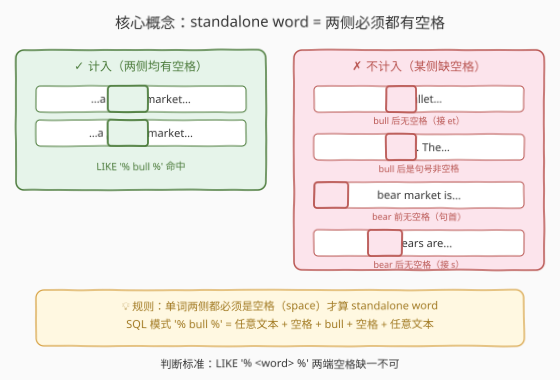
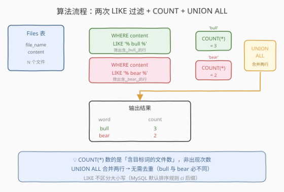
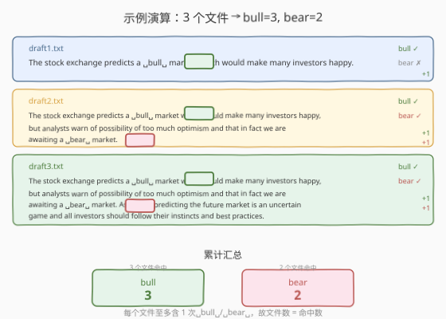

# LeetCode 统计文本中单词的出现次数 题解

## 1. 题目概述

- **标题 / 题号**：统计文本中单词的出现次数（#2738，medium）
- **链接**：https://leetcode.cn/problems/count-occurrences-in-text/
- **难度**：中等
- **标签**：数据库、SQL、`LIKE`、`COUNT`、`UNION ALL`、字符串模式匹配、LeetCode 锁题

> ⚠️ 本题为 LeetCode 付费题，题意描述根据官方示例用例与 hints 重建，可能与官方题面有出入。下文「表结构 / 输出列名 / 判定规则」均依据 `sampleTestCase` 与题目语义推理得出，若与官方题面有细节差异以官方为准。

**题意**：给定文件内容表 `Files`，每行包含 `file_name` 和 `content`（文本内容）。编写 SQL 查询，统计有多少个文件**至少包含一次**以**独立单词**形式出现的 `'bull'` 和 `'bear'`。

> 💡 **standalone word 判定**：目标词两侧必须都是**空格**才算独立单词。以下情况**不计入**：`'bullet'`（后接字母）、`'bears'`（后接字母）、`'bull.'`（后接句号）、`'bear'` 在句首（前无空格）、`'bear'` 在句末（后接句号非空格）。一句话总结：**空格包夹，缺一不可**。

返回列 `(word, count)`，两行 `'bull'` 和 `'bear'`，顺序任意。

**表结构**：

```text
Table: Files
+-------------+---------+
| Column Name | Type    |
+-------------+---------+
| file_name   | varchar |
| content     | text    |
+-------------+---------+
file_name 是该表具有唯一值的列。
每行包含 file_name 和该文件的内容。
```

**输出列**：`word`（单词 `'bull'` 或 `'bear'`）、`count`（至少包含一次该独立单词的文件数）。

**示例 1**：

```text
输入：
Files 表:
+------------+----------------------------------------------------------------------------------+
| file_name  | content                                                                          |
+------------+----------------------------------------------------------------------------------+
| draft1.txt | The stock exchange predicts a bull market which would make many investors happy. |
| draft2.txt | The stock exchange predicts a bull market which would make many investors happy,  |
|            | but analysts warn of possibility of too much optimism and that in fact we are   |
|            | awaiting a bear market.                                                          |
| draft3.txt | The stock exchange predicts a bull market which would make many investors happy,  |
|            | but analysts warn of possibility of too much optimism and that in fact we are   |
|            | awaiting a bear market. As always predicting the future market is an uncertain  |
|            | game and all investors should follow their instincts and best practices.         |
+------------+----------------------------------------------------------------------------------+

输出：
+------+-------+
| word | count |
+------+-------+
| bull | 3     |
| bear | 2     |
+------+-------+
```

**解释**：

| 文件 | ` bull ` 命中？ | ` bear ` 命中？ |
|------|---------------|----------------|
| draft1.txt | ✓（"a ␣bull␣ market"） | ✗ |
| draft2.txt | ✓（"a ␣bull␣ market"） | ✓（"a ␣bear␣ market"） |
| draft3.txt | ✓（"a ␣bull␣ market"） | ✓（"a ␣bear␣ market"） |

bull 命中 3 个文件 → count = 3；bear 命中 2 个文件 → count = 2。

> 💡 本题是 SQL **「LIKE 模式匹配 + COUNT 计数行数 + UNION ALL 合并」招牌题**——核心三步：① 用 `LIKE '% bull %'` 筛出 content 中含「空格-bull-空格」的行；② `COUNT(*)` 数命中行数即文件数；③ `UNION ALL` 合并 bull 和 bear 两条结果。难点在理解「standalone word = 两侧必须有空格」这一规则，以及 `LIKE '% word %'` 恰好编码了这一约束。

## 2. 解题思路

### 2.1 暴力思路：逐文件逐字符扫描

最直觉的过程式思路：遍历每个文件的 `content` 字符串，逐位置检查是否出现 `' bull '`（前后均为空格的子串），命中则该文件 bull 计数 +1；对 `'bear '` 同理。伪代码：

```text
bull_files = 0
bear_files = 0
for row in Files:
    if ' bull ' in row.content: bull_files += 1
    if ' bear ' in row.content: bear_files += 1
return [('bull', bull_files), ('bear', bear_files)]
```

逻辑正确，但 SQL 没有循环。表达「content 含某子串」最自然的方式是 `LIKE '% <pattern> %'`——一次模式匹配即可筛出全部命中行，再 `COUNT(*)` 即得文件数，无需逐行迭代。

### 2.2 核心观察：LIKE 模式匹配 + COUNT 行数



**关键洞察**：题目要求「standalone word」，即目标词两侧必须是空格。`LIKE '% bull %'` 的模式含义为「任意文本 + 空格 + bull + 空格 + 任意文本」，恰好编码了「前后空格包夹」的约束：

1. **`% bull %` 排除子串嵌入**：`'bullet'` 中 bull 后面是 `'et'` 而非空格，不匹配；`'bears'` 中 bear 后面是 `'s'` 而非空格，不匹配。
2. **`% bull %` 排除句号/标点**：`'bull.'` 中 bull 后面是 `'.'` 而非空格，不匹配；`'bear!'` 同理。
3. **`% bull %` 排除句首/句末**：句首的 `'bull '` 前面无空格，不匹配；句末的 `' bull'` 后面无空格，不匹配。

> 💡 **为什么用 `LIKE` 而非 `REGEXP`？** MySQL 的 `REGEXP` 支持 `\b`（词边界），但 `\b` 的语义是「字母与非字母的交界」，会把 `bull.` 中的 bull 也算作独立词（因为 `.` 是非字母，构成词边界）。而题目明确要求「空格包夹」，`bull.` 不应计入。`LIKE '% bull %'` 精确匹配题目对「空格两侧」的要求，比 `\b` 更贴合题意。

> ⚠️ **大小写**：MySQL 默认排序规则（如 `utf8mb4_general_ci`）下 `LIKE` 不区分大小写，`'Bull'`、`'BULL'` 均匹配 `'bull'`。若数据库使用 `_cs`（区分大小写）排序规则，需改用 `LOWER(content) LIKE '% bull %'` 或 `REGEXP '(^| )bull '` 等方式。LeetCode 的 MySQL 环境默认不区分大小写。

### 2.3 算法流程图



**逻辑执行步骤**：

| 步骤 | SQL 子句 | 作用 |
|------|----------|------|
| ① | `SELECT 'bull' AS word, COUNT(*) AS count FROM Files WHERE content LIKE '% bull %'` | 筛出含 ␣bull␣ 的行并计数 |
| ② | `SELECT 'bear' AS word, COUNT(*) AS count FROM Files WHERE content LIKE '% bear %'` | 筛出含 ␣bear␣ 的行并计数 |
| ③ | `UNION ALL` | 合并两行结果（bull 与 bear 必不同，无需去重） |

### 2.4 示例演算

以示例 1 的 3 个文件为例，观察 `LIKE` 模式匹配的逐步过程：



**步骤 ①：匹配 ` bull `（空格-bull-空格）**

| 文件 | content 片段 | 命中？ | 贡献 |
|------|-------------|--------|------|
| draft1.txt | "…a ␣bull␣ market…" | ✓ | +1 |
| draft2.txt | "…a ␣bull␣ market…" | ✓ | +1 |
| draft3.txt | "…a ␣bull␣ market…" | ✓ | +1 |

`COUNT(*)` = 3

**步骤 ②：匹配 ` bear `（空格-bear-空格）**

| 文件 | content 片段 | 命中？ | 贡献 |
|------|-------------|--------|------|
| draft1.txt | 无 ␣bear␣ | ✗ | 0 |
| draft2.txt | "…a ␣bear␣ market." | ✓ | +1 |
| draft3.txt | "…a ␣bear␣ market." | ✓ | +1 |

`COUNT(*)` = 2

**步骤 ③：UNION ALL 合并** → `('bull', 3)` + `('bear', 2)` = 输出结果。

> 💡 **`COUNT(*)` 数的是文件数而非出现次数**：若一个文件的 content 中出现两次 ␣bull␣，`COUNT(*)` 仍只计 1（因为只有 1 行匹配）。题目问的是「至少包含一次的文件数」，`COUNT(*)` 正好。本题示例中每个文件至多出现 1 次，所以文件数 = 出现次数。

## 3. 参考代码

### SQL（解法 A：LIKE + COUNT + UNION ALL，推荐）

```sql
SELECT 'bull' AS word, COUNT(*) AS count
FROM Files
WHERE content LIKE '% bull %'
UNION ALL
SELECT 'bear' AS word, COUNT(*) AS count
FROM Files
WHERE content LIKE '% bear %';
```

> 💡 **写法要点**：
> - **`LIKE '% bull %'`**：模式 `%` 匹配任意字符串（含空串），` bull ` 是空格-bull-空格。整体含义：content 中任意位置出现「空格 bull 空格」即命中。
> - **`COUNT(*)`**：数的是满足 `WHERE` 条件的**行数**（文件数），不是词的出现次数。题目问「至少一次的文件数」，正确。
> - **`UNION ALL` 而非 `UNION`**：两行 word 分别是 `'bull'` 和 `'bear'`，内容必不同，无需去重。`UNION ALL` 不做排序去重，比 `UNION` 更快。
> - ✓ **最推荐**：两条简单查询拼接，逻辑清晰、执行高效。

### SQL（解法 B：UNION 去重，防御性写法）

```sql
SELECT 'bull' AS word, COUNT(*) AS count
FROM Files
WHERE content LIKE '% bull %'
UNION
SELECT 'bear' AS word, COUNT(*) AS count
FROM Files
WHERE content LIKE '% bear %';
```

> 💡 **解法 B 与解法 A 的区别**：仅 `UNION` vs `UNION ALL`。`UNION` 会对结果去重，但因为 `'bull' ≠ 'bear'`，两行不会合并，结果完全相同。`UNION` 多了一次排序去重开销，性能略差。仅在不担心性能或习惯性写 `UNION` 时使用。

### SQL（解法 C：LENGTH + REPLACE 统计出现总次数）

```sql
SELECT 'bull' AS word,
       SUM((LENGTH(content) - LENGTH(REPLACE(LOWER(content), ' bull ', ''))) 
           / LENGTH(' bull ')) AS count
FROM Files
UNION ALL
SELECT 'bear',
       SUM((LENGTH(content) - LENGTH(REPLACE(LOWER(content), ' bear ', '')))
           / LENGTH(' bear '))
FROM Files;
```

> 💡 **解法 C 的思路**：用 `(原长度 - 替换后长度) / 模式长度` 计算 ␣bull␣ 在每个文件中的**出现次数**（而非文件数），再 `SUM` 求总。
>
> **何时用**：若题目改为「统计 bull / bear 的总出现次数（含同一文件多次）」，解法 A/B 的 `COUNT(*)` 只能数文件数，需改用此法。
>
> **本题取舍**：题目问的是文件数，解法 A 即正确。在示例中每个文件至多 1 次出现，两种解法结果相同。解法 C 仅作思路拓展。注意 `LOWER(content)` 确保大小写不敏感。

### Python（pandas）

```python
import pandas as pd

def count_occurrences(files: pd.DataFrame) -> pd.DataFrame:
    bull = files['content'].str.contains(' bull ', case=False, regex=False).sum()
    bear = files['content'].str.contains(' bear ', case=False, regex=False).sum()
    return pd.DataFrame({'word': ['bull', 'bear'], 'count': [bull, bear]})
```

> 💡 **pandas 对照**：
> - `str.contains(' bull ', case=False, regex=False)`——对应 `content LIKE '% bull %'`（字面匹配 ` bull ` 子串，不区分大小写）。
> - `.sum()`——对布尔 Series 求和，对应 `COUNT(*)`（True=1，统计命中行数）。
> - `pd.DataFrame({'word': [...], 'count': [...]})`——对应 `UNION ALL` 合并两行。
> - 若需统计总出现次数而非文件数，改用 `(content.str.count(' bull ', flags=re.IGNORECASE))`。

## 4. 复杂度分析

| 维度 | 解法 A（UNION ALL） | 解法 B（UNION） | 解法 C（LENGTH/REPLACE） | pandas |
|------|---------------------|------------------|--------------------------|--------|
| **时间** | $O(N \cdot L)$ | $O(N \cdot L)$ | $O(N \cdot L)$ | $O(N \cdot L)$ |
| **空间** | $O(1)$ | $O(1)$ | $O(1)$ | $O(N)$ |
| **扫表次数** | 原表 2 次 | 原表 2 次 | 原表 2 次 | 原表 1 次 |
| **可读性** | ✓ 最简洁 | ✓ 同 A | △ 公式复杂 | ✓ 清晰 |
| **推荐度** | ✓ **首选** | ✓ 防御性 | △ 仅统计次数时 | ✓ 验证用 |

> - $N$ = Files 行数（文件数），$L$ = content 平均长度。
> - **LIKE 模式匹配**：MySQL 的 `LIKE` 对每行做子串搜索，单行 $O(L)$，$N$ 行共 $O(N \cdot L)$。两次查询（bull + bear）共扫表 2 次。
> - **解法 C**：`REPLACE` 也是 $O(L)$ 单行，但表达式更长、可读性差；优势是能统计同一文件多次出现。
> - **pandas**：`str.contains` 向量化操作，底层 C 实现，单次扫表即可对 bull 和 bear 分别判断（两次 `contains` 调用，但同一 Series）。

## 5. 扩展：SQL 字符串模式匹配的选择

### 5.1 `LIKE` vs `REGEXP` vs `LOCATE`

SQL 中检测「子串是否出现」有三种常用方式：

```sql
-- ① LIKE：通配符匹配（% = 任意串，_ = 单字符），最直观
WHERE content LIKE '% bull %'

-- ② REGEXP：正则表达式，功能最强但语义可能不同
WHERE content REGEXP '[[:space:]]bull[[:space:]]'

-- ③ LOCATE / INSTR：返回子串位置，> 0 表示存在
WHERE LOCATE(' bull ', content) > 0
```

本题选 `LIKE` 的理由：题目要求「两侧空格」，`LIKE '% bull %'` 用字面空格精确表达；`REGEXP` 的 `\b` 词边界会把 `bull.` 也算独立词（`.` 是非字母构成边界），与题意不符。

### 5.2 若改为「统计总出现次数」

若题目改为统计 bull / bear 在所有文件中的**总出现次数**（同一文件多次出现各计一次），需用 `LENGTH + REPLACE` 技巧：

```sql
-- 核心公式：(原长度 - 替换掉目标后的长度) / 目标长度 = 出现次数
SELECT 'bull' AS word,
       SUM((LENGTH(content) - LENGTH(REPLACE(LOWER(content), ' bull ', '')))
           / LENGTH(' bull ')) AS count
FROM Files;
```

原理：`REPLACE(content, ' bull ', '')` 每删去一个 ` bull ` 就让字符串短 6 字符（`' bull '` 长度），长度差除以 6 即出现次数。

### 5.3 边界陷阱：句首与句末

`LIKE '% bull %'` 要求 bull 两侧都有空格。但若 content 首尾恰好是目标词（如 `"bull market"` 或 `"the bull"`），则因缺少一侧空格而**不匹配**。题目明确规定「句首/句末不计入」，故此行为正确。若需求改为「也计入句首句末」，需补充处理：

```sql
-- 也计入句首（content 以 'bull ' 开头）和句末（以 ' bull' 结尾）
WHERE content LIKE '% bull %'
   OR content LIKE 'bull %'
   OR content LIKE '% bull'
```

## 6. 面试要点

1. **`LIKE '% bull %'` 中的空格有什么作用？**

   > 空格是**模式的一部分**，不是 `LIKE` 语法。`%` 匹配任意串，` bull ` 要求 bull 前后都必须是空格。这恰好编码了题目「standalone word = 两侧空格」的约束。去掉空格写成 `LIKE '%bull%'` 会把 `bullet`、`bears` 等子串嵌入也命中，完全错误。

2. **`COUNT(*)` 统计的是文件数还是出现次数？**

   > 统计的是**文件数**（行数）。`WHERE content LIKE '% bull %'` 筛出所有含 ␣bull␣ 的行，`COUNT(*)` 数这些行的数量。若一个文件出现 3 次 ␣bull␣，仍只算 1 行、计 1。题目问「至少一次的文件数」，正确。若需统计总出现次数，要用 `LENGTH + REPLACE` 技巧（见 5.2）。

3. **`UNION ALL` 和 `UNION` 在本题有什么区别？**

   > `UNION` 会对结果去重（排序后消除重复行），`UNION ALL` 直接拼接不去重。本题两行 word 分别是 `'bull'` 和 `'bear'`，内容必不同，去重无意义。用 `UNION ALL` 省去排序去重开销，更高效。习惯性写 `UNION` 也能通过，但多了一次无谓的排序。

4. **`REGEXP '\\bbull\\b'` 能替代 `LIKE '% bull %'` 吗？**

   > **不能完全替代**。`\b` 词边界是「字母与非字母的交界」，`bull.` 中的 `.` 是非字母，构成词边界，会被 `REGEXP` 匹配。但题目明确要求 `bull.` **不计入**（句号不算空格）。`LIKE '% bull %'` 用字面空格精确匹配，比 `\b` 更贴合题意。

5. **如果 content 以 `'bull '` 开头，`LIKE '% bull %'` 会命中吗？**

   > **不会**。`bull` 前面没有空格（是字符串开头），`'% bull %'` 要求 bull 前必须有空格。题目规定「句首不计入」，故此行为正确。若需求改为也计入句首，需补充 `OR content LIKE 'bull %'`。

> 💡 **一句话总结**：2738 是 SQL **「LIKE 模式匹配 + COUNT 文件数 + UNION ALL 合并」招牌题**——核心模板「`WHERE content LIKE '% <word> %'` 筛出含空格包夹目标词的行 → `COUNT(*)` 数行数 → `UNION ALL` 合并 bull/bear 两行」。最大要点：**模式中的空格是约束的一部分（编码 standalone word），不是语法；`COUNT(*)` 数文件数非出现次数；`UNION ALL` 无需去重比 `UNION` 更高效**。

## 同类练习题

| # | 题目 | 与本题的关联 |
|---|------|-------------|
| 1527 | [患某种疾病的患者](https://leetcode.cn/problems/patients-with-a-condition/) | `LIKE` 模式匹配 `conditions` 列中的疾病代码（`DIAB1%`），同为 `LIKE` 子串过滤招牌题，巩固通配符匹配思维 |
| 1683 | [无效的推文](https://leetcode.cn/problems/invalid-tweets/) | `LENGTH(content) > 15` 过滤超长推文，同为 `WHERE` 字符串条件过滤 + 计数，对照 `LIKE` 与 `LENGTH` 两种字符串判定方式 |
| 584 | [寻找用户推荐人](https://leetcode.cn/problems/find-customer-referee/) | `WHERE referee_id IS NULL` 过滤空值行，同为「简单 `WHERE` 条件筛选行」骨架，巩固条件过滤 + NULL 处理 |
| 1757 | [可回收且可降解的产品](https://leetcode.cn/problems/recyclable-and-low-fat-products/) | `WHERE recylable = 1 AND low_fats = 1` 多条件过滤，同为「`WHERE` 筛选 + 取列」极简查询，对照 2738 的 `LIKE` 条件 |
| 1141 | [查询近30天活跃用户数](https://leetcode.cn/problems/user-activity-for-the-past-30-days-i/) | `WHERE activity_date` 日期过滤 + `COUNT` 计数，同为「过滤行 + `COUNT`」骨架，对照日期条件与 `LIKE` 字符串条件 |
