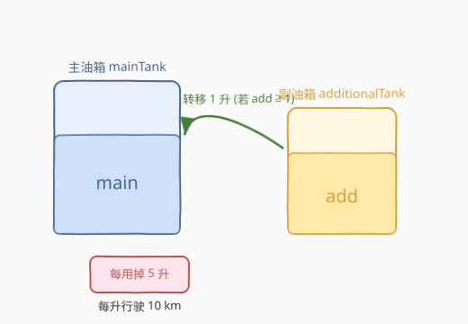
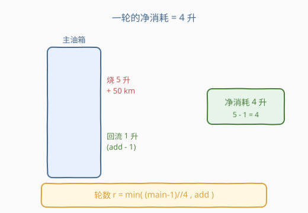
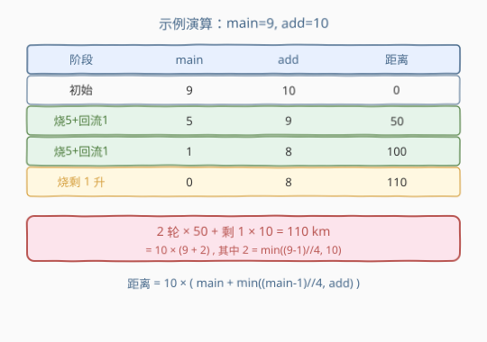

# LeetCode 总行驶距离 题解

## 1. 题目概述

- **标题 / 题号**：总行驶距离（#2739，easy）
- **链接**：https://leetcode.cn/problems/total-distance-traveled/
- **难度**：简单
- **标签**：数学、模拟

**题意**：卡车有两个油箱。给你两个整数，`mainTank` 表示主油箱中的燃料（以升为单位），`additionalTank` 表示副油箱中的燃料（以升为单位）。

该卡车每耗费 `1` 升燃料都可以行驶 `10` km。每当主油箱使用了 `5` 升燃料时，如果副油箱至少有 `1` 升燃料，则会将 `1` 升燃料从副油箱转移到主油箱。

返回卡车可以行驶的最大距离。

> ⚠️ 注意：从副油箱向主油箱注入燃料**不是连续行为**。这一事件会在每消耗 `5` 升燃料时突然且立即发生。

**示例 1**：

```text
输入：mainTank = 5, additionalTank = 10
输出：60
解释：
在用掉 5 升燃料后，主油箱中还剩下 (5 - 5 + 1) = 1 升，行驶距离为 50km。
在用掉剩下的 1 升燃料后，没有新的燃料注入到主油箱中，主油箱变空。
总行驶距离为 60km。
```

**示例 2**：

```text
输入：mainTank = 1, additionalTank = 2
输出：10
解释：
在用掉 1 升燃料后，主油箱变空。
总行驶距离为 10km。
```

**约束**：

- `1 <= mainTank, additionalTank <= 100`

## 2. 解题思路

### 2.1 暴力思路：逐升模拟

最直接的做法是按题意逐升模拟：用一个计数器 `used` 记录距上次转移后已消耗的升数，每烧 1 升距离 +10、`used` +1；当 `used` 到 5 且副油箱非空时，转移 1 升并重置 `used`。该过程最坏循环 `mainTank + additionalTank` 次（≤ 200），完全可行。

### 2.2 核心观察：「一轮」净消耗 4 升



把「烧 5 升 → 回流 1 升」视作一个**完整轮次**。一轮内：

- 从主油箱烧掉 `5` 升，距离 `+50` km；
- 若副油箱 `≥ 1`，立刻回流 `1` 升到主油箱。

因此**一轮对主油箱的净消耗只有 `5 − 1 = 4` 升**，副油箱消耗 `1` 升。



> 💡 关键转化：只要主油箱「够再开一轮」（即开始时 `main ≥ 5`）且副油箱非空，就能进行一轮，净扣 4 升主油箱、1 升副油箱、贡献 50 km。

那么最多能跑多少轮？设跑了 $r$ 轮。要开第 $r$ 轮，开始时主油箱需 `≥ 5`。每轮净扣 4，第 $r$ 轮开始时主油箱剩余为 $\text{main} - 4(r-1)$，要求它 $\ge 5$，即 $r \le \dfrac{\text{main}-1}{4}$，故

$$r_{\max} = \left\lfloor \frac{\text{main}-1}{4} \right\rfloor$$

同时 $r$ 不能超过副油箱存量：$r \le \text{add}$。所以实际轮数

$$r = \min\!\left(\left\lfloor \frac{\text{main}-1}{4} \right\rfloor,\ \text{add}\right).$$

跑完 $r$ 轮后，主油箱还剩 $\text{main} - 4r$ 升（已无副油箱补充），全部烧完。总距离：

$$\text{dist} = 10 \times \bigl(\text{main} - 4r + 5r\bigr)?$$

更简单地理解：**总共烧掉的升数** = 初始 `main` + 回流的 `r` 升 = $\text{main} + r$（因为回流进来的油最终也被烧掉）。于是

$$\boxed{\text{dist} = 10 \times \bigl(\text{main} + \min(\lfloor (\text{main}-1)/4 \rfloor,\ \text{add})\bigr)}$$

### 2.3 算法流程图



### 2.4 示例演算

以 `main = 9, add = 10` 为例：

| 阶段 | main | add | 距离 |
|------|------|-----|------|
| 初始 | 9 | 10 | 0 |
| 烧 5 + 回流 1（一轮） | 5 | 9 | 50 |
| 烧 5 + 回流 1（二轮） | 1 | 8 | 100 |
| 烧剩 1 升 | 0 | 8 | 110 |

套公式：$r = \min(\lfloor 8/4 \rfloor, 10) = \min(2, 10) = 2$，距离 $= 10 \times (9 + 2) = 110$。✅

## 3. 参考代码

### C++

```cpp
// 数学 O(1) 解法
class Solution {
public:
    int distanceTraveled(int mainTank, int additionalTank) {
        int rounds = min((mainTank - 1) / 4, additionalTank);
        return (mainTank + rounds) * 10;
    }
};
```

### Python

```python
# 写法一：数学 O(1)
class Solution:
    def distanceTraveled(self, mainTank: int, additionalTank: int) -> int:
        rounds = min((mainTank - 1) // 4, additionalTank)
        return (mainTank + rounds) * 10


# 写法二：逐升模拟（更直观，便于理解题意）
class Solution:
    def distanceTraveled(self, mainTank: int, additionalTank: int) -> int:
        dist = used = 0
        while mainTank > 0:
            mainTank -= 1
            used += 1
            dist += 10
            if used == 5:
                used = 0
                if additionalTank >= 1:
                    additionalTank -= 1
                    mainTank += 1
        return dist
```

## 4. 复杂度分析

| 维度 | 复杂度 | 说明 |
|------|--------|------|
| 时间复杂度（数学） | $O(1)$ | 一行公式，常数次运算 |
| 空间复杂度（数学） | $O(1)$ | 仅用常数变量 |
| 时间复杂度（模拟） | $O(\text{main}+\text{add})$ | 每升烧一次，最多约 200 步 |

## 5. 扩展：模拟到公式的推导方法

本题展示了「**模拟找规律 → 抽象成等价代数式**」的典型套路：

1. 先写一个**忠实模拟**版本，保证正确性（用于对拍验证公式）；
2. 观察重复的「最小单元」（这里是「烧 5 回 1」），算出**单元的净消耗**；
3. 用净消耗反推**最大轮数**，注意两个上界（主油箱够不够开下一轮、副油箱够不够补给）；
4. 把「总烧油量」拆成「初始 + 回流」两部分，得到闭式解。

> ⚠️ 易错点：`r` 的主油箱上界是 $\lfloor (\text{main}-1)/4 \rfloor$ 而非 $\lfloor \text{main}/4 \rfloor$。因为开第 $r$ 轮要求开始时 $\ge 5$，对应 $\text{main}-4(r-1)\ge 5$，解出 $r\le(\text{main}-1)/4$。差一格会导致多算一轮（例如 `main=4` 时应为 0 轮，若用 `main/4` 会错算成 1 轮）。

## 6. 面试要点

1. **为什么是 `(main-1)//4` 而不是 `main//4`？**
   - 要开第 $r$ 轮，开始时主油箱需 $\ge 5$，即 $\text{main}-4(r-1)\ge 5$，得 $r\le(\text{main}-1)/4$。`main=4` 时两种写法分别得 0、1，前者正确（4 升不够触发任何一轮）。

2. **模拟法和公式法结果是否恒等？**
   - 是。公式法本质是把模拟里的「烧 5 回 1」循环折叠成乘除；可用对拍验证任意 `main,add ∈ [1,100]`。

3. **副油箱上界为何是 `add`？**
   - 每轮消耗副油箱 1 升，最多开 `add` 轮后副油箱归零，之后即便主油箱还够也再无回流。

4. **题目强调「不是连续行为」是什么意思？**
   - 转移只在「累计烧满 5 升」的瞬间触发一次，不会因为主油箱恰好为 4 又有副油箱就提前转；要严格在达到 5 的那一刻处理。

5. **如果约束放大到 $10^9$，模拟还行得通吗？**
   - 不行，必须用 $O(1)$ 公式。这正是先模拟验证、再化公式的好处：当数据范围变大时直接套闭式解。

## 同类练习题

| # | 题目 | 与本题的关联 |
|---|------|-------------|
| 258 | [各位相加](https://leetcode.cn/problems/add-digits/) | 逐位模拟 → $O(1)$ 数根公式，同属「模拟找规律后化闭式解」。 |
| 172 | [阶乘后的零](https://leetcode.cn/problems/factorial-trailing-zeroes/) | 逐个乘 → $O(\log n)$ 勒让德公式，数学化简典型题。 |
| 1281 | [整数的各位积和之差](https://leetcode.cn/problems/subtract-the-product-and-sum-of-digits-of-an-integer/) | 按位模拟计算，简单的数学/模拟入门题。 |
| 292 | [Nim 游戏](https://leetcode.cn/problems/nim-game/) | 博弈模拟 → $n\bmod 4\ne0$ 一行公式，从过程抽象到充要条件。 |
