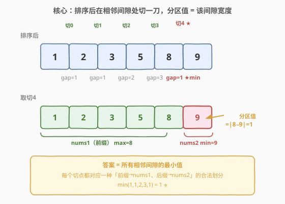
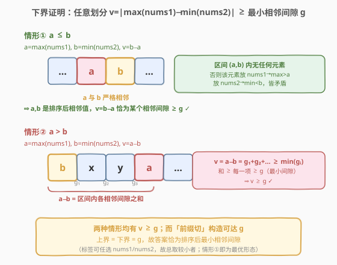
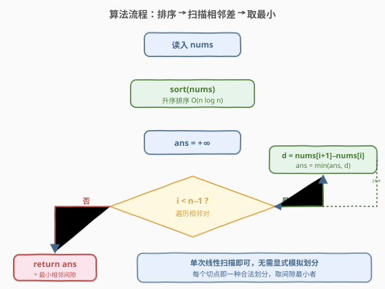
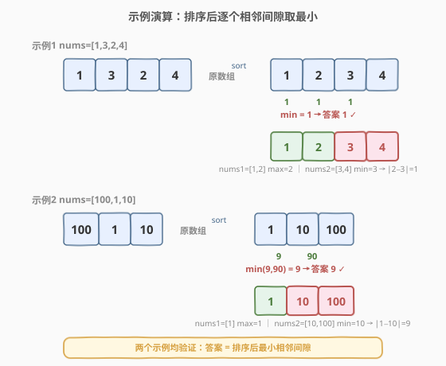

# LeetCode 找出分区值 题解

## 1. 题目概述

- **标题 / 题号**：找出分区值（#2740，medium）
- **链接**：https://leetcode.cn/problems/find-the-value-of-the-partition/
- **难度**：中等
- **标签**：数组、排序

**题意**：给你一个 **正** 整数数组 `nums`。将 `nums` 分成两个数组 `nums1` 和 `nums2`，并满足下述条件：

- 数组 `nums` 中的每个元素都属于数组 `nums1` 或数组 `nums2`。
- 两个数组都 **非空**。
- **分区值** 最小。

分区值的计算方法是 `|max(nums1) - min(nums2)|`。其中 `max(nums1)` 表示数组 `nums1` 中的最大元素，`min(nums2)` 表示数组 `nums2` 中的最小元素。返回表示分区值的整数。

**示例 1**：

```text
输入：nums = [1,3,2,4]
输出：1
解释：可以将数组 nums 分成 nums1 = [1,2] 和 nums2 = [3,4]。
- 数组 nums1 的最大值等于 2。
- 数组 nums2 的最小值等于 3。
分区值等于 |2 - 3| = 1。
可以证明 1 是所有分区方案的最小值。
```

**示例 2**：

```text
输入：nums = [100,1,10]
输出：9
解释：可以将数组 nums 分成 nums1 = [10] 和 nums2 = [100,1]。
- 数组 nums1 的最大值等于 10。
- 数组 nums2 的最小值等于 1。
分区值等于 |10 - 1| = 9。
可以证明 9 是所有分区方案的最小值。
```

**约束**：

- $2 \le \text{nums.length} \le 10^5$
- $1 \le \text{nums[i]} \le 10^9$

> ⚠️ **关键信号**：求的是「把数组拆两半后，两半极端值之差」的最小化。这种「极值差」问题几乎必然要**排序**——排序后所有候选极值都落在相邻位置，问题瞬间退化成线性扫描。

## 2. 解题思路

### 2.1 暴力思路

枚举所有把 `nums` 拆成两个非空子集的方案（每个元素二选一，共 $2^{n}-2$ 种），对每种方案算出 $|\max(\text{nums1})-\min(\text{nums2})|$ 取最小。$n=10^5$ 时完全不可行。需要利用「极值差最小」的结构，避免枚举划分。

### 2.2 核心观察：排序后答案 = 最小相邻间隙



先把数组**升序排序**。考察一种「最规整」的划分方式：**前缀归 `nums1`、后缀归 `nums2`**，即

$$\text{nums1} = \text{nums}[0..i],\quad \text{nums2} = \text{nums}[i+1..n-1]$$

此时 $\max(\text{nums1})=\text{nums}[i]$、$\min(\text{nums2})=\text{nums}[i+1]$，且因已排序 $\text{nums}[i]\le\text{nums}[i+1]$，分区值为

$$\text{nums}[i+1]-\text{nums}[i].$$

每个切点 $i\in[0,n-2]$ 都对应一种合法划分（两半皆非空），因此

$$\text{ans}\le \min_{0\le i<n-1}\bigl(\text{nums}[i+1]-\text{nums}[i]\bigr)\;=:\;g.$$

> 💡 **更妙的是下界也等于 $g$**：对任意划分（含标签任选），设 $a=\max(\text{nums1})$、$b=\min(\text{nums2})$。分两种情形都能推出 $v=|a-b|\ge g$，于是上界即下界，答案恰为 $g$。证明见下图。

### 2.3 下界证明：两种情形均有 v ≥ g



- **情形① $a\le b$**：$v=b-a$。若存在元素 $x$ 严格在 $(a,b)$ 内，它放入 `nums1` 会使 $\max>a$、放入 `nums2` 会使 $\min<b$，均矛盾。故 $(a,b)$ 内无元素，$a$ 与 $b$ 在排序后**严格相邻**，$v=b-a$ 恰为某个相邻间隙 $\ge g$。
- **情形② $a>b$**：$v=a-b$。$a,b$ 是数组中两个元素且 $a>b$，在排序后它们之间隔着若干相邻间隙，$a-b$ 等于这些间隙之和，**和 ≥ 每一项 ≥ $g$**。

两种情形都有 $v\ge g$；而前缀切构造可达 $g$，故 $\boxed{\text{ans}=g=\min_i(\text{nums}[i+1]-\text{nums}[i])}$。

### 2.4 算法流程图



### 2.5 示例演算



- `nums=[1,3,2,4]` → 排序 `[1,2,3,4]`，间隙 `1,1,1`，$\min=1$。取切点 $i=1$：`nums1=[1,2]`、`nums2=[3,4]`，$|2-3|=1$。✅
- `nums=[100,1,10]` → 排序 `[1,10,100]`，间隙 `9,90`，$\min=9$。取切点 $i=0$：`nums1=[1]`、`nums2=[10,100]`，$|1-10|=9$。✅

> ⚠️ 注意示例 2 官方给的 `nums1=[10]`、`nums2=[100,1]` 得 $|10-1|=9$，是情形②（$a>b$）的形态；我们用更规整的前缀切 `nums1=[1]`、`nums2=[10,100]` 得到相同的 $9$。两种形态殊途同归，**最小值不变**，但前缀切更易实现且天然对应情形①。

## 3. 参考代码

### C++

```cpp
class Solution {
public:
    int findValueOfPartition(vector<int>& nums) {
        sort(nums.begin(), nums.end());
        int ans = INT_MAX;
        for (int i = 0; i + 1 < (int)nums.size(); ++i)
            ans = min(ans, nums[i + 1] - nums[i]);
        return ans;
    }
};
```

### Python

```python
class Solution:
    def findValueOfPartition(self, nums: List[int]) -> int:
        nums.sort()
        return min(nums[i + 1] - nums[i] for i in range(len(nums) - 1))
```

> 💡 **写法选择**：C++ 用 `INT_MAX` 初值配合逐项 `min`，避免依赖 `numeric_limits`；Python 用生成器 + `min` 一行表达，简洁且零额外空间。两种写法本质一致：排序后线性扫相邻差。

## 4. 复杂度分析

| 维度 | 复杂度 | 说明 |
|------|--------|------|
| 时间复杂度 | $O(n\log n)$ | 排序主导；线性扫描 $O(n)$ 可忽略 |
| 空间复杂度 | $O(\log n)$ | 排序递归/迭代栈（原地排序，无额外数组） |

$n=10^5$ 时排序约 $1.7\times10^6$ 次比较，毫秒级完成。

## 5. 扩展：为什么「前缀切」就够了

直觉上「随便拆」似乎可能比「前缀切」更优，但证明告诉我们**不会**：任何划分的分区值都被某个相邻间隙下界住，而前缀切恰好命中每个相邻间隙。换言之：

- 最优解一定能让 $\max(\text{nums1})\le\min(\text{nums2})$（即情形①）——因为若处于情形②，把两半**交换标签**就能转化为情形①且值不增（取两种标签的较小者）。
- 情形①下，$\max(\text{nums1})$ 与 $\min(\text{nums2})$ 必定是排序后相邻值，故等价于在某个相邻间隙处切一刀。

> 💡 **一类套路**：「最小化两个集合的极值差」→ 排序后枚举切点取最小相邻差。同类有「最小化删若干元素后的极差」（1509）等，骨架完全一致：**排序 + 在相邻结构上找最优切点**。

## 6. 面试要点

1. **为什么排序后只看相邻差就行，不用枚举所有子集划分？**
   - 最优解可转化为情形①（$\max(\text{nums1})\le\min(\text{nums2})$），此时两半的极端值在排序后必定相邻，分区值恰为某个相邻间隙；枚举 $n-1$ 个切点即覆盖所有候选，无需 $2^n$ 枚举。

2. **`nums1`/`nums2` 的标签可以随便交换吗？**
   - 可以。分区值对标签不对称（$|\max(\text{nums1})-\min(\text{nums2})|$），但题目允许我们自行指派哪个集合叫 `nums1`，故对任一集合划分取两种标签的较小者。最优解总可取到情形①形态。

3. **元素有重复时结论还成立吗？**
   - 成立。重复元素会使最小相邻间隙 $g$ 可能为 $0$（两个相等元素相邻），此时答案为 $0$，把它们分到两半即可；证明中情形①对 $a=b$ 的处理同样给出 $v=0=g$。

4. **数据范围 $n\le10^5$、$10^9$ 对算法选择的影响？**
   - 排除 $O(2^n)$ 子集枚举，必须 $O(n\log n)$ 起步；$10^9$ 的值域不影响排序解法（不依赖值域分桶），差值用 `int` 足够（$<10^9$），无需开 `long long`。

5. **如果改成「分成 $k$ 组，最小化相邻组的极值差」？**
   - 排序后在 $n-1$ 个相邻间隙中选 $k-1$ 个切点，最大化被切掉的间隙之和等价于最小化相邻组极值差之和/最大者——仍是「排序 + 相邻间隙」的延伸，骨架不变。

## 同类练习题

| # | 题目 | 与本题的关联 |
|---|------|-------------|
| 912 | [排序数组](https://leetcode.cn/problems/sort-an-array/)（[站内题解](../0901-1000/912_排序数组.md)） | 排序母题，本题的排序步骤即其直接应用。 |
| 1509 | [三次操作后最大值与最小值的最小差](https://leetcode.cn/problems/minimum-difference-between-largest-and-smallest-value-in-three-moves/)（[站内题解](../1501-1600/1509_三次操作后最大值与最小值的最小差.md)） | 同骨架——排序后删至多 3 个元素使极差最小，相邻间隙思路的进阶。 |
| 561 | [数组拆分](https://leetcode.cn/problems/array-partition/)（[站内题解](../0501-0600/561_数组拆分.md)） | 排序后两两配对取较小者求和，同样是「排序 + 相邻结构」贪心。 |
| 628 | [三个数的最大乘积](https://leetcode.cn/problems/maximum-product-of-three-numbers/)（[站内题解](../0601-0700/628_三个数的最大乘积.md)） | 排序后从首尾取极值组合，对照体会排序如何让极值问题降维。 |
