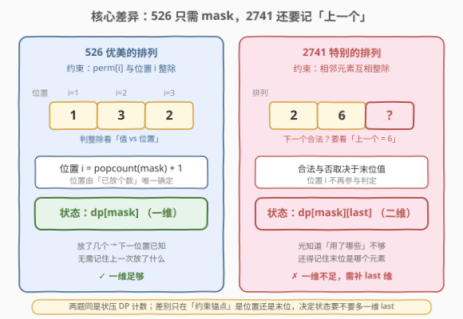
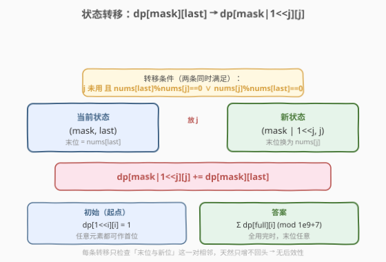
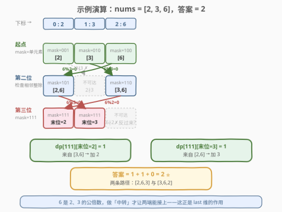

# 特别的排列

- **题目名称**：特别的排列
- **链接**：[2741. 特别的排列](https://leetcode.cn/problems/special-permutations/)
- **难度**：中等
- **标签**：位运算、数组、动态规划、状态压缩

## 1. 题目概述

给你一个下标从 **0** 开始、含 `n` 个**互不相同**正整数的数组 `nums`。若 `nums` 的一个排列满足：对每个 `0 <= i < n - 1`，要么 `nums[i] % nums[i+1] == 0`，要么 `nums[i+1] % nums[i] == 0`，则称它是一个**特别的排列**。返回特别排列的总数，答案对 $10^9 + 7$ 取余。

**示例 1**：

```text
输入：nums = [2,3,6]
输出：2
解释：[3,6,2] 和 [2,6,3] 是两个特别的排列。
```

**示例 2**：

```text
输入：nums = [1,4,3]
输出：2
解释：[3,1,4] 和 [4,1,3] 是两个特别的排列。
```

**约束条件**：

- $2 \le \text{nums.length} \le 14$
- $1 \le \text{nums[i]} \le 10^9$
- `nums` 中所有整数互不相同

> ⚠️ **关键信号**：`n ≤ 14` 是**状压 DP** 的标志性数据范围——$2^{14} = 16384$ 个状态，落在「可枚举所有子集」的甜区。这题与站内已有题解 [526. 优美的排列](../0501-0600/526_优美的排列.md) 同源，差别只在「约束锚点」，下面详述。

---

## 2. 解题思路

### 2.1 暴力思路

枚举 `nums` 的所有全排列（共 $n!$ 种），逐个检查 $n-1$ 对相邻元素是否互相整除。$n=14$ 时 $14! \approx 8.7 \times 10^{10}$，远超时限。需要用记忆化避免对「同一组已选元素」的重复搜索。

### 2.2 核心观察：与 526 的关键差异——需要记住「上一个」

排列是逐位填出来的。要判断下一个元素 `nums[j]` 能否接上，本题看的是它和**前一个元素**的整除关系；而 526 看的是元素与其**位置编号**的整除关系。这一差别决定了状态维数：



- **526**：位置 `pos = popcount(mask) + 1` 由「已放个数」唯一确定，所以**一维 `mask` 就刻画了全部信息**。
- **2741**：合法性只取决于**末位值**，与位置无关。光知道「哪些用了」还不够——同一个已用集合可以以**不同末位**到达，而不同末位对下一个元素的取舍不同。所以必须补一维 `last`（末位元素的下标）。

> 💡 **判断要不要加维的经验**：若转移的合法性只依赖「集合本身 + 一个可由集合推导的量（如个数→位置）」，一维 `mask` 足够；若依赖「集合外」的额外历史信息（如末位值），就必须把该信息纳入状态。本题正是后者。

### 2.3 状态定义与转移

定义 $\text{dp}[\text{mask}][\text{last}]$ = 已放置集合为 `mask`、末位元素为 `nums[last]` 时，能延伸出的特别排列数。

枚举下一个尚未使用的元素 `j`，若它与末位互相整除，就转移到 `mask | (1<<j)`、新末位 `j`：



$$
\text{dp}[\text{mask} \mid (1 \ll j)][\,j\,] \mathrel{+}= \text{dp}[\text{mask}][\text{last}]
$$

转移条件：`j` 未用（`mask` 第 `j` 位为 0），且 $\text{nums}[\text{last}] \bmod \text{nums}[j] = 0 \;\lor\; \text{nums}[j] \bmod \text{nums}[\text{last}] = 0$。

- **初始**：$\text{dp}[1 \ll i][i] = 1$（任意元素都可作首位，没有前驱故无约束）。
- **答案**：$\sum_i \text{dp}[\text{full}][i] \bmod (10^9+7)$，`full = (1<<n)-1`。

> ⚠️ **取余细节**：转移中加法即可溢出，需在累加后取余；记忆化版本返回前取余即可。由于每个 `(mask,last)` 状态唯一确定「已选集合 + 末位」，从 `start` 到 `full` 的每条合法排列路径与 DAG 上一一对应，无重复无遗漏。

### 2.4 示例演算

以 `nums = [2,3,6]`（下标 0/1/2）为例，逐层填充 DP：



- **起点**：`dp[001][0]=dp[010][1]=dp[100][2]=1`，对应单元素排列 `[2]`、`[3]`、`[6]`。
- **第二位**：`2` 与 `3` 互不整除（不可接）；`2` 与 `6`（`6%2=0`）、`3` 与 `6`（`6%3=0`）可接。故可达 `dp[101]`（末位 2 或 6）、`dp[110]`（末位 3 或 6）。
- **第三位**：只有末位为 `6` 的状态能继续——
  - `[2,6]` 末位 `6` → 加 `3`（`6%3=0`）⇒ `dp[111][末位=3]=1`；
  - `[3,6]` 末位 `6` → 加 `2`（`6%2=0`）⇒ `dp[111][末位=2]=1`。
- **答案**：`dp[111][0]+dp[111][1]+dp[111][2] = 1+1+0 = 2` ⭐，对应 `[2,6,3]` 与 `[3,6,2]`。

> 💡 `6` 是 `2`、`3` 的公倍数，做「中转」才让两端能接上——这正是 `last` 维的作用：末位为 `2` 时接不上 `3`，末位为 `6` 时却可以。

---

## 3. 参考代码

### 方法一：记忆化搜索（自顶向下，最直观）

### Python

```python
class Solution:
    def specialPerm(self, nums: List[int]) -> int:
        MOD = 10**9 + 7
        n = len(nums)
        full = (1 << n) - 1

        @lru_cache(None)
        def dfs(mask: int, last: int) -> int:
            if mask == full:
                return 1
            total = 0
            for j in range(n):
                if mask >> j & 1:
                    continue
                if nums[last] % nums[j] == 0 or nums[j] % nums[last] == 0:
                    total += dfs(mask | (1 << j), j)
            return total % MOD

        ans = 0
        for i in range(n):                 # 任选首位起步
            ans += dfs(1 << i, i)
        return ans % MOD
```

### C++

```cpp
class Solution {
public:
    int specialPerm(vector<int>& nums) {
        const int MOD = 1e9 + 7;
        int n = nums.size();
        int full = (1 << n) - 1;
        vector<vector<int>> memo(1 << n, vector<int>(n, -1));

        function<int(int,int)> dfs = [&](int mask, int last) -> int {
            if (mask == full) return 1;
            if (memo[mask][last] != -1) return memo[mask][last];
            long long total = 0;
            for (int j = 0; j < n; ++j) {
                if (mask >> j & 1) continue;
                if (nums[last] % nums[j] == 0 || nums[j] % nums[last] == 0) {
                    total += dfs(mask | (1 << j), j);
                }
            }
            return memo[mask][last] = total % MOD;
        };

        long long ans = 0;
        for (int i = 0; i < n; ++i)          // 任选首位起步
            ans += dfs(1 << i, i);
        return ans % MOD;
    }
};
```

### 方法二：递推（自底向上，常数更小）

按 `mask` 从小到大枚举，把贡献「推」给更大的状态，无递归栈、更工程化。

### C++

```cpp
class Solution {
public:
    int specialPerm(vector<int>& nums) {
        const int MOD = 1e9 + 7;
        int n = nums.size();
        int full = (1 << n) - 1;
        vector<vector<int>> dp(1 << n, vector<int>(n, 0));
        for (int i = 0; i < n; ++i) dp[1 << i][i] = 1;      // 起点
        for (int mask = 1; mask <= full; ++mask) {
            for (int last = 0; last < n; ++last) {
                if (dp[mask][last] == 0 || !(mask >> last & 1)) continue;  // 不可达/末位不在集合
                for (int j = 0; j < n; ++j) {
                    if (mask >> j & 1) continue;           // 已用
                    if (nums[last] % nums[j] == 0 || nums[j] % nums[last] == 0) {
                        int nm = mask | (1 << j);
                        dp[nm][j] = (dp[nm][j] + dp[mask][last]) % MOD;
                    }
                }
            }
        }
        int ans = 0;
        for (int i = 0; i < n; ++i) ans = (ans + dp[full][i]) % MOD;
        return ans;
    }
};
```

### Python

```python
class Solution:
    def specialPerm(self, nums: List[int]) -> int:
        MOD = 10**9 + 7
        n = len(nums)
        full = (1 << n) - 1
        dp = [[0] * n for _ in range(1 << n)]
        for i in range(n):
            dp[1 << i][i] = 1
        for mask in range(1, 1 << n):
            for last in range(n):
                if dp[mask][last] == 0 or not (mask >> last & 1):
                    continue
                for j in range(n):
                    if mask >> j & 1:
                        continue
                    if nums[last] % nums[j] == 0 or nums[j] % nums[last] == 0:
                        nm = mask | (1 << j)
                        dp[nm][j] = (dp[nm][j] + dp[mask][last]) % MOD
        return sum(dp[full]) % MOD
```

> 💡 **小技巧**：`if dp[mask][last] == 0: continue` 跳过大量「从空集走不到」的不可达状态，常数优化明显。`__builtin_popcount` / `int.bit_count()` 等用法在 526 题解中已介绍，本题不依赖位置故未用到 popcount。

---

## 4. 复杂度分析

| 维度 | 复杂度 | 说明 |
|------|--------|------|
| 时间复杂度 | $O(n^2 \cdot 2^n)$ | 共 $n \cdot 2^n$ 个状态，每个状态枚举 $n$ 个候选元素判定转移 |
| 空间复杂度 | $O(n \cdot 2^n)$ | `dp`/`memo` 数组大小为 $2^n \times n$ |

$n=14$ 时约为 $14^2 \times 2^{14} \approx 3.2 \times 10^6$ 次操作，毫秒级完成。可达状态远少于理论上限（相邻整除约束剪枝很强），常数很小。

---

## 5. 扩展：与 526 的状态设计对照

本题与 [526. 优美的排列](../0501-0600/526_优美的排列.md) 是一对镜像题，骨架同为「状压 DP 计数排列」，差异只在约束锚点与随之而来的状态维数：

| 维度 | 526 优美的排列 | 2741 特别的排列 |
|------|----------------|------------------|
| 约束对象 | 元素 **vs 位置** $i$ | 相邻**元素之间** |
| 约束形式 | $\text{perm}[i] \bmod i = 0 \lor i \bmod \text{perm}[i] = 0$ | $\text{nums}[i] \bmod \text{nums}[i\!+\!1] = 0 \lor \text{nums}[i\!+\!1] \bmod \text{nums}[i] = 0$ |
| 位置是否参与 | 参与，位置由 `popcount` 推出 | 不参与，位置无意义 |
| 状态维数 | 一维 $\text{dp}[\text{mask}]$ | 二维 $\text{dp}[\text{mask}][\text{last}]$ |
| 时间复杂度 | $O(n \cdot 2^n)$ | $O(n^2 \cdot 2^n)$ |

> 💡 **共性骨架**：两者都把「排列逐位构造」建模为「在已用集合上扩展」的 DAG，状态 = 已用集合的位掩码，答案 = 走到全 1 状态的路径数。判断要不要加维的准则见 2.2 节。**面试中遇到「排列 + 相邻关系」计数，第一反应应是 $\text{dp}[\text{mask}][\text{last}]$。**

---

## 6. 面试要点

1. **为什么状态要加 `last` 维，不能像 526 那样只用 `mask`？**

   - 本题合法性取决于**末位值**与**新值**的整除关系，而末位值不能由 `mask`（已用集合）唯一推出——同一集合可由不同末位到达，它们对新元素的取舍不同。526 的合法性取决于位置，而位置 = `popcount(mask)+1` 可由集合推出，故无需 `last`。

2. **为什么 `n ≤ 14` 提示状压 DP？**

   - $2^{14} = 16384$，状态空间可承受；一般 `n ≤ 20` 的「选/不选」计数/最值问题都可考虑状压 DP。多一维 `last` 后状态数为 $n \cdot 2^n \approx 2.3 \times 10^5$，仍稳过。

3. **初始值为什么是 `dp[1<<i][i]=1` 而非 `dp[0][?]=1`？**

   - 首位没有前驱，无需整除判定，任选一个起步即可合法。故以每个单元素排列为起点（值 1），从这些起点向更大队列扩展。若设 `mask=0` 为起点，还需额外约定「无末位」的虚拟态，不如直接以 $n$ 个单元素状态起步简洁。

4. **答案为什么是 $\sum_i \text{dp}[\text{full}][i]$？**

   - `full` 表示所有元素都已放置，即排列已完整。末位可以是任一元素，每种末位对应不同排列集合，互斥求和即总数。

5. **如何输出所有具体的特别排列，而不只是计数？**

   - 在 DFS 回溯里维护 `path`，到达 `mask==full` 时存一份；状压 DP 适合计数，**要还原方案时回溯更直接**。

---

## 7. 同类练习题

- [526. 优美的排列](https://leetcode.cn/problems/beautiful-arrangement/)（[站内题解](../0501-0600/526_优美的排列.md)）：本题的「位置约束」镜像题，一维 `mask` 即可；对照可体会「约束锚点决定状态维数」
- [996. 平方数组的数目](https://leetcode.cn/problems/number-of-squareful-arrays/)：相邻两数之和须为完全平方数，同样用 $\text{dp}[\text{mask}][\text{last}]$ 计数，与本题状态设计完全同构（注意含重复元素需去重）
- [943. 最短超级串](https://leetcode.cn/problems/find-the-shortest-superstring/)：相邻拼接求最短总长，$\text{dp}[\text{mask}][\text{last}]$ 改求最值 + 记录前驱还原方案
- [1655. 分配重复整数](https://leetcode.cn/problems/distribute-repeating-integers/)：状压 DP 进阶，`mask` 表示已满足的需求子集，承接本题「集合扩展」思路
- [46. 全排列](https://leetcode.cn/problems/permutations/)（[站内题解](../0001-0100/46_全排列.md)）：朴素回溯生成全排列的母题，对比体会「加记忆化 → 状压 DP」的演化
