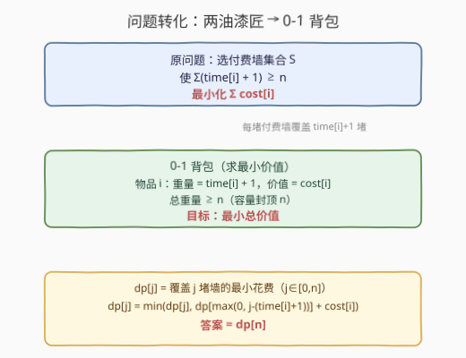
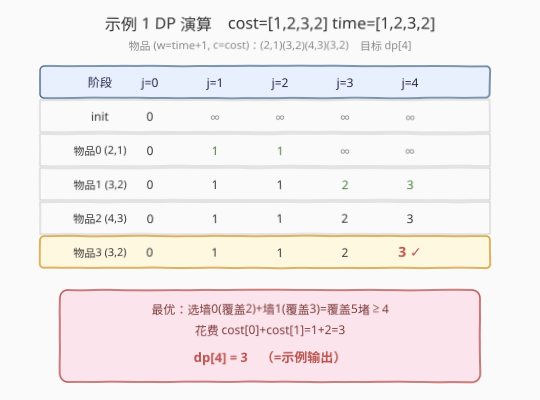

# 给墙壁刷油漆

- **题目名称**：给墙壁刷油漆
- **链接**：[2742. 给墙壁刷油漆](https://leetcode.cn/problems/painting-the-walls/)
- **难度**：困难
- **标签**：数组、动态规划

## 1. 题目概述

给你两个长度为 `n` 下标从 0 开始的整数数组 `cost` 和 `time`，分别表示给 `n` 堵不同的墙刷油漆需要的开销和时间。你有两名油漆匠：

- 一位**付费**的油漆匠，刷第 `i` 堵墙需要花费 `time[i]` 单位的时间，开销为 `cost[i]` 单位的钱。
- 一位**免费**的油漆匠，刷任意一堵墙的时间为 `1` 单位，开销为 `0`。但是必须在付费油漆匠**工作时**，免费油漆匠才会工作。

请你返回刷完 `n` 堵墙最少开销为多少。

**示例 1**：

```text
输入：cost = [1,2,3,2], time = [1,2,3,2]
输出：3
解释：下标为 0 和 1 的墙由付费油漆匠来刷，需要 3 单位时间。同时，免费油漆匠刷下标为 2 和 3 的墙，需要 2 单位时间，开销为 0。总开销为 1 + 2 = 3。
```

**示例 2**：

```text
输入：cost = [2,3,4,2], time = [1,1,1,1]
输出：4
解释：下标为 0 和 3 的墙由付费油漆匠来刷，需要 2 单位时间。同时，免费油漆匠刷下标为 1 和 2 的墙，需要 2 单位时间，开销为 0。总开销为 2 + 2 = 4。
```

**约束条件**：

- `1 <= cost.length <= 500`
- `cost.length == time.length`
- `1 <= cost[i] <= 10^6`
- `1 <= time[i] <= 500`

---

## 2. 解题思路

### 2.1 暴力思路

`n` 堵墙每堵要么由付费油漆匠刷、要么由免费油漆匠刷，枚举每个子集 $S$（付费刷的墙），则总付费时间 $T = \sum_{i \in S} \text{time}[i]$。免费油漆匠只能在付费油漆匠工作期间工作，每堵免费墙耗时 1 单位，因此能免费刷的墙数不超过 $T$。而免费墙的数量恰为 $n - |S|$，可行需满足 $n - |S| \le T$，即 $\sum_{i \in S}(\text{time}[i] + 1) \ge n$。在所有可行 $S$ 中取 $\sum \text{cost}[i]$ 最小者。

但子集枚举复杂度 $O(2^n)$，$n=500$ 不可行。

### 2.2 核心观察：付费刷墙 i ⇒ 覆盖 time[i] + 1 堵

关键直觉是**把"两个油漆匠并行"翻译成"一堵付费墙能覆盖多少堵"**：

![付费刷墙 i：免费油漆匠趁机白嫖 time[i] 堵](../images/p2742_two_painters_concept.svg)

当付费油漆匠刷墙 `i` 时，耗时 `time[i]`，这段时间里免费油漆匠可并行刷掉至多 `time[i]` 堵免费墙。再加上墙 `i` 本身被付费刷掉，**选择付费刷墙 i 等价于"覆盖了 `time[i] + 1` 堵墙，只花 `cost[i]`"**。

于是问题化为：每个墙 `i` 是一个物品，重量 = `time[i] + 1`、价值 = `cost[i]`，**选一组物品使总重量 ≥ n，最小化总价值**——标准 0-1 背包的最小价值变体。



> 💡 **为什么覆盖超过 n 也无所谓**：总覆盖只需"≥ n"，所以把超过 n 的需求封顶到 n 即可——`dp[j]` 下标只开到 `n`，转移时 `prev = max(0, j - (time[i]+1))`，需求为负时取 0。

### 2.3 状态设计与转移

令 `dp[j]` = 覆盖恰好 `j` 堵墙（需求封顶到 `n`）的最小花费，`j ∈ [0, n]`。

- 初始化：`dp[0] = 0`，`dp[1..n] = +∞`。
- 对每堵墙 `i`（物品重量 `w = time[i] + 1`，价值 `c = cost[i]`），**倒序**枚举 `j` 从 `n` 到 `1`（0-1 背包一维滚动，倒序保证每个物品只用一次）：
  - $\text{dp}[j] = \min(\text{dp}[j],\ \text{dp}[\max(0,\ j - w)] + c)$
- 答案为 `dp[n]`。

### 2.4 示例演算

以示例 1 `cost = [1,2,3,2]`、`time = [1,2,3,2]` 为例，物品 $(w=\text{time}+1,\ c=\text{cost})$ 依次为 $(2,1),(3,2),(4,3),(3,2)$，目标是 `dp[4]`：



绿色为该轮刚更新的格子，最终 `dp[4] = 3`（选墙 0 + 墙 1，覆盖 $2+3=5 \ge 4$，花费 $1+2=3$），与示例输出一致。

> ⚠️ 注意"重量超过需求"的处理：如墙 2 的 $w=4$，处理 `j=4` 时 `prev = max(0, 4-4) = 0`，即 $dp[0]+c = 0+3=3$，相当于"只刷这一堵墙就够覆盖 4 堵"——因为 `time[2]=3` 期间免费油漆匠能刷 3 堵，加上自身恰好 4 堵。

---

## 3. 参考代码

### 方法一：一维 0-1 背包（推荐）

### C++

```cpp
class Solution {
public:
    int paintWalls(vector<int>& cost, vector<int>& time) {
        int n = cost.size();
        const int INF = 1e9;
        vector<int> dp(n + 1, INF);
        dp[0] = 0;
        for (int i = 0; i < n; ++i) {
            int w = time[i] + 1, c = cost[i];
            for (int j = n; j >= 1; --j) {
                int prev = max(0, j - w);
                dp[j] = min(dp[j], dp[prev] + c);
            }
        }
        return dp[n];
    }
};
```

### Python

```python
class Solution:
    def paintWalls(self, cost: List[int], time: List[int]) -> int:
        n = len(cost)
        dp = [0] + [float('inf')] * n
        for c, t in zip(cost, time):
            w = t + 1
            for j in range(n, 0, -1):
                dp[j] = min(dp[j], dp[max(0, j - w)] + c)
        return dp[n]
```

### 方法二：记忆化 DFS（免费时长余额视角）

从另一个角度看：维护"免费油漆匠可用的时长余额 `j`"——付费刷墙 `i` 会让余额增加 `time[i]`（代价 `cost[i]`）；余额 `>0` 时可让免费油漆匠刷当前墙（余额 `-1`，代价 0）。从 `dp[0][0]` 出发递归。两种视角等价，便于理解"为什么能并行"。

### Python

```python
class Solution:
    def paintWalls(self, cost: List[int], time: List[int]) -> int:
        from functools import lru_cache
        n = len(cost)

        @lru_cache(None)
        def dfs(i: int, remain: int) -> int:
            if i == n:
                return 0 if remain >= 0 else float('inf')
            # remain 降到 -n 以下必然无解，封顶避免负得过大
            if remain < -n:
                return float('inf')
            # 付费刷墙 i：余额 +time[i]，花 cost[i]
            pay = cost[i] + dfs(i + 1, remain + time[i] - 1)
            # 免费刷墙 i：余额 -1，花 0（需 remain>0 才有意义）
            free = dfs(i + 1, remain - 1)
            return min(pay, free)

        return dfs(0, 0)
```

> 💡 方法二里 `remain` 可正可负，负值表示"欠"免费时长（已预支）。余额大到一定值后等价于"剩余墙全免费"，因此可以封顶；为简洁此处仅对极端负值剪枝。两种方法时间同为 $O(n^2)$。

---

## 4. 复杂度分析

| 维度 | 方法 | 复杂度 | 说明 |
|------|------|--------|------|
| 时间复杂度 | 一维背包 | $O(n^2)$ | 物品数 $n$ × 容量 $n$，二重循环 |
| 空间复杂度 | 一维背包 | $O(n)$ | 一维 `dp` 滚动数组，长度 $n+1$ |
| 时间复杂度 | 记忆化 DFS | $O(n^2)$ | 状态 $(i,\text{remain})$，`remain` 封顶到 $O(n)$ 级别 |
| 空间复杂度 | 记忆化 DFS | $O(n^2)$ | 记忆化表 + 递归栈 |

> ⚠️ 为什么是 $O(n^2)$ 而非 $O(n \cdot \max\text{time})$？因为 `time[i]` 最大 500、$n$ 最大 500，但 `dp` 下标封顶在 $n$：`prev = max(0, j-w)`，需求超过 $n$ 的部分被压缩，所以第二维只用 $[0,n]$。

---

## 5. 扩展

- **如果免费墙不是 1 单位时间**（即免费油漆匠刷墙耗时也随墙变化）：则不能简单地把 `time[i]+1` 当覆盖量，需回到调度问题，可能需按"性价比"贪心 + 区间 DP，复杂度上升。
- **如果两人都能付费**：退化为普通最短工期/最小开销调度，与本题的"免费搭便车"机制无关。
- **求方案而非最小开销**：在 DP 同时记录前驱 `choice[i][j]`，回溯即可还原选了哪些付费墙。

---

## 6. 面试要点

1. **怎么想到背包的？**
   - 关键是把"并行工作"转成"覆盖量"：付费刷墙 i 花掉 `time[i]` 时间，这段时间免费油漆匠能白嫖 `time[i]` 堵，故付费刷墙 i 等价于覆盖 `time[i]+1` 堵、花 `cost[i]`。需求"覆盖 n 堤"= 背包容量，最小花费 = 最小价值。

2. **为什么是 0-1 背包不是完全背包？**
   - 每堵墙最多被付费刷一次（一个物品选/不选），不是"可重复选"，故是 0-1 背包。

3. **一维滚动为什么倒序？**
   - 0-1 背包一维写法必须倒序 `j`，否则同一物品会在一次外循环内被"重复使用"（读到本轮刚更新的值），变成完全背包。

4. **`max(0, j-w)` 在干什么？**
   - 当物品重量 `w ≥ j` 时，单独这一堵付费墙就能覆盖需求 `j`，剩余需求视为 0（`dp[0]`），即 `dp[j] = min(dp[j], dp[0] + c) = min(dp[j], c)`。这是把"覆盖 ≥ n"用封顶处理的体现。

5. **`dp` 初值用多大的 INF？**
   - 最坏全付费：$n \cdot \max\text{cost} = 500 \times 10^6 = 5\times10^8$，故 `INF` 取 $10^9$ 以上即可（C++ 用 `1e9`，Python 用 `float('inf')` 更稳）。注意 C++ 用 `int` 时 $10^9 < 2^{31}-1$，不会溢出。

6. **能否贪心？**
   - 不能。性价比 $\frac{\text{cost}[i]}{\text{time}[i]+1}$ 贪心对背包不成立（0-1 背包无贪心最优性），需 DP。

---

## 7. 同类练习题

- [416. 分割等和子集](https://leetcode.cn/problems/partition-equal-subset-sum/)：0-1 背包判定型（能否凑出一半和），与本题同为 0-1 背包一维写法
- [1049. 最后一块石头的重量 II](https://leetcode.cn/problems/last-stone-weight-ii/)：0-1 背包求最小差，承接 416 的"分组"思想
- [322. 零钱兑换](https://leetcode.cn/problems/coin-change/)：完全背包求最少硬币数，对照本题 0-1 与"求最小价值"的写法差异
- [474. 一和零](https://leetcode.cn/problems/ones-and-zeroes/)：二维费用 0-1 背包，加深对"物品重量/容量"建模的理解
- [740. 删除并获得点数](https://leetcode.cn/problems/delete-and-earn/)：同样是"问题转化 + DP"的范式（值域建桶 → 打家劫舍），训练把题面翻译成模型的能力
