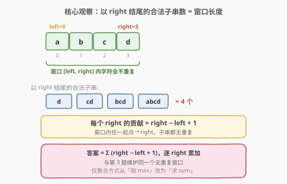
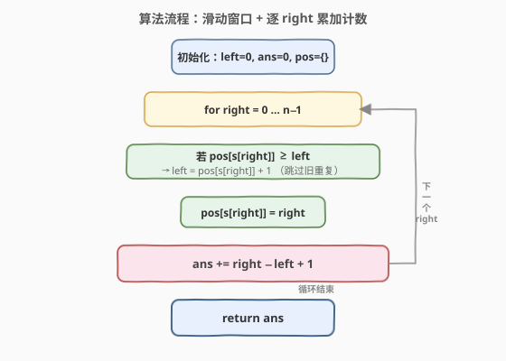
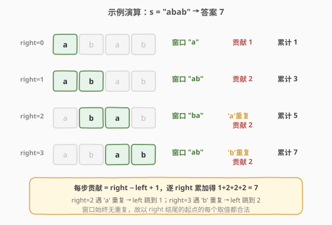

# 计算没有重复字符的子字符串数量

- **题目名称**：计算没有重复字符的子字符串数量
- **链接**：[2743. 计算没有重复字符的子字符串数量](https://leetcode.cn/problems/count-substrings-without-repeating-character/)
- **难度**：中等
- **标签**：哈希表、字符串、滑动窗口

## 1. 题目概述

> ⚠️ 本题为 LeetCode 付费题，题意描述根据官方示例用例与 hints 重建，可能与官方题面有出入。

给定一个字符串 `s`，统计其中**不含重复字符**的子字符串的数量。子字符串是字符串中连续的非空字符序列；只要子字符串内某个字符出现了不止一次，该子字符串就不合法。

**示例 1**：

```text
输入：s = "abcd"
输出：10
解释："abcd" 中所有字符互不相同，因此它的每一个子字符串都没有重复字符，
     共 4+3+2+1 = 10 个：a, b, c, d, ab, bc, cd, abc, bcd, abcd。
```

**示例 2**：

```text
输入：s = "ooo"
输出：3
解释：任何长度 ≥ 2 的子字符串都含有重复的 'o'，只有 3 个单字符子字符串合法。
```

**示例 3**：

```text
输入：s = "abab"
输出：7
解释：合法子字符串为 a, b, a, b, ab, ba, ab，共 7 个。
     长度 ≥ 3 的子字符串（aba、bab、abab）均含重复字符，不合法。
```

**约束条件**（据题意与算法复杂度推断）：

- `1 <= s.length <= 10^5`
- `s` 由小写英文字母组成（用哈希表的解法对任意字符集均成立）

---

## 2. 解题思路

### 2.1 暴力思路

枚举所有子字符串 `[i, j]`（共 `O(n^2)` 个），逐个检查其中是否含有重复字符（`O(n)`），总数为 `O(n^3)`。当 `n = 10^5` 时必然超时，且没有利用「无重复」这一单调性质。

### 2.2 核心观察：滑动窗口 + 逐右端点计数



关键直觉来自一个**恒等式**：若用滑动窗口维护一个**始终无重复字符**的区间 `[left, right]`，那么**以 `right` 结尾的合法子字符串数量恰好等于窗口长度** `right - left + 1`。

- 窗口 `[left, right]` 内所有字符互不相同。
- 取窗口内**任一起点** `k`（`left <= k <= right`），子字符串 `s[k..right]` 是窗口的**后缀**，必也无重复字符。
- 因此以 `right` 结尾的合法子串就是 `right - left + 1` 个：`s[right..right]`、`s[right-1..right]`、…、`s[left..right]`。

> 💡 **与 [第 3 题](../0001-0100/3_无重复字符的最长子串.md) 的关系**：两题维护的是**同一个**无重复字符窗口——`right` 右扩、遇重复时把 `left` 跳到「重复字符上次出现位置的下一位」。区别仅在于**聚合方式**：第 3 题对每个窗口取 `max`（求最长长度），本题对每个窗口取 `sum`（把每个 `right` 的贡献 `right-left+1` 累加）。**同一套窗口骨架，换个聚合算子就是新题。**

### 2.3 算法流程图



整体只有一重循环，`left` 与 `right` 都只增不减，哈希表记录每个字符的**最新下标**，使「查找重复」和「定位 `left`」都为 `O(1)`，总移动次数不超过 `2n`。

### 2.4 示例演算



上表逐步展示了 `s = "abab"` 的执行过程：

- 前 2 步窗口不断扩张，`right=1` 时贡献达到 `2`（子串 `"ab"`、`"b"`），累计 `3`。
- `right=2` 遇到 `'a'` 已在窗口内，`left` 从 `0` 跳到 `1`（旧 `'a'` 下标 +1），窗口变为 `"ba"`，贡献 `2`，累计 `5`。
- `right=3` 遇到 `'b'` 已在窗口内，`left` 从 `1` 跳到 `2`，窗口变为 `"ab"`，贡献 `2`，累计 `7`。
- 每步贡献 = `right - left + 1`，累加得 `1+2+2+2 = 7`。

---

## 3. 参考代码

> ⚠️ 本题为付费题，LeetCode 未提供代码骨架，下方函数签名（`countSubstrings`）为据题意推断，提交时请以官方实际签名为准。

### C++（哈希表记录最新下标）

```cpp
class Solution {
  public:
    int countSubstrings(string s) {
        unordered_map<char, int> pos; // 字符 -> 最新下标
        int left = 0, ans = 0;

        for (int right = 0; right < (int)s.size(); right++) {
            char c = s[right];
            // 重复字符确实落在当前窗口内时，left 跳过它
            if (pos.count(c) && pos[c] >= left) {
                left = pos[c] + 1;
            }
            pos[c] = right;
            ans += right - left + 1; // 以 right 结尾的合法子串数
        }

        return ans;
    }
};
```

### Python

```python
class Solution:
    def countSubstrings(self, s: str) -> int:
        pos = {}            # 字符 -> 最新下标
        left = 0
        ans = 0

        for right, c in enumerate(s):
            if c in pos and pos[c] >= left:
                left = pos[c] + 1
            pos[c] = right
            ans += right - left + 1

        return ans
```

> ⚠️ 注意 `pos[c] >= left` 这个条件：哈希表里可能记录着窗口之外的旧下标，必须确认重复字符确实在当前窗口 `[left, right]` 内才需要移动 `left`，否则会误把 `left` 往回挪。这与第 3 题完全一致。

---

## 4. 复杂度分析

| 维度 | 复杂度 | 说明 |
|------|--------|------|
| 时间复杂度 | O(n) | `left`、`right` 各至多遍历一次（均只增不减），哈希表操作 O(1) |
| 空间复杂度 | O(min(m, n)) | `m` 为字符集大小；哈希表最多存字符集大小个键 |

---

## 5. 扩展：频率表收缩法

上面的「跳过旧下标」法把 `left` 一步跳到位，是最贴近第 3 题的写法。也可用**频率表 + while 收缩**的等价写法，思路更直白：把 `s[right]` 计入频率，只要它出现次数 `> 1` 就不断从 `left` 端弹出，直到恢复无重复。两种写法等价，均 O(n)。

```cpp
class Solution {
  public:
    int countSubstrings(string s) {
        unordered_map<char, int> freq;
        int left = 0, ans = 0;
        for (int right = 0; right < (int)s.size(); right++) {
            char c = s[right];
            freq[c]++;
            while (freq[c] > 1) {       // 出现重复就收缩
                freq[s[left]]--;
                left++;
            }
            ans += right - left + 1;
        }
        return ans;
    }
};
```

> 💡 当字符集较小（如仅小写字母 / ASCII）时，可用定长数组 `int pos[128]` 或 `int freq[26]` 代替哈希表，常数更小，思路与第 3 题的数组版一致。频率表写法更易推广到「至多 K 种」「至多出现 K 次」等变体（如第 2958、159、340 题）。

---

## 6. 面试要点

1. **为什么「以 right 结尾的合法子串数 = 窗口长度」？**
   - 窗口 `[left, right]` 内无重复，其任一后缀 `s[k..right]`（`left <= k <= right`）也无重复，共 `right-left+1` 个；而任何起点 `k < left` 的子串会包含窗口外那个与 `s[right]` 相同的字符，必不合法。

2. **与第 3 题「最长无重复子串」的异同？**
   - 同：同一套无重复窗口骨架，`left` 跳过旧重复位置。
   - 异：聚合方式——第 3 题对窗口宽度取 `max`，本题对每步贡献 `right-left+1` 取 `sum`。从「最值型滑窗」到「计数型滑窗」的范式切换。

3. **为什么 `left` 可以「跳」而不是一步步挪？**
   - 窗口内既然已有 `s[right]`，则在旧位置之前的所有起点都必然包含这个重复字符，逐一收缩只是浪费。用哈希表存最新下标即可 O(1) 定位。

4. **「跳过法」与「频率表 while 收缩法」有何区别？**
   - 跳过法用 `pos` 存下标，一步跳到 `pos[c]+1`，无内层循环；频率表法用 `freq` 存次数，`while` 逐步收缩。两者均 O(n)（均摊），跳过法常数更小、更贴近第 3 题；频率表法更易迁移到「至多 K」类变体。

5. **结果会溢出吗？**
   - `n = 10^5` 时最坏全不重复，答案为 `n(n+1)/2 ≈ 5×10^9`，超过 `int` 上界，C++ 应用 `long long` 累加（或确认题目保证答案在 `int` 内）。Python 无此问题。

---

## 7. 同类练习题

- [3. 无重复字符的最长子串](https://leetcode.cn/problems/longest-substring-without-repeating-characters/)（[题解](../0001-0100/3_无重复字符的最长子串.md)）：同维护无重复窗口，聚合取 `max`，本题是其「计数版」
- [713. 乘积小于 K 的子数组](https://leetcode.cn/problems/subarray-product-less-than-k/)（[题解](../0701-0800/713_乘积小于K的子数组.md)）：滑窗计数，每步贡献 `right-left+1`，套路一致
- [1358. 包含所有三种字符的子字符串数量](https://leetcode.cn/problems/number-of-substrings-containing-all-three-characters/)：滑窗计数，条件从「无重复」换成「三种字符齐全」
- [2799. 统计完全子数组的数量](https://leetcode.cn/problems/count-complete-subarrays-in-an-array/)：滑窗计数，窗口合法性由「覆盖所有不同元素」定义
- [1248. 统计「优美子数组」](https://leetcode.cn/problems/count-number-of-nice-subarrays/)（[题解](../1201-1300/1248_统计优美子数组.md)）：计数型滑窗，可用「至多 K」差分转化
