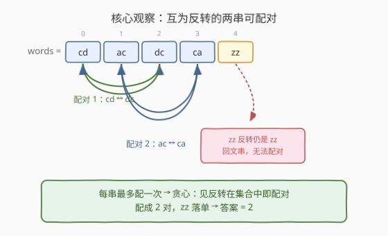
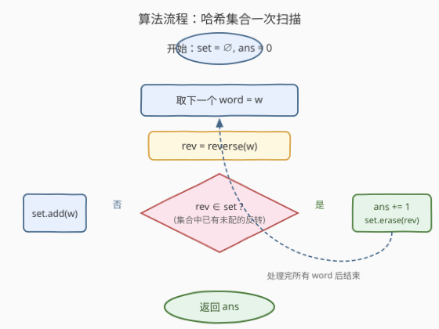
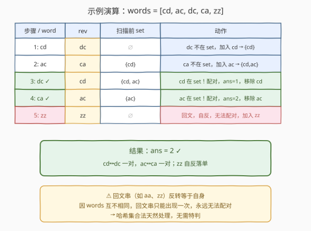

# LeetCode 最大字符串配对数目 题解

## 1. 题目概述

- **标题 / 题号**：最大字符串配对数目（#2744，easy）
- **链接**：https://leetcode.cn/problems/find-maximum-number-of-string-pairs/
- **难度**：简单
- **标签**：数组、哈希表、字符串、模拟

**题意**：给你一个下标从 **0** 开始的数组 `words`，数组中包含**互不相同**的字符串。如果字符串 `words[i]` 与字符串 `words[j]` 满足以下条件，称它们可以**匹配**：

- 字符串 `words[i]` 等于 `words[j]` 的**反转**字符串。
- $0 \le i < j < \text{words.length}$

请返回数组 `words` 中的**最大**匹配数目。注意，每个字符串最多匹配一次。

**示例 1**：

```text
输入：words = ["cd","ac","dc","ca","zz"]
输出：2
解释：
- words[0] = "cd" 的反转 "dc" 等于 words[2]，匹配一对；
- words[1] = "ac" 的反转 "ca" 等于 words[3]，匹配一对；
- "zz" 的反转仍是 "zz"，但数组中只有一个 "zz"，无法匹配。
最多匹配 2 对。
```

**示例 2**：

```text
输入：words = ["ab","ba","cc"]
输出：1
解释："ab" 的反转 "ba" 等于 words[1]，匹配一对；"cc" 反转仍为自身，无法匹配。
```

**示例 3**：

```text
输入：words = ["aa","ab"]
输出：0
解释："aa" 是回文，反转等于自身无法匹配；"ab" 的反转 "ba" 不在数组中，也无法匹配。
```

**约束**：

- $1 \le \text{words.length} \le 50$
- $\text{words}[i].\text{length} = 2$
- `words` 包含的字符串**互不相同**
- `words[i]` 只包含小写英文字母

> 💡 关键性质：字符串长度恒为 2，反转即两个字符交换位置；字符串互不相同意味着一个字符串与其反转要么是**不同的两串**（可配对），要么是**回文**（自反，无法配对）。每个字符串最多配一次，因此贪心地「见到反转已在待配集合中就立即配对」即可达到最大值。

## 2. 解题思路

### 2.1 暴力思路：枚举所有下标对

最朴素的思路：枚举所有满足 $i < j$ 的下标对 $(i, j)$，若 $\text{words}[i]$ 等于 $\text{reverse}(\text{words}[j])$ 就标记 $i, j$ 已用，统计能选出的不重叠对数。

但「最大匹配数目」要求不重叠配对，朴素枚举需要回溯或贪心保证不重复用。时间复杂度 $O(n^2)$，对 $n \le 50$ 足够，但没有利用「互不相同」与「长度恒为 2」的结构——其实一次扫描 + 哈希即可。

### 2.2 核心观察：哈希集合一次扫描



由于字符串**互不相同**，任一字符串 `w` 与其反转 `rev` 的关系只有两种：

1. **$w \ne \text{rev}$（非回文）**：`w` 只可能与 `rev` 配对。若 `rev` 出现在数组中，则二者构成**唯一**的一对；若 `rev` 不在数组中，`w` 谁也配不了。
2. **$w = \text{rev}$（回文，如 "aa"、"zz"）**：反转等于自身，但数组中 `w` 只出现一次，找不到**另一个** `w` 与之配对，必然落单。

因此「最大匹配数目」=「能凑出 (w, rev) 且 $w \ne \text{rev}$ 的无序对数」。用一个**待配集合** `set` 模拟：从左到右扫描，对每个 `w`：

- 若 $\text{rev} \in \text{set}$：说明前面有个未配的 `rev` 正好与 `w` 凑成一对，`ans += 1` 并把 `rev` 从集合移走（已配，不再可用）；
- 否则：`w` 暂时落单，加入 `set` 等待未来可能的反转来配对。

> ⚠️ **顺序至关重要**：必须**先查 `rev` 是否在集合，再决定是否加入 `w`**。若先把 `w` 加入再查，回文串（`w == rev`）会把自己和自己配对，得出错误答案。由于数组元素互不相同，正确顺序下回文串只会被加入集合、永远不会触发匹配，天然处理，无需特判。

### 2.3 算法流程图



逻辑要点：

- 集合 `set` 存放「已扫描但尚未配对的字符串」；
- 匹配成功时**移除** `rev`（表示这一对已消费，两个串都不再可用）；
- 匹配失败时**加入** `w`（留给后续的反转来配）；
- 全部扫完，`ans` 即为最大配对数。

### 2.4 示例演算



**示例 1：`words = ["cd","ac","dc","ca","zz"]`**

| 步骤 | word | rev | 扫描前 set | 动作 | ans |
|------|------|-----|------------|------|-----|
| 1 | cd | dc | ∅ | dc 不在 set，加入 cd | 0 |
| 2 | ac | ca | {cd} | ca 不在 set，加入 ac | 0 |
| 3 | dc | cd | {cd, ac} | cd 在 set！配对，移除 cd | 1 |
| 4 | ca | ac | {ac} | ac 在 set！配对，移除 ac | 2 |
| 5 | zz | zz | ∅ | 回文自反，不在 set，加入 zz | 2 |

最终 $ans = 2$ $\checkmark$

**示例 3：`words = ["aa","ab"]`**

| 步骤 | word | rev | 扫描前 set | 动作 | ans |
|------|------|-----|------------|------|-----|
| 1 | aa | aa | ∅ | aa 不在 set，加入 aa | 0 |
| 2 | ab | ba | {aa} | ba 不在 set，加入 ab | 0 |

最终 $ans = 0$ $\checkmark$ —— "aa" 是回文，自反永远落单。

> 💡 若把第 1 步改为「先加 `aa` 再查 `aa` 是否在集合」，会误判 "aa" 与自己配对得到 $ans=1$ 的错误结果。这就是「先查后加」的必要性。

## 3. 参考代码

### C++

```cpp
class Solution {
public:
    int maximumNumberOfStringPairs(vector<string>& words) {
        unordered_set<string> seen;
        int ans = 0;
        for (const string& w : words) {
            string rev = w;
            reverse(rev.begin(), rev.end());
            if (seen.count(rev)) {       // 反转已在待配集合 → 配对
                ans++;
                seen.erase(rev);        // 该对已消费，移除
            } else {
                seen.insert(w);         // 暂时落单，等待未来反转
            }
        }
        return ans;
    }
};
```

### Python

```python
class Solution:
    def maximumNumberOfStringPairs(self, words: List[str]) -> int:
        seen = set()
        ans = 0
        for w in words:
            rev = w[::-1]
            if rev in seen:            # 反转已在待配集合 → 配对
                ans += 1
                seen.remove(rev)       # 该对已消费，移除
            else:
                seen.add(w)            # 暂时落单，等待未来反转
        return ans
```

> 💡 本题字符串长度恒为 2，反转代价 $O(1)$，整体 $O(n)$。若想更短，可用「**规范形计数**」写法：对每个 `w` 取 $\text{key} = \min(w, \text{rev}(w))$（即字典序较小的那个），统计每个 key 的出现次数，答案为 $\sum \lfloor \text{cnt} / 2 \rfloor$。回文串 key 就是自身，次数为 1，$1 / 2 = 0$，同样天然处理。

## 4. 复杂度分析

| 维度 | 复杂度 | 说明 |
|------|--------|------|
| 时间复杂度 | $O(n)$ | 一次扫描，每个字符串反转与集合操作均 $O(1)$（长度恒为 2） |
| 空间复杂度 | $O(n)$ | 最坏情况无任何匹配，集合存入全部 $n$ 个字符串 |

> 💡 若字符串长度不恒为 2 而为 $L$，反转 $O(L)$、哈希 $O(L)$，整体 $O(nL)$。本题 $L=2$ 退化为 $O(n)$。

## 5. 扩展：规范形计数法

哈希集合模拟「先查后加、匹配即移除」是配对计数的通用范式。本题因字符串长度为 2，还可等价地用**规范形（canonical form）**计数：

对每个 `w`，定义规范形 $\text{key}(w) = \min(w, \text{rev}(w))$（字典序较小的那个）。互为反转的两串规范形相同，回文串的规范形即自身。统计每个 key 的频次 $c$，该 key 贡献 $\lfloor c / 2 \rfloor$ 对：

$$\text{ans} = \sum_{\text{key}} \left\lfloor \frac{c_{\text{key}}}{2} \right\rfloor$$

由于数组元素互不相同，非回文 key 的 $c \in \{1, 2\}$，回文 key 的 $c = 1$，故 $\lfloor c/2 \rfloor \in \{0, 1\}$，与集合模拟结果一致。

```python
from collections import Counter
class Solution:
    def maximumNumberOfStringPairs(self, words: List[str]) -> int:
        cnt = Counter(min(w, w[::-1]) for w in words)
        return sum(v // 2 for v in cnt.values())
```

> ⚠️ 规范形计数法依赖「互不相同」保证非回文 key 最多 2 个；若允许重复字符串（变体题），同一规范形可有多个，$c$ 可能 $>2$，公式仍适用但需保证每个串只配一次——此时集合模拟的「匹配即移除」与 $\lfloor c/2 \rfloor$ 仍然等价，因为每对消耗 2 个。

## 6. 面试要点

1. **为什么「先查后加」而非「先加后查」？**

   > 必须先查 `rev` 是否已在集合，再决定是否加入 `w`。若先加 `w` 再查，回文串（`w == rev`）会发现自己已在集合中，误判与自身配对。由于元素互不相同，回文串只出现一次，正确顺序下它只会被加入集合、永不被匹配——天然落单，无需特判。

2. **回文串为什么必然无法配对？需要特判吗？**

   > 回文串反转等于自身，配对要求两个**不同下标**的互逆串。元素互不相同意味着同一下标的串只有一个，找不到「另一个」相同串与之配对。集合模拟中，回文串的 `rev == w`，扫描到它时 `w` 还未入集合（先查后加），故查不到、加入后也再无第二个 `w` 来匹配。无需特判。

3. **为什么贪心地「见反转就配」能得到最大值？**

   > 每个非回文串至多与一个特定的反转配对（其反转唯一）。一旦 `w` 与 `rev` 配对，二者都被消费，不影响任何其它配对决策——不存在「让 `rev` 去配别的串能换来更多对数」的取舍，因为 `rev` 只能配 `w`。故贪心即最优，等价于二分图最大匹配在此特殊结构下退化为平凡情形。

4. **集合模拟与规范形计数两种写法的等价性？**

   > 集合模拟记录「待配串」，匹配即成对移除，每个 key 最终剩余 0 或 1 个未配，配成 $(c - c\%2)/2 = \lfloor c/2 \rfloor$ 对；规范形计数直接统计 $c$ 后取 $\lfloor c/2 \rfloor$。两者数学等价，前者是流式（在线）视角，后者是批统计视角。

5. **若去掉「长度恒为 2」或「互不相同」的约束会怎样？**

   > 去掉长度约束：反转代价升为 $O(L)$，整体 $O(nL)$，思路不变。去掉互不相同：同一字符串可多次出现，回文串「aa」可出现两次从而配成一对（`rev` 也是「aa」，第二个「aa」能在集合中查到第一个），集合模拟仍正确，规范形计数 $\lfloor c/2 \rfloor$ 也仍成立——两法对变体均稳健。

## 同类练习题

| # | 题目 | 与本题的关联 |
|---|------|-------------|
| 1 | [两数之和](https://leetcode.cn/problems/two-sum/)（[题解](../0001-0100/1_两数之和.md)） | 哈希表一次扫描查「补数」是否在集合。本题查「反转」是否在集合，同为「哈希一次扫描 + 查存在性」范式 |
| 1512 | [好数对的数目](https://leetcode.cn/problems/number-of-good-pairs/) | 统计数组中相等下标对数。与本题「统计可配对数」同属哈希计数配对，本题多了「反转」这一配对条件 |
| 242 | [有效的字母异位词](https://leetcode.cn/problems/valid-anagram/) | 判定两串是否字母重排。反转是重排的特例（仅交换两字符），可对比「逐位比对」与「规范形」两种判定思路 |
| 344 | [反转字符串](https://leetcode.cn/problems/reverse-string/) | 原地反转字符数组的基础操作。本题用 `reverse` 求配对的反转串，是反转操作的直接应用 |
