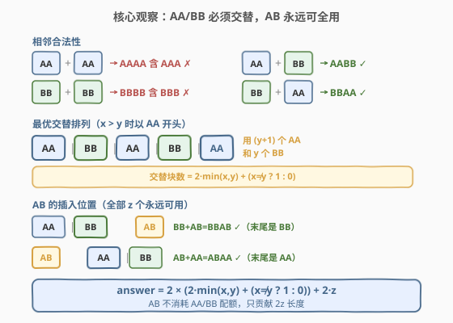
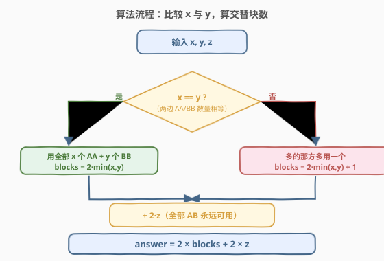
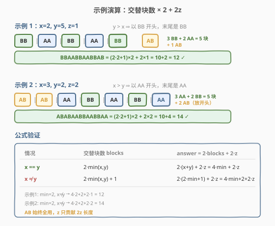

# 构造最长的新字符串

- **题目名称**：构造最长的新字符串
- **链接**：[2745. 构造最长的新字符串](https://leetcode.cn/problems/construct-the-longest-new-string/)
- **难度**：中等
- **标签**：贪心、脑筋急转弯、数学、动态规划

## 1. 题目概述

给你三个整数 $x$、$y$、$z$，分别表示你有 $x$ 个 `"AA"` 字符串、$y$ 个 `"BB"` 字符串、$z$ 个 `"AB"` 字符串。你需要选择其中部分（可全选也可不选），按顺序连接得到一个新字符串，且新字符串**不能包含子串 `"AAA"` 或 `"BBB"`**。返回新字符串的最大可能长度。

**示例 1**：

```text
输入：x = 2, y = 5, z = 1
输出：12
解释：连接 "BB","AA","BB","AA","BB","AB" → "BBAABBAABBAB"，长度 12。
```

**示例 2**：

```text
输入：x = 3, y = 2, z = 2
输出：14
解释：连接 "AB","AB","AA","BB","AA","BB","AA" → "ABABAABBAABBAA"，长度 14。
```

**约束条件**：

- $1 \le x, y, z \le 50$

> 💡 本题的关键约束是「禁止 `AAA` / `BBB`」——两个 `"AA"` 不能相邻（否则 `AAAA` 含 `AAA`），两个 `"BB"` 不能相邻（否则 `BBBB` 含 `BBB`）。这迫使 `"AA"` 与 `"BB"` 必须**交替排列**，而 `"AB"` 则可以灵活插入，最终化归为一个 $O(1)$ 的贪心公式。

---

## 2. 解题思路

### 2.1 暴力思路

$x, y, z \le 50$，理论上可以枚举 `"AA"`、`"BB"`、`"AB"` 的所有排列组合，逐个验证是否含 `AAA`/`BBB`，取最大长度。但组合空间极大（$C(150, \text{...})$ 级别的排列），完全不实际。暴力无法利用结构。

### 2.2 核心观察：AA/BB 必须交替，AB 永远可全用



**第一步：相邻合法性分析。** 逐对检查四种拼接：

| 拼接 | 结果 | 合法？ |
|------|------|--------|
| `AA` + `AA` | `AAAA` | ✗（含 `AAA`） |
| `BB` + `BB` | `BBBB` | ✗（含 `BBB`） |
| `AA` + `BB` | `AABB` | ✓ |
| `BB` + `AA` | `BBAA` | ✓ |

结论：同类块不能相邻，异类块可以相邻。因此 `"AA"` 与 `"BB"` 必须**严格交替**，排列模式只有两种：

- 以 `AA` 开头：`AA BB AA BB AA BB ...`
- 以 `BB` 开头：`BB AA BB AA BB AA ...`

**第二步：交替模式下的块数上界。** 设 $m = \min(x, y)$。

- 若 $x = y$：两种模式都能用完全部 $x + y$ 块，交替块数 $= 2m$。
- 若 $x > y$：以 `AA` 开头，模式为 `AA BB AA BB ... AA`，用 $y$ 个 `BB` 和 $y+1$ 个 `AA`（末尾多一个 `AA`），交替块数 $= 2y + 1 = 2m + 1$。
- 若 $y > x$：以 `BB` 开头，模式为 `BB AA BB AA ... BB`，用 $x$ 个 `AA` 和 $x+1$ 个 `BB`，交替块数 $= 2x + 1 = 2m + 1$。

统一公式：

$$\text{blocks} = 2 \cdot \min(x, y) + \begin{cases} 0 & x = y \\ 1 & x \ne y \end{cases}$$

**第三步：AB 的插入——永远全用。** `"AB"` 的拼接兼容性：

| 拼接 | 结果 | 合法？ |
|------|------|--------|
| `AB` + `AA` | `ABAA` | ✓ |
| `AB` + `BB` | `ABBB` | ✗（含 `BBB`） |
| `AA` + `AB` | `AAAB` | ✗（含 `AAA`） |
| `BB` + `AB` | `BBAB` | ✓ |
| `AB` + `AB` | `ABAB` | ✓ |

`"AB"` 可以接在 `"AB"` 后（自连），可以接在 `"AA"` 前（`AB` + `AA`），也可以接在 `"BB"` 后（`BB` + `AB`）。关键观察：

- 若交替链**以 `AA` 结尾**（$x \ge y$ 时以 `AA` 开头的情况）：把全部 $z$ 个 `AB` **放在最前面**，即 `AB AB ... AB | AA BB AA ...`。`AB` + `AB` = `ABAB` ✓，`AB` + `AA` = `ABAA` ✓。
- 若交替链**以 `BB` 结尾**（$y > x$ 时以 `BB` 开头的情况）：把全部 $z$ 个 `AB` **放在最后面**，即 `... BB AA BB | AB AB ... AB`。`BB` + `AB` = `BBAB` ✓，`AB` + `AB` = `ABAB` ✓。

因此 **$z$ 个 `AB` 永远可以全用**，不消耗 `AA`/`BB` 的配额，只贡献 $2z$ 长度。

> ⚠️ `AB` 不能放在 `AA` 之后（`AAAB` 含 `AAA`），也不能放在 `BB` 之前（`ABBB` 含 `BBB`）。但通过选择放在链首或链尾，总能绕开这两个冲突，保证全部 $z$ 个 `AB` 都被使用。

### 2.3 算法流程图



流程非常简洁：

1. 比较 $x$ 与 $y$：
   - 若 $x = y$：`blocks` $= 2 \cdot \min(x, y)$
   - 若 $x \ne y$：`blocks` $= 2 \cdot \min(x, y) + 1$
2. 答案 $= 2 \times \text{blocks} + 2 \times z$

### 2.4 示例演算



**示例 1：$x=2, y=5, z=1$**

- $m = \min(2, 5) = 2$，$x \ne y$ → $\text{blocks} = 2 \times 2 + 1 = 5$
- 以 `BB` 开头（$y > x$）：`BB AA BB AA BB`，用 3 个 `BB` + 2 个 `AA` = 5 块
- 链以 `BB` 结尾 → 1 个 `AB` 放末尾：`BB AA BB AA BB AB` = `BBAABBAABBAB`
- 长度 $= 5 \times 2 + 1 \times 2 = 10 + 2 = 12$ ✓

**示例 2：$x=3, y=2, z=2$**

- $m = \min(3, 2) = 2$，$x \ne y$ → $\text{blocks} = 2 \times 2 + 1 = 5$
- 以 `AA` 开头（$x > y$）：`AA BB AA BB AA`，用 3 个 `AA` + 2 个 `BB` = 5 块
- 链以 `AA` 结尾 → 2 个 `AB` 放开头：`AB AB AA BB AA BB AA` = `ABABAABBAABBAA`
- 长度 $= 5 \times 2 + 2 \times 2 = 10 + 4 = 14$ ✓

> 💡 两个示例都是 $x \ne y$ 的情况，块数都是 $2m + 1 = 5$。若 $x = y$（如 $x=3, y=3, z=0$），则 $\text{blocks} = 2 \times 3 = 6$，答案 $= 6 \times 2 + 0 = 12$，用完全部 6 块，末尾无额外块。

---

## 3. 参考代码

### C++

```cpp
class Solution {
public:
    int longestString(int x, int y, int z) {
        int m = min(x, y);
        int blocks = (x == y) ? 2 * m : 2 * m + 1;
        return 2 * blocks + 2 * z;
    }
};
```

### Python

```python
class Solution:
    def longestString(self, x: int, y: int, z: int) -> int:
        m = min(x, y)
        blocks = 2 * m if x == y else 2 * m + 1
        return 2 * blocks + 2 * z
```

> 💡 代码本质只有三行：取最小值、按是否相等定块数、乘 2 加 `2z`。整个解法是 $O(1)$ 的数学公式，不涉及循环或数据结构。

---

## 4. 复杂度分析

| 维度 | 复杂度 | 说明 |
|------|--------|------|
| 时间复杂度 | $O(1)$ | 仅一次 `min` 比较和常数次算术运算 |
| 空间复杂度 | $O(1)$ | 无额外数据结构 |

> 💡 本题数据范围 $x, y, z \le 50$ 虽小，但最优解是 $O(1)$ 公式，与数据规模无关。即便 $x, y, z$ 到 $10^9$ 也一样适用。

---

## 5. 扩展：动态规划视角

本题标签含「动态规划」，可用 DP 验证贪心结论的正确性。定义 $dp[i][j][k][\text{last}]$ 为用 $i$ 个 `AA`、$j$ 个 `BB`、$k$ 个 `AB` 且末尾块类型为 $\text{last} \in \{AA, BB, AB\}$（或初始状态）时的最大长度。转移：对每个状态，尝试追加一个与末尾兼容的块。

由于 $i, j, k \le 50$，状态数 $= 51^3 \times 4 \approx 5.3 \times 10^5$，可过。但贪心公式 $O(1)$ 远优于 DP 的 $O(x \cdot y \cdot z)$，且 DP 的最优值必然等于贪心公式给出的值——可通过对拍验证。

```python
# DP 验证版（用于对拍，非提交用）
def longestString_dp(x, y, z):
    from functools import lru_cache
    @lru_cache(None)
    def dp(i, j, k, last):
        best = 0
        if i > 0 and last != 'AA':                       # AA 不能接 AA
            best = max(best, 2 + dp(i-1, j, k, 'AA'))
        if j > 0 and last != 'BB':                       # BB 不能接 BB
            best = max(best, 2 + dp(i, j-1, k, 'BB'))
        if k > 0 and last != 'AA' and last != 'BB_pre':  # AB 不能接 AA 后/BB 前
            best = max(best, 2 + dp(i, j, k-1, 'AB'))
        return best
    return dp(x, y, z, None)
```

> ⚠️ 上述 DP 中 `AB` 的约束需要更细致的状态设计（区分「上一块以 A 结尾」还是「以 B 结尾」），实际实现需用「末尾字符」而非「末尾块类型」做状态。这里仅展示思路骨架，完整 DP 需考虑 `AA` 以 `A` 结尾、`BB` 以 `B` 结尾、`AB` 以 `B` 结尾，因此追加 `AB` 只需末尾字符不是 `A`（避免 `AAB`→`AAA` 的风险，实为 `AA`+`AB`=`AAAB` 含 `AAA`）。贪心公式已给出严格证明，DP 仅供验证。

---

## 6. 面试要点

1. **为什么 AA 和 BB 必须交替？**

   > `AA` + `AA` = `AAAA` 含 `AAA`，`BB` + `BB` = `BBBB` 含 `BBB`，同类不能相邻。`AA` + `BB` 和 `BB` + `AA` 都合法，所以只有异类可拼，迫使交替排列。

2. **块数公式中 $+1$ 的含义是什么？**

   > 当 $x \ne y$ 时，数量多的那方可以在交替链的**一端多放一块**（如 $x > y$ 时以 `AA` 开头且以 `AA` 结尾，用 $y+1$ 个 `AA` 和 $y$ 个 `BB`）。当 $x = y$ 时两边用完恰好对齐，没有多出的那块，所以不加 1。

3. **为什么 $z$ 个 AB 永远能全用？**

   > `AB` 以 `B` 结尾，可以接在 `AB` 或 `BB` 后面（`BBAB` 无 `BBB`）；以 `A` 开头，可以放在 `AA` 前面（`ABAA` 无 `AAA`）。只要根据交替链的末尾字符选择把 `AB` 放在链首（链以 `AA` 结尾时）或链尾（链以 `BB` 结尾时），就能绕开所有冲突，保证全用。

4. **如果题目改为禁止 `AA` 和 `BB`（而非 `AAA`/`BBB`），会怎样？**

   > 那 `AA` 和 `BB` 本身就被禁用，只能用 `AB`，答案退化为 $2z$。约束不同导致完全不同的结构。本题的约束是「禁止三个连续相同字符」，恰好允许两个连续但禁止三个，才有了交替排列的解法。

5. **$O(1)$ 公式如何保证最优性？**

   > 交替链的块数上界为 $2 \cdot \min(x,y) + [x \ne y]$，这是交替约束下的最大可能——多于 `min` 块的较少者每多一块就需要另一类块隔开，而交替链两端可各多出一块同类型。`AB` 不参与交替竞争，其 $2z$ 贡献是独立的。两者相加即为全局最优。

---

## 7. 同类练习题

- [2131. 最长拼接回文串](https://leetcode.cn/problems/longest-palindrome-by-concatenating-two-letter-words/)：拼接双字母字符串使结果最长且有约束。与本题同为「拼接定长片段构造最优字符串」的贪心构造题
- [1400. 构造 K 个回文串](https://leetcode.cn/problems/construct-k-palindrome-strings/)：用字符集构造字符串并满足约束。与本题同为「构造可行性 + 计数优化」类脑筋急转弯
- [1758. 交替二进制字符串的最小操作数](https://leetcode.cn/problems/minimum-changes-to-make-alternating-binary-string/)：将字符串变为交替模式。本题的 `AA`/`BB` 交替与此题的 `01` 交替同构，可对比「交替排列」的核心思想
- [2401. 最长优雅子数组](https://leetcode.cn/problems/longest-nice-subarray/)：子数组中相邻元素不能共享某性质。与本题「相邻同类块不能共存」的相邻约束思想相通
- [2244. 完成所有任务的最少轮次](https://leetcode.cn/problems/minimum-rounds-to-complete-all-tasks/)：贪心 + 数学公式 $O(1)$ 求解。与本题同为「观察约束结构后化归为公式」的脑筋急转弯类型
