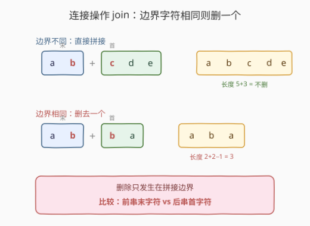
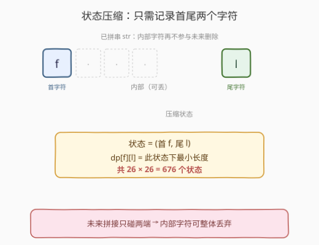
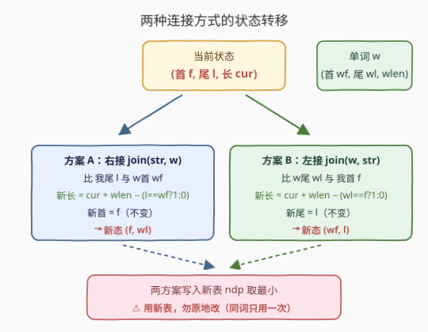
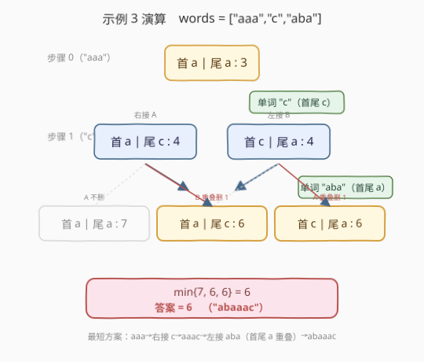

# 字符串连接删减字母

- **题目名称**：字符串连接删减字母
- **链接**：[2746. 字符串连接删减字母](https://leetcode.cn/problems/decremental-string-concatenation/)
- **难度**：中等
- **标签**：数组、字符串、动态规划

## 1. 题目概述

给你一个下标从 0 开始的字符串数组 `words`，含 `n` 个字符串。定义连接操作 `join(x, y)` 表示把 `x` 和 `y` 拼成 `xy`；若 `x` 的最后一个字符与 `y` 的第一个字符相等，则拼接后这**两个相等字符中的一个被删除**（即只重叠删一个）。

例如 `join("ab", "ba") = "aba"`，`join("ab", "cde") = "abcde"`。

从 `str_0 = words[0]` 开始，对 `i = 1` 到 `n - 1`，第 `i` 步可二选一：

- `str_i = join(str_{i-1}, words[i])`（把 `words[i]` 接到**右边**）
- `str_i = join(words[i], str_{i-1})`（把 `words[i]` 接到**左边**）

求 `str_{n-1}` 的**最小长度**。

**示例 1**：

```text
输入：words = ["aa","ab","bc"]
输出：4
解释：str0="aa" → str1=join(str0,"ab")="aab" → str2=join(str1,"bc")="aabc"，长度 4。
```

**示例 2**：

```text
输入：words = ["ab","b"]
输出：2
解释：str0="ab" → join(str0,"b")="ab"（删一个 b）长度 2；另一种 join("b",str0)="bab" 长度 3，取最小 2。
```

**示例 3**：

```text
输入：words = ["aaa","c","aba"]
输出：6
解释：str0="aaa" → str1=join(str0,"c")="aaac" → str2=join("aba",str1)="abaaac"（首尾 a 重叠删一个），长度 6。
```

**约束条件**：

- `1 <= words.length <= 1000`
- `1 <= words[i].length <= 50`
- `words[i]` 只包含小写英文字母

---

## 2. 解题思路

### 2.1 暴力思路

每一步有"左接 / 右接"两种选择，`n` 步共 $2^{n-1}$ 种方案，对每种方案模拟拼接得到长度取最小。复杂度 $O(2^n \cdot L)$（$L$ 为总字符数），$n=1000$ 完全不可行。

### 2.2 核心观察：只需记录首尾字符

关键直觉是**连接时的"删一个"只发生在边界处**——即前串的**末字符**与后串的**首字符**相同。而已拼字符串 `str_{i-1}` 内部的字符再也不会参与任何未来的删除，因为后续拼接只碰它的两端。



因此刻画一段已拼结果只需两个量：**首字符 `f`** 和**尾字符 `l`**，外加当前长度。中间一大串字符对后续决策毫无影响，可以丢掉。



> 💡 **为什么首尾就够了**：未来每次拼接，删除与否只取决于"对方的首/末 vs 我的末/首"。我的内部字符永远不会再被比较。把状态从"整串"压成 `(f, l)` 对，状态数从无穷多降到 $26 \times 26 = 676$ 个。

### 2.3 状态设计与转移

令 `dp[f][l]` = 处理完当前前缀后，首字符为 `f`、尾字符为 `l` 的拼接串的**最小长度**（`f, l ∈ [0,25]`）。

- **初始化**（`words[0]`）：`dp[wf0][wl0] = len(words[0])`，其余 `+∞`。其中 `wf0 = words[0][0]`、`wl0 = words[0][-1]`。
- 对每个后续单词 `w`（首 `wf`、尾 `wl`、长 `wlen`），用新表 `ndp` 由旧 `dp` 转移（**必须用新表**，避免同一步内读到刚更新的值）：

  - **方案 A：右接 `join(str, w)`**。比较我的尾 `l` 与 `w` 的首 `wf`：
    - 新长度 `= dp[f][l] + wlen - (l == wf ? 1 : 0)`
    - 新首 `= f`（不变），新尾 `= wl`
    - 更新 `ndp[f][wl]`
  - **方案 B：左接 `join(w, str)`**。比较 `w` 的尾 `wl` 与我的首 `f`：
    - 新长度 `= dp[f][l] + wlen - (wl == f ? 1 : 0)`
    - 新首 `= wf`，新尾 `= l`（不变）
    - 更新 `ndp[wf][l]`



- **答案**：全部单词处理完后，`min(dp[f][l])`。

> ⚠️ **单字符单词**：若 `words[i]` 长度为 1，则 `wf == wl`，上面两个判定照常成立，无需特判。另外当拼接前后串首尾相同时只删**一个**字符（不是整段），公式里只减 1 即可。

### 2.4 示例演算

以示例 3 `words = ["aaa","c","aba"]` 为例，每步只列出非无穷的活跃状态 `(首|尾 : 长度)`：



- 步骤 0（`"aaa"`）：`{a|a : 3}`
- 步骤 1（`"c"`，wf=wl=c，wlen=1）：从 `(a|a,3)`
  - 右接 A：尾 `a` ≠ 首 `c` → `a|c : 4`
  - 左接 B：尾 `c` ≠ 首 `a` → `c|a : 4`
  - 得 `{a|c:4, c|a:4}`
- 步骤 2（`"aba"`，wf=wl=a，wlen=3）：
  - 从 `(a|c,4)`：右接 A 尾 `c`≠首 `a` → `a|a:7`；左接 B 尾 `a`=首 `a` **重叠** → `a|c:6`
  - 从 `(c|a,4)`：右接 A 尾 `a`=首 `a` **重叠** → `c|a:6`；左接 B 尾 `a`≠首 `c` → `a|a:7`
  - 得 `{a|a:7, a|c:6, c|a:6}`
- 最小值 `6`，即答案。

对应方案：`"aaa"`→右接 `"c"` 得 `"aaac"`（首 a 尾 c）→左接 `"aba"` 得 `"aba"+"aaac"` 首尾 `a` 重叠删一个 = `"abaaac"`，长 6，与示例输出一致。

---

## 3. 参考代码

### C++

```cpp
class Solution {
public:
    int minimizeConcatenatedLength(vector<string>& words) {
        const int INF = 1e9;
        // dp[f][l]: 已处理前缀拼接串首字符 f、尾字符 l 时的最小长度
        vector<vector<int>> dp(26, vector<int>(26, INF));
        int f0 = words[0][0] - 'a';
        int l0 = words[0].back() - 'a';
        dp[f0][l0] = (int)words[0].size();

        for (int i = 1; i < (int)words.size(); ++i) {
            int wf = words[i][0] - 'a';
            int wl = words[i].back() - 'a';
            int wlen = (int)words[i].size();
            vector<vector<int>> ndp(26, vector<int>(26, INF));
            for (int f = 0; f < 26; ++f) {
                for (int l = 0; l < 26; ++l) {
                    if (dp[f][l] == INF) continue;
                    int cur = dp[f][l];
                    // 方案 A：右接 join(str, w)
                    int lenA = cur + wlen - (l == wf ? 1 : 0);
                    if (lenA < ndp[f][wl]) ndp[f][wl] = lenA;
                    // 方案 B：左接 join(w, str)
                    int lenB = cur + wlen - (wl == f ? 1 : 0);
                    if (lenB < ndp[wf][l]) ndp[wf][l] = lenB;
                }
            }
            dp = move(ndp);
        }
        int ans = INF;
        for (int f = 0; f < 26; ++f)
            for (int l = 0; l < 26; ++l)
                ans = min(ans, dp[f][l]);
        return ans;
    }
};
```

### Python

```python
class Solution:
    def minimizeConcatenatedLength(self, words: List[str]) -> int:
        INF = float('inf')
        # dp[f][l]: 已处理前缀拼接串首字符 f、尾字符 l 时的最小长度
        dp = [[INF] * 26 for _ in range(26)]
        f0 = ord(words[0][0]) - 97
        l0 = ord(words[0][-1]) - 97
        dp[f0][l0] = len(words[0])

        for w in words[1:]:
            wf = ord(w[0]) - 97
            wl = ord(w[-1]) - 97
            wlen = len(w)
            ndp = [[INF] * 26 for _ in range(26)]
            for f in range(26):
                for l in range(26):
                    cur = dp[f][l]
                    if cur == INF:
                        continue
                    # 方案 A：右接 join(str, w)
                    a = cur + wlen - (1 if l == wf else 0)
                    if a < ndp[f][wl]:
                        ndp[f][wl] = a
                    # 方案 B：左接 join(w, str)
                    b = cur + wlen - (1 if wl == f else 0)
                    if b < ndp[wf][l]:
                        ndp[wf][l] = b
            dp = ndp

        return int(min(min(row) for row in dp))
```

---

## 4. 复杂度分析

| 维度 | 复杂度 | 说明 |
|------|--------|------|
| 时间复杂度 | $O(n \cdot \Sigma^2)$ | $n$ 个单词，每个扫 $26\times26=676$ 个状态、各 2 种转移；$\Sigma=26$ |
| 空间复杂度 | $O(\Sigma^2)$ | 两张 $26\times26$ 的表滚动，常数级 |

> 💡 $n \le 1000$，$676 \times 1000 \approx 6.76\times10^5$ 次基本运算，远低于时限。字母表大小 $\Sigma=26$ 是常数，故也可写作 $O(n)$。

---

## 5. 扩展：最大化"重叠节省量"视角

换一种等价视角：若全部直接拼接不删字符，总长 $S=\sum \text{len}$；每次边界字符相同可"节省 1"。设 `g[f][l]` = 已处理前缀拼串首 `f` 尾 `l` 时的**最大节省量**，则转移里把"+wlen−(重叠?1:0)"改成"+(重叠?1:0)"即可，答案 $= S - \max g$。两种视角的状压思路一致，最大化节省有时更易理解"为什么只看首尾"。

进一步可把单步内层 $O(\Sigma^2)$ 优化到 $O(\Sigma)$：方案 A 对固定首 `f`，新尾恒为 `wl`，只需在所有尾 `l` 中取 `dp[f][l]−(l==wf?1:0)` 的最小（即比较 `dp[f][wf]−1` 与 `dp[f][其它]` 的最小值）；方案 B 同理对固定尾 `l` 取最小。总复杂度降到 $O(n\cdot\Sigma)$，但常数优化在 $\Sigma=26$ 时意义不大。

---

## 6. 面试要点

1. **怎么想到只记首尾的？**
   - 删除只发生在拼接边界：要么是"我的尾 vs 你的首"，要么是"你的尾 vs 我的首"。我内部字符永远不会被再次比较，所以可丢弃，状态塌缩成 `(首, 尾, 长度)`。

2. **为什么状态数是 676？**
   - 首尾各是小写字母 26 种，组合 $26\times26=676$。长度是要求最小化的值（放在 dp 值里），不进状态维度，否则状态爆炸。

3. **为什么必须用 `ndp` 新表、不能原地更新？**
   - 一步内两个方案都可能写到同一格子。若原地写，方案 A 刚写入的状态会被方案 B 当作"上一步结果"再读再转移，等于让同一个词被用了两次。新表保证"本步全部基于上一步的状态"。

4. **边界字符相同时为什么只减 1？**
   - 题目规定删"两个相等字符中的一个"，即首尾只重叠一个字符位，不是整段匹配（不是最长公共前后缀那类）。所以固定减 1。

5. **能否贪心？**
   - 不能。某个词左接还是右接最优，取决于后续词的首尾，局部看不出全局最优，需 DP。

---

## 7. 同类练习题

- [664. 奇怪的打印机](https://leetcode.cn/problems/strange-printer/)：区间 DP，相邻相同字符可合并打印，与本题"边界同字符合并删一个"同源，训练"相同字符可合并"的合并思维
- [516. 最长回文子序列](https://leetcode.cn/problems/longest-palindromic-subsequence/)：区间 DP 以两端字符是否相等驱动转移，对照本题"首尾字符决定转移分支"
- [1312. 让字符串成为回文串的最少插入次数](https://leetcode.cn/problems/minimum-insertion-steps-to-make-a-string-palindrome/)：区间 DP，转移取决于两端字符是否相等，强化"端点字符驱动状态转移"的建模
- [2430. 对字母串可执行的最大删除数](https://leetcode.cn/problems/maximum-deletions-on-a-string/)：字符串上基于首尾/回文的 DP 操作，体会"拼接 vs 删除"在状态设计上的对称性
