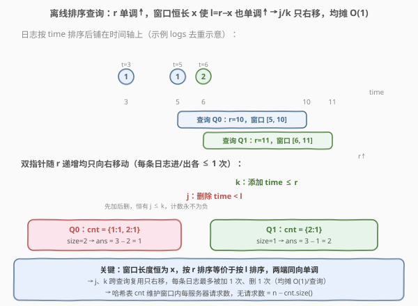
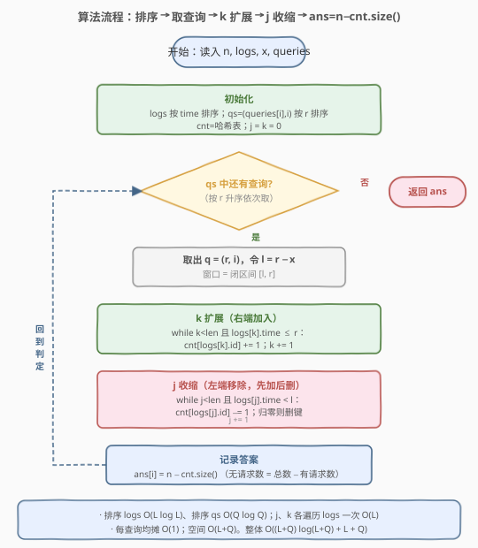

# LeetCode 统计没有收到请求的服务器数目 题解

## 1. 题目概述

- **标题 / 题号**：统计没有收到请求的服务器数目（#2747，medium）
- **链接**：https://leetcode.cn/problems/count-zero-request-servers/
- **难度**：中等
- **标签**：数组、哈希表、排序、滑动窗口

**题意**：给你一个整数 `n`，表示服务器的总数目（编号 $1 \sim n$）；再给你一个下标从 **0** 开始的二维整数数组 `logs`，其中 `logs[i] = [server_id, time]` 表示 id 为 `server_id` 的服务器在 `time` 时刻收到了一个请求。

同时给你一个整数 `x` 和一个下标从 **0** 开始的整数数组 `queries`。请你返回一个数组 `arr`，其中 `arr[i]` 表示在**闭区间** $[\text{queries}[i] - x,\; \text{queries}[i]]$ 内**没有收到任何请求**的服务器数目。

**示例 1**：

```text
输入：n = 3, logs = [[1,3],[2,6],[1,5]], x = 5, queries = [10,11]
输出：[1,2]
解释：
对于 queries[0]=10：区间 [5,10] 内 id 为 1、2 的服务器收到过请求，只有服务器 3 没有收到请求 → 1。
对于 queries[1]=11：区间 [6,11] 内只有 id 为 2 的服务器收到过请求，id 为 1、3 的服务器没有收到 → 2。
```

**示例 2**：

```text
输入：n = 3, logs = [[2,4],[2,1],[1,2],[3,1]], x = 2, queries = [3,4]
输出：[0,1]
解释：
对于 queries[0]=3：区间 [1,3] 内所有服务器都收到过请求 → 0。
对于 queries[1]=4：区间 [2,4] 内只有 id 为 3 的服务器没有收到请求 → 1。
```

**约束**：

- $1 \le n \le 10^5$
- $1 \le \text{logs.length} \le 10^5$
- $1 \le \text{queries.length} \le 10^5$
- $\text{logs}[i] = [\text{server\_id}, \text{time}]$，$1 \le \text{server\_id} \le n$，$1 \le \text{time} \le 10^6$
- $1 \le x \le 10^5$，$x < \text{queries}[i] \le 10^6$

> 💡 本题问的是「窗口内**没有**收到请求的服务器数」，等价于「总数 $n$ − 窗口内**收到过请求的不同**服务器数」。关键不在「请求次数」而在「是否出现过」，所以用一个哈希表维护窗口内每个服务器的请求数，其 `size` 即为「收到过请求的不同服务器数」。难点是 $n$、`logs`、`queries` 都到 $10^5$，必须让每个日志只被处理常数次——这正是**离线排序 + 双指针滑动窗口**的甜区。

## 2. 解题思路

### 2.1 暴力思路：逐查询全量扫描

最直接的写法：对每个查询 $q$，令窗口 $[l, r] = [q-x, q]$，扫描全部 `logs`，把 `time` 落在 $[l, r]$ 内的 `server_id` 收进一个集合，答案 = $n - |\text{集合}|$。

单次查询 $O(L)$（$L = \text{logs.length}$），共 $Q$ 次查询，总复杂度 $O(Q \cdot L)$。当 $Q, L \le 10^5$ 时高达 $10^{10}$，必然超时。

瓶颈在于：没有利用「相邻查询的窗口高度重叠」这一结构——每次都从头重扫日志、重建集合。如果把查询**按时间顺序**处理，那么后一个查询的窗口只在前一个的基础上**两端各挪动一点点**，已经统计过的部分完全可以复用，不必推倒重来。

### 2.2 核心观察：离线排序查询 + 双指针滑动窗口



**第一步：离线排序。** 我们不必按 `queries` 给定的顺序回答，可以先把查询按右端点 $r = \text{queries}[i]$ 从小到大排序（同时记录原下标 `i` 以便把答案放回原位），处理完再写回 `ans[i]`。这种「打乱输入顺序、处理完再还原」的手法叫**离线查询**。

**第二步：窗口两端同向单调。** 注意每个查询的窗口都是 $[r - x,\; r]$，**长度恒为 $x$**。因此按 $r$ 排序后，左端 $l = r - x$ 也随 $r$ 同步递增——两端都单调不减。这正是能套双指针的前提：

- 用指针 `k` 维护「右端扩展」：把 `logs` 按 `time` 排序后，只要 `logs[k].time <= r` 就把它**加入**窗口（哈希表 `cnt` 对应服务器计数 $+1$），`k` 右移；
- 用指针 `j` 维护「左端收缩」：只要 `logs[j].time < l` 就把它**移出**窗口（哈希表对应计数 $-1$，归零则删除该键），`j` 右移。

因为 $r$ 与 $l$ 都单调不减，`j`、`k` **只会向右走**，每条日志最多被「加入一次、移除一次」。窗口内不同服务器数就是 `cnt.size()`，于是当前查询答案 $= n - \text{cnt.size()}$。

> ⚠️ **必须先加后删**：先执行 `k` 的加入循环，再执行 `j` 的移除循环。因为 $l \le r$，所有 `time < l` 的日志必然 `time <= r`，先被 `k` 加入后才轮到 `j` 移除，保证 `j <= k`、计数永不为负。若调换顺序，`j` 可能试图移除尚未加入的日志而把计数打成 $-1$。

> 💡 **为什么是 `time < l` 删、`time <= r` 加？** 因为窗口是闭区间 $[l, r]$：`time == l` 的请求**在窗口内**（要保留），`time == r` 的请求也**在窗口内**（要加入）。删用严格小于、加用小于等于，正好覆盖闭区间。

### 2.3 算法流程图



### 2.4 示例演算

![示例 1 演算：n=3，排序后 logs=[[1,3],[1,5],[2,6]]，x=5，排序后查询=[(10,0),(11,1)]](../images/p2747_example_walkthrough.svg)

以**示例 1**（`n = 3`，`logs = [[1,3],[2,6],[1,5]]`，`x = 5`，`queries = [10,11]`）为例。先把 `logs` 按 `time` 排序为 `[[1,3],[1,5],[2,6]]`，把 `queries` 带原下标排序为 `[(10,0),(11,1)]`，`cnt = {}`，`j = k = 0`：

**查询 Q0：`r = 10, i = 0`，`l = 10 - 5 = 5`，窗口 `[5, 10]`**

| 步骤 | 操作 | cnt | 说明 |
|------|------|-----|------|
| k 扩展 | `logs[0]=(1,3)`，`3≤10` → 加入 | `{1:1}` | k=1 |
| k 扩展 | `logs[1]=(1,5)`，`5≤10` → 加入 | `{1:2}` | k=2 |
| k 扩展 | `logs[2]=(2,6)`，`6≤10` → 加入 | `{1:2, 2:1}` | k=3（到尾） |
| j 收缩 | `logs[0]=(1,3)`，`3<5` → 移除 | `{1:1, 2:1}` | j=1 |
| j 收缩 | `logs[1]=(1,5)`，`5<5`? 否 → 停 | `{1:1, 2:1}` | j=1 |

`cnt.size() = 2` → `ans[0] = 3 - 2 = 1` $\checkmark$（服务器 3 无请求）。

**查询 Q1：`r = 11, i = 1`，`l = 11 - 5 = 6`，窗口 `[6, 11]`**

| 步骤 | 操作 | cnt | 说明 |
|------|------|-----|------|
| k 扩展 | k 已到尾，无新日志可加 | `{1:1, 2:1}` | k=3 |
| j 收缩 | `logs[1]=(1,5)`，`5<6` → 移除 | `{2:1}` | j=2 |
| j 收缩 | `logs[2]=(2,6)`，`6<6`? 否 → 停 | `{2:1}` | j=2 |

`cnt.size() = 1` → `ans[1] = 3 - 1 = 2` $\checkmark$（服务器 1、3 无请求）。最终结果 `[1, 2]`。

> 💡 观察 Q0→Q1：`r` 从 10 涨到 11，`l` 从 5 涨到 6，`k` 已到尾不动，`j` 从位置 1 右移到位置 2——两端指针都**只向右走**，这正是离线排序带来的均摊 $O(1)$ 红利。

## 3. 参考代码

### C++

```cpp
class Solution {
public:
    vector<int> countServers(int n, vector<vector<int>>& logs, int x, vector<int>& queries) {
        sort(logs.begin(), logs.end(), [](const auto& a, const auto& b) {
            return a[1] < b[1];                       // 日志按 time 排序
        });
        int m = queries.size();
        vector<pair<int, int>> qs(m);                 // 离线：查询按右端点排序，记录原下标
        for (int i = 0; i < m; ++i) qs[i] = {queries[i], i};
        sort(qs.begin(), qs.end());

        unordered_map<int, int> cnt;                  // 窗口内每个服务器的请求数
        vector<int> ans(m);
        int j = 0, k = 0;                             // j=左端删除指针, k=右端添加指针
        for (auto& [r, i] : qs) {
            int l = r - x;
            while (k < (int)logs.size() && logs[k][1] <= r)   // 右端扩展：time<=r 进窗
                ++cnt[logs[k++][0]];
            while (j < (int)logs.size() && logs[j][1] < l) {  // 左端收缩：time<l 出窗
                if (--cnt[logs[j][0]] == 0)
                    cnt.erase(logs[j][0]);            // 归零则删键，保证 size=不同服务器数
                ++j;
            }
            ans[i] = n - (int)cnt.size();             // 无请求 = 总数 − 有请求的服务器数
        }
        return ans;
    }
};
```

### Python

```python
class Solution:
    def countServers(self, n: int, logs: List[List[int]], x: int, queries: List[int]) -> List[int]:
        logs.sort(key=lambda lg: lg[1])                       # 日志按 time 排序
        qs = sorted((q, i) for i, q in enumerate(queries))     # 离线：按右端点排序并记原下标
        cnt = Counter()                                       # 窗口内每个服务器的请求数
        ans = [0] * len(queries)
        j = k = 0                                             # j=左端删除, k=右端添加
        for r, i in qs:
            l = r - x
            while k < len(logs) and logs[k][1] <= r:          # 右端扩展
                cnt[logs[k][0]] += 1
                k += 1
            while j < len(logs) and logs[j][1] < l:           # 左端收缩
                cnt[logs[j][0]] -= 1
                if cnt[logs[j][0]] == 0:
                    del cnt[logs[j][0]]                       # 归零删键，size=不同服务器数
                j += 1
            ans[i] = n - len(cnt)                             # 无请求 = 总数 − 有请求的服务器数
        return ans
```

> 💡 `cnt` 用「计数 + 归零删键」而非「集合」是有意为之：同一服务器可能在窗口内有多条请求（如示例 1 的服务器 1 在 `[5,10]` 内有两次），集合无法正确处理「移除一条后该服务器是否仍有请求」——必须用计数器，减到 0 才表示它真正离开窗口。

## 4. 复杂度分析

| 维度 | 复杂度 | 说明 |
|------|--------|------|
| 时间复杂度 | $O(L\log L + Q\log Q + L + Q)$ | 排序日志 $O(L\log L)$、排序查询 $O(Q\log Q)$；`j`、`k` 各最多遍历 `logs` 一遍 $O(L)$；每查询均摊 $O(1)$ |
| 空间复杂度 | $O(L + Q)$ | 哈希表 `cnt` 最多存 $L$ 条、排序后的查询数组 $Q$ 条 |

> 💡 若不排序查询、对每个查询独立维护窗口，则每次都要把 `j`、`k` 重置回起点，退化为 $O(Q \cdot L)$。离线排序的价值正在于让两个指针**跨查询复用**，把每条日志的加工次数从 $O(Q)$ 压到 $O(1)$。

## 5. 扩展：与莫队算法的对比

本题的本质是「在一系列**区间**上统计不同元素个数」。对**任意**区间 $[l, r]$ 的不同数计数，通用解法是**莫队算法**：把询问分块排序，用双指针在序列上滑动，复杂度 $O((n+q)\sqrt n)$。

但本题的区间不是任意的——它们都是形如 $[q-x, q]$ 的**等长右对齐**区间。排序后两端同向单调，**不需要分块**，直接用线性双指针即可做到 $O(n + q)$，比莫队的 $\sqrt n$ 因子更优。这说明：

- **通用算法未必最优**：莫队是「区间不同数」的万能钥匙，但本题区间的特殊结构（等长、右对齐）让一个更轻量的线性扫描就够用；
- **识别结构是关键**：看到「所有窗口长度相同 / 端点由单一变量决定」就要想到「按该变量排序后端点单调」，从而避开莫队的分块开销。

> ⚠️ 若题目改为「每个查询给定任意 $[l_i, r_i]$（不等长）」，则两端不再同步单调，线性双指针失效，此时才需要莫队或「按 next 数组 + 主席树」等更重的结构。本题的线性解法高度依赖「窗口恒长」这一约束。

## 6. 面试要点

1. **为什么要离线排序查询？不能按原顺序处理吗？**

   > 按原顺序处理时，相邻查询的 $r$ 可能来回跳动，`k` 指针无法单调前进，每查询都可能要把已加入的日志再退回，最坏 $O(Q \cdot L)$。按 $r$ 排序后 $r$ 单调不减，`k` 只前进不回退；又因窗口恒长 $x$，$l = r - x$ 也单调不减，`j` 同样只前进。两端单调是双指针均摊 $O(1)$ 的充要条件。

2. **为什么用计数哈希表而不是集合？**

   > 同一服务器可能在窗口内有多条请求（示例 1 的服务器 1 有两条）。集合只能反映「是否出现」，移除一条后无法判断该服务器是否还有其余请求留在窗口内。计数器减到 0 才删键，才能正确维护「窗口内仍收到过请求的服务器集合」。

3. **`j`、`k` 的加入和移除顺序能调换吗？**

   > 不能。必须先 `k`（加入 `time <= r`）再 `j`（移除 `time < l`）。因 $l \le r$，待移除的日志必已先被加入，`j <= k` 恒成立、计数不为负。若先删后加，`j` 可能触及尚未加入的日志，把计数打成 $-1$。

4. **如果同一个 `time` 有多条日志会怎样？**

   > 不影响。按 `time` 排序后相同 `time` 的日志相邻，`k` 会依次把它们都加入（`time <= r` 命中），`j` 会依次把它们都移除（`time < l` 命中或不命中）。闭区间边界用「删 `< l`、加 `<= r`」保证了 `time == l` 和 `time == r` 都被正确计入窗口。

5. **这道题的本质是什么范式？**

   > 「**离线查询 + 单调双指针滑动窗口**」：把多次询问重排成端点单调的序列，用两个只前进的指针维护一个随查询演化的窗口，配合哈希表做窗口内的聚合计数。它与「莫队」同属「区间不同数计数」家族，但利用了等长右对齐窗口的特殊结构把 $\sqrt n$ 因子优化掉。

> 💡 **一句话总结**：2747 = 把「等长右对齐窗口的不同元素计数」离线按 $r$ 排序，使 `j`、`k` 双指针只右移，哈希表 `cnt` 维护窗口内不同服务器数，答案 $= n - \text{cnt.size()}$，整体 $O(L\log L + Q\log Q + L + Q)$。

## 同类练习题

| # | 题目 | 与本题的关联 |
|---|------|-------------|
| 992 | [K 个不同整数的子数组](https://leetcode.cn/problems/subarrays-with-k-different-integers/)（[题解](../0901-1000/992_K个不同整数的子数组.md)） | 哈希表统计窗口内不同元素个数，用 $\text{atMost}(K) - \text{atMost}(K-1)$ 转化。共享「滑窗内哈希计数不同元素 → 答案由 size 推出」的核心技术 |
| 438 | [找到字符串中所有字母异位词](https://leetcode.cn/problems/find-all-anagrams-in-a-string/)（[题解](../0401-0500/438_找到字符串中所有字母异位词.md)） | 定长滑窗 + 哈希计数对比，与本题「等长窗口滑动」同构，可对比「窗口内计数匹配」的判定型写法 |
| 1847 | [最近的房间](https://leetcode.cn/problems/closest-room/)（[题解](../1801-1900/1847_最近的房间.md)） | 离线查询按 size 排序 + 有序容器二分。与本题共享「离线排序查询使端点/约束单调」的核心思想，可对比「排序后用数据结构增量维护」的不同落地 |
| 1705 | [吃苹果的最大数目](https://leetcode.cn/problems/maximum-number-of-eaten-apples/)（[题解](../1701-1800/1705_吃苹果的最大数目.md)） | 按时间顺序处理事件 + 最小堆。与本题共享「按时间排序后顺序处理、复用状态」的思路，可对比「时间轴扫描 + 增量维护」的另一落地（堆 vs 双指针） |
| 76 | [最小覆盖子串](https://leetcode.cn/problems/minimum-window-substring/)（[题解](../0001-0100/76_最小覆盖子串.md)） | 滑窗 + 哈希计数，窗口端点单调收缩。与本题共享「哈希表维护窗口内计数、端点单调移动」的滑动窗口骨架，可对比「求最小满足条件窗口」与「按查询给定窗口计数」两类问题 |
