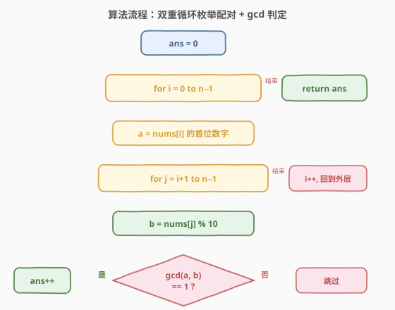
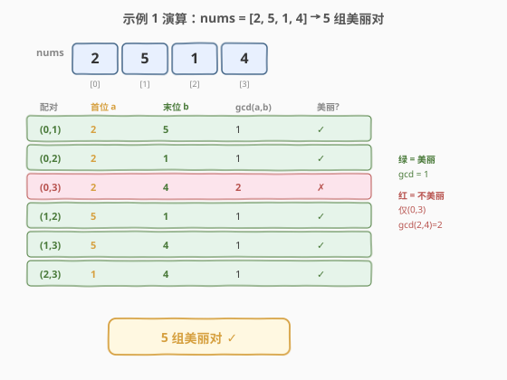

# LeetCode 美丽下标对的数目 题解

## 1. 题目概述

- **标题 / 题号**：美丽下标对的数目（#2748，easy）
- **链接**：https://leetcode.cn/problems/number-of-beautiful-pairs/
- **难度**：简单
- **标签**：数组、哈希表、数学、计数、数论

**题意**：给你一个下标从 **0** 开始的整数数组 `nums`。如果下标对 `i`、`j` 满足 `0 ≤ i < j < nums.length`，且 `nums[i]` 的**第一个数字**和 `nums[j]` 的**最后一个数字** **互质**，则认为 `nums[i]` 和 `nums[j]` 是一组**美丽下标对**。

返回 `nums` 中**美丽下标对**的总数目。

> 对于两个整数 `x` 和 `y`，如果不存在大于 1 的整数可以整除它们，则认为 `x` 和 `y` 互质。换言之，如果 `gcd(x, y) == 1`，则认为 `x` 和 `y` 互质。

**示例 1**：

```text
输入：nums = [2,5,1,4]
输出：5
解释：nums 中共有 5 组美丽下标对：
i = 0 和 j = 1：nums[0] 的首位是 2，nums[1] 的末位是 5。gcd(2,5) == 1。
i = 0 和 j = 2：nums[0] 的首位是 2，nums[2] 的末位是 1。gcd(2,1) == 1。
i = 1 和 j = 2：nums[1] 的首位是 5，nums[2] 的末位是 1。gcd(5,1) == 1。
i = 1 和 j = 3：nums[1] 的首位是 5，nums[3] 的末位是 4。gcd(5,4) == 1。
i = 2 和 j = 3：nums[2] 的首位是 1，nums[3] 的末位是 4。gcd(1,4) == 1。
因此返回 5。
```

**示例 2**：

```text
输入：nums = [11,21,12]
输出：2
解释：共有 2 组美丽下标对：
i = 0 和 j = 1：nums[0] 的首位是 1，nums[1] 的末位是 1。gcd(1,1) == 1。
i = 0 和 j = 2：nums[0] 的首位是 1，nums[2] 的末位是 2。gcd(1,2) == 1。
因此返回 2。
```

**约束**：

- $2 \le \text{nums.length} \le 100$
- $1 \le \text{nums}[i] \le 9999$
- `nums[i] % 10 != 0`（末位数字永不为 0）

> 💡 关键观察：对每个数只需关心两个数字——**首位**和**末位**。首位恒为 $1\text{–}9$，末位因约束保证 $\ne 0$ 也恒为 $1\text{–}9$。于是 gcd 的两个操作数都是个位数，计算极快。

## 2. 解题思路

### 2.1 暴力思路：枚举所有下标对

$n \le 100$，所有下标对 $(i, j)$（$i < j$）最多 $\binom{100}{2} = 4950$ 对。对每对提取 `nums[i]` 的首位和 `nums[j]` 的末位，计算 $\gcd$ 判断是否为 1，是则计数。复杂度 $O(n^2 \cdot \log \min(a, b))$，对个位数 gcd 实际为 $O(1)$，完全可行。

### 2.2 核心观察：只取首尾数字，互质则计数

![核心观察：首位[i] 与 末位[j] 互质即美丽](../images/p2748_concept.svg)

题目本质非常直接：**每个数只贡献两个数字**（首位与末位），配对的判定只取决于这两个数字是否互质。

- **首位提取**：不断除以 10 直到剩一位（或转字符串取首字符）。如 `nums[i] = 21` → 首位 `2`。
- **末位提取**：`nums[j] % 10`。如 `nums[j] = 12` → 末位 `2`。
- **互质判定**：$\gcd(\text{首位}, \text{末位}) == 1$ 则该对美丽。

> ⚠️ **约束 `nums[i] % 10 != 0` 的作用**：保证末位 $\ne 0$，从而 $\gcd$ 的第二个操作数非零。若末位可能为 0，则 $\gcd(a, 0) = a$，需特殊处理（$a = 1$ 才互质）。本题约束消除了这一边界。

### 2.3 算法流程图



双重循环：外层固定 $i$ 并提取首位 $a$，内层枚举 $j > i$ 并取末位 $b = \text{nums}[j] \bmod 10$，若 $\gcd(a, b) = 1$ 则 `ans++`。

### 2.4 示例演算



以示例 1 `nums = [2,5,1,4]` 为例，每个数都是个位数，首位 = 末位 = 自身：

| 配对 $(i,j)$ | 首位 $a$ | 末位 $b$ | $\gcd(a,b)$ | 美丽? |
|:---:|:---:|:---:|:---:|:---:|
| $(0,1)$ | 2 | 5 | 1 | ✓ |
| $(0,2)$ | 2 | 1 | 1 | ✓ |
| $(0,3)$ | 2 | 4 | 2 | ✗ |
| $(1,2)$ | 5 | 1 | 1 | ✓ |
| $(1,3)$ | 5 | 4 | 1 | ✓ |
| $(2,3)$ | 1 | 4 | 1 | ✓ |

共 5 组美丽对，与示例输出一致。唯一不美丽的是 $(0,3)$：$\gcd(2, 4) = 2 \ne  1$。

## 3. 参考代码

### C++

```cpp
class Solution {
public:
    int countBeautifulPairs(vector<int>& nums) {
        int n = nums.size(), ans = 0;
        for (int i =  0; i < n; ++i) {
            int a = nums[i];
            while (a >= 10) a /= 10;       // 提取首位
            for (int j = i + 1; j < n; ++j) {
                int b = nums[j] % 10;       // 提取末位
                if (gcd(a, b) == 1) ++ans;
            }
        }
        return ans;
    }
};
```

### Python

```python
class Solution:
    def countBeautifulPairs(self, nums: List[int]) -> int:
        from math import gcd
        ans = 0
        for i in range(len(nums)):
            a = int(str(nums[i])[0])         # 提取首位
            for j in range(i + 1, len(nums)):
                b = nums[j] % 10             # 提取末位
                if gcd(a, b) == 1:
                    ans += 1
        return ans
```

> 💡 **首位提取的两种写法**：C++ 用 `while (a >= 10) a /= 10` 循环除以 10，避免字符串转换开销；Python 用 `int(str(nums[i])[0])` 更直观。两者等价，对 $n \le 100$ 性能无差异。

## 4. 复杂度分析

| 维度 | 复杂度 | 说明 |
|------|--------|------|
| 时间复杂度 | $O(n^2)$ | 双重循环枚举 $\binom{n}{2}$ 个下标对，每对 gcd 计算为 $O(1)$（操作数 $\le 9$） |
| 空间复杂度 | $O(1)$ | 仅维护计数器 `ans` 和临时变量，无额外数据结构 |

> 💡 gcd 的时间复杂度一般为 $O(\log \min(a, b))$，但本题 $a, b \in [1, 9]$，$\log 9 \approx 3.17$ 为常数，故每对判定为 $O(1)$。

## 5. 扩展：$O(n)$ 计数优化

当 $n$ 较大时（如 $n = 10^5$），$O(n^2)$ 不可行。观察到首位和末位都只有 $1\text{–}9$ 共 9 种取值，可**按末位分组计数**：

- 维护 `cnt[d]` = 遍历到当前位置时，首位为 $d$（$d \in [1,9]$）的元素个数。
- 对每个 $j$ 从左到右扫描：末位 $b = \text{nums}[j] \bmod 10$，答案累加 $\sum_{d=1}^{9} \text{cnt}[d] \times [\gcd(d, b) = 1]$。
- 然后将 `nums[j]` 的首位计入 `cnt`。

由于 $\gcd$ 只涉及 $9 \times 9 = 81$ 种组合，可预计算互质表 `coprime[d][b]`，每步查询 $O(9)$，总复杂度 $O(n \cdot 9) = O(n)$。

### Python

```python
class Solution:
    def countBeautifulPairs(self, nums: List[int]) -> int:
        from math import gcd
        coprime = [[gcd(d, b) == 1 for b in range(10)] for d in range(10)]
        cnt = [0] * 10
        ans = 0
        for x in nums:
            b = x % 10
            for d in range(1, 10):
                if cnt[d] and coprime[d][b]:
                    ans += cnt[d]
            a = x
            while a >= 10:
                a //= 10
            cnt[a] += 1
        return ans
```

> ⚠️ 本题 $n \le 100$，$O(n^2)$ 足矣，$O(n)$ 优化主要展示「值域有限时用计数代替枚举」的通用思路——当配对判定只取决于取值有限的属性时，哈希计数可将 $O(n^2)$ 降为 $O(n \cdot V)$（$V$ 为值域大小）。

## 6. 面试要点

1. **为什么只需首位和末位？**

   > 题目明确判定条件是「`nums[i]` 的第一个数字」与「`nums[j]` 的最后一个数字」互质。中间数字完全不参与判定，故每个数只需提取这两个数字。

2. **首位怎么提取？**

   > 两种方式：① 不断除以 10 直到不足两位（`while (a >= 10) a /= 10`），$O(\log_{10} n)$ 次；② 转字符串取首字符再转整数。对本题数据范围（$\le 9999$，最多 4 位）两者等价。

3. **约束 `nums[i] % 10 != 0` 有何意义？**

   > 保证末位非零，使 $\gcd(a, b)$ 中 $b \ge 1$。若末位可能为 0，则 $\gcd(a, 0) = a$，需额外判断 $a == 1$ 才互质。约束消除了这个边界。

4. **$\gcd(1, 1) == 1$ 吗？**

   > 是的。1 的正因子只有 1，故 $\gcd(1, 1) = 1$，满足互质定义。示例 2 中 $\gcd(1, 1) = 1$ 被判为美丽对，符合此规则。

5. **$O(n)$ 优化为什么可行？**

   > 首位和末位都只有 $1\text{–}9$ 共 9 种取值（值域有限）。用计数数组记录已遍历元素的首位分布，对当前元素的末位只需查 9 种首位是否互质——把「枚举配对」变成「按值域计数求和」，$O(n^2) \to O(n)$。

## 同类练习题

| # | 题目 | 与本题的关联 |
|---|------|-------------|
| 1979 | [找出数组的最大公约数](https://leetcode.cn/problems/find-greatest-common-divisor-of-array/) | 取数组最大值与最小值的 gcd，gcd 基础操作练习 |
| 914 | [卡牌分组](https://leetcode.cn/problems/x-of-a-kind-in-a-deck-of-cards/) | 统计各数字频率后求所有频率的 gcd，gcd 在计数场景的典型应用 |
| 1071 | [字符串的最大公因子](https://leetcode.cn/problems/greatest-common-divisor-of-strings/) | gcd 思想推广到字符串长度，验证整除关系 |
| 1447 | [最简分数](https://leetcode.cn/problems/simplified-fractions/) | 枚举分子分母并判断互质，与本题「gcd==1 即互质」的判定完全一致 |
| 1250 | [检查「好数组」](https://leetcode.cn/problems/check-if-it-is-a-good-array/) | 判断数组所有元素的 gcd 是否为 1，互质判定从两数推广到多数 |
