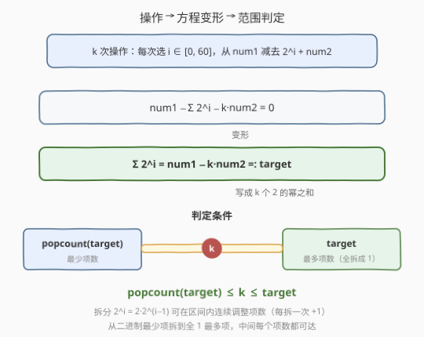
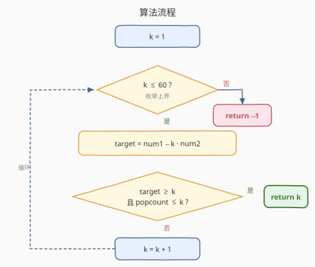
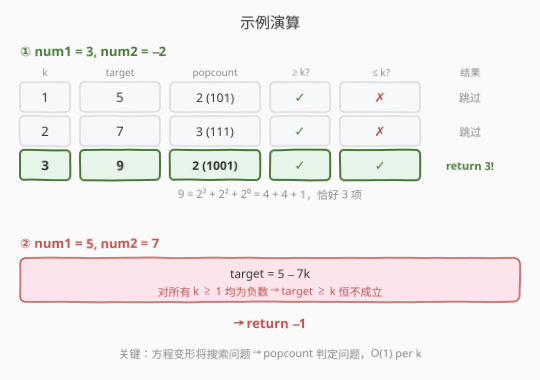

# 得到整数零需要执行的最少操作数

- **题目名称**：得到整数零需要执行的最少操作数
- **链接**：[2749. 得到整数零需要执行的最少操作数](https://leetcode.cn/problems/minimum-operations-to-make-the-integer-zero/)
- **难度**：中等
- **标签**：位运算、脑筋急转弯、枚举

## 1. 题目概述

给你两个整数 `num1` 和 `num2`。在一步操作中，你需要从范围 `[0, 60]` 中选出一个整数 $i$，并从 `num1` 减去 $2^i + \text{num2}$。请你计算，要想使 `num1` 等于 $0$ 需要执行的最少操作数，并以整数形式返回。如果无法使 `num1` 等于 $0$，返回 $-1$。

**示例 1**：

```text
输入：num1 = 3, num2 = -2
输出：3
解释：可以执行下述步骤使 3 等于 0：
- 选择 i = 2，num1 = 3 − (2² + (−2)) = 3 − 2 = 1
- 选择 i = 2，num1 = 1 − (2² + (−2)) = 1 − 2 = −1
- 选择 i = 0，num1 = (−1) − (2⁰ + (−2)) = (−1) − (−1) = 0
```

**示例 2**：

```text
输入：num1 = 5, num2 = 7
输出：-1
解释：可以证明，执行操作无法使 5 等于 0。
```

**约束条件**：

- $1 \le \text{num1} \le 10^9$
- $-10^9 \le \text{num2} \le 10^9$

> 💡 这是一道**脑筋急转弯 + 位运算**题：看似需要搜索所有操作组合，实则一次方程变形即可将问题转化为「一个数能否拆成恰好 $k$ 个 $2$ 的幂之和」——而这个问题有 $O(1)$ 的 popcount 判据。

---

## 2. 解题思路

### 2.1 暴力思路：DFS 搜索

最直观的做法是对每一步操作枚举 $i \in [0, 60]$ 共 61 种选择，用 DFS/BFS 搜索从 `num1` 到 $0$ 的最短路径。但 `num1` 可达 $10^9$，状态空间爆炸，且每步 61 个分支，搜索树指数增长——完全不可行。

> 💡 关键瓶颈：暴力法没有利用「操作的结构」——每步减去的 $2^i$ 部分**与步数无关**，而 $+ \text{num2}$ 部分在 $k$ 步后恰好累积 $k \cdot \text{num2}$。把这个累积量提出来，就能把搜索问题变成判定问题。

### 2.2 核心观察：方程变形 + popcount 范围判定



**第一步：方程变形。** 假设执行 $k$ 次操作，第 $j$ 次选了 $i_j$，则：

$$
\text{num1} - \sum_{j=1}^{k} 2^{i_j} - k \cdot \text{num2} = 0
$$

移项得：

$$
\sum_{j=1}^{k} 2^{i_j} = \text{num1} - k \cdot \text{num2} =: \text{target}
$$

问题转化为：**target 能否写成恰好 $k$ 个 $2$ 的幂（$2^0 \sim 2^{60}$）之和？**

**第二步：popcount 给出最少项数。** 任何正整数 $n$ 的二进制表示中 $1$ 的个数 $\text{popcount}(n)$，就是把它写成**不同** $2$ 的幂之和所需的最少项数——每个 $1$ 位对应一个 $2^i$，这就是二进制本身。

**第三步：target 给出最多项数。** 把所有项都拆成 $2^0 = 1$，需要恰好 $\text{target}$ 个 $1$ 相加——这是最多项数。

**第四步：拆分可连续调整项数。** 从 $\text{popcount}$ 项出发，每次把一个 $2^i$（$i > 0$）拆成两个 $2^{i-1}$，项数 $+1$。反复拆分直到全为 $1$（$\text{target}$ 项），途中的每个项数都能达到。因此：

$$
\text{可行} \iff \text{popcount}(\text{target}) \le k \le \text{target}
$$

> ⚠️ 注意 $\text{target}$ 必须为正（$2$ 的幂都是正数，和不可能为负或零）。当 $\text{target} \le 0$ 时 $k \le \text{target}$ 不可能成立（$k \ge 1$），自然被排除。

### 2.3 算法流程图



只需枚举 $k = 1, 2, \dots, 60$，对每个 $k$ 计算 $\text{target} = \text{num1} - k \cdot \text{num2}$，检查 $\text{popcount}(\text{target}) \le k \le \text{target}$，首个满足的 $k$ 即为答案。

> 💡 **为什么上界是 60？** $\text{target} = \text{num1} - k \cdot \text{num2}$，在约束下 $|\text{target}| < 2^{37}$（$\text{num1} \le 10^9 < 2^{30}$，$k \le 60$，$|\text{num2}| \le 10^9$），故 $\text{popcount}(\text{target}) \le 37 \le k$ 对 $k \ge 37$ 恒成立。因此答案若存在，必在 $k \le 37$ 找到；取 60 是安全的宽松上界。详见第 5 节。

### 2.4 示例演算



以示例 1（$\text{num1} = 3, \text{num2} = -2$）为例：

| $k$ | $\text{target} = 3 - k \cdot (-2)$ | 二进制 | $\text{popcount}$ | $\text{target} \ge k$? | $\text{popcount} \le k$? | 结果 |
|-----|-------------------------------------|--------|-------------------|------------------------|--------------------------|------|
| 1   | $5$                                 | $101$  | $2$               | $5 \ge 1$ ✓            | $2 \le 1$ ✗              | 跳过 |
| 2   | $7$                                 | $111$  | $3$               | $7 \ge 2$ ✓            | $3 \le 2$ ✗              | 跳过 |
| 3   | $9$                                 | $1001$ | $2$               | $9 \ge 3$ ✓            | $2 \le 3$ ✓              | **返回 3** |

$k = 3$ 时两个条件同时满足：$9 = 2^2 + 2^2 + 2^0 = 4 + 4 + 1$，恰好 $3$ 项。

示例 2（$\text{num1} = 5, \text{num2} = 7$）：$\text{target} = 5 - 7k$，对所有 $k \ge 1$ 均为负数，条件无法满足，返回 $-1$。

---

## 3. 参考代码

### C++

```cpp
class Solution {
public:
    int makeTheIntegerZero(int num1, int num2) {
        for (int k = 1; k <= 60; k++) {
            long long target = (long long)num1 - (long long)k * num2;
            if (target >= k && __builtin_popcountll(target) <= k) {
                return k;
            }
        }
        return -1;
    }
};
```

### Python

```python
class Solution:
    def makeTheIntegerZero(self, num1: int, num2: int) -> int:
        for k in range(1, 61):
            target = num1 - k * num2
            if target >= k and bin(target).count('1') <= k:
                return k
        return -1
```

> 💡 **C++ 注意事项**：
> - `num1`、`num2` 都是 `int`，但 `k * num2` 可能超出 `int` 范围（$60 \times 10^9 > 2^{31}$），必须用 `long long` 中间变量。
> - `__builtin_popcountll` 接受 `unsigned long long`，但在 `target >= k` 通过后 `target` 必为正，无需担心负数转无符号的问题。

---

## 4. 复杂度分析

| 维度 | 复杂度 | 说明 |
|------|--------|------|
| 时间复杂度 | $O(1)$ | 枚举 $k$ 最多 $60$ 次，每次 $O(1)$ 的 popcount，总计常数级 |
| 空间复杂度 | $O(1)$ | 仅用若干整型变量 |

> ⚠️ 严格说 $60$ 次循环是 $O(60) = O(1)$，因为循环次数与输入规模无关。即便考虑 $\text{popcount}$ 的时间为 $O(\log \text{target})$，$\text{target} < 2^{37}$，也是常数。

---

## 5. 扩展：为什么上界是 60？

枚举上界 $60$ 并非随意选取，而是由约束条件推导出的安全上界：

**情况一：$\text{num2} < 0$（target 随 $k$ 增大）。** $\text{target} = \text{num1} + k \cdot |\text{num2}|$。在 $k \le 60$ 时：

$$
\text{target} \le 10^9 + 60 \times 10^9 = 6.1 \times 10^{10} < 2^{36}
$$

故 $\text{popcount}(\text{target}) \le 36$。当 $k \ge 36$ 时 $\text{popcount} \le k$ 恒成立，且 $\text{target} \ge k$（$\text{num1} \ge 1$，$|\text{num2}| \ge 1$）也恒成立。**答案若存在，必在 $k \le 36$ 找到。**

**情况二：$\text{num2} \ge 0$（target 随 $k$ 减小或不变）。** $\text{target} = \text{num1} - k \cdot \text{num2} \le \text{num1} < 2^{30}$，故 $\text{popcount} \le 30$。当 $k \ge 30$ 时 popcount 条件恒成立。但 $\text{target}$ 随 $k$ 增大而减小，$\text{target} \ge k$ 的窗口在缩小。**答案若存在，必在 $k \le 30$ 找到。**

综合两种情况，实际上界为 $\max(36, 30) = 36$。题目取 $i \in [0, 60]$（$2^{60} \gg \text{target}$，不会成为约束），取 $60$ 作为枚举上界是充裕的安全裕量。

> 💡 更直观的理解：$\text{popcount}(n)$ 的上界是 $n$ 的二进制位数 $\lfloor \log_2 n \rfloor + 1$。而 $\text{target}$ 在约束下不超过 $36$ 位，所以 $k$ 不需要超过 $36$ 就一定能满足 popcount 条件。$60$ 只是恰好与 $i$ 的范围 $[0, 60]$ 对齐，取个整数好记。

---

## 6. 面试要点

1. **如何想到方程变形？**

   - 关注操作的结构：每步减去 $2^i + \text{num2}$，其中 $2^i$ 部分随步变化、$\text{num2}$ 部分固定。$k$ 步后 $\text{num2}$ 累积 $k \cdot \text{num2}$ 是确定的，把它提出来就只剩下 $\sum 2^{i_j} = \text{target}$ 的判定问题。

2. **popcount 为什么是最少项数？**

   - 正整数 $n$ 的二进制表示 $\sum_{b \in \text{bits}(n)} 2^b$ 恰好用了 $\text{popcount}(n)$ 个不同的 $2$ 的幂。不可能更少：每个 $2$ 的幂在二进制中贡献恰好一个 $1$ 位，要覆盖 $n$ 的所有 $1$ 位至少需要 $\text{popcount}(n)$ 个幂。

3. **target 为什么是最多项数？拆分是否一定能达到中间值？**

   - 全拆成 $2^0 = 1$ 需要 $\text{target}$ 项，这是上限。从 $\text{popcount}$ 项出发，每次把一个 $2^i$（$i > 0$）拆成两个 $2^{i-1}$，项数恰好 $+1$。反复拆到全 $1$，中间每个整数项数都可达，因此 $[\text{popcount}, \text{target}]$ 内的任意 $k$ 都可行。

4. **为什么不用 DFS/BFS？复杂度差在哪？**

   - 每步 61 个分支，$k$ 步的搜索树有 $61^k$ 个叶节点。即使 $k = 3$ 也有 $226{,}981$ 种组合，且无法剪枝（没有明显的好坏方向）。方程变形把「搜索 $k$ 步的具体选法」降为「判定 $k$ 是否可行」，复杂度从指数降为 $O(1)$。

5. **target 为负或为零时怎么办？**

   - $2$ 的幂都是正数，和不可能为负或零。代码中 `target >= k`（$k \ge 1$）已隐含 $\text{target} > 0$ 的检查：$\text{target} \le 0$ 时 $\text{target} < k$，条件不满足，自动跳过。

---

## 7. 同类练习题

- [191. 位 1 的个数](https://leetcode.cn/problems/number-of-1-bits/)（[题解](../0001-0100/191_位1的个数.md)）：`popcount` 的定义题——`n & (n−1)` 消最低位 $1$，本题的核心判据直接依赖它
- [231. 2 的幂](https://leetcode.cn/problems/power-of-two/)（[题解](../0201-0300/231_2的幂.md)）：`n & (n−1) == 0` 判定单个 $2$ 的幂，本题拆分的「积木块」
- [371. 两整数之和](https://leetcode.cn/problems/sum-of-two-integers/)（[题解](../0301-0400/371_两整数之和.md)）：位运算模拟加法（异或求和、与进位），同为位运算族
- [29. 两数相除](https://leetcode.cn/problems/divide-two-integers/)（[题解](../0001-0100/29_两数相除.md)）：位运算模拟除法（左移翻倍成倍减），与本题「$2$ 的幂分解」思想同源
