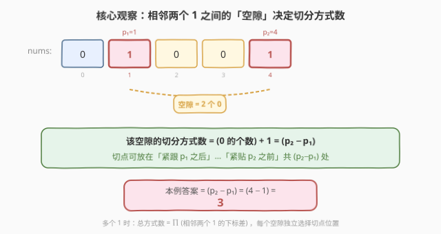
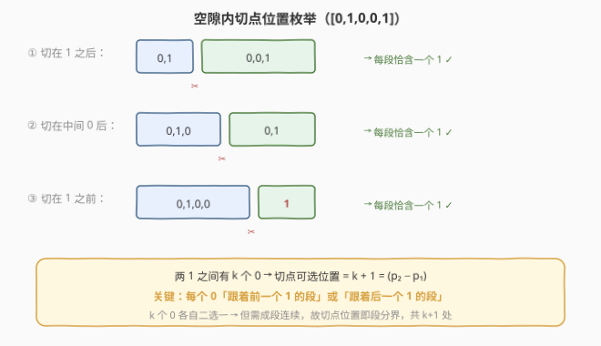
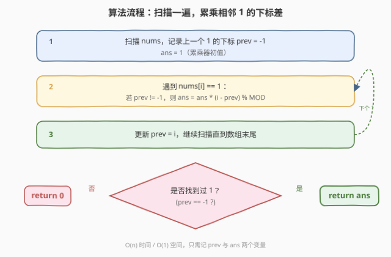
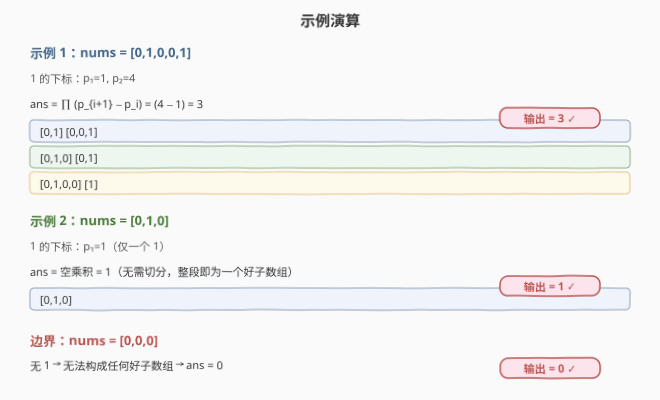

# LeetCode 将数组划分成若干好子数组的方式 题解

## 1. 题目概述

- **标题 / 题号**：将数组划分成若干好子数组的方式（#2750，medium）
- **链接**：https://leetcode.cn/problems/ways-to-split-array-into-good-subarrays/
- **难度**：中等
- **标签**：数组、数学、动态规划

**题意**：给你一个二元数组 `nums`。如果数组中的某个子数组 **恰好** 只存在 **一** 个值为 `1` 的元素，则认为该子数组是一个 **好子数组**。

请你统计将数组 `nums` 划分成若干 **好子数组** 的方法数，并以整数形式返回。由于数字可能很大，返回其对 $10^9 + 7$ **取余** 之后的结果。

子数组是数组中的一个连续 **非空** 元素序列。

**示例 1**：

```text
输入：nums = [0,1,0,0,1]
输出：3
解释：存在 3 种可以将 nums 划分成若干好子数组的方式：
- [0,1] [0,0,1]
- [0,1,0] [0,1]
- [0,1,0,0] [1]
```

**示例 2**：

```text
输入：nums = [0,1,0]
输出：1
解释：存在 1 种可以将 nums 划分成若干好子数组的方式：
- [0,1,0]
```

**约束**：

- $1 \le \text{nums.length} \le 10^5$
- $0 \le \text{nums[i]} \le 1$

> 💡 这是一道**数学 + 脑筋急转弯**题：看似要枚举所有切分方案，实则在确定「每个 1 必须独占一段」后，相邻两个 1 之间的若干个 `0` 该归属哪一段是**独立**的——空隙里有几个 `0`，切点就有几种放法，各空隙方案数直接相乘即可。

## 2. 解题思路

### 2.1 暴力思路

枚举所有切分位置子集（$n-1$ 个间隙每个「切 / 不切」共 $2^{n-1}$ 种），对每种方案检查每段是否恰含一个 `1`。时间复杂度 $O(2^n \cdot n)$，显然不可行。

### 2.2 核心观察：相邻 1 之间的空隙决定方案数



**关键约束**：每个「好子数组」必须**恰好含一个 1**。这意味着：

1. 每个 `1` 必须独占一段（同一段里不能有两个 `1`）；
2. 因此**任意两个相邻的 `1` 之间，必须有且仅有一个切分点**把它们的归属段分开；
3. 两个 `1` 之间的若干个 `0`，可以「跟着前一个 1 的段」也可以「跟着后一个 1 的段」——但切分点必须落在两 `1` 之间的某个间隙里。

设相邻两个 `1` 的下标为 $p_i$ 与 $p_{i+1}$（$p_i < p_{i+1}$），二者之间夹着 $p_{i+1} - p_i - 1$ 个 `0`。切分点可以放在「紧跟 $p_i$ 之后」到「紧贴 $p_{i+1}$ 之前」的任意一处，共

$$
\text{方案数}_i = (p_{i+1} - p_i - 1) + 1 = p_{i+1} - p_i
$$

种选择。



由于**各空隙互不影响**（每段含且仅含一个 `1`，空隙之间没有耦合），总方案数就是各空隙方案数的乘积：

$$
\text{ans} = \prod_{i=1}^{k-1} (p_{i+1} - p_i) \bmod (10^9 + 7)
$$

其中 $k$ 为 `1` 的总数。两个边界：

- **没有 `1`**（$k = 0$）：无法构成任何好子数组，返回 `0`。
- **只有一个 `1`**（$k = 1$）：没有空隙，乘积为空即 `1`（整段就是一个好子数组，无需切分）。

### 2.3 算法流程图



只需一次遍历，维护「上一个 `1` 的下标 `prev`」与「累乘器 `ans`」，遇到 `1` 时若 `prev != -1` 就把 $(i - \text{prev})$ 乘进去，最后据是否见过 `1` 返回 `ans` 或 `0`。

### 2.4 示例演算



## 3. 参考代码

### C++

```cpp
class Solution {
  public:
    int numberOfGoodSubarraySplits(vector<int>& nums) {
        const int MOD = 1e9 + 7;
        long long ans = 1;
        int prev = -1;
        for (int i = 0; i < (int)nums.size(); i++) {
            if (nums[i] == 1) {
                if (prev != -1) {
                    ans = ans * (i - prev) % MOD;
                }
                prev = i;
            }
        }
        return prev == -1 ? 0 : (int)ans;
    }
};
```

### Python

```python
class Solution:
    def numberOfGoodSubarraySplits(self, nums: List[int]) -> int:
        MOD = 10**9 + 7
        ans = 1
        prev = -1
        for i, x in enumerate(nums):
            if x == 1:
                if prev != -1:
                    ans = ans * (i - prev) % MOD
                prev = i
        return 0 if prev == -1 else ans
```

## 4. 复杂度分析

| 维度 | 复杂度 | 说明 |
|------|--------|------|
| 时间复杂度 | $O(n)$ | 单次遍历数组，遇 `1` 做 $O(1)$ 乘法 |
| 空间复杂度 | $O(1)$ | 只用 `prev`、`ans` 两个变量 |

## 5. 扩展：动态规划视角

本题也可用 DP 理解：设 $dp[i]$ 为考虑前 $i$ 个元素的合法切分方案数。转移时找最近的 `1` 的位置 $j$（$j \le i$），若 $[j..i]$ 恰含一个 `1`，则 $dp[i] = \sum_{j} dp[j-1]$。

实际上该 DP 会塌缩成上述乘积形式——因为只有「上一个 `1` 之后」的位置 $j$ 才能让 $[j..i]$ 恰含一个 `1`，而这些 $j$ 的取值个数恰为 $(i - \text{prev}_1)$，每个贡献相同的 $dp[j-1]$，求和即等价于「乘上空隙宽度」。所以数学乘积解就是 DP 的闭式精简。

## 6. 面试要点

1. **为什么答案是相邻 1 下标差的乘积？**
   - 每个 `1` 必须独占一段，故相邻两个 `1` 之间**必有且仅有一个切点**；该切点可放在两 `1` 间的 $(p_{i+1}-p_i)$ 个间隙中任一处，各空隙独立，故相乘。

2. **为什么乘积是 $p_{i+1} - p_i$ 而不是 $p_{i+1} - p_i - 1$？**
   - 间隙数 = `0` 的个数 + 1。两 `1` 间有 $(p_{i+1}-p_i-1)$ 个 `0`，切点可选位置 = `0` 的个数 + 1 = $p_{i+1} - p_i$。

3. **数组中没有 `1` 时返回什么？**
   - 返回 `0`。没有任何好子数组能形成，整个划分无解。

4. **只有一个 `1` 时返回什么？为什么不是 0？**
   - 返回 `1`。整段恰好含一个 `1`，本身就是一个好子数组，无需任何切分，即唯一方案。代码中靠「乘积为空 = 初值 1」+「见过 `1`」两个条件共同保证。

5. **为什么要取模？在哪一步取？**
   - 方案数可达 $10^{10^5}$ 量级（每段差相乘），远超 `int`/`long long`。每次乘法后立即 `% MOD` 防止溢出，C++ 用 `long long` 中间量、Python 大数天然支持但同样取模控制规模。

## 同类练习题

| # | 题目 | 与本题的关联 |
|---|------|-------------|
| 343 | [整数拆分](https://leetcode.cn/problems/integer-break/) | 切分型计数/最值，体会「分段独立决策」的乘积结构 |
| 96 | [不同的二叉搜索树](https://leetcode.cn/problems/unique-binary-search-trees/) | 以乘积/组合计数为骨架的 DP，思路同源 |
| 2369 | [检查数组是否存在有效划分](https://leetcode.cn/problems/check-if-there-is-a-valid-partition-for-the-array/) | 数组划分可行性 DP，对照本题为计数版 |
| 2430 | [对字母串可执行的最大删除数](https://leetcode.cn/problems/maximum-deletions-on-a-string/) | 分段决策的区间计数题，体会乘积 vs 求和的转化 |
