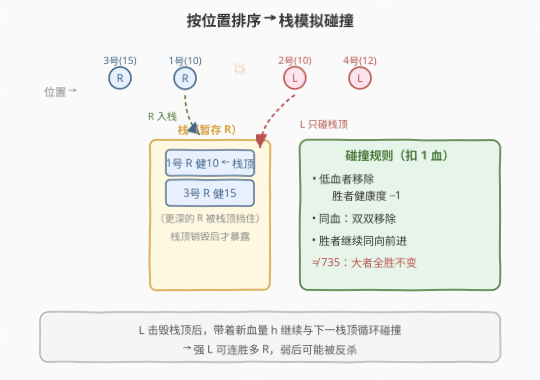
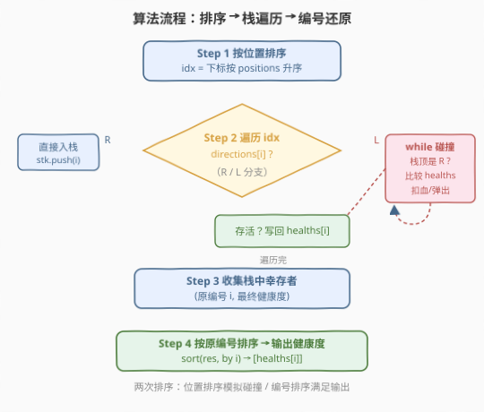
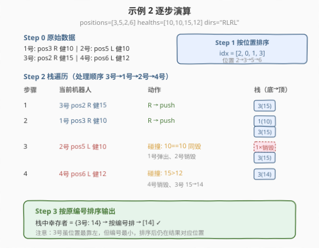

# LeetCode 机器人碰撞 题解

## 1. 题目概述

- **标题 / 题号**：机器人碰撞（#2751，hard）
- **链接**：https://leetcode.cn/problems/robot-collisions/
- **难度**：困难
- **标签**：栈、数组、排序、模拟

**题意**：现有 $n$ 个机器人，编号从 **1** 开始，每个机器人包含在路线上的位置、健康度和移动方向。给你下标从 **0** 开始的两个整数数组 `positions`、`healths` 和一个字符串 `directions`（`directions[i]` 为 `'L'` 表示**向左**，`'R'` 表示**向右**）。`positions` 中的所有整数**互不相同**。

所有机器人以**相同速度** **同时**沿给定方向在路线上移动。如果两个机器人移动到相同位置，则会发生**碰撞**。

碰撞规则：

- 将**健康度较低**的机器人从路线中**移除**，并且另一个机器人的健康度**减少 1**。
- 如果两个机器人的健康度**相同**，则将二者都从路线中移除。
- 存活下来的机器人继续沿着与之前**相同**的方向前进。

请你确定全部碰撞后幸存下来的所有机器人的**健康度**，并按照**原来机器人编号的顺序**排列（即机器人 1 的最终健康度、机器人 2 的最终健康度……）。如果不存在幸存的机器人，则返回空数组。

> ⚠️ **注意**：位置 `positions` 可能是**乱序**的。

**示例 1**：

```text
输入：positions = [5,4,3,2,1], healths = [2,17,9,15,10], directions = "RRRRR"
输出：[2,17,9,15,10]
解释：在本例中不存在碰撞，因为所有机器人向同一方向移动。所以按原编号顺序返回健康度。
```

**示例 2**：

```text
输入：positions = [3,5,2,6], healths = [10,10,15,12], directions = "RLRL"
输出：[14]
解释：发生 2 次碰撞。机器人 1 和机器人 2 健康度相同，二者都被移除；机器人 3 和机器人 4 碰撞，
      机器人 4 健康度更小被移除，机器人 3 健康度变为 15 - 1 = 14。仅剩机器人 3，返回 [14]。
```

**示例 3**：

```text
输入：positions = [1,2,5,6], healths = [10,10,11,11], directions = "RLRL"
输出：[]
解释：机器人 1、2 健康度相同双双移除；机器人 3、4 健康度相同双双移除。无幸存者，返回 []。
```

**约束**：

- $1 \le \text{positions.length} = \text{healths.length} = \text{directions.length} = n \le 10^5$
- $1 \le \text{positions}[i], \text{healths}[i] \le 10^9$
- `directions[i] == 'L'` 或 `directions[i] == 'R'`
- `positions` 中的所有值互不相同

> 💡 本题是 [735. 行星碰撞](../0701-0800/735_行星碰撞.md) 的**进阶版**：位置乱序（需先排序）、碰撞后胜者**扣 1 血**（可连战多场）、机器人**带编号**（结果需按原编号输出）。核心仍是**栈模拟**，只是多了「排序预处理」和「编号还原」两步。

## 2. 解题思路

### 2.1 暴力思路：逐轮扫描相邻碰撞

最直觉的做法是先把机器人按位置排序，然后反复扫描相邻的「左 R、右 L」对进行碰撞处理，直到某轮无碰撞为止。每轮扫描 $O(n)$，最坏情况下每轮只消除一个元素、共需 $O(n)$ 轮，总复杂度 $O(n^2)$，$n = 10^5$ 时必然超时。

优化方向：用一个**栈**逐个处理机器人。向右（R）的机器人入栈暂存命运；向左（L）的机器人只与栈顶（最近的向右机器人）碰撞——每台机器人最多入栈一次、出栈一次，总复杂度降到 $O(n)$（排序后）。

### 2.2 核心观察：按位置排序 + 栈模拟碰撞



三个关键洞察：

1. **位置乱序 → 先排序**。所有碰撞只发生在「左侧向右、右侧向左」的机器人之间，与原始输入顺序无关。先把机器人按位置升序排列，就能从左到右逐一处理。

2. **栈天然匹配碰撞顺序**。从左到右遍历排序后的机器人：
   - **向右（R）**：直接入栈。它可能与后续向左的机器人碰撞，命运待定。
   - **向左（L）**：只可能与**栈顶**（最近的、且仍向右的机器人）碰撞。因为栈中更深的向右机器人会被栈顶「挡住」——若栈顶被击毁，L 才会继续与下一个栈顶碰撞。

3. **扣 1 血规则 → 循环连战**。与 735「大者全胜、小者直接爆」不同，本题**胜者每次只扣 1 血**，可能连战多场后变弱被反杀。因此碰撞后要把**更新后的健康度**写回，让胜者带着新血量继续参与后续战斗——这恰好由 `while` 循环 + 局部变量 `h` 自然实现。

> 💡 **为什么 L 不会与栈中更深的 R 碰撞？** 假设栈为 `[..., X, Y]`，`Y` 向右、当前 `a` 向左。`a` 只与 `Y` 碰撞。只有当 `Y` 被击毁（弹出）后，`a` 才会与 `X` 碰撞——前提是 `X` 也向右。这就是碰撞后要**循环比较新栈顶**的原因。

### 2.3 算法流程图



四步走：

1. **按位置排序**：对下标按 `positions` 排序，得到处理顺序 `idx`。
2. **栈遍历**：按 `idx` 逐个处理。R 入栈；L 与栈顶循环碰撞，胜者带新血量入栈或留在栈中。
3. **收集幸存者**：栈中留下的是幸存机器人（按位置有序），记录其 `(原编号, 最终健康度)`。
4. **按原编号排序输出**：题目要求按机器人编号顺序返回健康度，故对幸存者按原下标再排一次序后取健康度。

> 💡 两次排序都不可省：第一次按**位置**排序是为了正确模拟碰撞；第二次按**原编号**排序是为了满足输出顺序要求。两者维度不同，各司其职。

### 2.4 示例演算



以**示例 2**（`positions = [3,5,2,6]`, `healths = [10,10,15,12]`, `directions = "RLRL"`）为例。

**Step 0 原始数据**（机器人编号 = 下标 + 1）：

| 机器人 | 下标 $i$ | 位置 | 健康度 | 方向 |
|--------|----------|------|--------|------|
| 1 | 0 | 3 | 10 | R |
| 2 | 1 | 5 | 10 | L |
| 3 | 2 | 2 | 15 | R |
| 4 | 3 | 6 | 12 | L |

**Step 1 按位置排序**：得到处理顺序 `idx = [2, 0, 1, 3]`（位置 2→3→5→6）。

**Step 2 栈遍历**：

| 步骤 | 当前机器人 | 动作 | 栈（底→顶） | 说明 |
|------|-----------|------|-------------|------|
| 1 | 3 号（pos 2, R, 15） | push | `[3(15)]` | 向右，入栈 |
| 2 | 1 号（pos 3, R, 10） | push | `[3(15), 1(10)]` | 向右，入栈 |
| 3 | 2 号（pos 5, L, 10） | 碰撞 | `[3(15)]` | 栈顶 1 号血 10 == 10，**双双移除**，1 号弹出、2 号销毁 |
| 4 | 4 号（pos 6, L, 12） | 碰撞 | `[3(14)]` | 栈顶 3 号血 15 > 12，4 号销毁，3 号血变为 $15-1=14$ |

**Step 3 按原编号排序输出**：栈中幸存者 = `{3 号: 14}`，按编号排好 → `[14]`。✓

> 💡 步骤 3 中 2 号（L）击败 1 号后本应继续左行，但 1 号与 2 号**同血双双移除**，2 号也销毁，故不与栈中更深的 3 号碰撞。步骤 4 中 4 号（L）败给 3 号（15 > 12），4 号销毁、3 号扣 1 血变 14，3 号留在栈中继续向右。

## 3. 参考代码

### C++

```cpp
class Solution {
public:
    vector<int> survivedRobotsHealths(vector<int>& positions, vector<int>& healths, string directions) {
        int n = positions.size();
        vector<int> idx(n);
        for (int i = 0; i < n; i++) idx[i] = i;
        sort(idx.begin(), idx.end(), [&](int a, int b) {
            return positions[a] < positions[b];
        });

        vector<int> stk;
        for (int i : idx) {
            if (directions[i] == 'R') {
                stk.push_back(i);
            } else {
                bool alive = true;
                int h = healths[i];
                while (alive && !stk.empty() && directions[stk.back()] == 'R') {
                    int j = stk.back();
                    if (healths[j] > h) {
                        healths[j] -= 1;
                        alive = false;
                    } else if (healths[j] < h) {
                        h -= 1;
                        stk.pop_back();
                    } else {
                        stk.pop_back();
                        alive = false;
                    }
                }
                if (alive) {
                    healths[i] = h;
                    stk.push_back(i);
                }
            }
        }

        vector<pair<int,int>> res;
        for (int i : stk) res.emplace_back(i, healths[i]);
        sort(res.begin(), res.end());
        vector<int> ans;
        for (auto& p : res) ans.push_back(p.second);
        return ans;
    }
};
```

> ⚠️ `positions[i]`、`healths[i]` 可达 $10^9$，但本题只做比较与减 1 运算，不累加大数，`int`（最大约 $2.1 \times 10^9$）足够，无需 `long long`。碰撞规则要求**严格大于**才算胜（相等则同归于尽），因此三个分支 `>`、`<`、`==` 必须写全，漏掉 `==` 会导致相等情况误判。

### Python

```python
class Solution:
    def survivedRobotsHealths(self, positions: List[int], healths: List[int], directions: str) -> List[int]:
        n = len(positions)
        idx = sorted(range(n), key=lambda i: positions[i])

        stk = []
        for i in idx:
            if directions[i] == 'R':
                stk.append(i)
            else:
                alive = True
                h = healths[i]
                while alive and stk and directions[stk[-1]] == 'R':
                    j = stk[-1]
                    if healths[j] > h:
                        healths[j] -= 1
                        alive = False
                    elif healths[j] < h:
                        h -= 1
                        stk.pop()
                    else:
                        stk.pop()
                        alive = False
                if alive:
                    healths[i] = h
                    stk.append(i)

        res = sorted((i, healths[i]) for i in stk)
        return [x[1] for x in res]
```

> 💡 `while` 条件里的 `directions[stk[-1]] == 'R'` 是关键：它保证 L 机器人只与**向右**的栈顶碰撞，不会误碰栈中已存活下来的 L 机器人（两个同向左行的机器人永不碰撞）。胜者的新血量通过局部变量 `h` 跟踪，最终存活时再写回 `healths[i]`。

## 4. 复杂度分析

| 维度 | 复杂度 | 说明 |
|------|--------|------|
| 时间复杂度 | $O(n \log n)$ | 按位置排序 $O(n \log n)$ 为主项；栈遍历每台机器人最多入栈/出栈一次，$O(n)$；按原编号再排序 $O(n \log n)$ |
| 空间复杂度 | $O(n)$ | `idx`、`stk`、`res` 各 $O(n)$ |

> 💡 内层 `while` 看似嵌套在循环中，但每次 `pop` 永久移除一个元素，总共最多 `n` 次 `pop`，均摊后每步 $O(1)$，故栈遍历整体 $O(n)$。瓶颈在两次排序，各 $O(n \log n)$，$n = 10^5$ 时 $\log n \approx 17$，总比较约 $3.4 \times 10^6$ 次，轻松通过。

## 5. 扩展：与 735 行星碰撞的三点差异

本题与 [735. 行星碰撞](../0701-0800/735_行星碰撞.md) 同属「栈模拟碰撞」家族，但有三个本质区别，决定了实现细节：

| 维度 | 735 行星碰撞 | 2751 机器人碰撞 |
|------|-------------|------------------|
| **位置** | 已按输入顺序排列 | 乱序，需先按位置排序 |
| **碰撞规则** | 大者全胜、不变；相等同毁 | **胜者扣 1 血**，可连战多场后变弱被反杀 |
| **输出** | 按碰撞后顺序返回 | 机器人**带编号**，需按原编号顺序返回 |

**扣 1 血规则的影响**：在 735 中，栈顶一旦更大就「全胜」，当前 L 直接销毁、栈顶不变；而在 2751 中，栈顶即便更大也**损失 1 点健康度**。这意味着一个强 R 可能连挡多个 L 后被磨死，或者一个强 L 连胜多个 R 后血量耗尽被反杀。因此必须把更新后的血量**写回**并让胜者继续留在栈中（R 胜）或带着 `h` 继续循环（L 胜），这正是 `while` 循环 + 局部变量 `h` 的作用。

> 💡 **一个易错的细节**：735 的行星**无编号**（输出就是栈顺序），而 2751 的机器人**有编号**（输出要按原编号）。所以 2751 栈里存的是**原下标** `i` 而非健康度本身，最后还要对幸存者按 `i` 再排一次序。若直接把栈当答案返回，顺序会按位置而非编号，导致错误。

## 6. 面试要点

1. **为什么要先按位置排序？不排序会怎样？**

   > 碰撞只发生在「左侧向右、右侧向左」的机器人之间，与输入顺序无关。若不排序，按输入顺序处理会错过「输入中靠后但位置靠左」的机器人，导致碰撞配对错误。排序后从左到右遍历，才能用栈正确捕获每对 R-L 的碰撞时序。

2. **为什么 L 只与栈顶碰撞，不与栈中更深的 R 碰撞？**

   > 栈顶是最近（位置最大）的向右机器人，L 向左行先遇到它。只有栈顶被击毁弹出后，L 才会暴露给更深的 R。这就是 `while` 循环每次只比栈顶的原因——若跳过栈顶直接比更深的 R，相当于让 L「穿墙」，物理上不可能。

3. **扣 1 血规则如何影响代码？和 735 有何不同？**

   > 735 中大者全胜、不变，栈顶更大时当前 L 直接销毁、栈顶不动。2751 中栈顶更大也要 `healths[j] -= 1`（扣 1 血），栈顶虽胜但变弱；当前 L 胜时也要 `h -= 1` 并继续循环，因为它可能还要面对下一个 R。所以必须用局部变量 `h` 跟踪 L 的实时血量，最终存活时写回。

4. **相等健康度时为什么要双方都销毁？**

   > 题目明确规定：健康度相同则二者都移除。因此代码用 `==` 分支同时 `pop` 栈顶并置 `alive = false`，既不入栈当前 L 也不保留栈顶。漏掉这个分支会让相等情况落入错误的比较逻辑。

5. **为什么栈里存下标而不是健康度？**

   > 因为机器人有编号，输出要按原编号顺序。栈里存原下标 `i`，碰撞时通过 `healths[j]` 读写血量、通过 `directions[j]` 判方向，最后再对幸存下标按 `i` 排序取 `healths[i]`。若只存健康度，会丢失编号信息，无法按要求顺序输出。

> 💡 **一句话总结**：2751 = 「位置排序 + 栈模拟 R-L 碰撞（胜者扣 1 血、循环连战）+ 按原编号排序输出」。它是 735 行星碰撞的带编号乱序扣血版，核心仍是「向右入栈、向左与栈顶循环碰撞」的栈模拟范式。

## 同类练习题

| # | 题目 | 与本题的关联 |
|---|------|-------------|
| 735 | [行星碰撞](https://leetcode.cn/problems/asteroid-collision/)（[站内题解](../0701-0800/735_行星碰撞.md)） | 本题的「无编号、位置有序、大者全胜」基础版，栈模拟碰撞的母题，先做它再上 2751 水到渠成 |
| 2731 | [移动机器人](https://leetcode.cn/problems/movement-of-robots/)（[站内题解](../2701-2800/2731_移动机器人.md)） | 同为机器人碰撞主题，但用「相撞反弹 ⟺ 穿透」的脑筋急转弯把模拟降到 $O(n \log n)$，对照「真模拟」与「等价转换」两种思路 |
| 2196 | [根据描述创建二叉树](https://leetcode.cn/problems/create-binary-tree-from-descriptions/) | 栈 / 哈希处理带编号节点的关系还原，巩固「带编号元素 + 排序/还原」的范式 |
| 456 | [132 模式](https://leetcode.cn/problems/132-pattern/) | 单调栈进阶，对照「栈模拟碰撞」与「单调栈维护极值」两类栈用法的区别 |
