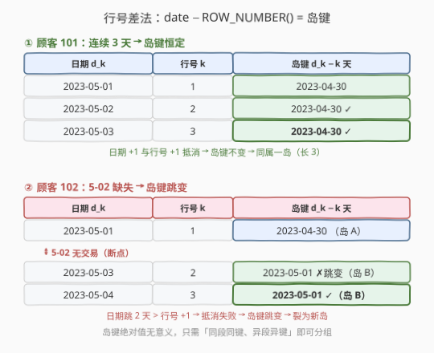
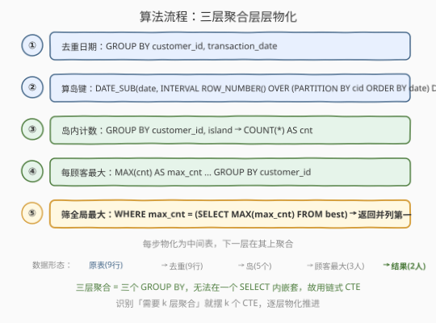
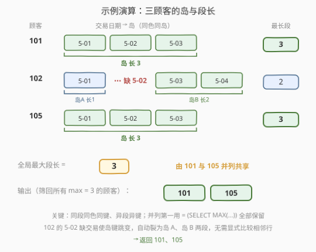

# LeetCode 在连续天数上进行了最多交易次数的顾客 题解

## 1. 题目概述

- **标题 / 题号**：在连续天数上进行了最多交易次数的顾客（#2752，hard）
- **链接**：https://leetcode.cn/problems/customers-with-maximum-number-of-transactions-on-consecutive-days/
- **难度**：困难
- **标签**：SQL、数据库、窗口函数、`ROW_NUMBER()`、Gaps and Islands、`DATE_SUB`、`INTERVAL`、CTE

> ⚠️ 本题为 LeetCode 付费题（Plus 会员专享），题意描述根据官方示例用例与 `jsonExampleTestcases` 重建，可能与官方题面有出入。

**题意**：给定 `Transactions` 表，记录每位顾客每笔交易。编写 SQL 查询，找出**在连续天数上进行了最多交易次数的顾客**——即每位顾客在一段连续自然日内都有交易，统计该连续段内的交易笔数，取各顾客的**最大连续段交易笔数**，再返回其值等于全局最大值的所有 `customer_id`。结果按 `customer_id` 升序返回。

**表结构**：

```text
表: Transactions
+------------------+------+
| Column Name      | Type |
+------------------+------+
| transaction_id   | int  |   ← 交易 id（主键）
| customer_id      | int  |   ← 顾客 id
| transaction_date | date |   ← 交易日期
| amount           | int  |   ← 交易金额
+------------------+------+
transaction_id 是该表的主键。
```

> 💡 **审题关键**：① **连续天数**指自然日相邻（5-01、5-02、5-03 相差恰好 1 天），不是「行号相邻」；② 每位顾客可能有**多段**连续日（如 102 既有 5-01 单日段，又有 5-03/5-04 两日段），只取其**最长段**参与全局比较；③ 要返回的是**并列第一的所有顾客**（全局最大值可能被多人共享），不是只取一人；④ 示例数据中每位顾客每天至多一笔交易（`(customer_id, transaction_date)` 唯一），故「连续段内交易笔数」=「连续段天数」。

**示例 1**：

```text
输入：
Transactions 表:
+----------------+-------------+------------------+--------+
| transaction_id | customer_id | transaction_date | amount |
+----------------+-------------+------------------+--------+
| 1              | 101         | 2023-05-01       | 100    |
| 2              | 101         | 2023-05-02       | 150    |
| 3              | 101         | 2023-05-03       | 200    |
| 4              | 102         | 2023-05-01       | 50     |
| 5              | 102         | 2023-05-03       | 100    |
| 6              | 102         | 2023-05-04       | 200    |
| 7              | 105         | 2023-05-01       | 100    |
| 8              | 105         | 2023-05-02       | 150    |
| 9              | 105         | 2023-05-03       | 200    |
+----------------+-------------+------------------+--------+

输出：
+-------------+
| customer_id |
+-------------+
| 101         |
| 105         |
+-------------+
```

**解释**：

| 顾客 | 交易日期 | 连续段（岛） | 各段笔数 | 最长段笔数 |
|------|----------|--------------|----------|------------|
| 101 | 5-01, 5-02, 5-03 | {5-01..5-03} | 3 | **3** |
| 102 | 5-01, 5-03, 5-04 | {5-01}, {5-03..5-04} | 1, 2 | **2** |
| 105 | 5-01, 5-02, 5-03 | {5-01..5-03} | 3 | **3** |

全局最长段笔数 = 3，由 101 与 105 共享，故返回二者。

> 💡 本题是 SQL **「Gaps and Islands（间隙与孤岛）」招牌母题**——核心是**窗口行号差法**：对每位顾客按日期排序的行，用 `transaction_date − ROW_NUMBER()` 作「岛键」，连续自然日会得到同一个键，从而把「判定连续」转化为「分组聚合」。它是对标 [180. 连续出现的数字](https://leetcode.cn/problems/consecutive-numbers/)、[1285. 找到连续区间的开始和结束数字](https://leetcode.cn/problems/find-the-start-and-end-number-of-continuous-ranges/) 的孤岛家族进阶——本题多了一层「每位顾客取最大岛、再跨顾客取全局最大、最后筛回顾客」的嵌套聚合。

## 2. 解题思路

### 2.1 暴力思路：自连接判相邻

最直觉的过程式思路：对每位顾客，把所有日期两两比较、找出连续序列。一种朴素写法是用自连接枚举「前驱日期相差 1 天」并递归拼接连续段。但 SQL 没有天然的递归（除非用 `WITH RECURSIVE`），逐对判定连续的写法既繁琐又易错：

```text
for each customer:
    sort dates ascending
    scan & split into runs where date[i] == date[i-1] + 1 day
    record max run length
take global max run length
return customers whose max == global max
```

- **正确性**：能做对，但「判定相邻」需要逐行比较前一行日期，纯关系代数写法（`t1.day + 1 = t2.day` 自连接）只能处理固定长度（如 180 题恰好 3 连续），**任意长度的连续段**要靠递归或多次自连接，代码膨胀。
- **效率**：自连接最坏 $O(n^2)$，且对「不定长连续段」无能为力。

> ⚠️ 瓶颈在于「连续性」被当成「相邻行的二元关系」逐对验证，而非当成「可一次性计算的全局不变量」。突破口是给连续段打上一个**对所有同段行都相同的标签（岛键）**——于是「判定连续」退化为「按标签分组」，一步聚合即可。

### 2.2 核心观察：行号差法 `date − ROW_NUMBER()` 是岛键



**关键不变量**：对一位顾客按日期升序排序后，若第 $k$ 行日期为 $d_k$，则：

$$g_k = d_k - k \cdot 1\text{ 天}$$

- 当日期**连续**（$d_{k} = d_{k-1} + 1$ 天）时，$d_k - k = d_{k-1} + 1 - k = d_{k-1} - (k-1) = g_{k-1}$——岛键**不变**；
- 当日期**断开**（$d_k \ge d_{k-1} + 2$ 天）时，$d_k - k > d_{k-1} + 1 - k = g_{k-1} + 1$——岛键**跳变**，开启新岛。

于是**同一连续段的所有行岛键相同**，**不同段岛键不同**。SQL 中用窗口函数给岛键：

$$\boxed{\text{island} = \text{DATE\_SUB}\big(\text{transaction\_date},\; \text{INTERVAL}\; \text{ROW\_NUMBER()}\;\text{OVER}\;(\text{PARTITION BY customer\_id ORDER BY transaction\_date})\; \text{DAY}\big)}$$

**以 101 为例**（连续 3 天，岛键恒为 4-30）：

| 日期 $d_k$ | 行号 $k$ | $d_k - k$ 天（岛键） | 是否连续 |
|------------|----------|----------------------|----------|
| 2023-05-01 | 1 | 2023-04-30 | 起点 |
| 2023-05-02 | 2 | 2023-04-30 | ✓ 与上行同键 |
| 2023-05-03 | 3 | 2023-04-30 | ✓ 与上行同键 |

**以 102 为例**（5-02 缺失，岛键跳变，裂为两岛）：

| 日期 $d_k$ | 行号 $k$ | 岛键 | 所属岛 |
|------------|----------|------|--------|
| 2023-05-01 | 1 | 2023-04-30 | 岛 A（仅 1 日） |
| 2023-05-03 | 2 | 2023-05-01 | 岛 B（起点） |
| 2023-05-04 | 3 | 2023-05-01 | 岛 B（与上行同键） |

> 💡 **为什么行号差法成立？** 「连续」的充要条件是「相邻行日期差恰为 1 天」。而行号对每行恰好 $+1$，于是「日期差 = 行号差」等价于「日期差 = 1」。把日期减去行号后，日期的「连续 $+1$」与行号的「连续 $+1$」相互抵消，残值稳定；一旦日期跳了 $>1$，抵消失败，残值跳变。本质是把「相对差分」转成「绝对不变量」。

> ⚠️ **两个前提**：① **`PARTITION BY customer_id`** 必须有——否则跨顾客的行号混在一起，岛键不再有意义；② **`ORDER BY transaction_date`** 必须升序——行号必须随日期单调递增，差法才成立。漏任一项都会得到错误的岛键。

### 2.3 算法流程图



**逻辑执行步骤**：

| 步骤 | 表达式 | 作用 |
|------|--------|------|
| ① 去重日期 | `GROUP BY customer_id, transaction_date` | 每位顾客每天保留一行，防止同日多笔交易扰乱行号差法 |
| ② 排序编号 | `ROW_NUMBER() OVER (PARTITION BY customer_id ORDER BY transaction_date)` | 顾客内按日期升序赋予连续行号 $k$ |
| ③ 算岛键 | `DATE_SUB(transaction_date, INTERVAL k DAY)` | 连续段岛键相同、断点跳变 |
| ④ 分组计数 | `GROUP BY customer_id, island`，`COUNT(*)` | 每段（岛）的连续天数 |
| ⑤ 每顾客最大 | `MAX(cnt) ... GROUP BY customer_id` | 取该顾客最长连续段 |
| ⑥ 筛全局最大 | `WHERE max_cnt = (SELECT MAX(max_cnt) ...)` | 只留并列第一的顾客 |

> 💡 **嵌套聚合的处理顺序**：本题有三层聚合——岛内计数（④）→ 顾客内取最大（⑤）→ 全局取最大并筛回（⑥）。SQL 中每层聚合都需一个独立 `GROUP BY`，无法在一个 `SELECT` 里嵌套三层 `MAX`。正因如此用**链式 CTE** 把每层结果物化为一张中间表，层层推进：`grp`（算岛键）→ `islands`（岛内计数）→ `best`（顾客最大）→ 最终 `SELECT`（筛全局最大）。这是「多级分组下取最值」类 SQL 题的标准骨架。

### 2.4 示例演算



对三位顾客逐一走行号差法：

**顾客 101**（连续段 1 段，长 3）：

| 日期 | 行号 $k$ | 岛键 = 日期 − $k$ 天 | 岛 | 段长 |
|------|----------|----------------------|----|------|
| 5-01 | 1 | 4-30 | A | 3 |
| 5-02 | 2 | 4-30 | A | ↑ |
| 5-03 | 3 | 4-30 | A | ↑ |

**顾客 102**（断点在 5-02，裂为 2 段，最长 2）：

| 日期 | 行号 $k$ | 岛键 | 岛 | 段长 |
|------|----------|------|----|------|
| 5-01 | 1 | 4-30 | A | 1 |
| 5-03 | 2 | 5-01 | B | 2 |
| 5-04 | 3 | 5-01 | B | ↑ |

**顾客 105**（与 101 同构，最长 3）：

| 日期 | 行号 $k$ | 岛键 | 岛 | 段长 |
|------|----------|------|----|------|
| 5-01 | 1 | 4-30 | A | 3 |
| 5-02 | 2 | 4-30 | A | ↑ |
| 5-03 | 3 | 4-30 | A | ↑ |

各顾客最长段：101→3，102→2，105→3；全局最大 = 3，由 101、105 共享 → 输出 101、105。

> 💡 **三个观察要点**：① **断点导致岛键跳变**——102 在 5-02 缺交易，5-03 的岛键（5-01）不同于 5-01 的岛键（4-30），自然裂为两岛，无需显式「比较相邻行」；② **岛键的绝对值无意义**——4-30、5-01 只是个分组标签，重要的是「同段同键、异段异键」，不去解释它代表哪一天；③ **并列第一要全返回**——最后一步用 `= (SELECT MAX(...))` 子查询而非 `LIMIT 1`，保留所有达到全局最大值的顾客。

## 3. 参考代码

### SQL（解法 A：`DATE_SUB` + `ROW_NUMBER` 行号差法，推荐）

```sql
WITH dd AS (
    SELECT customer_id, transaction_date
    FROM Transactions
    GROUP BY customer_id, transaction_date
),
grp AS (
    SELECT customer_id, transaction_date,
           DATE_SUB(transaction_date,
                     INTERVAL ROW_NUMBER() OVER (
                         PARTITION BY customer_id ORDER BY transaction_date
                     ) DAY) AS island
    FROM dd
),
islands AS (
    SELECT customer_id, island, COUNT(*) AS cnt
    FROM grp
    GROUP BY customer_id, island
),
best AS (
    SELECT customer_id, MAX(cnt) AS max_cnt
    FROM islands
    GROUP BY customer_id
)
SELECT customer_id
FROM best
WHERE max_cnt = (SELECT MAX(max_cnt) FROM best)
ORDER BY customer_id;
```

> 💡 **写法要点**：
> - **`dd` 去重日期**：`GROUP BY customer_id, transaction_date` 保证每位顾客每天一行。即使允许同日多笔交易，去重后行号差法仍正确（见第 5 节变体）；示例数据天然唯一，此步为防御性写法。
> - **`grp` 算岛键**：`DATE_SUB(transaction_date, INTERVAL ROW_NUMBER() ... DAY)` 把「连续自然日」编码为同一标签。`PARTITION BY customer_id` 保证行号在顾客内独立计数；`ORDER BY transaction_date` 保证行号随日期单调递增——二者缺一不可。
> - **`islands` 岛内计数**：`GROUP BY customer_id, island` 后 `COUNT(*)` 得每段连续天数。注意要带上 `customer_id` 一起分组，否则不同顾客的相同岛键（如 101 与 105 都有 4-30 键）会被错误合并。
> - **`best` 每顾客最大**：一位顾客可能有多个岛（如 102 的岛 A、岛 B），取其最大段长。
> - **最终筛选**：`max_cnt = (SELECT MAX(max_cnt) FROM best)` 取全局最大并筛回所有达到该值的顾客；`ORDER BY customer_id` 满足输出顺序要求。
> - ✓ 需 MySQL 8.0+（窗口函数）。链式 CTE 把「岛内计数 → 顾客最大 → 全局最大筛回」三层聚合层层物化，是「多级分组取最值」的标准骨架。

### SQL（解法 B：`DATEDIFF` 整数岛键，跨库友好）

```sql
WITH grp AS (
    SELECT customer_id, transaction_date,
           DATEDIFF(transaction_date, '2000-01-01')
             - ROW_NUMBER() OVER (
                   PARTITION BY customer_id ORDER BY transaction_date
               ) AS island
    FROM Transactions
    GROUP BY customer_id, transaction_date
),
islands AS (
    SELECT customer_id, island, COUNT(*) AS cnt
    FROM grp
    GROUP BY customer_id, island
),
best AS (
    SELECT customer_id, MAX(cnt) AS max_cnt
    FROM islands
    GROUP BY customer_id
)
SELECT customer_id
FROM best
WHERE max_cnt = (SELECT MAX(max_cnt) FROM best)
ORDER BY customer_id;
```

> 💡 **写法要点**：
> - 用 `DATEDIFF(transaction_date, '2000-01-01')` 把日期转成整数序号（自 2000-01-01 起的天数），再减行号，得到**整数岛键**。数学等价于解法 A 的 `DATE_SUB`，但不依赖 `INTERVAL ... DAY` 构造，跨库（MySQL/PG 可换 `date - '2000-01-01'`）更易移植。
> - `DATEDIFF` 的「基准日」任取（此处用 2000-01-01），只要对所有行统一即可——岛键是相对不变量，基准平移只整体偏移键值，不影响「同段同键、异段异键」。
> - ⚠️ MySQL 的 `DATEDIFF(a, b)` 返回 `a - b` 的天数（顺序与某些库相反），PG 写作 `(date - DATE '2000-01-01')`。移植时注意符号方向。

### Python（pandas）

```python
import pandas as pd

def max_transactions_consecutive_days(transactions: pd.DataFrame) -> pd.DataFrame:
    t = transactions[['customer_id', 'transaction_date']].drop_duplicates()
    t = t.sort_values(['customer_id', 'transaction_date'])
    t['rn'] = t.groupby('customer_id').cumcount() + 1
    t['island'] = t['transaction_date'].map(pd.Timestamp.toordinal) - t['rn']
    island_cnt = t.groupby(['customer_id', 'island']).size().reset_index(name='cnt')
    best = island_cnt.groupby('customer_id')['cnt'].max().reset_index()
    max_cnt = best['cnt'].max()
    return best[best['cnt'] == max_cnt][['customer_id']].sort_values('customer_id')
```

> 💡 **pandas 对照**：
> - `.drop_duplicates()` 等价于 CTE `dd` 的 `GROUP BY` 去重；`.sort_values` 等价于 `ORDER BY transaction_date`。
> - `.groupby('customer_id').cumcount() + 1` 等价于 `ROW_NUMBER() OVER (PARTITION BY customer_id ORDER BY ...)`——`cumcount` 从 0 起，故 $+1$。
> - `transaction_date.map(toordinal) - rn` 等价于 `DATEDIFF(date, base) - ROW_NUMBER()`——把日期转整数序号再减行号，得整数岛键。pandas 无 `DATE_SUB ... INTERVAL`，故走整数路线（对应 SQL 解法 B）。
> - `.groupby(['customer_id','island']).size()` 等价于 `islands` CTE 的岛内 `COUNT(*)`；随后 `.groupby('customer_id')['cnt'].max()` 对应 `best` CTE；最后布尔筛对应 `WHERE max_cnt = (SELECT MAX(...))`。

## 4. 复杂度分析

| 维度 | 复杂度 | 说明 |
|------|--------|------|
| 时间复杂度 | $O(n \log n)$ | 窗口排序主导：按 `(customer_id, transaction_date)` 排序 $O(n \log n)$；后续分组聚合均为 $O(n)$ 单趟扫描 |
| 空间复杂度 | $O(n)$ | CTE 中间结果物化（`grp`/`islands`/`best` 各至多 $n$ 行） |
| 中间行数 | $O(n)$ | 去重后每顾客每天一行，总行数 $\le n$ |

> - $n$ = `Transactions` 行数。
> - **排序主导**：窗口函数 `ROW_NUMBER() OVER (PARTITION BY ... ORDER BY ...)` 需按 `(customer_id, transaction_date)` 排序，代价 $O(n \log n)$；若 `(customer_id, transaction_date)` 已建索引或主键有序，排序可省，降至 $O(n)$。
> - **三层聚合均为线性**：岛内 `COUNT`、顾客内 `MAX`、全局 `MAX` 各扫一遍中间表，合计 $O(n)$，远低于排序代价，故总复杂度由排序 $O(n \log n)$ 主导。
> - **对比暴力自连接**：逐对判相邻的最坏 $O(n^2)$，且无法处理任意长连续段；行号差法用一次排序把「连续性判定」降为「分组聚合」，是质的飞跃。

> ⚠️ **性能要点**：给 `(customer_id, transaction_date)` 建复合索引可同时加速排序与去重的范围扫描；若数据倾斜（某顾客交易极多），排序仍集中在一个分区，但复杂度量级不变。

## 5. 扩展：同日多笔交易与「笔数 vs 天数」

### 5.1 去重为何必要

行号差法成立的前提是「相邻行的日期差恰为 1 天」。若一位顾客**同一天有多笔交易**且不去重，`ROW_NUMBER()` 会对同日的多行赋予不同的 $k$（如 5-01 得 $k=1,2$），于是 `date − k` 不再相等——同日本应同岛却被行号差法拆散。因此 `dd` CTE 的 `GROUP BY customer_id, transaction_date` 是必要的防御：**把同日多笔压成一行再算岛键**。

### 5.2 笔数 vs 天数：两种计数口径

示例数据每位顾客每天至多一笔交易，故「连续段天数」=「连续段交易笔数」，两种口径等价。但若允许同日多笔，需区分题目到底要哪种：

| 口径 | 含义 | 实现 |
|------|------|------|
| **连续天数**（本题默认） | 最长连续段跨几个自然日 | 去重后 `COUNT(*)`（即 `dd` 上的计数） |
| **连续段交易笔数** | 最长连续段内的所有交易笔数（含同日多笔） | 岛键仍用去重日期算，但计数时 `JOIN` 回原表数笔 |

若题目要「连续段交易笔数」，把 `islands` CTE 改为：

```sql
islands AS (
    SELECT g.customer_id, g.island, COUNT(*) AS cnt
    FROM grp g
    JOIN Transactions t
      ON t.customer_id = g.customer_id
     AND t.transaction_date = g.transaction_date
    GROUP BY g.customer_id, g.island
)
```

> 💡 即：**岛键用去重日期算**（保证连续性判定正确），**计数时 JOIN 回原表**（把同日多笔都算上）。两步分离，各司其职。面试若被追问「同日多笔怎么算」，回答要点就是这个——去重只服务于岛键构建，不影响最终笔数统计。

### 5.3 行号差法的家族

把「日期 − 行号」换成不同的「值 − 行号」，行号差法可解一族连续性问题：

| 连续对象 | 岛键构造 | 对应题目 |
|----------|----------|----------|
| 连续自然日 | `DATE_SUB(date, INTERVAL rn DAY)` | 本题 |
| 连续整数 id | `id − ROW_NUMBER()` | [1285. 找到连续区间的开始和结束数字](https://leetcode.cn/problems/find-the-start-and-end-number-of-continuous-ranges/) |
| 连续出现 3 次（定长） | `LAG() OVER` 取前两行比对 | [180. 连续出现的数字](https://leetcode.cn/problems/consecutive-numbers/) |
| 连续活跃日 | `DATE_SUB(login_day, INTERVAL rn DAY)` | [1454. 活跃用户](https://leetcode.cn/problems/active-users/) |

> 💡 行号差法是「不定长连续段」的通用解；定长连续（如「恰好 3 次」）也可用 `LAG` 取前 $k-1$ 行比较，但无法推广到任意长。掌握行号差法即掌握整个「孤岛」家族的骨架。

## 6. 面试要点

**Q1：为什么用 `date − ROW_NUMBER()` 能识别连续段？**

> 连续自然日的充要条件是相邻行日期差恰为 1 天，而行号对每行恰好 $+1$。把日期减去行号后，日期的「连续 $+1$」与行号的「连续 $+1$」相互抵消，同段行得到相同残值（岛键）；一旦日期跳了 $>1$ 天，抵消失败，残值跳变，开启新段。本质是把「相邻行的二元差分关系」转化为「每行的绝对不变量」，于是「判定连续」退化为「按不变量分组」。

**Q2：`PARTITION BY customer_id` 和 `ORDER BY transaction_date` 各起什么作用？**

> `PARTITION BY customer_id` 让行号在每位顾客内独立从 1 计起——否则跨顾客的行号混在一起，岛键无意义，会把不同顾客的连续段错误拼接。`ORDER BY transaction_date` 保证行号随日期单调递增——这是差法成立的数学前提（日期的 $+1$ 要与行号的 $+1$ 对齐）；若按别的列排序，日期差不等于行号差，岛键失真。二者缺一不可。

**Q3：为什么要三层 CTE，不能一个 `SELECT` 搞定？**

> 本题有三层嵌套聚合：岛内 `COUNT`、顾客内 `MAX`、全局 `MAX` 并筛回。SQL 的一个 `SELECT` 只能有一个 `GROUP BY` 层级，无法在原表上直接写 `MAX(MAX(COUNT(*)))`。每层聚合都需独立 `GROUP BY` 并物化为中间表，故用链式 CTE 逐层推进。这是「多级分组取最值」类 SQL 题的标准骨架——识别出「需要 $k$ 层聚合」就摆 $k$ 个 CTE。

**Q4：最后一步为什么用子查询 `= (SELECT MAX(...))` 而不是 `ORDER BY ... LIMIT 1`？**

> 全局最大值可能被多位顾客共享（如本题 101、105 并列第一）。`LIMIT 1` 只返回一行，会漏掉并列者。用 `WHERE max_cnt = (SELECT MAX(max_cnt) FROM best)` 筛回**所有**达到全局最大值的顾客。口诀：**「取并列第一」用子查询等值筛选，「只取唯一第一」才用 `LIMIT 1`**。

**Q5：同日多笔交易会破坏行号差法吗？如何处理？**

> 会。同日多笔若不去重，`ROW_NUMBER()` 给同日多行赋予不同 $k$，使 `date − k` 不等，同日本应同岛却被拆散。处理方式是先用 `GROUP BY customer_id, transaction_date` 去重再算岛键——**去重只服务于岛键构建**。若题目要的是「连续段交易笔数」（含同日多笔），则岛键仍用去重日期算，但计数时 `JOIN` 回原表数笔：去重保连续性，JOIN 保笔数，两步分离。

> 💡 **一句话总结**：2752 是 SQL **「Gaps and Islands 行号差法」招牌母题**——核心模板 `DATE_SUB(date, INTERVAL ROW_NUMBER() OVER (PARTITION BY customer_id ORDER BY date) DAY) AS island`。三大要点：**行号差法把连续性转为不变量（`date − rn` 同段同键）、`PARTITION+ORDER` 是差法前提、多级聚合用链式 CTE 逐层物化**。记住「连续段问题先想行号差法，并列第一用子查询等值筛」。

## 同类练习题

| # | 题目 | 与本题的关联 |
|---|------|-------------|
| 180 | [连续出现的数字](https://leetcode.cn/problems/consecutive-numbers/) | `LAG() OVER` 取前两行比对「连续出现 3 次」，定长连续的入门版；本题是任意长连续段，需用行号差法推广 |
| 1285 | [找到连续区间的开始和结束数字](https://leetcode.cn/problems/find-the-start-and-end-number-of-continuous-ranges/) | `id − ROW_NUMBER()` 作岛键再取每段 `MIN/MAX`，与本题同源行号差法，区别是输出每段的端点而非取全局最大 |
| 1454 | [活跃用户](https://leetcode.cn/problems/active-users/) | `DATE_SUB(login_day, INTERVAL ROW_NUMBER() OVER ... DAY)` 找连续活跃日 $\ge 5$ 天的用户，与本题岛键构造完全同构，区别是阈值判定而非取最值 |
| 1225 | [报告系统状态的连续日期](https://leetcode.cn/problems/report-contiguous-dates/) | 行号差法对「成功/失败」两状态分别建岛并合并区间，本题的单状态进阶版，难度更高 |
| 603 | [连续空余座位](https://leetcode.cn/problems/consecutive-available-seats/) | `seat_id − ROW_NUMBER()` 找连续空座，整数版行号差法，对照本题的「日期 − 行号」理解基准选取无关性 |
