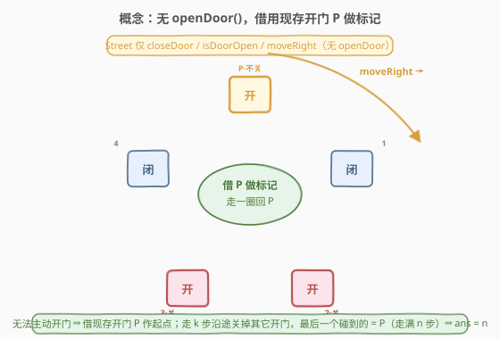
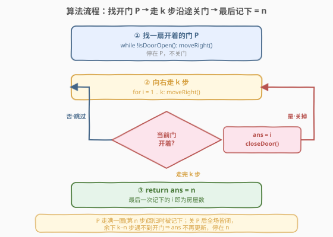

# LeetCode 计算一个环形街道上的房屋数量 II 题解

## 1. 题目概述

- **标题 / 题号**：计算一个环形街道上的房屋数量 II（#2753，hard）
- **链接**：https://leetcode.cn/problems/count-houses-in-a-circular-street-ii/
- **难度**：困难
- **标签**：交互、脑筋急转弯

> ⚠️ 本题为 LeetCode 付费题，题意描述根据官方示例用例与 hints 重建，可能与官方题面有出入。核心 API 与解题思路来自官方 hints 及题面，可信度较高。

**题意**：环形街道上有 $n$ 间房屋，首尾相接围成一圈，每间房有一扇门，门的状态为**开**（`1`）或**关**（`0`）。题目保证**至少有一扇门是开着的**。你站在其中某一间房前，但**不知道 $n$ 是多少**，也不知道自己在圈里的位置。判题系统提供一个 `Street` 对象，封装了对当前房屋与街道的操作：

| 方法 | 作用 |
|------|------|
| `closeDoor()` | 关闭**当前**所在房屋的门 |
| `isDoorOpen()` | 返回当前房屋的门是否打开（`true`/`false`） |
| `moveRight()` | 向右移动到下一间房；街道是环形，走到末尾后回到第一间 |

此外给你一个整数 $k$。题目保证**房屋总数 $n$ 不超过 $k$**（即 $n \le k$），$k$ 是已知的规模上界。请返回这条环形街道上的房屋总数 $n$。

> ⚠️ 与 I 代 [2728](https://leetcode.cn/problems/count-houses-in-a-circular-street/) 相比，本题的 `Street` 接口**没有 `openDoor()`**——你**无法主动打开任何门**来制造标记。这是本题升为「困难」的根本原因：标记不能凭空创造，只能借用一扇**本来就开着的门**。

**示例 1**：

```text
输入：street = [1,1,1,1], k = 10
输出：4
解释：4 间房，所有门都开着。房屋数小于 k（k=10）。
```

**示例 2**：

```text
输入：street = [1,0,1,1,0], k = 5
输出：5
解释：5 间房，向右数第 1、3、4 间门开着，其余关闭。房屋数等于 k（k=5）。
```

**约束条件（重建）**：

- $n$ 为房屋数，$1 \le n \le k \le 10^5$
- 门状态 $\text{doors}[i] \in \{0, 1\}$，且至少有一扇门为开（`1`）
- 街道按题意为环形

> 💡 四条官方 hints 一字不差地给出了算法骨架：(1) 先假设全场只有一扇开门，试着解决；(2) 关掉一扇开着的门；(3) 向右走 $k$ 间房，若没遇到开门则假设成立，得答案；(4) 若仍遇开门，回到步骤 1。本题就是把这套"逐扇关门直至只剩唯一开门"的骨架翻译成代码。

## 2. 解题思路

### 2.1 朴素思路：照搬 I 代的"清场→标记→计数"会失败

I 代（2728）的三步法是「关 $k$ 扇门清场 → `openDoor()` 标记 → 绕圈计数」。但本题 `Street` **没有 `openDoor()`**，第二步"制造一个唯一标记"根本无法执行。若直接退化为"找一扇开门就当标记、绕圈计数"：示例 2 初始有 3 扇门开着，你还没绕回标记门，就会先撞上**另一扇本就开着的门**，提前误停，计数偏小。

> ⚠️ 一句话：朴素法失败于"无法制造唯一标记"。既然不能**开门**做标记，那就反过来——**关门**做减法：把多余的开门逐个关掉，让起点那扇开门成为绕一圈后唯一会再次被碰到的开门。

### 2.2 核心观察：借用现存开门 P，沿途关门，"最后一次遇到"即 n



算法分两段：

1. **找起点 P**：一直 `moveRight()` 直到 `isDoorOpen()` 为真，停在**一扇本来就开着的门**前，记为 P。**不要关它**。因为全场至少一扇开门，这个循环必终止。
2. **走 $k$ 步沿途关门并记录**：从 P 出发循环 $i = 1 \dots k$，每步先 `moveRight()`，若当前门开，则 `ans = i` 并 `closeDoor()`（把这扇开门关掉）。循环结束返回 `ans`。

> 💡 关键不变式：**P 始终开着，直到第 $n$ 步被自己碰到时才关掉**。理由是：在走满一圈（$n$ 步）之前，我们只会到达 $P{+}1, P{+}2, \dots, P{+}n{-}1$ 这些"别的房子"，最多把它们之中开着的关掉，**碰不到 P**。于是第 $n$ 步回到 P 时它必然还开着 $\Rightarrow$ `ans` 被更新为 $n$ 并关掉 P。此后全场所有门都关了，第 $n{+}1 \dots k$ 步遇不到任何开门，`ans` 不再变化。故**最后一次记下的 `ans` 恰为 $n$**。

这就把 hints 翻译成了代码：hints 的"回到步骤 1"不是真的重头开始，而是"每关掉一扇，剩下开门更少，离'只剩唯一开门'更近一步"——一趟 $k$ 步扫描即可把这些关门动作全部完成，最后一扇被记下的必是 P（第 $n$ 步）。

### 2.3 算法流程图



流程要点：

- **找 P**：`while !isDoorOpen(): moveRight()`，停在第一扇开着的门，不关门。
- **$k$ 步循环**：先 `moveRight()` 再判 `isDoorOpen()`。开着就 `ans = i` + `closeDoor()`；关着就跳过。是"先走后判"，保证第 $n$ 步回到 P 那一刻才记录。
- **结束**：走满 $k$ 步后返回 `ans`，无需显式判停——靠"关掉 P 后全场皆闭、后续不再更新"自然把 `ans` 钉在 $n$。

### 2.4 示例演算

![示例演算：street=[1,0,1,1,0], k=5（n=5）](../images/p2753_example_walkthrough.svg)

以**示例 2** `street = [1,0,1,1,0], k = 5`（$n=5$）为例：

| 阶段 | 当前位置 | 操作 | 门状态（idx0..4） | ans | 说明 |
|------|----------|------|-------------------|-----|------|
| 找 P | idx0 | 停在开门处，不关 | `1 0 1 1 0` | 0 | idx0 = P（开着） |
| $i=1$ | idx1 | 闭，跳过 | `1 0 1 1 0` | 0 | 遇闭门，不动 |
| $i=2$ | idx2 | 开→关 | `1 0 0 1 0` | 2 | 记录并关掉 idx2 |
| $i=3$ | idx3 | 开→关 | `1 0 0 0 0` | 3 | 记录并关掉 idx3 |
| $i=4$ | idx4 | 闭，跳过 | `1 0 0 0 0` | 3 | 遇闭门，不动 |
| $i=5$ | idx0 | 开→关 | `0 0 0 0 0` | 5 | **回到 P**，记录 5 并关掉 |

第 5 步走回 P（仍开着），`ans` 更新为 5；关 P 后全场皆闭，循环虽继续到 $k=5$ 已结束。$\text{ans}=5=n$ $\checkmark$

> 💡 注意"最后一次更新"是第 $n$ 步而非更早：第 2、3 步虽也更新过 `ans`（=2、=3），但它们对应的门随后被关掉，不会再被碰到；唯有 P 在第 $n$ 步被碰到时是"全场最后一扇开门"，故 `ans` 终值钉在 $n$。

## 3. 参考代码

### C++

```cpp
/**
 * // This is the Street's API interface.
 * // You should not implement it, or speculate about its implementation
 * // 注意：本题 Street 接口没有 openDoor()
 * class Street {
 * public:
 *     void closeDoor();
 *     bool isDoorOpen();
 *     void moveRight();
 * };
 */
class Solution {
public:
    int houseCount(Street* street, int k) {
        // ① 找到一扇开着的门 P，停在它前面（不关）
        while (!street->isDoorOpen()) {
            street->moveRight();
        }
        // ② 向右走 k 步，每遇开门就记下步数并关掉它
        int ans = 0;
        for (int i = 1; i <= k; ++i) {
            street->moveRight();
            if (street->isDoorOpen()) {
                ans = i;
                street->closeDoor();
            }
        }
        // 最后一次记下的 ans = n（P 在第 n 步回归时被记下，此后全闭不再更新）
        return ans;
    }
};
```

### Python

```python
# """
#  This is the Street's API interface.
#  You should not implement it, or speculate about its implementation
#  注意：本题 Street 接口没有 openDoor()
#  class Street:
#     def closeDoor(self) -> None: ...
#     def isDoorOpen(self) -> bool: ...
#     def moveRight(self) -> None: ...
# """
class Solution:
    def houseCount(self, street: 'Street', k: int) -> int:
        # ① 找到一扇开着的门 P，停在它前面（不关）
        while not street.isDoorOpen():
            street.moveRight()
        # ② 向右走 k 步，每遇开门就记下步数并关掉它
        ans = 0
        for i in range(1, k + 1):
            street.moveRight()
            if street.isDoorOpen():
                ans = i
                street.closeDoor()
        # 最后一次记下的 ans = n（P 在第 n 步回归时被记下，此后全闭不再更新）
        return ans
```

> 💡 代码与官方 hints 一一对应：`while !isDoorOpen()` = "假设唯一开门并定位它"；循环里 `closeDoor()` = "关掉一扇开门"；走满 $k$ 步未遇新开门 = "假设成立得答案"，否则继续关。两段顺序不可乱：必须先定位 P（否则没有起点参照），再边走边关（否则没法保证 P 是最后被碰到的开门）。

## 4. 复杂度分析

| 维度 | 复杂度 | 说明 |
|------|--------|------|
| 时间复杂度 | $O(k)$ | 找 P 至多走 $k$ 步（$n \le k$ 且至少一扇开门，绕一圈内必遇）；$k$ 步主循环恰好 $k$ 次；合计 $\le 2k$ 次操作 |
| 空间复杂度 | $O(1)$ | 仅用常数标量 `ans/i`，不存任何数组 |

> 💡 与 I 代同为 $O(k)$ / $O(1)$，操作次数同一量级。本题"难"在**思路**而非**代价**：缺少 `openDoor()` 后，能否想到"反向关门、用最后一扇被碰到的开门当答案"这一不变式，是分水岭。若已知 $n$ 则 $k$ 步可缩为 $n$ 步，但交互场景 $n$ 未知，$O(k)$ 已是最优上界保证。

## 5. 扩展：I/II 两代的"标记"思想对照

I 代（2728）与 II 代（2753）看似同形，实则"标记"的获取方式相反：

| 维度 | 2728（简单） | 2753（困难，本题） |
|------|--------------|---------------------|
| `Street` 接口 | 有 `openDoor()` | **无 `openDoor()`** |
| 标记来源 | **主动开门制造**：关 $k$ 扇门清场后 `openDoor()` 造唯一标记 | **被动借用**：找一扇本就开着的门 P，沿途关掉其它开门让 P 成为"最后被碰到" |
| 计数方式 | 绕圈直到遇开门即停（`while` 先走后判） | 走满 $k$ 步，取**最后一次**遇开门的步数 |
| 终止判据 | 显式：遇开门 `break` | 隐式：走完 $k$ 步，靠"关 P 后全闭不再更新"自然钉住 `ans` |
| 复杂度 | $O(k)$ / $O(1)$ | $O(k)$ / $O(1)$ |

> 💡 共同骨架仍是"**不知规模 ⇒ 借可识别状态做标记 ⇒ 确定性遍历一圈回到标记**"。I 代能"造"标记（开门），II 代只能"借+减"标记（借用现存开门、减去其余开门）。这种"正向造标记 vs 反向消标记"的对照，在交互式计数题里很有代表性。

> ⚠️ 这一思想在更广的交互题里反复出现：[489. 扫地机器人](https://leetcode.cn/problems/robot-room-cleaner/) 用"标记已扫格 + 回溯"探索未知网格；[2061. 清扫机器人清扫的格数](https://leetcode.cn/problems/number-of-spaces-cleaning-robot-cleaned/) 沿固定路径清扫并计数。它们的共同骨架都是"**不知规模 ⇒ 制造/借用可识别状态 ⇒ 确定性遍历并计数直到回到已知状态**"。

## 6. 面试要点

1. **本题和 I 代（2728）的核心区别是什么？为什么难度不同？**

   > 接口差异：本题 `Street` **没有 `openDoor()`**，无法主动开门制造标记。I 代可"关 $k$ 扇门清场 + 开一扇做唯一标记 + 绕圈计数"，第二三步都依赖能开门；II 代不能开门，只能借用一扇**现存**的开门 P 作起点，并沿途**关门**消除其它开门，让 P 成为绕一圈后最后被碰到的开门。难度差异源于"造标记"（直觉、直接）与"借+消标记"（需洞察不变式）的思维落差。

2. **为什么"最后一次记下的 `ans`"一定是 $n$，而不是某个更小的步数？**

   > 因为沿途每扇被碰到的开门都会被**立即关掉**，不会再次出现。唯一无法提前关掉的是起点 P——在走满 $n$ 步前，我们只到达 $P{+}1 \dots P{+}n{-}1$，碰不到 P。所以 P 必在第 $n$ 步被碰到（仍开着）并被记下、关掉。此后全场皆闭，第 $n{+}1 \dots k$ 步遇不到任何开门，`ans` 不再更新，终值钉在 $n$。

3. **找 P 的 `while` 循环最坏走多少步？为什么一定终止？**

   > 最坏走 $n{-}1$ 步（$\le k{-}1$）。因为题目保证**至少一扇门开着**，从任意位置出发绕一圈内必遇开门，故循环必在 $< n$ 步内终止。若全场无一开门则死循环，但约束排除了此情况——"至少一扇开门"是算法正确性的必要前提。

4. **如果去掉"至少一扇门开着"的保证会怎样？**

   > 找 P 的 `while` 会无限循环（全场皆闭，永远遇不到 `isDoorOpen()` 为真），程序无法终止。所以这条约束不是可有可无的：它保证 P 的存在性，是整个算法的起点。

5. **能否不走满 $k$ 步、遇到 P 就提前 `break`？**

   > 不能简单"遇开门即停"。因为路上可能有多扇开门，第一扇遇到的不一定是 P；若提前停会把 `ans` 取成更小的步数。正确做法是**记下每次遇门的步数并关掉它**，走满 $k$ 步后取最后一次——这才保证取到的是 P（第 $n$ 步）。可以证明走满一圈（$n$ 步）后 P 已被关、全场皆闭，但程序不知道 $n$，只能用已知上界 $k$ 兜底走完，这是 $n$ 未知场景的固有代价。

## 同类练习题

| # | 题目 | 与本题的关联 |
|---|------|-------------|
| 2728 | [计算一个环形街道上的房屋数量](https://leetcode.cn/problems/count-houses-in-a-circular-street/) | 本题 I 代，`Street` 含 `openDoor()`，可"清场→开门标记→绕圈计数"，对照本题"造标记 vs 借+消标记" |
| 489 | [扫地机器人](https://leetcode.cn/problems/robot-room-cleaner/) | 交互式探索未知空间的经典母题，同样"不知规模，靠标记/回溯遍历全场" |
| 2061 | [清扫机器人清扫的格数](https://leetcode.cn/problems/number-of-spaces-cleaning-robot-cleaned/) | 机器人沿固定路径清扫并计数空间，与本题"沿环形街道计数房屋"结构相近 |
| 918 | [环形子数组的最大和](https://leetcode.cn/problems/maximum-sum-circular-subarray/) | 环形结构的取模索引与"绕圈"思想，对照本题的环形遍历（套路不同但共享"环形"语境） |
