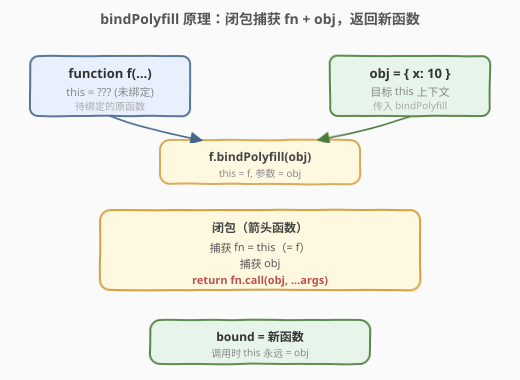
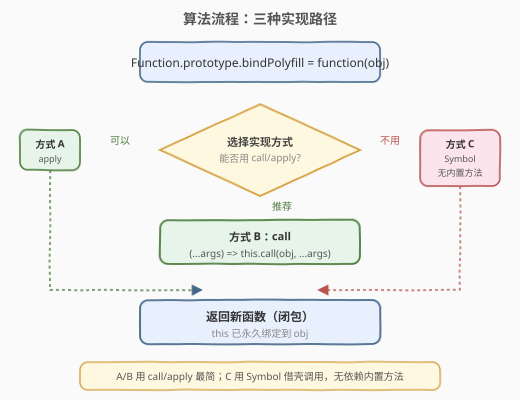
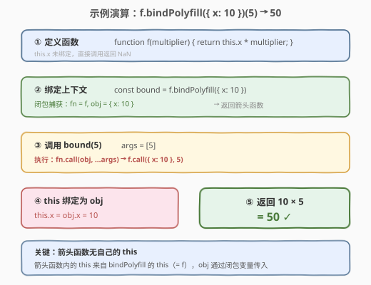

# 将函数绑定到上下文

- **题目名称**：将函数绑定到上下文
- **链接**：[2754. 将函数绑定到上下文](https://leetcode.cn/problems/bind-function-to-context/)
- **难度**：中等
- **标签**：闭包、函数式编程、JavaScript

## 1. 题目概述

> ⚠️ 本题为 LeetCode 付费题，题意描述根据官方示例用例与 hints 重建，可能与官方题面有出入。

为所有函数添加 `bindPolyfill` 方法，模拟原生 `Function.prototype.bind` 的行为：当对函数调用 `bindPolyfill(obj)` 时，返回一个**新函数**，该函数被调用时，原函数的 `this` 被**永久绑定**为传入的对象 `obj`，同时原函数接收到的参数被透传。

**约束条件**：

- 不能使用内置的 `Function.prototype.bind` 方法
- 需要在 `Function.prototype` 上挂载 `bindPolyfill`，使所有函数都能调用

**示例 1**：

```text
输入：fn = function f(multiplier) { return this.x * multiplier; }
      obj = {"x": 10}
      args = [5]
输出：50
解释：绑定后调用 f(5)，此时 this.x = 10，返回 10 * 5 = 50。
```

**示例 2**：

```text
输入：fn = function speak() { return "My name is " + this.name; }
      obj = {"name":"Kathy"}
      args = []
输出："My name is Kathy"
解释：绑定后调用 speak()，此时 this.name = "Kathy"。
```

> 💡 本题考查对 JavaScript **`this` 绑定机制**与**闭包**的理解。核心难点不在算法复杂度，而在于如何在不使用原生 `bind` 的前提下，让一个函数"记住"它该用哪个对象作为 `this`。

---

## 2. 解题思路

### 2.1 暴力思路

最直觉的做法是直接使用 `fn.apply(obj, args)`——把 `this` 指向 `obj` 再执行。但"暴力"之处在于：返回的函数需要**每次调用时都重新设定 `this`**，而 JavaScript 普通函数的 `this` 取决于**调用方式**，闭包内若用普通 `function` 则 `this` 会丢失。

```javascript
// ❌ 错误：普通函数内 this 不再是原函数
Function.prototype.bindPolyfill = function (obj) {
    return function (...args) {
        return this.call(obj, ...args); // this 已变，不是原函数！
    };
};
```

问题根源：`function` 声明的函数有自己的 `this` 绑定，返回的普通函数被调用时 `this` 不再指向原函数。需要一种**不创建新 `this`** 的函数形式——箭头函数。

### 2.2 核心观察：箭头函数闭包 + call



两个关键观察：

1. **箭头函数没有自己的 `this`**：箭头函数内的 `this` 继承自外层作用域。`bindPolyfill` 作为普通函数被调用时，`this` 就是原函数 `f`；返回的箭头函数内的 `this` 仍然指向 `f`，不会因为调用方式改变。

2. **`call`/`apply` 显式设定 `this`**：`fn.call(obj, ...args)` 能强制把 `this` 指向 `obj`。在闭包中同时捕获 `fn`（通过 `this`）和 `obj`（通过参数），返回的箭头函数调用 `this.call(obj, ...args)` 即可。

> 💡 **为什么必须用箭头函数？** 普通函数被返回后，调用时 `this` 取决于调用点（如 `obj.method()` 则 `this = obj`，裸调用则 `this = undefined`/全局）。箭头函数没有自己的 `this`，它"穿透"到定义时的外层，即 `bindPolyfill` 内部的 `this`（= 原函数）。

### 2.3 算法流程图



### 2.4 示例演算



以**示例 1**为例，逐步追踪 `this` 的变化：

| 步骤 | 代码 | this 指向 | 说明 |
|------|------|-----------|------|
| ① 定义 | `function f(m) { return this.x * m; }` | 未绑定 | `this` 取决于调用方式 |
| ② 绑定 | `f.bindPolyfill({ x: 10 })` | `this = f`（bindPolyfill 内） | 闭包捕获 `fn = f`、`obj = { x: 10 }` |
| ③ 调用 | `bound(5)` | 箭头函数无 own `this`，继承 `f` | `args = [5]` |
| ④ 执行 | `f.call({ x: 10 }, 5)` | `this = { x: 10 }` | `call` 强制绑定 |
| ⑤ 结果 | `this.x * 5 = 10 * 5` | — | 返回 `50` ✓ |

---

## 3. 参考代码

### JavaScript

```javascript
Function.prototype.bindPolyfill = function (obj) {
    const fn = this;           // 捕获原函数（也可直接用箭头函数内的 this）
    return (...args) => {
        return fn.call(obj, ...args);  // 强制 this=obj，透传参数
    };
};
```

> 💡 等价的极简写法：`return (...args) => this.call(obj, ...args);`（箭头函数内 `this` 继承自 `bindPolyfill`，即原函数）。

### TypeScript

```typescript
type Fn = (...args: any[]) => any;

declare global {
    interface Function {
        bindPolyfill(obj: Record<any, any>): Fn;
    }
}

Function.prototype.bindPolyfill = function (obj: Record<any, any>): Fn {
    const fn = this;
    return (...args: any[]) => fn.call(obj, ...args);
};
```

### Python（概念等价）

```python
from typing import Any, Callable

def bind_polyfill(fn: Callable, obj: dict) -> Callable:
    """模拟 JS 的 bind：返回一个闭包，调用时以 obj 为上下文执行 fn。"""
    def bound(*args, **kwargs) -> Any:
        # Python 无 this 绑定问题：闭包直接捕获 fn 和 obj
        # 若 fn 期望第一个参数为 self/ctx，则传入 obj
        return fn(obj, *args, **kwargs)
    return bound
```

> ⚠️ Python 没有 `this` 绑定机制，上述代码仅展示**闭包捕获**的等价语义。JavaScript 的 `this` 是运行时动态绑定，Python 的显式参数天然避免了此问题。

---

## 4. 复杂度分析

| 维度 | 复杂度 | 说明 |
|------|--------|------|
| 时间复杂度 | $O(1)$ | `bindPolyfill` 仅创建一个闭包并返回，`call` 设定 `this` 的开销为常数；实际执行时间取决于原函数 |
| 空间复杂度 | $O(1)$ | 闭包仅捕获两个引用（`fn` 和 `obj`），固定大小 |

---

## 5. 扩展：Symbol 借壳法（不用 call/apply）

hints 提示了一种不依赖 `call`/`apply` 的实现：利用 **Symbol** 在 `obj` 上临时挂载原函数作为方法，再以方法调用方式触发 `this` 绑定，最后清理痕迹。

```javascript
Function.prototype.bindPolyfill = function (obj) {
    const fn = this;
    const key = Symbol();  // 唯一键，避免覆盖 obj 原有属性
    return (...args) => {
        obj[key] = fn;          // 借壳：把函数挂到 obj 上
        const result = obj[key](...args);  // 方法调用 → this = obj
        delete obj[key];        // 清理
        return result;
    };
};
```

原理：JavaScript 中 `obj.method()` 的调用形式会将 `this` 设为 `obj`。通过 Symbol 在 `obj` 上临时挂一个方法，以方法形式调用，就能让 `this` 指向 `obj`，无需 `call`/`apply`。

> ⚠️ Symbol 法每次调用都要写/删属性，有额外开销；`call` 法更简洁高效，是推荐解法。

---

## 6. 面试要点

1. **为什么返回的函数必须用箭头函数，不能用普通 `function`？**

   - 普通函数有自己的 `this` 绑定，返回后被调用时 `this` 会变（取决于调用方式），不再指向原函数。
   - 箭头函数没有自己的 `this`，它继承定义时外层的 `this`（即 `bindPolyfill` 内部的 `this` = 原函数），保证 `this` 引用稳定。

2. **`bindPolyfill` 内的 `this` 是什么？**

   - 当 `f.bindPolyfill(obj)` 被调用时，`bindPolyfill` 作为 `f` 的方法被调用，所以 `this` 指向调用者 `f`（原函数）。

3. **`call` 和 `apply` 的区别是什么？本题用哪个？**

   - `call(thisArg, arg1, arg2, ...)` 接受逐个参数；`apply(thisArg, [argsArray])` 接受参数数组。
   - 本题用 `...args` 展开后传给 `call` 即可；若用 `apply` 则写 `fn.apply(obj, args)`，效果相同。

4. **原生 `bind` 还有哪些行为是本 polyfill 没覆盖的？**

   - **偏函数应用**：原生 `bind` 允许 `fn.bind(obj, a, b)` 预填参数，返回函数再传剩余参数。本 polyfill 可扩展为 `function (obj, ...boundArgs) { return (...args) => fn.call(obj, ...boundArgs, ...args); }`。
   - **`new` 构造**：原生 `bind` 返回的函数可用 `new` 调用，此时 `this` 指向新实例而非绑定的 `obj`。箭头函数不能作构造函数，需用普通函数 + `new.target` 判断。

5. **Symbol 法的 Symbol 作用是什么？能否用普通字符串键？**

   - Symbol 保证键的唯一性，不会与 `obj` 上已有属性冲突。用普通字符串键可能覆盖用户属性，造成数据丢失或行为异常。

---

## 7. 同类练习题

- [2693. 使用自定义上下文调用函数](https://leetcode.cn/problems/call-function-with-custom-context/)（[题解](../2601-2700/2693_使用自定义上下文调用函数.md)）：直接用 `call`/`apply` 以指定 `this` 执行函数，是本题 `this` 绑定的基础练习
- [2620. 计数器](https://leetcode.cn/problems/counter/)（[题解](../2601-2700/2620_计数器.md)）：闭包捕获变量实现计数，与本题闭包捕获 `fn`/`obj` 同为闭包基础题
- [2629. 复合函数](https://leetcode.cn/problems/function-composition/)（[题解](../2601-2700/2629_复合函数.md)）：返回一个组合多个函数的新函数，同样是"返回闭包"的模式
- [2667. 创建 Hello World 函数](https://leetcode.cn/problems/create-hello-world-function/)（[题解](../2601-2700/2667_创建HelloWorld函数.md)）：最简闭包返回函数入门，理解闭包捕获的起点
- [2694. 事件发射器](https://leetcode.cn/problems/event-emitter/)（[题解](../2601-2700/2694_事件发射器.md)）：设计模式中 `this` 与闭包的综合运用，`subscribe`/`emit` 涉及方法绑定场景
