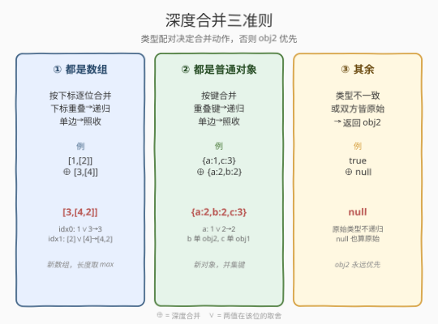
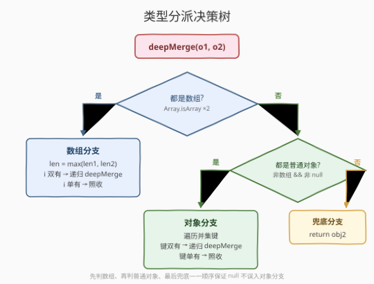

# 深度合并两个对象

- **题目名称**：深度合并两个对象
- **链接**：[2755. 深度合并两个对象](https://leetcode.cn/problems/deep-merge-of-two-objects/)
- **难度**：中等
- **标签**：递归、JSON、类型分派、深度优先、对象合并

## 1. 题目概述

给定两个值 `obj1` 与 `obj2`（可以是对象、数组或原始类型），返回它们的**深度合并**结果。

**合并准则**：

1. **都是数组**：结果是新数组，长度取 `max(len1, len2)`。每个下标若两边都有，则递归深度合并；只有一边有则照收。
2. **都是普通对象**（由 `{}` 创建，**非数组、非 `null`**）：结果是新对象，键取两边并集。键在两边都有则递归深度合并，只一边有则照收。
3. **其余**（类型不一致，或双方皆为原始类型）：**返回 `obj2`**——后者永远优先。

> ⚠️ 本题为 LeetCode 付费题，题意描述根据官方示例用例与同系列姊妹题（[2705. 精简对象](2705_精简对象.md)）信息重建，可能与官方题面有出入。

**示例 1**：

```text
输入：obj1 = {"a": 1, "c": 3}, obj2 = {"a": 2, "b": 2}
输出：{"a": 2, "b": 2, "c": 3}
解释：键 a 两边都有→取 obj2 的 2；b 仅 obj2 有→2；c 仅 obj1 有→3。
```

**示例 2**：

```text
输入：obj1 = [{}, 2, 3], obj2 = [[], 5]
输出：[[], 5, 3]
解释：idx0 的 {}(对象) 与 [](数组) 类型不一致→obj2 的 [] 优先；idx1: 2∨5→5；idx2 仅 obj1 有→3。
```

**示例 3**：

```text
输入：obj1 = {"a": 1, "b": {"c": [1,[2,7],5], "d": 2}}
     obj2 = {"a": 1, "b": {"c": [6,[6],[9]], "e": 3}}
输出：{"a": 1, "b": {"c": [6,[6,7],[9]], "d": 2, "e": 3}}
解释：b.c 两数组逐位合并——idx0:1∨6→6；idx1:[2,7]∨[6]→[6,7]；idx2:5∨[9]→[9]（类型不一致，obj2 优先）。
```

**示例 4**：

```text
输入：obj1 = true, obj2 = null
输出：null
解释：双方皆原始类型，返回 obj2 的 null。
```

**约束条件**：

- `obj1` 与 `obj2` 均为合法 JSON 值（`JSON.parse` 可解析的输出）；
- 嵌套深度有限、无环；
- 合并结果同样是合法 JSON 值。

> 💡 本题是 LeetCode「30 天 JavaScript」系列题目，**仅提供 JavaScript / TypeScript 提交入口**，核心考察**递归 + 类型分派 + 两值配对合并**。它与 [2705. 精简对象](2705_精简对象.md)、[2628. 完全相等的 JSON 对象](2628_完全相等的JSON对象.md) 同属「沿 JSON 文法递归」一族——同一套类型分派骨架，换个动作：2705 递归**精简**一棵树，2628 递归**比对**两棵树，本题递归**合并**两棵树。本文以 JS 为提交语言，并给出 Python 概念等价实现。

---

## 2. 解题思路

### 2.1 暴力思路：先序列化再字符串拼接

一种取巧写法是 `JSON.stringify` 两个值后用正则/字符串操作拼接，但立刻撞墙：**深度合并的判定与结构的递归是同构的**——必须先下钻到子结构合并、再在当前层决定每个键/下标的去留。靠字符串拼接绕不开这层递归，正则还会误伤字符串内容、且无法区分「普通对象 vs 数组」（两者 `typeof` 都是 `"object"`）。更本质的问题是：**对象按键合并、数组按下标合并**，两种合并规则不同，序列化后已丢失这层类型信息。

### 2.2 核心观察：递归 + 类型分派 + 两值配对



JSON 值的文法本身是**递归**的——数组的元素、对象的值又都是 JSON 值。合并操作天然沿文法递归：先把子结构两两配对合并成"准值"，再在当前层按规则组装。

关键是**按类型配对分三条分支**：

| 分支 | 判定条件 | 动作 | 递归？ |
|------|----------|------|--------|
| **都是数组** | `Array.isArray(obj1) && Array.isArray(obj2)` | 按下标逐位配对，重叠下标递归、单边照收，长度取 max | 是 |
| **都是普通对象** | `非数组 && 非 null && typeof === "object"`（两边皆是） | 按键并集，重叠键递归、单边照收 | 是 |
| **其余** | 类型不一致 / 双方皆原始 | 返回 `obj2`（后者优先） | 否 |

**关键直觉：配对 + 后者优先。** 数组的"下标"和对象的"键"都是配对维度——配对上的递归合并，配对不上的单边照收；一旦配对双方类型不匹配（或都是原始类型），就退化为"`obj2` 直接覆盖"的递归基。这条"后者优先"的兜底，是整个合并的**终止条件**。

> 💡 **为什么"普通对象"必须排除数组和 `null`？** 这是本题最易踩坑的点。JS 中 `typeof [] === "object"` 且 `typeof null === "object"`（历史遗留）。若用 `typeof === "object"` 判定"对象"，则 `{}` 与 `[]` 会被错配进对象分支、按下标（实际按键）乱合并。正确做法是**先判数组分流、再判普通对象时显式排除 `null`**——与 [2705](2705_精简对象.md) 中"先拦 `null` 排雷、再分派"的思路同构。

> ⚠️ **示例 2 的 idx0 是反面教材**：`obj1[0] = {}`（普通对象）与 `obj2[0] = []`（数组）类型不一致——既不是"都是数组"也不是"都是普通对象"，落到第三分支返回 `obj2` 的 `[]`。这正说明"普通对象 ≠ 数组"的判定不可或缺：若误把它们当同类合并，会得到 `{0: ...}` 之类怪结果。

### 2.3 算法流程图



决策是**自顶向下判定、自底向上组装**的：

1. 先判 `Array.isArray` 双真（数组分支：按下标配对，重叠递归、单边照收，长度取 max）；
2. 否则判"两边都是普通对象"（对象分支：按键并集，重叠递归、单边照收）；
3. 兜底（类型不一致 / 双方皆原始）——返回 `obj2`，这是递归基。

第 1、2 步会**递归**调用自身，把配对的子结构逐层合并，直到撞上"类型不一致或皆原始"这一递归基。

> 💡 **判定顺序不能反**：必须先判数组、再判普通对象。因为数组也是 `typeof === "object"`，若先判"普通对象"且未排除数组，数组会被错分流。`Array.isArray` 是最可靠的数组判定（跨 iframe、跨原型链安全），放最前。

### 2.4 示例演算

![示例 3 嵌套数组逐位合并：b.c = [1,[2,7],5] ⊕ [6,[6],[9]] → [6,[6,7],[9]]](../images/p2755_merge_walkthrough.svg)

以**示例 3** 的 `b.c` 数组合并为例，逐下标演算：

| idx | obj1 | obj2 | 类型配对 | 结果 |
|-----|------|------|----------|------|
| 0 | `1` | `6` | 原始∨原始 | `6`（obj2 优先） |
| 1 | `[2,7]` | `[6]` | 数组∨数组→递归 | `[6,7]` |
| 2 | `5` | `[9]` | 原始∨数组→不一致 | `[9]`（obj2 优先） |

其中 idx1 的内层递归：`[2,7] ⊕ [6]`，长度取 max(2,1)=2——i0: `2∨6→6`；i1: 仅 obj1 有 `7`→照收 `7`，得 `[6,7]`。

回到 `b` 对象层：`c` 两边都有→递归得 `[6,[6,7],[9]]`；`d` 仅 obj1 有→`2`；`e` 仅 obj2 有→`3`，故 `b = {"c":[6,[6,7],[9]], "d":2, "e":3}`。最外层 `a:1∨1→1`，最终 `{"a":1, "b":{...}}`。

> 💡 **嵌套下钻细节**：idx2 的 `5`（数字）与 `[9]`（数组）类型不一致，看似"都是 JSON 值"但既非"都是数组"也非"都是普通对象"，故走第三分支返回 `obj2` 的整个 `[9]`——**不会**把 `5` 和 `9` 拉到一起。这正是"配对 + 后者优先"在叶子层的体现：配对失败即终止递归。

---

## 3. 参考代码

### JavaScript / TypeScript（提交语言）

```javascript
/**
 * @param {null|boolean|number|string|Array|Object} obj1
 * @param {null|boolean|number|string|Array|Object} obj2
 * @return {null|boolean|number|string|Array|Object}
 */
var deepMerge = function(obj1, obj2) {
    // 1. 都是数组：按下标逐位配对，重叠递归、单边照收，长度取 max
    if (Array.isArray(obj1) && Array.isArray(obj2)) {
        const len = Math.max(obj1.length, obj2.length);
        const res = [];
        for (let i = 0; i < len; i++) {
            if (i < obj1.length && i < obj2.length) {
                res.push(deepMerge(obj1[i], obj2[i]));
            } else {
                res.push(i < obj1.length ? obj1[i] : obj2[i]);
            }
        }
        return res;
    }
    // 2. 都是普通对象（非数组、非 null）：按键并集，重叠递归、单边照收
    if (isPlainObject(obj1) && isPlainObject(obj2)) {
        const res = {};
        for (const k of Object.keys(obj1)) {
            res[k] = k in obj2 ? deepMerge(obj1[k], obj2[k]) : obj1[k];
        }
        for (const k of Object.keys(obj2)) {
            if (!(k in obj1)) {
                res[k] = obj2[k];
            }
        }
        return res;
    }
    // 3. 其余（类型不一致 / 双方皆原始 / 含 null）：obj2 永远优先
    return obj2;
};

// 普通对象 = 非 null、typeof 为 object、且非数组
function isPlainObject(v) {
    return v !== null && typeof v === "object" && !Array.isArray(v);
}
```

TypeScript 版（带类型标注）：

```typescript
type JSONValue =
    | null
    | boolean
    | number
    | string
    | JSONValue[]
    | { [key: string]: JSONValue };

function deepMerge(obj1: JSONValue, obj2: JSONValue): JSONValue {
    // 1. 都是数组
    if (Array.isArray(obj1) && Array.isArray(obj2)) {
        const len = Math.max(obj1.length, obj2.length);
        const res: JSONValue[] = [];
        for (let i = 0; i < len; i++) {
            if (i < obj1.length && i < obj2.length) {
                res.push(deepMerge(obj1[i], obj2[i]));
            } else {
                res.push(i < obj1.length ? obj1[i] : obj2[i]);
            }
        }
        return res;
    }
    // 2. 都是普通对象
    if (isPlainObject(obj1) && isPlainObject(obj2)) {
        const a = obj1 as { [key: string]: JSONValue };
        const b = obj2 as { [key: string]: JSONValue };
        const res: { [key: string]: JSONValue } = {};
        for (const k of Object.keys(a)) {
            res[k] = k in b ? deepMerge(a[k], b[k]) : a[k];
        }
        for (const k of Object.keys(b)) {
            if (!(k in a)) {
                res[k] = b[k];
            }
        }
        return res;
    }
    // 3. 其余
    return obj2;
}

function isPlainObject(v: JSONValue): v is { [key: string]: JSONValue } {
    return v !== null && typeof v === "object" && !Array.isArray(v);
}
```

> 💡 **键的遍历顺序**：对象分支先遍历 `obj1` 的键（重叠的递归、单边的照收），再补 `obj2` 独有的键。`k in obj2` 用 `in` 判存在性，能正确处理值为 `null`/`undefined`/`0` 的键（`in` 判的是键是否存在，与值的真假无关），避免误把 `obj2 = {a: null}` 当成"obj2 没有 a"。这点与 [2705](2705_精简对象.md) 用 `Boolean(val)` 判去留不同——**合并题判"键是否存在"，精简题判"值是否为真"**。

> ⚠️ **数组分支用 `push` 而非 `delete`/`splice`**：按下标配对组装新数组天然重排索引，不存在空洞问题。若误用原地 `delete arr[i]` 会留下 sparse array，`JSON.stringify` 把空洞渲染成 `null`——这与 [2705](2705_精简对象.md) 数组用 `filter(Boolean)` 重排索引是同一类排雷。

### Python（概念等价）

> 本题 LeetCode 仅开放 JS/TS，Python 版作概念对照。JSON 的 `object → dict`、`array → list`、`null → None`，故 `isinstance(v, dict)` 即"普通对象"判定，天然排除 list 与 None，无需像 JS 那样额外拦 `null`/`Array.isArray`。

```python
def is_plain_object(v):
    # 普通对象 = dict（JSON object）；list 是数组、None 是 null，都被排除
    return v is not None and isinstance(v, dict)


def deep_merge(obj1, obj2):
    # 1. 都是数组：按下标逐位配对，重叠递归、单边照收，长度取 max
    if isinstance(obj1, list) and isinstance(obj2, list):
        n = max(len(obj1), len(obj2))
        res = []
        for i in range(n):
            if i < len(obj1) and i < len(obj2):
                res.append(deep_merge(obj1[i], obj2[i]))
            else:
                res.append(obj1[i] if i < len(obj1) else obj2[i])
        return res
    # 2. 都是普通对象（dict）：按键并集，重叠递归、单边照收
    if is_plain_object(obj1) and is_plain_object(obj2):
        res = {}
        for k in obj1:
            res[k] = deep_merge(obj1[k], obj2[k]) if k in obj2 else obj1[k]
        for k in obj2:
            if k not in obj1:
                res[k] = obj2[k]
        return res
    # 3. 其余（类型不一致 / 双方皆原始 / 含 None）：obj2 永远优先
    return obj2
```

> ⚠️ **Python 的 `bool`/`int` 陷阱在此无感**：`isinstance(True, int)` 为 `True`，但本题原始类型一律走第三分支返回 `obj2`，不依赖数值比较，故 `bool` 误入 `int` 不影响结果。这与 [2705](2705_精简对象.md) 中"`bool` 必须先于 `int` 处理"形成对照——**合并题不判真假，只判配对**。

---

## 4. 复杂度分析

| 维度 | 复杂度 | 说明 |
|------|--------|------|
| 时间复杂度 | $O(n)$ | $n$ 为两值合并后的节点总数；每个节点至多被访问常数次，递归无重复下钻 |
| 空间复杂度 | $O(n)$ | 输出新结构与输入同阶；递归栈 $O(h)$（$h$ 为嵌套深度），通常 $h \ll n$ |

> 💡 本质是**两棵 JSON 树的结构同构遍历**：递归沿文法逐层配对下钻，配对上的递归合并、配对不上的单边照收、配对失败的返回 `obj2`。每个节点至多被处理常数次（遍历 obj1 键、遍历 obj2 键、遍历数组下标各一次），总时间 $O(n)$。输出结构规模不超过两输入之和，故空间 $O(n)$。

---

## 5. 扩展：合并语义的边界与变体

- **"普通对象"的精确边界**：本题的"普通对象"指由 `{}`/`new Object()` 创建的值，**显式排除数组和 `null`**。这是 JS 的历史包袱——`typeof null === "object"`、`typeof [] === "object"`。可靠判定三件套：`Array.isArray`（数组）、`v !== null && typeof v === "object" && !Array.isArray(v)`（普通对象）、其余（原始）。掌握这套判定，是所有"沿 JSON 文法递归"题（[2705](2705_精简对象.md)、[2628](2628_完全相等的JSON对象.md)、[2633](2633_将对象转换为JSON字符串.md)、本题）的共同基石。
- **`null` 是值还是"删除"？** 本题把 `null` 当作普通原始值——示例 4 的 `true ⊕ null → null` 证明 `null` 会覆盖前者。这与某些库的"deep merge 把 `null` 视作删除信号"不同：**题目语义是"后者优先"，`null` 是后者的合法取值**。对象分支里 `{a:1} ⊕ {a:null}` 会得到 `{a:null}`（用 `in` 判键存在、而非判值真假）。
- **浅合并 vs 深合并**：浅合并（如 `{...obj1, ...obj2}`）只覆盖第一层——嵌套对象会被 `obj2` 整体替换而非递归合并。深合并则对配对的嵌套结构递归下钻。本题要求深合并，且对数组也按下标深合并（而非 `concat` 拼接）——这是它与 `lodash.merge` 的关键差异（`_.merge` 对数组按 index 合并，行为接近本题）。
- **不可变 vs 就地修改**：本解法返回**新建**结构（数组逐位 `push`、对象新建 `res`），不修改输入。若要求就地修改 `obj1`，需小心数组正向 `splice` 错位、对象直接赋值——新建更简洁无副作用，是首选。

> 💡 工程实践中，"递归 + 类型分派"是处理任意嵌套 JSON 的通用骨架——序列化（[2633](2633_将对象转换为JSON字符串.md)）、深度相等（[2628](2628_完全相等的JSON对象.md)）、精简（[2705](2705_精简对象.md)）、合并（本题）都是这套骨架换不同动作。掌握它，就抓住了 JSON 操作类题目的母题。

---

## 6. 面试要点

1. **为什么"普通对象"的判定要排除数组和 `null`？**

   > 因为 JS 中 `typeof [] === "object"` 且 `typeof null === "object"`。若用 `typeof === "object"` 判定，则 `{}` 与 `[]` 会被错配进对象分支、按键乱合并，`null` 会对 `Object.keys` 报错。本解法用 `Array.isArray` 先分流数组，再用 `v !== null && typeof v === "object" && !Array.isArray(v)` 兜底普通对象——"先排雷、再分派"，与 [2705](2705_精简对象.md) 同构。

2. **对象合并时，`{a:1} ⊕ {a:null}` 结果是 `{a:null}` 还是 `{}`？为什么？**

   > 是 `{a:null}`。本题用 `k in obj2` 判"键是否存在"——`in` 判的是键的存在性，与值真假无关，故 `obj2` 的 `a:null` 视为"有 a 这个键"，触发递归 `deepMerge(1, null)`→返回 `null`。这与精简题（[2705](2705_精简对象.md)）用 `Boolean(val)` 判去留截然不同：**合并题判键是否存在，精简题判值是否为真**。

3. **示例 2 的 idx0 为什么 `{} ⊕ []` 得到 `[]` 而不是 `{}`？**

   > 因为 `{}`（普通对象）与 `[]`（数组）类型不一致——既不满足"都是数组"也不满足"都是普通对象"，落到第三分支返回 `obj2` 的 `[]`。这正说明"普通对象 ≠ 数组"的判定不可或缺：若误把数组当普通对象合并，会按下标/按键得到怪结果。`obj2` 永远优先是兜底语义。

4. **数组合并为什么是"按下标配对"而不是 `concat` 拼接？**

   > 因为题目要求**深度合并**——配对的下标要递归合并子结构（如示例 3 的 idx1 `[2,7] ⊕ [6] → [6,7]`），单边的照收。`concat` 只会在尾部拼接，丢失了"同下标配对"的语义，无法递归处理重叠位。按下标配对 + 长度取 max，才能既保留单边尾部元素、又递归合并重叠位。

5. **递归的终止条件是什么？会不会无限递归？**

   > 终止条件是"类型不一致或双方皆原始类型"——此时返回 `obj2`，不再下钻。配对成功的数组/对象才递归。题目保证输入是合法 JSON（无环、无函数、有限深度），故递归必然在有限深度内终止于原始类型叶子或类型不匹配。

> 💡 **一句话总结**：2755 = 「沿 JSON 文法递归 + 三分支类型分派 + 配对后者优先」。都是数组按下标配对合并、都是普通对象按键并集合并、其余返回 `obj2`。先判数组、再判普通对象（排除 `null`）、最后兜底；用 `in` 判键存在而非值真假——一次遍历 $O(n)$ 搞定。

---

## 7. 同类练习题

- [2628. 完全相等的 JSON 对象](https://leetcode.cn/problems/json-deep-equal/)（[题解](2628_完全相等的JSON对象.md)）：沿 JSON 文法**递归比对**两棵树，复用类型分派骨架与"先拦 `null`"排雷，一判等一合并
- [2633. 将对象转换为 JSON 字符串](https://leetcode.cn/problems/convert-object-to-json-string/)（[题解](2633_将对象转换为JSON字符串.md)）：沿 JSON 文法**递归序列化**一棵树，与本题**递归合并**共用同一套类型分派骨架
- [2705. 精简对象](https://leetcode.cn/problems/compact-object/)（[题解](2705_精简对象.md)）：沿 JSON 文法**递归精简**一棵树，同属 30 天 JS 系列姊妹题，对照"判键存在 vs 判值真假"的边界
- [2625. 扁平化嵌套数组](https://leetcode.cn/problems/flatten-deeply-nested-array/)（[题解](2625_扁平化嵌套数组.md)）：递归遍历嵌套数组按深度剪枝，同属"JSON 文法递归"家族，巩固对数组/对象递归的运用
- [2692. 使对象不可变](https://leetcode.cn/problems/make-object-immutable/)：沿 JSON 树递归冻结对象，同属"JSON 文法递归 + 类型分派"家族，一冻结一合并
