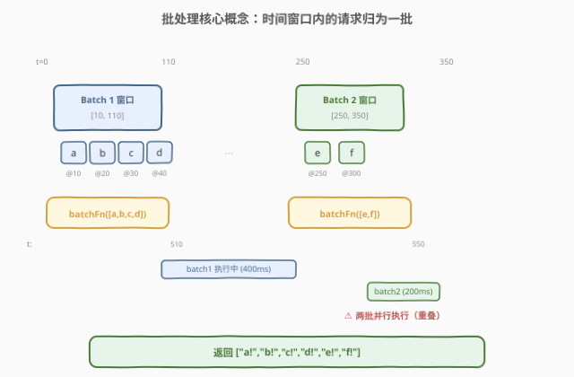
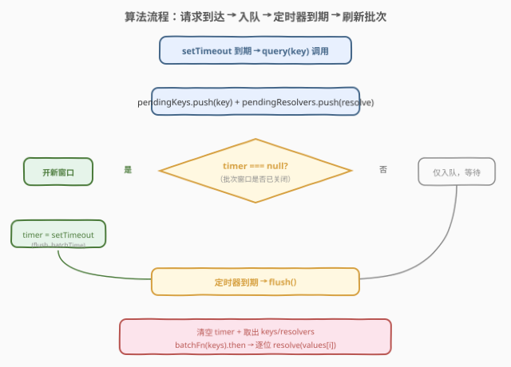
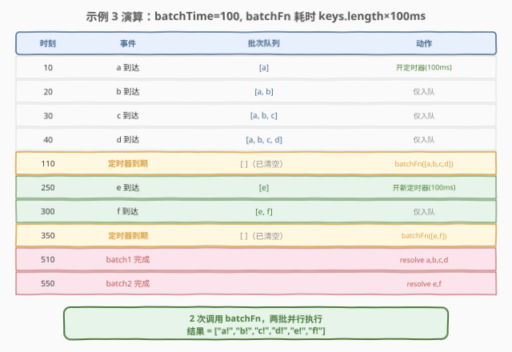

# LeetCode 批处理查询 题解

## 1. 题目概述

- **标题 / 题号**：批处理查询（#2756，hard）
- **链接**：https://leetcode.cn/problems/query-batching/
- **难度**：困难
- **标签**：JavaScript、异步编程、Promise、批处理、定时器、事件循环

> ⚠️ 本题为 LeetCode 付费题，题意描述根据官方示例用例与 hints 重建，可能与官方题面有出入。

**题意**：给定一个异步批处理函数 `batchFn`、一个批处理时间窗口 `batchTime`（毫秒）以及一组查询请求 `requests`，其中每个请求包含一个 `key` 和一个到达时刻 `time`（毫秒）。

请实现一个函数，模拟按时间顺序到达的查询请求的批处理逻辑：

- 当第一个请求到达时，开启一个长度为 `batchTime` 毫秒的**批次窗口**
- 在该窗口内到达的所有请求被归入**同一批次**
- 窗口到期时，调用 `batchFn(keys)`（`keys` 为本批所有请求的键数组），并将返回结果按索引**分发**给各请求的调用方
- 若 `batchFn` 尚在执行中时新请求到达，则新请求开启一个**独立的新批次**——两批可**并行执行**，互不阻塞

函数最终返回一个数组，按原始 `requests` 的顺序给出每个请求的结果。

**示例 1**：

```text
输入：
batchFn = async function(keys) { return keys.map(key => key + '!'); }
batchTime = 100
requests = [{"key": "a", "time": 10}, {"key": "b", "time": 20}, {"key": "c", "time": 30}]

输出：["a!", "b!", "c!"]
解释：a@10 开启窗口 [10,110]，b@20、c@30 均在窗口内。
      t=110 窗口到期，调用 batchFn(["a","b","c"]) → ["a!","b!","c!"]。
      1 次调用。
```

**示例 2**：

```text
输入：
batchFn = async function(keys) { await new Promise(res => setTimeout(res, 100)); return keys.map(key => key + '!'); }
batchTime = 100
requests = [{"key": "a", "time": 10}, {"key": "b", "time": 20}, {"key": "c", "time": 30}]

输出：["a!", "b!", "c!"]
解释：与示例 1 批次划分相同（均在 [10,110] 窗口内）。
      batchFn 耗时 100ms 但无新请求到达，不影响结果。
      1 次调用。
```

**示例 3**：

```text
输入：
batchFn = async function(keys) { await new Promise(res => setTimeout(res, keys.length * 100)); return keys.map(key => key + '!'); }
batchTime = 100
requests = [{"key": "a", "time": 10}, {"key": "b", "time": 20}, {"key": "c", "time": 30}, {"key": "d", "time": 40}, {"key": "e", "time": 250}, {"key": "f", "time": 300}]

输出：["a!", "b!", "c!", "d!", "e!", "f!"]
解释：批次 1 窗口 [10,110]，含 a,b,c,d。
      t=110 调用 batchFn([a,b,c,d])，耗时 400ms，t=510 完成。
      t=250 e 到达，开启批次 2 窗口 [250,350]，f@300 亦在窗口内。
      t=350 调用 batchFn([e,f])，耗时 200ms，t=550 完成。
      两批并行执行（110-510 与 350-550 重叠）。
      2 次调用。
```

**约束**：

- `batchFn` 是一个 async 函数，接收键数组 `keys`，返回等长结果数组
- `1 <= batchTime <= 1000`
- `1 <= requests.length <= 100`
- `0 <= requests[i].time <= 10^4`，`time` 严格递增
- `batchFn` 的返回结果与 `keys` 一一对应（按索引）

> 💡 本题是 LeetCode「30 天 JavaScript」系列的高阶题，考查 **异步批处理（batching）** 这一工程中高频的设计模式。核心难点不在于算法复杂度，而在于 **定时器生命周期管理 + Promise 协调 + 并行批次** 三者的正确编排。

## 2. 解题思路

### 2.1 暴力思路：逐请求调用 batchFn

最朴素的做法是对每个请求单独调用 `batchFn([key])`，拿到结果后直接返回。这在功能上是正确的（每个 key 最终都能拿到 `key + '!'`），但完全丧失了批处理的意义——`batchFn` 被调用了 $n$ 次（而非正确分批后的 1-2 次）。题目隐含验证 `batchFn` 的调用次数与批次参数，因此逐请求调用必然不通过。

### 2.2 核心观察：时间窗口 + 定时器刷新 + 并行批次



批处理的本质是「**攒一波再一起发**」。将散落的请求按时间窗口聚拢，窗口到期时统一交给 `batchFn`，再把结果按位置拆回给各调用方。三块拼图：

| 机制 | 实现 | 说明 |
|------|------|------|
| **攒请求** | `pendingKeys[]` + `pendingResolvers[]` 两个并行数组 | 每来一个请求，key 和 resolve 回调同步入队 |
| **定时刷新** | `timer = setTimeout(flush, batchTime)` | 仅在批次窗口**关闭**（首个请求到达）时设一次；已有定时器则只入队不重设 |
| **并行批次** | `flush()` 中先 `timer = null` 再 `await batchFn` | 清空 timer 后，batchFn 执行期间新到的请求会自然开启新窗口，两批并发不阻塞 |

> 💡 **"先清 timer 再调 batchFn"是并行批次的关键**。`flush()` 函数在调用 `batchFn` 之前先把 `timer` 置为 `null`——这意味着 batchFn 执行期间到达的新请求会走 `timer === null` 分支，开启一个全新的定时器窗口。两批 batchFn 的 Promise 互不依赖，各自 `.then()` 独立 resolve，天然并行。若不清 timer 就调 batchFn，新请求会错误地加入已关闭的旧批次。

> ⚠️ **结果分发靠索引对齐**。`batchFn(keys)` 返回的数组与 `keys` 一一对应（按位置），`flush()` 中用 `resolvers[i](values[i])` 逐位分发。这要求 `pendingResolvers` 的入队顺序与 `pendingKeys` 严格同步——两者在同一 `query()` 调用中紧挨着 push，保证了索引一致性。

### 2.3 算法流程图



整体流程是一个**事件驱动**的循环：

1. **请求到达**（`setTimeout` 到期触发 `query(key)`）：将 `key` 和 `resolve` 回调分别 push 到 `pendingKeys` 和 `pendingResolvers`
2. **判断定时器**：若 `timer === null`（当前无活跃窗口），设 `timer = setTimeout(flush, batchTime)` 开启新窗口；否则仅入队等待
3. **定时器到期 → flush**：清空 `timer`（置 `null`），取出 `pendingKeys`/`pendingResolvers` 的快照并清空队列，调用 `batchFn(keys)`，`.then()` 中逐位 `resolvers[i](values[i])`

> 💡 **JS 事件循环保证了 flush 与请求到达不会并发**。JavaScript 单线程，`setTimeout` 回调串行执行。当 flush 正在运行时，新到达的请求回调在宏任务队列中排队等待，flush 返回后才执行——因此 `pendingKeys` 的读写无需加锁。

### 2.4 示例演算



以**示例 3** 为例（`batchTime=100`，`batchFn` 耗时 `keys.length × 100ms`），逐步演算：

| 时刻 | 事件 | 批次队列 | 动作 |
|------|------|----------|------|
| 10 | a 到达 | `[a]` | timer=null → 开定时器(100ms) |
| 20 | b 到达 | `[a, b]` | 仅入队 |
| 30 | c 到达 | `[a, b, c]` | 仅入队 |
| 40 | d 到达 | `[a, b, c, d]` | 仅入队 |
| **110** | **定时器到期** | `[]`（已清空） | batchFn([a,b,c,d]) 启动，耗时 400ms |
| 250 | e 到达 | `[e]` | timer=null（已被 flush 清除）→ 开新定时器(100ms) |
| 300 | f 到达 | `[e, f]` | 仅入队 |
| **350** | **定时器到期** | `[]` | batchFn([e,f]) 启动，耗时 200ms |
| 510 | batch1 完成 | — | resolve a,b,c,d → "a!","b!","c!","d!" |
| 550 | batch2 完成 | — | resolve e,f → "e!","f!" |

最终 `Promise.all` 完成，返回 `["a!","b!","c!","d!","e!","f!"]`。注意 batch1（110-510）与 batch2（350-550）在时间上**重叠**——这正是"先清 timer 再调 batchFn"带来的并行效果。

## 3. 参考代码

### JavaScript / TypeScript（提交语言）

```javascript
/**
 * @param {Function} batchFn - async (keys: any[]) => any[]
 * @param {number} batchTime - 批次时间窗口（毫秒）
 * @param {{key: any, time: number}[]} requests - 查询请求列表
 * @return {any[]} 每个请求的结果，按 requests 顺序
 */
async function batchQuery(batchFn, batchTime, requests) {
    const results = new Array(requests.length);

    let pendingKeys = [];
    let pendingResolvers = [];
    let timer = null;

    function flush() {
        timer = null;
        if (pendingKeys.length === 0) return;

        const keys = pendingKeys;
        const resolvers = pendingResolvers;
        pendingKeys = [];
        pendingResolvers = [];

        batchFn(keys).then(values => {
            for (let i = 0; i < resolvers.length; i++) {
                resolvers[i](values[i]);
            }
        });
    }

    function query(key) {
        return new Promise(resolve => {
            pendingKeys.push(key);
            pendingResolvers.push(resolve);
            if (timer === null) {
                timer = setTimeout(flush, batchTime);
            }
        });
    }

    const allPromises = requests.map((req, idx) => {
        return new Promise(resolve => {
            setTimeout(() => {
                query(req.key).then(result => {
                    results[idx] = result;
                    resolve();
                });
            }, req.time);
        });
    });

    await Promise.all(allPromises);
    return results;
}
```

TypeScript 版：

```typescript
async function batchQuery(
    batchFn: (keys: any[]) => Promise<any[]>,
    batchTime: number,
    requests: { key: any; time: number }[]
): Promise<any[]> {
    const results = new Array<any>(requests.length);

    let pendingKeys: any[] = [];
    let pendingResolvers: ((value: any) => void)[] = [];
    let timer: ReturnType<typeof setTimeout> | null = null;

    function flush(): void {
        timer = null;
        if (pendingKeys.length === 0) return;

        const keys = pendingKeys;
        const resolvers = pendingResolvers;
        pendingKeys = [];
        pendingResolvers = [];

        batchFn(keys).then(values => {
            for (let i = 0; i < resolvers.length; i++) {
                resolvers[i](values[i]);
            }
        });
    }

    function query(key: any): Promise<any> {
        return new Promise(resolve => {
            pendingKeys.push(key);
            pendingResolvers.push(resolve);
            if (timer === null) {
                timer = setTimeout(flush, batchTime);
            }
        });
    }

    const allPromises = requests.map((req, idx) => {
        return new Promise<void>(resolve => {
            setTimeout(() => {
                query(req.key).then(result => {
                    results[idx] = result;
                    resolve();
                });
            }, req.time);
        });
    });

    await Promise.all(allPromises);
    return results;
}
```

> 💡 **三层 Promise 嵌套**。代码中有三层 Promise：(1) 最外层 `batchQuery` 本身是 async，`await Promise.all` 等所有请求完成；(2) 中间层 `new Promise(resolve => setTimeout(...))` 模拟请求在 `req.time` 时刻到达；(3) 内层 `query(key)` 返回的 Promise，由 `flush` 中的 `resolvers[i](values[i])` resolve。三层各自独立但通过 `results[idx]` 联动。

### Python（概念等价）

> 本题 LeetCode 仅开放 JS/TS，Python 版作概念对照。Python 用 `asyncio` + `loop.call_later` 模拟 JS 的 `setTimeout`，语义等价。

```python
import asyncio


async def batch_query(batch_fn, batch_time, requests):
    results = [None] * len(requests)

    pending_keys = []
    pending_resolvers = []
    timer_handle = [None]  # 用列表包装以便闭包内修改

    def flush():
        timer_handle[0] = None
        if not pending_keys:
            return

        keys = pending_keys[:]
        resolvers = pending_resolvers[:]
        pending_keys.clear()
        pending_resolvers.clear()

        async def run_batch():
            values = await batch_fn(keys)
            for i, resolve in enumerate(resolvers):
                resolve(values[i])

        asyncio.ensure_future(run_batch())

    def query(key):
        future = asyncio.get_event_loop().create_future()

        def resolve(value):
            if not future.done():
                future.set_result(value)

        pending_keys.append(key)
        pending_resolvers.append(resolve)
        if timer_handle[0] is None:
            timer_handle[0] = loop.call_later(batch_time / 1000, flush)

        return future

    loop = asyncio.get_event_loop()
    async_tasks = []
    for idx, req in enumerate(requests):
        async def schedule(idx=idx, req=req):
            await asyncio.sleep(req.time / 1000)
            result = await query(req.key)
            results[idx] = result

        async_tasks.append(schedule())

    await asyncio.gather(*async_tasks)
    return results
```

> ⚠️ **Python `call_later` 单位是秒**，JS `setTimeout` 单位是毫秒。Python 版需将 `batch_time` 和 `req.time` 除以 1000 转秒。此外 Python 的 `asyncio` 是协程并发而非真线程并行，但语义上等价——多个 `batch_fn` 协程可交错执行。

## 4. 复杂度分析

| 维度 | 复杂度 | 说明 |
|------|--------|------|
| 时间复杂度 | $O(n + T)$ | $n$ 为请求数；$T$ 为 `batchFn` 总执行时间。每个请求入队/分发 $O(1)$；`batchFn` 的耗时取决于批次划分与函数本身复杂度 |
| 空间复杂度 | $O(n)$ | `pendingKeys`/`pendingResolvers` 最多同时持有 $n$ 个元素；`results` 数组 $O(n)$ |

> 💡 本题的时间复杂度主要由 `batchFn` 自身决定——批处理本身只是"攒 + 拆"的协调逻辑，每个元素 $O(1)$ 摊还。若 `batchFn(keys)` 自身为 $O(|keys|)$，则总时间 $O(n)$（所有键被处理一次）。"并行批次"不改变总工作量，只影响墙钟时间（wall-clock time）。

## 5. 扩展：批处理的工程变体

**防抖 vs 批处理**。[2627. 函数防抖](../2601-2700/2627_函数防抖.md) 的防抖（debounce）是"攒够了等再发"——每次调用重置定时器，只有静默 `delay` 后才真正执行。批处理则是"攒一波到点发"——定时器只设一次不重置，窗口内所有请求一起发。两者都靠 `setTimeout` 管理，但定时器策略相反：防抖重置、批处理不重置。

**节流 vs 批处理**。节流（throttle）是"固定频率发"——每隔 `interval` 执行一次，不管期间来了多少请求。批处理是"攒到窗口到期发"——窗口长度固定但起点由首个请求决定。节流的定时器是周期性的，批处理是一次性的。

**最大并发批处理**。本题允许并行批次（batchFn 可并发调用）。工程中常有限制——如"同时最多 1 个 inflight 批次"。实现方式是在 `flush` 中加 `batchInProgress` 标志：若正在执行，新请求入队但不设定时器，等当前批次完成后自动 flush 队列。这把"时间窗口批处理"变成"容量窗口批处理"。

**错误处理**。当前实现假设 `batchFn` 总成功。工程中需加 `.catch()`——某批失败时，应逐个 `reject` 该批的 `pendingResolvers`，而非静默吞错。后续请求不受影响（它们在新批次中）。

> 💡 批处理是 DataLoader 等库的核心机制：GraphQL 服务端用 DataLoader 把同一 tick 内的多次 `load(id)` 合并为一次 `batchLoad([id1, id2, ...])`，大幅减少数据库查询次数。本题正是这一模式的精简化考察。

## 6. 面试要点

1. **为什么 flush 中要先 `timer = null` 再调 batchFn？**

   > 为了让 batchFn 执行期间到达的新请求能开启新窗口。若先调 batchFn 再清 timer，新请求会看到 `timer !== null`，错误地加入已关闭的旧批次队列（该队列已被取快照清空）。先清 timer 保证了"旧批次关门、新批次开门"的时序正确性，是并行批次的核心。

2. **两个 batchFn 能否真正并行？JS 单线程怎么办？**

   > JS 确实单线程，但 `batchFn` 是 async 函数——遇到 `await`（如 `setTimeout`）时会让出控制权，事件循环可处理其他回调（包括另一个批次的 flush 和 batchFn 调用）。两批 batchFn 交替执行（interleaved），宏观上"并行"，微观上是协作式并发。它们的 Promise 各自独立 `.then()`，互不阻塞。

3. **pendingKeys 和 pendingResolvers 的索引为什么一定对齐？**

   > 因为在同一个 `query(key)` 调用中，`pendingKeys.push(key)` 和 `pendingResolvers.push(resolve)` 紧挨着执行，中间无 `await`/回调让出。JS 单线程保证了这两次 push 原子性地完成。flush 取快照时两者长度必然相等，逐位 `resolvers[i](values[i])` 的索引对齐是安全的。

4. **如果 batchTime = 0 会怎样？**

   > `setTimeout(flush, 0)` 会在当前宏任务队列清空后执行。若多个请求同时到达（同 `time` 值），它们的 `setTimeout` 回调先全部入队，此时每个 `query` 调用都把 key 入队，第一个设 `setTimeout(flush, 0)`。flush 在所有同时刻请求入队后才执行，因此同 `time` 的请求总在同一批次。若不同 `time` 的请求 `time` 差为 0（不可能，约束说 `time` 严格递增），则同上。

5. **如何限制最多 1 个 inflight 批次（串行模式）？**

   > 加一个 `batchInProgress` 布尔标志。flush 中设为 true，batchFn 完成后设为 false 并检查 pendingKeys 是否非空——若非空立即再 flush（不等定时器）。新请求到达时：若 `batchInProgress` 为 true，只入队不设定时器（等当前批次完成后自动 flush）。这样把"时间驱动"改为"容量+时间驱动"的混合模式。

> 💡 **一句话总结**：2756 = 「`setTimeout` 模拟请求到达 + 时间窗口攒批 + 先清 timer 再调 batchFn 实现并行批次 + 索引对齐分发结果」。考点不在算法复杂度，在异步协调：定时器生命周期、Promise 三层嵌套、并发批次不互斥——是 DataLoader 模式的最小化考察。

## 同类练习题

| # | 题目 | 与本题的关联 |
|---|------|-------------|
| 2627 | [函数防抖](https://leetcode.cn/problems/debounce/)（[题解](../2601-2700/2627_函数防抖.md)） | 同样用 `setTimeout` 管理时间窗口，但防抖每次重置定时器（攒够了再发），批处理只设一次不重置（攒一波到点发），策略互为对照 |
| 2721 | [并行执行异步函数](https://leetcode.cn/problems/execute-asynchronous-functions-in-parallel/)（[题解](2721_并行执行异步函数.md)） | 用 `Promise.all` 并行执行多个异步函数，与本题"两批 batchFn 并行执行"共用 Promise 并发思想 |
| 2715 | [执行可取消的延迟函数](https://leetcode.cn/problems/timeout-cancellation/)（[题解](2715_执行可取消的延迟函数.md)） | `setTimeout` + `clearTimeout` 管理异步延迟与取消，与本题的定时器生命周期管理同属异步定时器专题 |
| 2725 | [间隔取消](https://leetcode.cn/problems/interval-cancellation/)（[题解](2725_间隔取消.md)） | `setInterval` + `clearInterval` 管理周期性定时器，与本题的一次性 `setTimeout` 窗口形成"周期 vs 一次"对照 |
| 2621 | [睡眠函数](https://leetcode.cn/problems/sleep/)（[题解](../2601-2700/2621_睡眠函数.md)） | 最基础的 `setTimeout` + Promise 封装，是理解本题"模拟请求到达"那层 `setTimeout` 的前置知识 |
