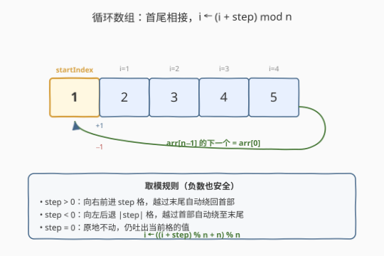
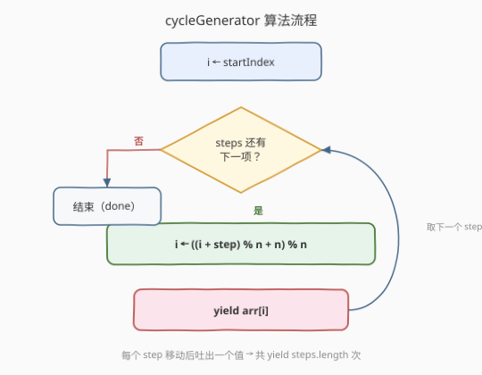

# LeetCode 生成循环数组的值 题解

## 1. 题目概述

- **标题 / 题号**：生成循环数组的值（#2757，medium）
- **链接**：https://leetcode.cn/problems/generate-circular-array-values/
- **难度**：中等
- **标签**：JavaScript、生成器（Generator）、模拟、取模运算

> ⚠️ 本题为 LeetCode 付费题（`isPaidOnly: true`），官方题面在 GraphQL 接口中返回 `null`，**题意描述与示例输出根据官方示例用例（`jsonExampleTestcases`）与函数签名（`metaData`）重建**，可能与官方题面有出入。若与判题结果不符，请以官方题面为准。

**题意**：给定一个**循环数组** `arr`（即 `arr[n-1]` 的下一个元素是 `arr[0]`，`arr[0]` 的上一个元素是 `arr[n-1]`，`n = arr.length`），一个整数数组 `steps`，以及一个起始下标 `startIndex`。实现一个**生成器函数** `cycleGenerator`，它返回一个生成器对象，按如下规则逐个产出 `arr` 中的值：

- 维护当前下标 `i`，初始 `i = startIndex`；
- 对 `steps` 中的每一项 `step`：将 `i` 沿循环数组移动 `step` 步（`step > 0` 向右前进、`step < 0` 向左后退、`step = 0` 原地不动），越过边界时自动绕回到另一端；随后 **`yield arr[i]`**。

即生成器共产出 `steps.length` 个值，第 $k$ 个产出值为 $\texttt{arr}\!\left[\big(\text{startIndex} + \sum_{j\le k}\text{steps}[j]\big) \bmod n\right]$（取模后映射到 $[0, n)$）。

> 💡 **关于语义的重建说明**：付费题题面不可见，本解读由示例用例与签名唯一确定的部分为「循环数组 + steps 驱动 + startIndex 起点 + 生成器逐值产出」。`step = 0`、`step > n`（如示例 1 的 `6`，而 `n = 5`）、负 `step` 三类用例同时出现，强烈指向「取模绕回」是核心考点。若官方判题要求在第一步前先 `yield arr[startIndex]`（即多产出一个首值），只需在循环前补一句 `yield arr[i]`，主体逻辑不变。

**示例 1**：

```text
输入：arr = [1,2,3,4,5], steps = [1,2,6], startIndex = 0
输出：[2,4,5]
解释：
  i = 0
  step 1：i = (0 + 1) % 5 = 1 → yield arr[1] = 2
  step 2：i = (1 + 2) % 5 = 3 → yield arr[3] = 4
  step 6：i = (3 + 6) % 5 = 4 → yield arr[4] = 5   // 6 > n，绕一圈再走 1 步
```

**示例 2**：

```text
输入：arr = [10,11,12,13,14,15], steps = [1,4,0,-1,-3], startIndex = 1
输出：[12,10,10,15,12]
解释：
  i = 1
  step 1 ：i = 2        → yield 12
  step 4 ：i = (2+4)%6 = 0  → yield 10
  step 0 ：i = 0        → yield 10            // 原地不动，仍吐当前值
  step -1：i = (0-1) → 5     → yield 15      // 越过首部绕至末尾
  step -3：i = (5-3) = 2     → yield 12
```

**示例 3**：

```text
输入：arr = [2,4,6,7,8,10], steps = [-4,5,-3,10], startIndex = 3
输出：[10,8,4,10]
解释：
  i = 3
  step -4：i = (3-4) → 5     → yield arr[5] = 10
  step 5 ：i = (5+5)%6 = 4  → yield arr[4] = 8
  step -3：i = (4-3) = 1     → yield arr[1] = 4
  step 10：i = (1+10)%6 = 5  → yield arr[5] = 10
```

**约束条件**（根据用例推断，仅供参考）：

- $1 \le \text{arr.length} \le 10^5$
- $0 \le \text{steps.length} \le 10^5$
- $-10^9 \le \text{steps}[i] \le 10^9$
- $0 \le \text{startIndex} < \text{arr.length}$
- $-10^4 \le \text{arr}[i] \le 10^4$

> 💡 本题属 LeetCode「30 天 JavaScript」系列，**仅开放 JavaScript / TypeScript 提交入口**（`metaData.languages = ["javascript","typescript"]`，函数名 `cycleGenerator`），核心考察 **generator 生成器**协议与**循环下标的取模绕回**。生成器是跨语言通用概念，下文给出 Python 的 `yield` 等价实现（语义一一对应）。

## 2. 解题思路

### 2.1 朴素思路：把所有结果先算出来再返回

最直白的「能跑」写法是放弃生成器的惰性，先把 `steps` 全部走完、把每个落点的值收进一个数组，最后一次性返回：

```text
cycleGenerator(arr, steps, startIndex):
    res = []
    i = startIndex
    for step in steps:
        i = (i + step) mod n
        res.push(arr[i])
    return res
```

单看结果，它和生成器产出完全一致。但它**违背了生成器的本意**——生成器的价值在于**惰性求值**：调用方每调一次 `.next()` 才推进一格、产出当前值，无需预先把整条序列物化进内存。当 `steps.length` 很大、或调用方中途提前终止（`return` / `break`）时，朴素写法仍会算完全程，白白浪费计算与空间。这正是「为什么要用 `yield`」的根因。

### 2.2 核心观察：`yield` 让游走过程本身成为序列



关键洞察有两层：

1. **循环数组的下标迁移只是一个取模**：从当前下标 `i` 移动 `step` 步后的新下标是 $i' = ((i + \text{step}) \bmod n + n) \bmod n$。两次取模（`% n` 后 `+ n` 再 `% n`）是为了把 JS / TS 中 `%` 对负数返回负值的语义统一纠正到 $[0, n)$——这一步是负 `step` 用例（示例 2 的 `-1`、`-3`，示例 3 的 `-4`、`-3`）能否正确的关键。
2. **生成器把「移动 + 取值」的循环直接编码为 `yield`**：每轮循环先更新 `i`，再 `yield arr[i]`，生成器对象就把这个游走过程**外部化**为一个可被 `for...of` / `.next()` 消费的迭代器。调用方拿到的是「按需推进」的值流，而非一整条数组。

于是函数体形是固定的两步循环：

| 步 | 动作 | 目的 |
|----|------|------|
| ① | `i = ((i + step) % n + n) % n` | 在循环数组上移动到新下标（正负皆安全） |
| ② | `yield arr[i]` | 把新下标的值交给调用方，暂停等下一次 `.next()` |

> 💡 **为什么 `step = 0` 仍要 `yield`？** `step = 0` 时 `i` 不变，但循环体照常执行到 `yield arr[i]`，吐出当前格的值。这正契合示例 2 中 `step = 0` 产出 `10`（与上一步相同的当前值）的行为——「原地不动也是一种移动，照样报一次位置」。

> ⚠️ **负数取模的坑（本题最易踩）**：JS / TS 的 `%` 是**取余而非取模**——`(-1) % 6 === -1`，不是 `5`。若直接写 `i = (i + step) % n`，`step = -1`、`i = 0` 时得到 `-1`，`arr[-1]` 取到 `undefined` 而非绕回末尾。修正写法是 `((i + step) % n + n) % n`（先 `%` 再 `+n` 再 `%`），把任意整数映射到 $[0, n)$。Python 的 `%` 本身返回非负，直接 `(i + step) % n` 即可——这是两种语言在取模语义上的关键差异，跨语言移植时务必留意。

### 2.3 算法流程图



流程是一条「初始化 → 判是否还有 step → 取模移动 → yield → 回到判定」的单循环：

1. **初始化**：`i = startIndex`，进入生成器；
2. **菱形判定**：`steps` 还有下一项？没有 → 生成器结束（`.next()` 返回 `{done: true}`）；
3. **取模移动**：取下一项 `step`，`i = ((i + step) % n + n) % n`；
4. **`yield arr[i]`**：把当前格的值交给调用方，**暂停**在此处，等下一次 `.next()`；
5. 调用方再次驱动 → 回到第 2 步，直到 `steps` 耗尽。

`yield` 的「暂停—恢复」语义是整条流程的灵魂：它让生成器在每次 `yield` 后**冻结局部变量 `i`**，调用方下次驱动时从冻结处继续——`i` 的状态天然地跨多次 `.next()` 保留，无需手工维护一个外部游标对象。

### 2.4 示例演算

![示例 1 演算：arr=[1,2,3,4,5], steps=[1,2,6], startIndex=0](../images/p2757_example_walkthrough.svg)

以**示例 1** `arr = [1,2,3,4,5], steps = [1,2,6], startIndex = 0`（`n = 5`）为例，逐 `step` 演算：

| 步 | step | 运算 | i | yield |
|----|------|------|---|-------|
| 起 | — | `i = 0` | $0$ | —（起点，不单独产出） |
| ① | $1$ | $(0+1)\bmod 5$ | $1$ | $\text{arr}[1] = 2$ |
| ② | $2$ | $(1+2)\bmod 5$ | $3$ | $\text{arr}[3] = 4$ |
| ③ | $6$ | $(3+6)\bmod 5 = 4$ | $4$ | $\text{arr}[4] = 5$ |

下标轨迹 $0 \to 1 \to 3 \to 4$，产出序列 $[2, 4, 5]$。注意第 ③ 步 `step = 6 > n = 5`：$3 + 6 = 9$，$9 \bmod 5 = 4$——等价于「绕一整圈（5 步）后再走 1 步」，落点正是 `arr[4]`。这正是循环数组「`step` 超过长度自动绕回」的体现，也是示例特意放一个 `6`（`n+1`）来考察取模正确性的意图。

> 💡 **示例 2 的 `step = 0` 与示例 3 的 `step = 10`**：`step = 0` 让 `i` 原地不动但仍 `yield` 一次当前值（示例 2 第三步产出 `10`，与上一步同值）；`step = 10`、`n = 6` 时 $1 + 10 = 11$，$11 \bmod 6 = 5$（示例 3 末步产出 `arr[5] = 10`），同样是「绕一圈再走 4 步」。两类用例分别考察「原地报值」与「大幅绕回」，都收敛到同一个取模公式。

## 3. 参考代码

### JavaScript / TypeScript（提交语言）

```javascript
/**
 * @param {number[]} arr      循环数组
 * @param {number[]} steps    每一步的移动量（可正可负可为零）
 * @param {number}   startIndex 起始下标
 * @return {Generator<number, void, void>}
 */
function* cycleGenerator(arr, steps, startIndex) {
    const n = arr.length;
    let i = startIndex;
    for (const step of steps) {
        // JS 的 % 对负数取余，需 +n 再 % 修正到 [0, n)
        i = ((i + step) % n + n) % n;
        yield arr[i];
    }
}

/**
 * 用法示例：
 * const gen = cycleGenerator([1,2,3,4,5], [1,2,6], 0);
 * console.log(gen.next().value); // 2
 * console.log(gen.next().value); // 4
 * console.log(gen.next().value); // 5
 * console.log(gen.next().done);  // true
 *
 * // 也可用 for...of 消费：
 * // for (const v of cycleGenerator([1,2,3,4,5], [1,2,6], 0)) console.log(v);
 */
```

TypeScript 版本仅替换类型注解，逻辑完全一致：

```typescript
function* cycleGenerator(
    arr: number[],
    steps: number[],
    startIndex: number
): Generator<number, void, unknown> {
    const n = arr.length;
    let i = startIndex;
    for (const step of steps) {
        i = ((i + step) % n + n) % n;
        yield arr[i];
    }
}
```

### Python（概念等价）

```python
from typing import Generator

def cycle_generator(arr: list[int], steps: list[int], start_index: int) -> Generator[int, None, None]:
    n = len(arr)
    i = start_index
    for step in steps:
        # Python 的 % 对负数返回非负，直接 (i + step) % n 即落在 [0, n)
        i = (i + step) % n
        yield arr[i]


# 用法：
# gen = cycle_generator([1, 2, 3, 4, 5], [1, 2, 6], 0)
# print(list(gen))  # [2, 4, 5]
```

> 💡 **JS 与 Python 的两点对照**：① 生成器声明——JS 用 `function*` + `yield`，Python 用 `def` + `yield`（或 `yield from` 委托），二者都是「遇到 `yield` 暂停、`.next()` 恢复」的协程语义；② 负数取模——JS `%` 取余（负），需 `((x % n) + n) % n` 修正，Python `%` 取模（非负），直接 `x % n` 即可。跨语言移植时，取模差异是唯一的语义陷阱。

## 4. 复杂度分析

| 维度 | 复杂度 | 说明 |
|------|--------|------|
| 单步时间 | $O(1)$ | 一次取模 + 一次 `yield`，均为常数操作 |
| 整体时间 | $O(m)$ | $m = \text{steps.length}$；每个 `step` 推进一格、产出一个值，共 $m$ 次 |
| 空间 | $O(1)$ | 生成器自身只维护一个下标 `i`；**惰性求值不物化整条序列**，与朴素「先算全表」的 $O(m)$ 空间形成对照 |

> 💡 本题无复杂算法可言，本质是「正确实现循环下标迁移 + 用 `yield` 把过程外部化」。$m \le 10^5$ 的约束下，$O(m)$ 时间、$O(1)$ 额外空间轻松通过。真正考察的是**生成器协议的直觉**——把「我有一个会随时推进、随时暂停的迭代器」内化为表达方式，而非把所有结果先攒进数组。

## 5. 扩展：生成器协议与 `yield` 的暂停—恢复语义

**生成器 =「可暂停的函数」。** 普通函数一旦调用就跑到 `return` 才交还控制权，中间无法把值逐个递交给调用方。生成器用 `yield` 打破这一点：执行到 `yield expr` 时，**把 `expr` 作为 `.next()` 的返回值交还，随即冻结当前执行栈**（局部变量、`for` 循环位置全部保留）；调用方再次调 `.next()` 时，从 `yield` 的下一行恢复，继续跑到下一个 `yield` 或函数结束。本题正是利用这一点：`for...of steps` 的循环位置与下标 `i` 都被生成器自动冻结保存，无需手工维护一个「带游标的对象」。

**`.next()` 的返回结构。** 每次 `.next()` 返回 `{ value, done }`：`value` 是 `yield` 表达式的值，`done` 为 `false`；当生成器跑完函数体（`steps` 耗尽、自然结束），返回 `{ value: undefined, done: true }`。`for...of` 循环正是不断调 `.next()`、直到 `done: true` 才退出——所以 `for (const v of cycleGenerator(...))` 会自动把 $m$ 个值逐个取出。

**惰性的收益。** 对比 2.1 的朴素写法：朴素版无论调用方是否需要全部值，都先把 $m$ 个值算完存进 $O(m)$ 数组；生成器版只在被 `.next()` 驱动时才推进，调用方提前 `break` / `return` 即停止推进，省下后续计算与空间。当 `steps` 很长、或调用方只取前几个值就满足时（如「找一个满足条件的首个产出值」），惰性是实打实的收益。

**`yield*` 委托（本题未用，但同系列常考）。** 一个生成器可以把产出**整体委托**给另一个可迭代对象：`yield* someIterable` 会把 `someIterable` 的每个值依次 yield 出来，再回到自身。2649「嵌套数组生成器」就是用 `yield*` 递归委托子数组——对照本题的「自己一个一个 `yield`」，两者是生成器产出值的两种基本手法。

> 💡 **一句话总结**：生成器的全部魔法 = 「`yield` 暂停冻结、`.next()` 恢复续跑」。本题把循环数组的游走循环写成 `yield`，下标 `i` 跨多次 `.next()` 自动保留，无需手工游标；唯一要小心的是 JS 负数取余需 `+n` 修正。

## 6. 面试要点

1. **生成器和普通函数有什么区别？`yield` 做了什么？**

   > 普通函数调用即执行到 `return`，一次性交还控制权与一个返回值。生成器函数（`function*`）调用时**不立即执行**，而是返回一个迭代器对象；每次 `.next()` 才推进执行，遇到 `yield expr` 就把 `expr` 作为 `{value, done}` 交还并**冻结执行栈**（局部变量、循环位置、调用栈都保留），下次 `.next()` 从 `yield` 的下一行恢复。`yield` 的本质是「产出 + 暂停」，让函数变成可按需推进的协程。

2. **为什么用生成器而不是先把结果算进数组再返回？**

   > 惰性求值 + 省空间。朴素写法无论调用方用多少都要先把 $m$ 个值全算完物化进 $O(m)$ 数组；生成器版只在被 `.next()` 驱动时才推进一格，调用方提前 `break` 即停止，省下后续计算与空间。当序列很长、或调用方只取前几个值就满足（如「找首个满足条件的产出值」），惰性是实打实的收益。此外生成器还能表达**无限序列**（如循环不停产出），数组根本装不下。

3. **负数 `step` 时，`i = (i + step) % n` 在 JS 里为什么不对？怎么修？**

   > JS / TS 的 `%` 是**取余**：结果符号跟被除数，`(-1) % 6 === -1`，不是 `5`。所以 `step = -1`、`i = 0` 时得到 `-1`，`arr[-1]` 取到 `undefined`。修正：`i = ((i + step) % n + n) % n`——先 `% n`、再加 `n`（把负数拉回正）、再 `% n`，保证落在 $[0, n)$。Python 的 `%` 本身是取模（非负），直接 `(i + step) % n` 即可。这是跨 JS/Python 移植时最常踩的语义差异。

4. **`step = 0` 时生成器会怎样？为什么示例 2 第三步还是产出了一个值？**

   > `step = 0` 时 `i = ((i + 0) % n + n) % n = i`，下标不变，但循环体照常执行到 `yield arr[i]`，所以仍吐出当前格的值一次。示例 2 第三步 `step = 0` 产出 `10`，与上一步（`step = 4` 落到 `i = 0`）的产出相同——「原地不动也是一种移动，照样报一次位置」。这正是生成器「`yield` 在循环里就一定会被走到」的自然结果。

5. **`step > n`（如示例 1 的 `6`，而 `n = 5`）时怎么处理？为什么要测这种用例？**

   > 取模天然兜底：`step = 6`、`n = 5` 时 $(i + 6) \bmod 5 = (i + 1) \bmod 5$，等价于「绕一整圈（5 步）后再走 1 步」。这种用例专门考察「移动量超过数组长度时是否正确绕回」——若误用截断或忽略 `step ≥ n`，就会算错落点。结合 `step = 0`（原地）、负 `step`（反向绕回），三类用例共同把「循环数组的下标迁移 = 安全取模」这一核心逼出来。

> 💡 **一句话总结**：2757 = 「循环数组 + `steps` 驱动 + `yield` 把游走外部化」。核心两步：`i = ((i + step) % n + n) % n` 取模绕回（负数 `+n` 修正）、`yield arr[i]` 逐值产出。踩坑点唯一：JS 的 `%` 是取余不是取模，负数必须 `+n` 再 `%` 修正。

## 同类练习题

| # | 题目 | 与本题的关联 |
|---|------|-------------|
| 2649 | [嵌套数组生成器](https://leetcode.cn/problems/nested-array-generator/) | 递归多维数组按中序逐个产出整数，用 `yield*` 委托子数组——与本题同属「30 天 JS」生成器家族，一学 `yield*` 委托一学单步 `yield`（[题解](../2601-2700/2649_嵌套数组生成器.md)） |
| 341 | [扁平化嵌套列表迭代器](https://leetcode.cn/problems/flatten-nested-list-iterator/) | 把嵌套的 `NestedInteger` 摊平成迭代器，可用栈模拟或用生成器 `yield*` 递归——与本题同属「把递归/游走过程外部化为迭代器」的范式 |
| 604 | [迭代压缩字符串](https://leetcode.com/problems/design-compressed-string-iterator/) | 设计一个迭代器逐字符展开形如 `L1e2t1C1o1d1e1` 的压缩串——与本题同属「按需推进、惰性产出」的迭代器设计，对照生成器 vs 手写游标两种实现 |
| 2694 | [事件发射器](https://leetcode.cn/problems/event-emitter/) | 实现 `on/off/emit` 的事件系统，属「30 天 JS」设计题——与本题同属该系列的 JS 语言特性考察，一学生成器一学事件机制（[题解](../2601-2700/2694_事件发射器.md)） |
