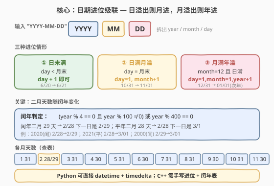
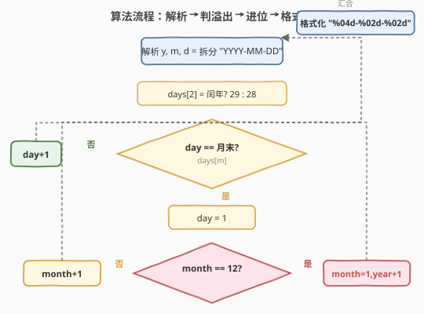
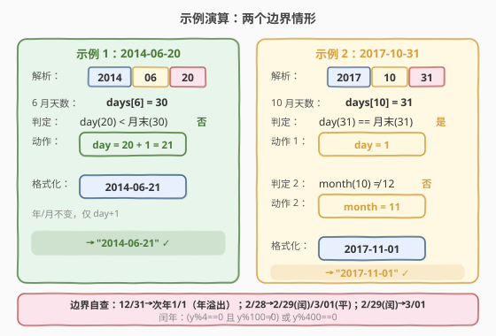

# 下一天

- **题目名称**：下一天
- **链接**：[2758. 下一天](https://leetcode.cn/problems/next-day/)
- **难度**：简单
- **标签**：日期、数学、模拟

## 1. 题目概述

> ⚠️ 本题为 LeetCode 付费题，题意描述根据官方示例用例重建，可能与官方题面有出入。

给定一个表示日期的字符串 `date`，格式为 `YYYY-MM-DD`（年-月-日）。请返回**该日期的下一天**，输出格式同样为 `YYYY-MM-DD`。

> 💡 本题考查的是**日期边界处理**：日进位是否会触发月进位、月进位是否会触发年进位，以及闰年二月的特殊天数。

**示例 1**：

```text
输入：date = "2014-06-20"
输出："2014-06-21"
解释：6 月有 30 天，20 未到月末，直接 day+1 即可。
```

**示例 2**：

```text
输入：date = "2017-10-31"
输出："2017-11-01"
解释：10 月有 31 天，31 已到月末 → day 归 1，month 进位 10→11。
```

**约束条件**（根据示例推断）：

- `date` 是一个**合法**的 `YYYY-MM-DD` 格式日期字符串
- 年份范围足以覆盖平年与闰年的判定（含世纪年如 1900、2000）

---

## 2. 解题思路

### 2.1 暴力思路

最直接的做法是借助语言内置的日期库：解析字符串为日期对象，加一天，再格式化回去。Python 的 `datetime` + `timedelta` 一行即可搞定，几乎不可能出错。但若面试官要求**不使用日期库**（或用 C++ 这类标准库不含日期处理的语言），就需要手写进位逻辑。

### 2.2 核心观察：日期进位级联



日期递增的本质是一套**级联进位**系统，和十进制加法「逢十进一」如出一辙，只是每位基数不同：

- **日位**的基数 = 当前月的总天数（1/3/5/7/8/10/12 月 31 天，4/6/9/11 月 30 天，2 月 28 或 29 天）。
- **月位**的基数固定为 12。
- **年位**无上限，直接累加。

三种进位情形：

| 情形 | 条件 | 动作 | 示例 |
|------|------|------|------|
| ① 日未满 | $d < \text{月末}$ | $d \mathrel{+}= 1$ | 6/20 → 6/21 |
| ② 日满月溢 | $d = \text{月末}$ | $d = 1,\; m \mathrel{+}= 1$ | 10/31 → 11/01 |
| ③ 月满年溢 | $d = \text{月末}$ 且 $m = 12$ | $d = 1,\; m = 1,\; y \mathrel{+}= 1$ | 12/31 → 次年 1/01 |

**关键细节：闰年判定**。2 月的天数取决于该年是否为闰年：

$$
\text{leap}(y) = \big(y \bmod 4 = 0 \;\land\; y \bmod 100 \ne 0\big) \;\lor\; \big(y \bmod 400 = 0\big)
$$

- 闰年 2 月有 **29** 天（$2/28 \to 2/29$）
- 平年 2 月有 **28** 天（$2/28 \to 3/01$）
- 世纪年特殊：2000 是闰年（能被 400 整除），1900 不是闰年（能被 100 但不能被 400 整除）。

### 2.3 算法流程图



流程为两层决策：

1. 解析 `YYYY-MM-DD` → 拆出 $y, m, d$。
2. 先算 2 月天数（闰年 29 / 平年 28）。
3. **第一层**：$d$ 是否等于月末？
   - 否 → $d \mathrel{+}= 1$（最常见路径）。
   - 是 → $d = 1$，进入第二层。
4. **第二层**：$m$ 是否等于 12？
   - 否 → $m \mathrel{+}= 1$。
   - 是 → $m = 1,\; y \mathrel{+}= 1$。
5. 格式化为 `%04d-%02d-%02d` 返回。

### 2.4 示例演算



**示例 1** `"2014-06-20"`：

| 步骤 | 内容 |
|------|------|
| 解析 | $y=2014,\; m=6,\; d=20$ |
| 月末 | $\text{days}[6] = 30$（6 月 30 天，2014 非闰年无需特判） |
| 判定 | $20 < 30$ → 日未满 |
| 动作 | $d = 20 + 1 = 21$ |
| 格式化 | `"2014-06-21"` ✓ |

**示例 2** `"2017-10-31"`：

| 步骤 | 内容 |
|------|------|
| 解析 | $y=2017,\; m=10,\; d=31$ |
| 月末 | $\text{days}[10] = 31$（10 月 31 天） |
| 判定 1 | $31 = 31$ → 日满月溢，$d = 1$ |
| 判定 2 | $m=10 \ne 12$ → 非年溢出，$m = 11$ |
| 格式化 | `"2017-11-01"` ✓ |

**边界自查**（虽未在示例中出现，但解法已覆盖）：

- `"2017-12-31"` → 日满 + 月满 → `"2018-01-01"`（年进位）。
- `"2020-02-28"` → 2020 闰年，月末 29 → $28 < 29$ → `"2020-02-29"`。
- `"2021-02-28"` → 2021 平年，月末 28 → $28 = 28$ → $d=1, m=3$ → `"2021-03-01"`。
- `"2020-02-29"` → 2020 闰年，月末 29 → $29 = 29$ → $d=1, m=3$ → `"2020-03-01"`。

---

## 3. 参考代码

### Python

借助标准库 `datetime`，三行搞定——这是面试中**最推荐的写法**：

```python
from datetime import datetime, timedelta

class Solution:
    def nextDay(self, date: str) -> str:
        d = datetime.strptime(date, "%Y-%m-%d")
        d += timedelta(days=1)
        return d.strftime("%Y-%m-%d")
```

`datetime.strptime` 自动处理闰年与各月天数，`timedelta(days=1)` 内部完成全部进位，`strftime` 保证输出格式（补零）。

> 💡 若面试官要求**不使用日期库**，可用如下手写进位版本，逻辑与 C++ 版完全对应：

```python
class Solution:
    def nextDay(self, date: str) -> str:
        y, m, d = map(int, date.split("-"))
        days = [0, 31, 28, 31, 30, 31, 30, 31, 31, 30, 31, 30, 31]
        if m == 2 and ((y % 4 == 0 and y % 100 != 0) or y % 400 == 0):
            last = 29
        else:
            last = days[m]
        if d < last:
            d += 1
        else:
            d = 1
            if m == 12:
                m, y = 1, y + 1
            else:
                m += 1
        return f"{y:04d}-{m:02d}-{d:02d}"
```

### C++

C++ 标准库不含日期解析，需手写进位 + 闰年表：

```cpp
class Solution {
public:
    string nextDay(string date) {
        int y = stoi(date.substr(0, 4));
        int m = stoi(date.substr(5, 2));
        int d = stoi(date.substr(8, 2));
        static int days[] = {0, 31, 28, 31, 30, 31, 30, 31, 31, 30, 31, 30, 31};
        bool leap = (y % 4 == 0 && y % 100 != 0) || (y % 400 == 0);
        int last = (m == 2 && leap) ? 29 : days[m];
        if (d < last) {
            ++d;
        } else {
            d = 1;
            if (m == 12) { m = 1; ++y; }
            else ++m;
        }
        char buf[12];
        snprintf(buf, sizeof(buf), "%04d-%02d-%02d", y, m, d);
        return string(buf);
    }
};
```

> ⚠️ 闰年判定不能简化为「能被 4 整除」：世纪年 1900 能被 100 但不能被 400 整除，**不是**闰年；2000 能被 400 整除，**是**闰年。漏掉 `y % 100 != 0` 条件会在 2100 年翻车。

---

## 4. 复杂度分析

| 维度 | 复杂度 | 说明 |
|------|--------|------|
| **时间** | $O(1)$ | 解析 10 字符 + 一次进位判定 + 格式化，全部常数操作 |
| **空间** | $O(1)$ | 只用常数个变量，返回长度固定的 10 字符串 |

> 💡 日期问题的时间复杂度恒为 $O(1)$（输入规模固定为 10 字符），考查的从来不是效率，而是**边界正确性**。

---

## 5. 扩展：JavaScript `Date` 对象的时区陷阱

若用 JavaScript 解题，有一个经典坑：`new Date("2014-06-20")` 会把**纯日期字符串**按 **UTC** 解析为 `2014-06-20T00:00:00Z`。在 UTC 之后的时区（如美东 UTC-5），调用 `getDate()` 会返回 **19**（前一天），导致结果错一天。

**正确写法**（用 `split` 手动构造本地日期，或直接做字符串算术）：

```javascript
var nextDay = function(date) {
    var [y, m, d] = date.split('-').map(Number);
    var dt = new Date(y, m - 1, d);  // 本地时间构造，不受时区影响
    dt.setDate(dt.getDate() + 1);
    var yy = dt.getFullYear();
    var mm = String(dt.getMonth() + 1).padStart(2, '0');
    var dd = String(dt.getDate()).padStart(2, '0');
    return `${yy}-${mm}-${dd}`;
};
```

> ⚠️ 用 `new Date(y, m-1, d)`（数字构造）而非 `new Date(dateString)`，前者按**本地时区**解析，`getDate()` 不会跨天偏移。

---

## 6. 面试要点

**Q1：为什么不能用「能被 4 整除」一个条件判闰年？**
> 因为公历（格里高利历）规定：能被 100 整除但**不能**被 400 整除的年份是**平年**。1900 能被 4 整除、也能被 100 整除但不能被 400 整除 → 平年（2 月 28 天）；2000 能被 400 整除 → 闰年。只用 `y % 4 == 0` 会在所有世纪年出错。

**Q2：级联进位和十进制加法有什么同构之处？**
> 十进制每位基数 10、逢十进一；日期「日位」基数 = 月末天数（随月/年变化）、「月位」基数 12、「年位」无上限。日满月末 → 月进位、日归 1；月满 12 → 年进位、月归 1。与「个位满 10 → 十位进 1、个位归 0」完全同构，只是基数不统一且 2 月基数随闰年浮动。

**Q3：哪些日期是必须覆盖的边界测试用例？**
> 四类：(1) 普通日（6/20→6/21）；(2) 月末非年末（10/31→11/01、6/30→7/01）；(3) 年末（12/31→次年 1/01）；(4) 闰年 2 月末（2020/2/28→2/29、2020/2/29→3/01、平年 2021/2/28→3/01）。世纪年 1900/2/28 和 2000/2/28 也值得各测一条。

**Q4：Python 的 `datetime` 方案为什么不推荐在面试中直接用？**
> 取决于面试官意图。若考查的是**日期边界处理能力**，直接调库等于绕开了考点——面试官可能追加「不用库再写一遍」。稳妥做法：先说清手写逻辑（展示理解），再补充「生产环境当然用 `timedelta`」，两者兼备。

**Q5：和 [1360. 日期之间隔几天](https://leetcode.cn/problems/number-of-days-between-two-dates/) 的考点有何关联？**
> 1360 求两日期间天数差，同样需要闰年判定与各月天数表，但方向是「累加」而非「进位」——逐月补满整月天数 + 剩余日，需要先判断起止年的闰年归属。本题（2758）只前进一天，是 1360 的最小单元：掌握了进位逻辑，1360 只需把它循环或做差。

---

## 7. 同类练习题

- [1118. 一月有多少天](https://leetcode.cn/problems/number-of-days-in-a-month/)：给定年份与月份返回该月天数，本题的子问题（闰年判定 + 天数表）
- [1154. 一年中的第几天](https://leetcode.cn/problems/day-of-the-year/)：给定日期返回它是一年中第几天，需逐月累加天数，复用同一张月天数表
- [1185. 一周中的第几天](https://leetcode.cn/problems/day-of-the-week/)：给定日期返回星期几，可用蔡勒公式或从已知基准日累加天数差
- [1360. 日期之间隔几天](https://leetcode.cn/problems/number-of-days-between-two-dates/)：求两个日期间天数差，闰年 + 天数表的进阶应用
