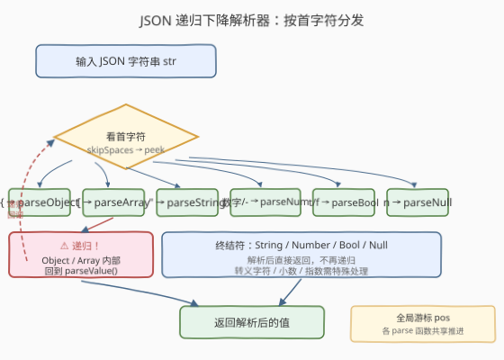
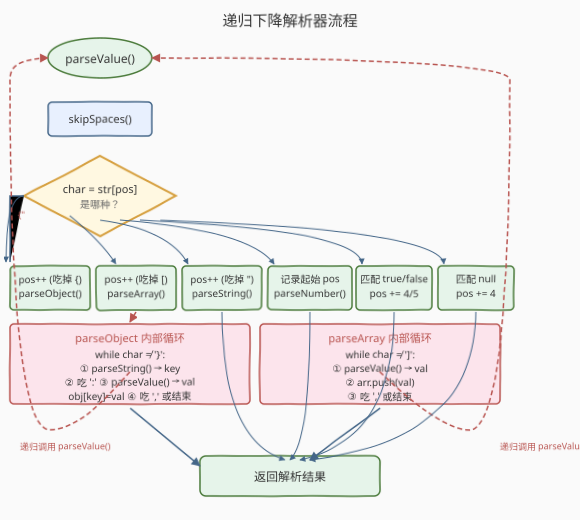
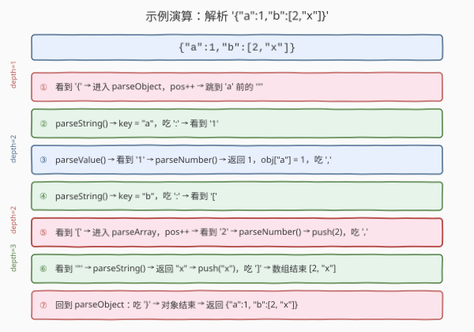

# LeetCode 将JSON字符串转换为对象 题解

## 1. 题目概述

- **标题 / 题号**：将JSON字符串转换为对象（#2759，hard）
- **链接**：https://leetcode.cn/problems/convert-json-string-to-object/
- **难度**：困难
- **标签**：字符串、递归、栈

> ⚠️ 本题为 LeetCode 付费题，题意描述根据官方示例用例与 hints 重建，可能与官方题面有出入。

**题意**：给定一个合法的 JSON 字符串 `str`，要求**不使用内置的 `JSON.parse()`**，手写一个解析器将字符串转换为对应的对象/值。

JSON 值支持以下 6 种类型：

| 类型 | 示例 | 说明 |
|------|------|------|
| `null` | `null` | 空值 |
| 布尔 | `true` / `false` | — |
| 数字 | `42`, `-3.14`, `1e10` | 整数、浮点、负数、科学计数法 |
| 字符串 | `"hello"` | 双引号包裹，支持转义序列 `\"` `\\` `\/` `\n` `\t` `\uXXXX` 等 |
| 数组 | `[1, "a", null]` | `[]` 包裹，逗号分隔的有序值列表 |
| 对象 | `{"k": 1}` | `{}` 包裹，`"key": value` 键值对，逗号分隔 |

**示例 1**：

```text
输入：str = '{"a":1,"b":[2,"x"]}'
输出：{"a":1,"b":[2,"x"]}
解释：解析得到对象，key "a" 对应数字 1，key "b" 对应数组 [2, "x"]
```

**示例 2**：

```text
输入：str = '[1,2,3]'
输出：[1,2,3]
解释：解析得到数组
```

**示例 3**：

```text
输入：str = '{"nested":{"deep":[1,{"k":2}]}}'
输出：{"nested":{"deep":[1,{"k":2}]}}
解释：多层嵌套，对象中含对象，对象中含数组，数组中含对象
```

**约束**：

- `1 <= str.length <= 10^5`
- 输入 `str` 保证是合法的 JSON 字符串

> 💡 这是一道**手写解析器**题：核心不在算法的复杂度优化，而在于把 JSON 语法形式化地映射成代码——递归下降（Recursive Descent）是天然解法，因为 JSON 的嵌套结构（数组含值、对象含值）本身就是递归的。

## 2. 解题思路

### 2.1 暴力思路：正则 / split

最容易想到的"取巧"方案是用正则表达式或 `split` 把字符串拆成 token 再拼装。但 JSON 的嵌套结构使得正则极难正确处理——一个 `split(',')` 会把 `"a,b"` 中的逗号也切掉，嵌套的 `{}` 和 `[]` 更是正则的噩梦。即使勉强拼出 token 流，还需要一个栈来处理嵌套关系，不如一步到位写递归下降。

### 2.2 核心观察：递归下降解析



JSON 语法天然是一棵递归的文法树：

```
value   → object | array | string | number | true | false | null
object  → '{' (string ':' value (',' string ':' value)*)? '}'
array   → '[' (value (',' value)*)? ']'
string  → '"' (char | escape)* '"'
number  → '-'? digits ('.' digits)? ('e' [+-]? digits)?
```

**关键观察**：每个 `value` 的类型由其**首字符**唯一决定——`{` 是对象、`[` 是数组、`"` 是字符串、`-` 或数字是数字、`t`/`f` 是布尔、`n` 是 null。因此解析器只需看一个字符就知道走哪条分支，这叫**预测型递归下降**（Predictive Recursive Descent），不需要回溯。

> 💡 **为什么递归？** 数组 `[v1, v2, ...]` 的每个 `vi` 本身就是一个 `value`，对象 `{"k": v}` 的每个 `v` 也是一个 `value`。解析 `value` 时遇到 `[` 或 `{`，就会**再次调用** `parseValue()`——递归天然匹配嵌套结构。

### 2.3 算法流程图



算法整体流程：

1. **维护全局游标** `pos`，所有 `parse*` 函数共享同一个游标，解析一段就推进一段，避免拷贝子串。
2. **`parseValue()`**：跳空白 → 看首字符 → 分发到对应的 `parse*` 函数。
3. **`parseObject()`**：吃 `{` → 循环 `parseString()` 取 key → 吃 `:` → `parseValue()` 取 val → 吃 `,` 或 `}`。
4. **`parseArray()`**：吃 `[` → 循环 `parseValue()` → 吃 `,` 或 `]`。
5. **`parseString()`**：吃 `"` → 逐字符读取直到未转义的 `"`，途中处理 `\` 转义 → 吃 `"`。
6. **`parseNumber()`**：从 `pos` 开始记录起始位置，逐字符跳过 `-`、数字、`.`、`e`/`E`、`+`/`-`，最后 `Number(str.slice(start, pos))` 一次性转换。
7. **`parseBoolean()` / `parseNull()`**：匹配 `true`/`false`/`null` 字面量，推进 `pos` 对应步数。

> ⚠️ **空对象 `{}` 和空数组 `[]`**：`parseObject` 吃完 `{` 后要先跳空白看是否 `}`，是则直接返回空对象，否则进入循环。`parseArray` 同理。

### 2.4 示例演算



以 `{"a":1,"b":[2,"x"]}` 为例，逐步追踪游标 `pos` 的推进：

| 步骤 | 当前字符 | 动作 | 递归深度 |
|------|----------|------|----------|
| ① | `{` | 进入 `parseObject`，`pos++`，跳到 `"` | 1 |
| ② | `"` | `parseString` → key=`"a"`，吃 `:` → 跳到 `1` | 2 |
| ③ | `1` | `parseNumber` → 返回 `1`，`obj.a=1`，吃 `,` | 2 |
| ④ | `"` | `parseString` → key=`"b"`，吃 `:` → 跳到 `[` | 2 |
| ⑤ | `[` | 进入 `parseArray`，`pos++` → 跳到 `2` | 2 |
| ⑥ | `2` | `parseNumber` → 返回 `2`，`push(2)`，吃 `,` → 跳到 `"` | 3 |
| ⑦ | `"` | `parseString` → 返回 `"x"`，`push("x")`，吃 `]` → 数组结束 | 3 |
| ⑧ | `}` | 回到 `parseObject`，吃 `}` → 对象结束 | 1 |

最终返回 `{"a": 1, "b": [2, "x"]}`。注意递归深度在步骤 ⑤→⑥→⑦ 时达到 3 层（object → array → string）。

## 3. 参考代码

### JavaScript（本题提交语言）

```javascript
/**
 * @param {string} str
 * @return {any}
 */
function jsonParse(str) {
    let pos = 0;
    const n = str.length;

    function skipSpaces() {
        while (pos < n && str[pos] === ' ') pos++;
    }

    function parseValue() {
        skipSpaces();
        const ch = str[pos];
        if (ch === '{') return parseObject();
        if (ch === '[') return parseArray();
        if (ch === '"') return parseString();
        if (ch === 't' || ch === 'f') return parseBoolean();
        if (ch === 'n') return parseNull();
        return parseNumber();
    }

    function parseObject() {
        pos++;
        const obj = {};
        skipSpaces();
        if (str[pos] === '}') { pos++; return obj; }
        while (true) {
            const key = parseString();
            skipSpaces();
            pos++;
            obj[key] = parseValue();
            skipSpaces();
            if (str[pos] === ',') { pos++; continue; }
            break;
        }
        pos++;
        return obj;
    }

    function parseArray() {
        pos++;
        const arr = [];
        skipSpaces();
        if (str[pos] === ']') { pos++; return arr; }
        while (true) {
            arr.push(parseValue());
            skipSpaces();
            if (str[pos] === ',') { pos++; continue; }
            break;
        }
        pos++;
        return arr;
    }

    function parseString() {
        pos++;
        const parts = [];
        while (str[pos] !== '"') {
            if (str[pos] === '\\') {
                pos++;
                const esc = str[pos];
                if (esc === 'u') {
                    parts.push(String.fromCharCode(
                        parseInt(str.slice(pos + 1, pos + 5), 16)));
                    pos += 4;
                } else {
                    const map = { '"': '"', '\\': '\\', '/': '/',
                        'b': '\b', 'f': '\f', 'n': '\n', 'r': '\r', 't': '\t' };
                    parts.push(map[esc]);
                }
            } else {
                parts.push(str[pos]);
            }
            pos++;
        }
        pos++;
        return parts.join('');
    }

    function parseNumber() {
        const start = pos;
        if (str[pos] === '-') pos++;
        while (pos < n && str[pos] >= '0' && str[pos] <= '9') pos++;
        if (str[pos] === '.') {
            pos++;
            while (pos < n && str[pos] >= '0' && str[pos] <= '9') pos++;
        }
        if (str[pos] === 'e' || str[pos] === 'E') {
            pos++;
            if (str[pos] === '+' || str[pos] === '-') pos++;
            while (pos < n && str[pos] >= '0' && str[pos] <= '9') pos++;
        }
        return Number(str.slice(start, pos));
    }

    function parseBoolean() {
        if (str[pos] === 't') { pos += 4; return true; }
        pos += 5; return false;
    }

    function parseNull() {
        pos += 4;
        return null;
    }

    return parseValue();
}
```

### Python（算法等价实现）

```python
class Solution:
    def jsonParse(self, s: str):
        self.s = s
        self.pos = 0
        self.n = len(s)

        def skip_spaces():
            while self.pos < self.n and self.s[self.pos] == ' ':
                self.pos += 1

        def parse_value():
            skip_spaces()
            ch = self.s[self.pos]
            if ch == '{': return parse_object()
            if ch == '[': return parse_array()
            if ch == '"': return parse_string()
            if ch in 'tf': return parse_boolean()
            if ch == 'n': return parse_null()
            return parse_number()

        def parse_object():
            self.pos += 1
            obj = {}
            skip_spaces()
            if self.s[self.pos] == '}':
                self.pos += 1
                return obj
            while True:
                key = parse_string()
                skip_spaces()
                self.pos += 1
                obj[key] = parse_value()
                skip_spaces()
                if self.s[self.pos] == ',':
                    self.pos += 1
                    continue
                break
            self.pos += 1
            return obj

        def parse_array():
            self.pos += 1
            arr = []
            skip_spaces()
            if self.s[self.pos] == ']':
                self.pos += 1
                return arr
            while True:
                arr.append(parse_value())
                skip_spaces()
                if self.s[self.pos] == ',':
                    self.pos += 1
                    continue
                break
            self.pos += 1
            return arr

        def parse_string():
            self.pos += 1
            parts = []
            while self.s[self.pos] != '"':
                if self.s[self.pos] == '\\':
                    self.pos += 1
                    esc = self.s[self.pos]
                    if esc == 'u':
                        parts.append(chr(int(self.s[self.pos+1:self.pos+5], 16)))
                        self.pos += 4
                    else:
                        mapping = {'"': '"', '\\': '\\', '/': '/',
                                   'b': '\b', 'f': '\f', 'n': '\n',
                                   'r': '\r', 't': '\t'}
                        parts.append(mapping[esc])
                else:
                    parts.append(self.s[self.pos])
                self.pos += 1
            self.pos += 1
            return ''.join(parts)

        def parse_number():
            start = self.pos
            if self.s[self.pos] == '-':
                self.pos += 1
            while self.pos < self.n and self.s[self.pos].isdigit():
                self.pos += 1
            if self.pos < self.n and self.s[self.pos] == '.':
                self.pos += 1
                while self.pos < self.n and self.s[self.pos].isdigit():
                    self.pos += 1
            if self.pos < self.n and self.s[self.pos] in 'eE':
                self.pos += 1
                if self.pos < self.n and self.s[self.pos] in '+-':
                    self.pos += 1
                while self.pos < self.n and self.s[self.pos].isdigit():
                    self.pos += 1
            num_str = self.s[start:self.pos]
            if '.' in num_str or 'e' in num_str or 'E' in num_str:
                return float(num_str)
            return int(num_str)

        def parse_boolean():
            if self.s[self.pos] == 't':
                self.pos += 4
                return True
            self.pos += 5
            return False

        def parse_null():
            self.pos += 4
            return None

        return parse_value()
```

> 💡 **代码要点**：
> - **全局游标 `pos`** 而非传子串：每次 `parseValue` 处理完一段就推进 `pos`，下一个 `parseValue` 从新位置开始。避免 `str.slice` 的 $O(n)$ 拷贝，整体 $O(n)$。
> - **`parseString` 用数组拼接**（`parts.join('')`）而非 `+=`：JavaScript 中字符串拼接在大量调用时可能 $O(n^2)$，用数组 `push` + `join` 更稳定。
> - **`parseNumber` 先记录起始位置，最后一次性转换**：不逐字符拼接，而是 `Number(str.slice(start, pos))`，让引擎优化转换。
> - **`parseObject`/`parseArray` 的空情况**：吃掉开头 `{`/`[` 后先跳空白看是否是 `}`/`]`，是则直接返回空容器。

## 4. 复杂度分析

| 维度 | 复杂度 | 说明 |
|------|--------|------|
| 时间复杂度 | $O(n)$ | 每个字符恰好被游标扫过一次，`parseString` 的 `join` 也是线性 |
| 空间复杂度 | $O(d)$ | 递归深度 $d$ = 最大嵌套层数；最坏 $d = O(n)$（如 `[[[[...]]]]`），通常远小于 $n$ |

> ⚠️ 递归深度等于 JSON 的最大嵌套层数。极端情况下（如 `[[[[...单层...]]]]` 嵌套 $n/2$ 层），空间为 $O(n)$，可能触发栈溢出。题目约束 $n \le 10^5$ 时一般安全，但若需防御性编程，可改为显式栈迭代版（见第 5 节）。

## 5. 扩展：显式栈迭代版

递归版在嵌套极深时可能栈溢出。可改为**显式栈**实现：用一个栈保存"当前正在构建的容器"（对象或数组）及其状态。

核心思路：

- 遇到 `{` 或 `[`：创建新容器，压栈
- 遇到终结值（数字、字符串、布尔、null）：直接填入栈顶容器
- 遇到 `}` 或 `]`：弹出栈顶容器，填入新栈顶（如果还有的话）

```python
def jsonParse_iterative(s: str):
    stack = []   # 元素: (container, type, first)
    pos = 0
    n = len(s)
    result = None

    def skip_spaces():
        nonlocal pos
        while pos < n and s[pos] == ' ': pos += 1

    while pos < n:
        skip_spaces()
        if pos >= n: break
        ch = s[pos]

        if ch == '{':
            stack.append([{}, 'obj', True])
            pos += 1
        elif ch == '[':
            stack.append([[], 'arr', True])
            pos += 1
        elif ch == '}':
            obj = stack.pop()[0]
            if stack: _fill(stack[-1][0], obj, stack[-1])
            else: result = obj
            pos += 1
        elif ch == ']':
            arr = stack.pop()[0]
            if stack: _fill(stack[-1][0], arr, stack[-1])
            else: result = arr
            pos += 1
        elif ch == '"':
            val = _parse_string()
            if stack: _fill(stack[-1][0], val, stack[-1])
            else: result = val
        elif ch in 'tf':
            val = _parse_bool()
            if stack: _fill(stack[-1][0], val, stack[-1])
            else: result = val
        elif ch == 'n':
            val = _parse_null()
            if stack: _fill(stack[-1][0], val, stack[-1])
            else: result = val
        elif ch == ',':
            pos += 1
        elif ch == ':':
            pos += 1
        else:
            val = _parse_number()
            if stack: _fill(stack[-1][0], val, stack[-1])
            else: result = val

    return result
```

> 💡 迭代版消除了递归栈，空间从 $O(d)$ 降为 $O(d)$ 的显式栈（但显式栈在堆上分配，不会栈溢出）。代价是代码复杂度上升，且需维护 `_fill` 函数区分对象（填 key-value）和数组（append）。面试中**递归版优先**，除非被追问深嵌套场景。

## 6. 面试要点

1. **为什么用递归下降而不是正则或 `split`？**

   - JSON 的嵌套结构是**上下文无关文法**（CFG），正则表达式（正则只对应正则文法/3 型文法）无法正确匹配任意深度的嵌套括号。`split(',')` 会错误切割字符串内部的逗号。递归下降天然匹配 CFG。

2. **`\uXXXX` 转义如何处理？**

   - 在 `parseString` 中遇到 `\u` 时，读取后 4 个十六进制字符，`parseInt(hex, 16)` 得到码点，`String.fromCharCode` 转回字符。注意 JSON 规范不支持代理对（surrogate pair）以外的特殊编码——但标准 JSON 中 `\uD834\uDD1E` 这种代理对需要拼接两个码点后用 `String.fromCodePoint`。

3. **数字解析有哪些边界情况？**

   - 前导 `-`、小数点 `.`、指数 `e`/`E` 后跟可选 `+`/`-`。注意 JSON 不允许前导零（如 `01`）、不允许单独的 `.` 或 `-`、不允许尾部小数点（如 `1.`）。本题输入保证合法，故代码无需校验，只需正确推进游标。若需严格校验，参考 [65. 有效数字](https://leetcode.cn/problems/valid-number/) 的 DFA 方法。

4. **为什么用全局游标而不是每次传子串？**

   - 传子串 `str.slice(start)` 每次拷贝 $O(n)$，嵌套 $d$ 层共 $O(n \cdot d)$。全局游标每个字符只被读过一次，总 $O(n)$。

5. **空对象 `{}` 和空数组 `[]` 怎么处理？**

   - `parseObject` 吃 `{` 后跳空白，若看到 `}` 则 `pos++` 返回 `{}`，不进入循环。`parseArray` 同理。否则进入 `while(true)` 循环解析元素。这避免了"空容器后多读一个字符"的 off-by-one 错误。

## 同类练习题

| # | 题目 | 与本题的关联 |
|---|------|-------------|
| 8 | [字符串转换整数 (atoi)](https://leetcode.cn/problems/string-to-integer-atoi/)（[题解](../0001-0100/8_字符串转换整数atoi.md)） | 单类型解析（数字），本题 `parseNumber` 的独立简化版，关注溢出边界处理 |
| 224 | [基本计算器](https://leetcode.cn/problems/basic-calculator/)（[题解](../0201-0300/224_基本计算器.md)） | 栈解析含嵌套括号的算术表达式，与 JSON 嵌套结构的解析思路同源 |
| 150 | [逆波兰表达式求值](https://leetcode.cn/problems/evaluate-reverse-polish-notation/)（[题解](../0101-0200/150_逆波兰表达式求值.md)） | 后缀表达式求值，另一种语法解析范式（逆波兰 vs 递归下降） |
| 65 | [有效数字](https://leetcode.cn/problems/valid-number/)（[题解](../0001-0100/65_有效数字.md)） | DFA 验证数字格式，本题 `parseNumber` 的判定版——解析时不校验合法性（输入保证合法），但理解 DFA 有助于处理边界情况 |
| 394 | [字符串解码](https://leetcode.cn/problems/decode-string/) | 嵌套括号解码字符串（如 `3[a2[c]]`），同为递归/栈处理嵌套结构的练习 |
