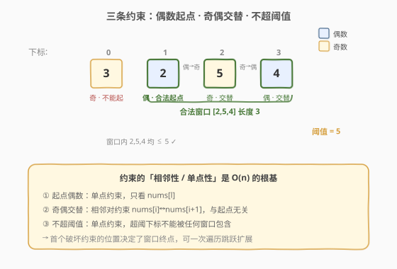
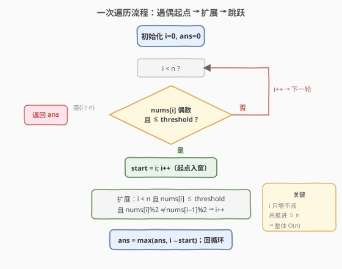

# 最长奇偶子数组

- **题目名称**：最长奇偶子数组
- **链接**：[2760. 最长奇偶子数组](https://leetcode.cn/problems/longest-even-odd-subarray-with-threshold/)
- **难度**：简单
- **标签**：数组、滑动窗口

## 1. 题目概述

给你一个下标从 **0** 开始的整数数组 `nums` 和一个整数 `threshold`。请你从 `nums` 的子数组中找出以下标 `l` 开头、下标 `r` 结尾 `0 <= l <= r < nums.length` 且满足以下条件的 **最长子数组**：

- `nums[l] % 2 == 0`（起点必须是偶数）
- 对于范围 `[l, r - 1]` 内的所有下标 `i`，`nums[i] % 2 != nums[i + 1] % 2`（相邻元素奇偶性交替）
- 对于范围 `[l, r]` 内的所有下标 `i`，`nums[i] <= threshold`（窗口内元素都不超过阈值）

以整数形式返回满足题目要求的最长子数组的长度。**子数组**是数组中的一个连续非空元素序列。

**示例 1**：

```text
输入：nums = [3,2,5,4], threshold = 5
输出：3
解释：选择 l = 1、r = 3 的子数组 => [2,5,4]，满足上述条件。
     因此答案就是这个子数组的长度 3。可以证明 3 是满足题目要求的最大长度。
```

**示例 2**：

```text
输入：nums = [1,2], threshold = 2
输出：1
解释：选择 l = 1、r = 1 的子数组 => [2]。该子数组满足上述全部条件。
     可以证明 1 是满足题目要求的最大长度。
```

**示例 3**：

```text
输入：nums = [2,3,4,5], threshold = 4
输出：3
解释：选择 l = 0、r = 2 的子数组 => [2,3,4]。该子数组满足上述全部条件。
     因此答案就是这个子数组的长度 3。可以证明 3 是满足题目要求的最大长度。
```

**约束条件**：

- `1 <= nums.length <= 100`
- `1 <= nums[i] <= 100`
- `1 <= threshold <= 100`

---

## 2. 解题思路

### 2.1 暴力思路

枚举所有子数组 `[l, r]`（共 $O(n^2)$ 个），对每个子数组逐一检查三条约束：起点是否偶数、相邻奇偶是否交替、元素是否都不超过阈值，每项检查 $O(n)$。总复杂度 $O(n^3)$，在本题 $n \le 100$ 的数据范围内完全可过。

但暴力做法没有利用**约束的局部性**：一旦某个下标违反了「交替」或「阈值」，任何包含该处的子数组都无效，无需反复检查。

### 2.2 核心观察：一次遍历 + 跳跃扩展



三条约束有一个关键共性——它们都只与**相邻关系**或**单点取值**有关，因此窗口从起点出发能延伸多远，完全由「第一个破坏约束的位置」决定，而该位置**与起点无关**：

- **起点必须偶数**：只有 `nums[i]` 为偶数且 `nums[i] <= threshold` 时才能作为合法起点。
- **交替条件** `nums[i] % 2 != nums[i+1] % 2`：判断的是**相邻一对**元素的奇偶关系，与窗口从哪开始无关。若 `nums[r]` 与 `nums[r+1]` 奇偶相同，任何同时包含 $r$、$r+1$ 的窗口都无效。
- **阈值条件** `nums[i] <= threshold`：是单点约束，超阈值的下标不能被任何窗口包含。

> 💡 **为什么可以「跳」到窗口末尾之后？** 设起点 $l$ 的最大可扩展终点为 $r$（在 $r+1$ 处首次违反交替或阈值）。由于「交替」是相邻对约束、「阈值」是单点约束，任何起点 $l' \in (l, r]$ 的可扩展终点都 $\le r$，长度 $r-l'+1 \le r-l+1$，绝不会超过起点 $l$ 的窗口。所以一旦算完 $[l, r]$，直接令 $i = r+1$ 寻找下一个偶数起点即可，中间位置无需重复枚举——这就是把 $O(n^2)$ 压到 $O(n)$ 的关键。

### 2.3 算法流程图



整体只有一重外层循环，内层 `while` 只做「扩展」，`i` 始终只增不减，因此 $i$ 的总推进次数不超过 $n$，整体 $O(n)$。

### 2.4 示例演算

![示例演算：[3,2,5,4]](../images/p2760_example_walkthrough.svg)

上表逐步展示了 `nums = [3,2,5,4], threshold = 5` 的完整执行过程：

- 下标 0 的 `3` 是奇数，不能作起点，`i` 直接右移。
- 下标 1 的 `2` 是偶数且 `2 <= 5`，记为起点 `start=1`，开始向右扩展：`5 <= 5` 且奇偶交替 ✓，`4 <= 5` 且奇偶交替 ✓，到达末尾停止，窗口 `[1,3]` 长度 3。
- 全局答案更新为 3，可证明这是最大长度。

---

## 3. 参考代码

### C++（一次遍历 + 跳跃扩展）

```cpp
class Solution {
public:
    int longestAlternatingSubarray(vector<int>& nums, int threshold) {
        int n = nums.size();
        int ans = 0;
        int i = 0;
        while (i < n) {
            // 合法起点：偶数 且 不超过阈值
            if (nums[i] % 2 != 0 || nums[i] > threshold) {
                i++;
                continue;
            }
            int start = i;
            i++; // 至少包含起点
            // 向右扩展：不超阈值 且 与左邻奇偶相反
            while (i < n && nums[i] <= threshold && nums[i] % 2 != nums[i - 1] % 2) {
                i++;
            }
            ans = max(ans, i - start);
        }
        return ans;
    }
};
```

### Python

```python
class Solution:
    def longestAlternatingSubarray(self, nums: List[int], threshold: int) -> int:
        n = len(nums)
        ans = 0
        i = 0
        while i < n:
            # 合法起点：偶数 且 不超过阈值
            if nums[i] % 2 != 0 or nums[i] > threshold:
                i += 1
                continue
            start = i
            i += 1  # 至少包含起点
            # 向右扩展：不超阈值 且 与左邻奇偶相反
            while i < n and nums[i] <= threshold and nums[i] % 2 != nums[i - 1] % 2:
                i += 1
            ans = max(ans, i - start)
        return ans
```

> ⚠️ **注意**：扩展条件里比较的是 `nums[i]` 与 `nums[i-1]`，因此 `i++` 让起点入窗后再判断下一个位置，避免越界。跳跃后 `i` 已停在「首个不合法位置」，外层循环继续从这里找下一个偶数起点，无需回退。

---

## 4. 复杂度分析

| 维度 | 复杂度 | 说明 |
|------|--------|------|
| 时间复杂度 | $O(n)$ | 内外两层循环共享同一个只增不减的游标 $i$，总推进次数不超过 $n$ |
| 空间复杂度 | $O(1)$ | 只用常数个变量，无额外数据结构 |

---

## 5. 扩展：暴力双指针法（便于理解）

若不依赖「相邻对约束与起点无关」的观察，可用朴素双指针：枚举每个偶数起点 `l`，再用 `r` 向右试探，遇违反即停。由于每次都从 `l` 重新数，最坏 $O(n^2)$，但仍优于三重循环的 $O(n^3)$：

```cpp
int longestAlternatingSubarray(vector<int>& nums, int threshold) {
    int n = nums.size(), ans = 0;
    for (int l = 0; l < n; l++) {
        if (nums[l] % 2 != 0 || nums[l] > threshold) continue;
        int r = l;
        while (r + 1 < n && nums[r + 1] <= threshold
               && nums[r + 1] % 2 != nums[r] % 2) {
            r++;
        }
        ans = max(ans, r - l + 1);
    }
    return ans;
}
```

> 💡 它与一次遍历法的差别：这里外层 `l` 每次只 `+1`，没有跳过已确认无用的区间，所以是 $O(n^2)$；一次遍历法把 `l` 直接跳到 `r+1`，才把复杂度压到 $O(n)$。

---

## 6. 面试要点

1. **为什么本题能从 $O(n^2)$ 优化到 $O(n)$？**

   - 因为「奇偶交替」是相邻对约束、「阈值」是单点约束，二者都**与窗口起点无关**。一旦起点 $l$ 的最大延伸终点为 $r$，区间 $(l, r]$ 内任何起点的终点都不可能超过 $r$，所以可直接跳跃，无需对中间起点重新枚举。

2. **跳跃会不会漏掉更长的窗口？**

   - 不会。区间 $(l, r]$ 内起点 $l'$ 的窗口长度 $r-l'+1 \le r-l+1$，已被 $[l,r]$ 覆盖；而 $r+1$ 处是首个违反约束的位置，含它的窗口一律无效，跳到 $r+1$ 重新找偶数起点恰好衔接。

3. **起点为何必须判「偶数且不超阈值」两个条件？**

   - 题目要求 `nums[l] % 2 == 0`；阈值约束覆盖整个窗口含起点，故起点本身也需 `<= threshold`，缺一不可，否则该窗口从第一项就违法。

4. **如果数据范围放大到 $10^5$，本法还成立吗？**

   - 成立。算法是严格 $O(n)$、$O(1)$ 空间，与数据规模无关，依然高效；暴力 $O(n^2)$ 则会超时。

5. **奇偶交替能否用异或简洁表达？**

   - 可以，`nums[i] % 2 != nums[i-1] % 2` 等价于 `(nums[i] ^ nums[i-1]) & 1 == 1`，异或后看最低位是否为 1 即可，常数更小、可读性略降。

---

## 7. 同类练习题

- [209. 长度最小的子数组](https://leetcode.cn/problems/minimum-size-subarray-sum/)：同向双指针滑窗，正数单调性驱动收缩
- [713. 乘积小于 K 的子数组](https://leetcode.cn/problems/subarray-product-less-than-k/)：滑窗 + 计数 `right-left+1`，遇违反即收缩
- [3. 无重复字符的最长子串](https://leetcode.cn/problems/longest-substring-without-repeating-characters/)：滑窗维护区间性质，遇违反跳跃收缩
- [674. 最长连续递增序列](https://leetcode.cn/problems/longest-continuous-increasing-subsequence/)：一次遍历遇违反即重置起点，与本题跳跃扩展同构
- [978. 最长湍流子数组](https://leetcode.cn/problems/longest-turbulent-subarray/)：相邻比较 + 遇违反重置，奇偶交替的符号比较进阶版
