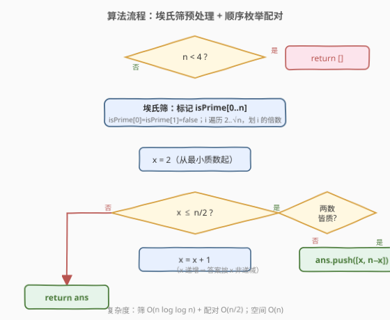
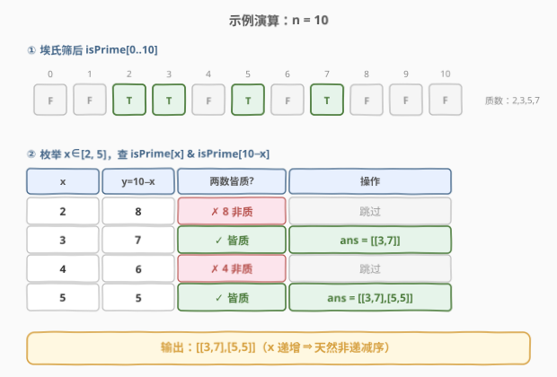

# 和等于目标值的质数对

- **题目名称**：和等于目标值的质数对
- **链接**：[2761. 和等于目标值的质数对](https://leetcode.cn/problems/prime-pairs-with-target-sum/)
- **难度**：中等
- **标签**：数组、数学、枚举、数论

## 1. 题目概述

给你一个整数 `n`。如果两个整数 `x` 和 `y` 满足下列条件，则认为二者形成一个**质数对**：

- `1 <= x <= y <= n`
- `x + y == n`
- `x` 和 `y` 都是质数

请你以二维有序列表的形式返回符合题目要求的所有 `[x_i, y_i]`，列表需要按 `x_i` 的**非递减顺序**排序。如果不存在符合要求的质数对，则返回一个空数组。

> 💡 **注意**：质数是大于 `1` 的自然数，并且只有两个因子，即它本身和 `1`。

**示例 1**：

```text
输入：n = 10
输出：[[3,7],[5,5]]
解释：在这个例子中，存在满足条件的两个质数对。
这两个质数对分别是 [3,7] 和 [5,5]，按照题面描述中的方式排序后返回。
```

**示例 2**：

```text
输入：n = 2
输出：[]
解释：可以证明不存在和为 2 的质数对，所以返回一个空数组。
```

**约束**：

- `1 <= n <= 10^6`

## 2. 解题思路

### 2.1 暴力思路：逐个试除判定

最直观的做法是：枚举 `x ∈ [2, n/2]`，令 `y = n - x`，对 `x` 和 `y` 各做一次 $O(\sqrt{n})$ 的试除判质数，若都为质数则收入答案。

```text
for x in 2..n/2:
    if isPrime(x) and isPrime(n - x):   # 各试除到 √n
        ans.append([x, n - x])
```

枚举量 $O(n)$、每次判质 $O(\sqrt n)$，总和约 $O(n\sqrt n)$。当 $n = 10^6$ 时 $\sqrt n \approx 1000$，总操作约 $10^9$ 量级，**必然 TLE**。瓶颈在于：**每个候选数都要从头重复试除**，且对 `y = n - x` 这个较大值也要扫到 $\sqrt n$。

> ⚠️ 瓶颈在“逐点判质”而非“枚举配对”本身。把判质数从 $O(\sqrt n)$ 降到 $O(1)$ 即可 AC，这正是筛法的用武之地。

### 2.2 核心观察：埃氏筛预处理 + $O(1)$ 查表配对

关键洞察：**配对判定只依赖“某数是否为质数”这一布尔信息**。如果我们事先用一个布尔数组 `isPrime[0..n]` 标记好 `[2, n]` 中每个数的质性，那么 `isPrime[x] && isPrime[n-x]` 就是 $O(1)$ 一次查表，配对总复杂度退化为 $O(n)$。

**两个细节**：

1. **为何 `x` 只需枚举到 `n/2`？** 由 `x <= y` 与 `x + y = n` 推得 `x <= n/2`。当 `x` 超过 `n/2` 时 `y = n - x < x`，该对在之前已以 `(y, x)` 的形式出现过，再枚举只会重复。因此 `x ∈ [2, n/2]` 覆盖全部不重复对。

   > 💡 这正是“**有序双和**”剪枝：固定较小的一方 `x`，用单调性把 $O(n)$ 枚举砍半。

2. **为何 `x` 递增即天然非递减序？** 我们按 `x = 2, 3, 4, …` 顺序扫描，命中时直接 `append([x, n-x])`，结果序列的 `x_i` 单调不减，**无需额外排序**，直接满足题面输出要求。


**一个边界**：最小的质数是 `2`，故最小可成对的和为 `2 + 2 = 4`。`n <= 3` 时无解，直接返回空数组（也可不做特判，让循环自然空跑，但显式剪枝更清晰且省下建数组）。

### 2.3 算法流程图

预处理用 **埃氏筛** 一次标记 `[0, n]` 全体质性，内层从 `i*i` 起、外层只到 $\sqrt n$，与 [204. 计数质数](../0201-0300/204_计数质数.md) 完全同款。



### 2.4 示例演算

以 `n = 10` 走一遍，重点看筛后查表如何把 `8`、`4` 这种合数“一票否决”：



筛得质数 `{2, 3, 5, 7}`，随后 `x = 2..5` 逐个配对：`(2,8)`✗、`(3,7)`✓、`(4,6)`✗、`(5,5)`✓，最终输出 `[[3,7],[5,5]]`，与示例 1 一致 ⭐。

## 3. 参考代码

### C++

```cpp
class Solution {
public:
    vector<vector<int>> findPrimePairs(int n) {
        vector<vector<int>> ans;
        if (n < 4) return ans;                 // 最小质数对 2+2=4，n<4 必空

        // 埃氏筛：标记 isPrime[0..n]
        vector<bool> isPrime(n + 1, true);
        isPrime[0] = isPrime[1] = false;
        for (int i = 2; (long long)i * i <= n; ++i) {
            if (isPrime[i]) {
                for (int j = i * i; j <= n; j += i) {  // 从 i*i 起划倍数
                    isPrime[j] = false;
                }
            }
        }

        // 枚举 x ∈ [2, n/2]，x 递增 ⇒ 答案天然非递减
        for (int x = 2; x <= n / 2; ++x) {
            int y = n - x;
            if (isPrime[x] && isPrime[y]) {
                ans.push_back({x, y});
            }
        }
        return ans;
    }
};
```

### Python

```python
class Solution:
    def findPrimePairs(self, n: int) -> List[List[int]]:
        if n < 4:                              # 最小质数对 2+2=4，n<4 必空
            return []

        # 埃氏筛：标记 is_prime[0..n]
        is_prime = [True] * (n + 1)
        is_prime[0] = is_prime[1] = False
        i = 2
        while i * i <= n:                       # 只筛到 √n
            if is_prime[i]:
                for j in range(i * i, n + 1, i):  # 从 i*i 起划倍数
                    is_prime[j] = False
            i += 1

        # 枚举 x ∈ [2, n/2]，x 递增 ⇒ 答案天然非递减
        ans = []
        for x in range(2, n // 2 + 1):
            y = n - x
            if is_prime[x] and is_prime[y]:
                ans.append([x, y])
        return ans
```

## 4. 复杂度分析

| 维度 | 复杂度 | 说明 |
|------|--------|------|
| 时间 | $O(n \log \log n)$ | 埃氏筛 $O(n \log \log n)$ 主导；配对枚举 $O(n/2) = O(n)$ 严格更小 |
| 空间 | $O(n)$ | `isPrime` 布尔数组占 $n+1$ 位（C++ `vector<bool>` 约 $n/8$ 字节，$n=10^6$ 约 125 KB） |

> 💡 **为何不是 $O(n\sqrt n)$？** 筛法把“判质数”从每次 $O(\sqrt n)$ 摊成一次预处理 $O(n \log \log n)$，之后全为 $O(1)$ 查表。$n=10^6$ 时 $\log \log n \approx 2.6$，筛约 $2.6\times10^6$ 次标记，配对 $5\times10^5$ 次查表，总量远低于暴力的 $10^9$。

## 5. 扩展：试除判定 vs 筛法查表的取舍

若 `n` 极大但只需判定少数几个数（如 $n \le 10^9$ 且只查 $O(\sqrt n)$ 个），逐点试除 $O(\sqrt n)$ 反而更省空间（$O(1)$ 而非 $O(n)$）。但本题要求枚举**整整 $n/2$ 个候选**，逐点判质会让总量飙到 $O(n\sqrt n)$，此时“$O(n)$ 预处理 + $O(1)$ 查表”的筛法是唯一可行解——**候选数越多，预处理摊销越划算**。

另外，若值域再大一个量级（如 $n = 10^7$），可把埃氏筛换成**线性筛（欧拉筛）**严格 $O(n)$；本题 $n = 10^6$ 下埃氏筛因无分支、缓存友好，往往比线性筛更快，推荐。

## 6. 面试要点

> **Q1：为什么 `x` 只枚举到 `n/2`，而不是到 `n`？**
> **A**：由 `x <= y` 与 `x + y = n` 得 `x <= n/2`。超过 `n/2` 时 `y = n - x < x`，该对已以 `(y, x)` 形式出现，再枚举会重复。这条“有序双和”剪枝把枚举量砍半，且无需去重。

> **Q2：为什么不用对结果再排序？**
> **A**：`x` 从 `2` 递增扫描到 `n/2`，命中时按出现顺序 `append`，结果序列的 `x_i` 天然单调不减，直接满足“非递减”要求。换“乱序枚举”才需事后排序。

> **Q3：埃氏筛为什么从 `i*i` 划起、外层只到 $\sqrt n$？**
> **A**：从 `i*i`：更小倍数 `2i … (i-1)i` 已被 `i` 的更小质因子划过。外层到 $\sqrt n$：任何 $\le n$ 的合数都有 $\le \sqrt n$ 的质因子，已被更小的 `i` 划掉；`i*i >= n` 时无可划目标。这两点把朴素筛的常数降到极低。

> **Q4：`i * i` 会不会溢出？**
> **A**：本题 $n \le 10^6$，$\sqrt n \approx 1000$，`i*i` 最大约 $10^6$，远在 `int` 范围内。但写 `(long long)i * i <= n` 是更稳的习惯，若值域扩到 $10^9$ 就必须如此防溢出。

> **Q5：这道题和哥德巴赫猜想有什么关系？**
> **A**：本题正是**哥德巴赫猜想**（每个大于 2 的偶数可表为两质数之和）的计算版：枚举偶数 `n` 的所有质数拆分。对奇数 `n`，拆分形如 `2 + (n-2)`，仅当 `n-2` 也为质数时才有解，这解释了为何奇数 `n` 的解通常稀疏甚至为空。

## 7. 同类练习题

- [204. 计数质数](https://leetcode.cn/problems/count-primes/)（[站内题解](../0201-0300/204_计数质数.md)）：埃氏筛母题，本题筛法部分与其完全同款，从“数质数个数”升级到“按和配对”
- [2523. 范围内最接近的两个质数](https://leetcode.cn/problems/closest-prime-numbers-in-range/)：同为“筛法求区间质数 + 在质数序列上做配对/差值分析”，筛法应用进阶
- [633. 平方数之和](https://leetcode.cn/problems/sum-of-square-numbers/)：同为“枚举 `x`，判定 `n-x` 满足性质”的存在型两数之和，把质数判定换成平方数判定
- [762. 二进制表示中质数个计算置位](https://leetcode.cn/problems/prime-number-of-set-bits-in-binary-representation/)：小规模质数集合预置后 $O(1)$ 查表，筛法/质数表查表的微型应用
- [2614. 对角线上的质数](https://leetcode.cn/problems/prime-in-diagonal/)：单点质数判定（试除），对照体会“少量候选用试除、大量候选用筛法”的取舍
