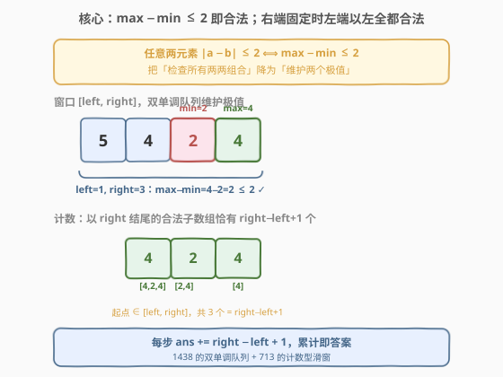
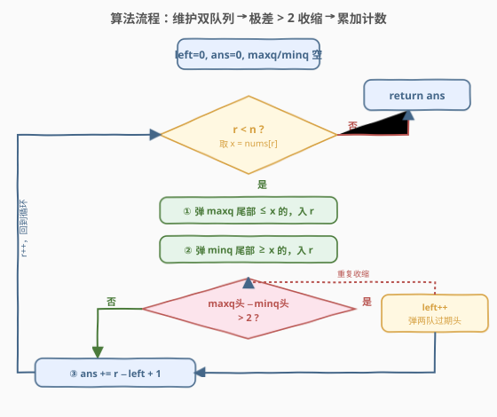

# 不间段子数组

- **题目名称**：不间段子数组
- **链接**：[2762. 不间段子数组](https://leetcode.cn/problems/continuous-subarrays/)
- **难度**：中等
- **标签**：数组、滑动窗口、单调队列、堆（优先队列）

## 1. 题目概述

给定一个下标从 **0** 开始的整数数组 `nums`。如果 `nums` 的一个子数组满足以下条件，则称其为**不间段**的：

- 设子数组下标为 $i, i+1, \dots, j$。对子数组中**任意**两个下标 $i_1, i_2$（$i \le i_1, i_2 \le j$），都有 $0 \le |\text{nums}[i_1] - \text{nums}[i_2]| \le 2$。

请你返回**不间段子数组**的总数目。子数组是数组中一段连续**非空**的元素序列。

**示例 1**：

```text
输入：nums = [5,4,2,4]
输出：8
解释：
大小为 1 的不间段子数组：[5], [4], [2], [4]。
大小为 2 的不间段子数组：[5,4], [4,2], [2,4]。
大小为 3 的不间段子数组：[4,2,4]。
没有大小为 4 的不间段子数组。
不间段子数组的总数目为 4 + 3 + 1 = 8。
```

**示例 2**：

```text
输入：nums = [1,2,3]
输出：6
解释：
大小为 1 的不间段子数组：[1], [2], [3]。
大小为 2 的不间段子数组：[1,2], [2,3]。
大小为 3 的不间段子数组：[1,2,3]。
不间段子数组的总数目为 3 + 2 + 1 = 6。
```

**约束条件**：

- $1 \le \text{nums.length} \le 10^5$
- $1 \le \text{nums}[i] \le 10^9$

> 💡 关键化简：「任意两元素绝对差 $\le 2$」等价于「$\max - \min \le 2$」。因为两两之差的上确界就是最大值与最小值之差。于是问题归约为：**维护窗口极差**——这是 [1438. 绝对差不超过限制的最长连续子数组](../1401-1500/1438_绝对差不超过限制的最长连续子数组.md) 的双单调队列场景；而本题要的是**计数**而非最长长度，每步累加 `right - left + 1`，又承接 [713. 乘积小于 K 的子数组](../0701-0800/713_乘积小于K的子数组.md) 的计数型滑窗。故 2762 = 1438 的双队列 + 713 的计数。

---

## 2. 解题思路

### 2.1 暴力思路：枚举所有子数组

枚举所有连续子数组 $[i, j]$，对每个子数组线性扫描求 $\max$ 与 $\min$，判断 $\max - \min \le 2$。共有 $O(n^2)$ 个子数组，每个判断 $O(n)$，总复杂度 $O(n^3)$（边扩展边维护极值可降到 $O(n^2)$），$n = 10^5$ 时严重超时。

> ⚠️ 暴力的浪费在于：相邻子数组大量重叠，却每次重新求 $\max/\min$；且没有意识到「以 $r$ 结尾的合法子数组构成一段连续的起点区间」，可一次性计数。

### 2.2 核心观察：双单调队列维护极差 + 逐右端计数



两个观察叠加，把 $O(n^3)$ 压到 $O(n)$：

**观察一（化简约束）**：「任意两元素 $|a - b| \le 2$」$\iff$ 「$\max - \min \le 2$」。子数组中两两之差的最大值就是极差，只要极差不超标，所有两两之差都不会超标。这把「检查所有组合」降为「维护两个极值」。

**观察二（计数型滑窗）**：维护窗口 $[\text{left}, \text{right}]$ 使其始终合法（$\max - \min \le 2$）。固定右端 $\text{right}$ 时，合法起点构成一段**连续区间** $[\text{left}, \text{right}]$——因为若 $[\text{left}, \text{right}]$ 合法，它的任意后缀 $[k, \text{right}]$（$\text{left} \le k \le \text{right}$）作为子区间，极差只会更小，必然也合法。于是以 $\text{right}$ 结尾的合法子数组**恰有** $\text{right} - \text{left} + 1$ 个，每步直接累加。

> ⚠️ 为什么不会多算也不会漏？`left` 是使窗口合法的**最小**起点（再往左一步 `left-1` 起的窗口极差 $> 2$ 不合法，正是收缩的边界）。所以 $[\text{left}, \text{right}]$ 是以 $\text{right}$ 结尾的最长合法子数组，其所有后缀恰好枚举了全部以 $\text{right}$ 结尾的合法子数组，不多不少。

**极值的维护**用两个双端队列（与 1438 完全一致）：

- **`maxq`（单调递减）**：存下标，对应值从队头到队尾递减。队头 = 窗口**最大值**。新元素入队前，从队尾弹出所有 $\le \text{nums}[\text{right}]$ 的（更小且更早，永不再成为最大）。
- **`minq`（单调递增）**：存下标，对应值从队头到队尾递增。队头 = 窗口**最小值**。新元素入队前，从队尾弹出所有 $\ge \text{nums}[\text{right}]$ 的（更大且更早，永不再成为最小）。

一旦 $\text{nums}[\text{maxq.front()}] - \text{nums}[\text{minq.front()}] > 2$，就收缩左端：`left++`，并把两队队头中下标 $< \text{left}$ 的过期元素弹出。

### 2.3 算法流程图



遍历 `right` 从 $0$ 到 $n-1$，每步四动作：

1. **维护 `maxq`**（右端弹尾保递减）：`while maxq 非空 且 nums[maxq.back()] ≤ nums[right]：maxq.pop_back()`；`maxq.push_back(right)`。
2. **维护 `minq`**（右端弹尾保递增）：`while minq 非空 且 nums[minq.back()] ≥ nums[right]：minq.pop_back()`；`minq.push_back(right)`。
3. **超标收缩**：`while nums[maxq.front()] - nums[minq.front()] > 2`：`left++`；弹两队过期队头（`< left`）。
4. **累加计数**：`ans += right - left + 1`。

### 2.4 示例演算

![示例演算：nums=[5,4,2,4]，每步累加 right−left+1](../images/p2762_example_walkthrough.svg)

以示例 1 `nums = [5,4,2,4]` 为例：

| $r$ | $x$ | 窗口值 | $\max-\min$ | left | 动作 | 累加 | ans |
|-----|-----|--------|-------------|------|------|------|-----|
| 0 | 5 | `[5]` | $5-5=0 \le 2$ ✓ | 0 | 两队入 0 | $+1$ | 1 |
| 1 | 4 | `[5,4]` | $5-4=1 \le 2$ ✓ | 0 | maxq 留 5 入 4；minq 弹 5 入 4 | $+2$ | 3 |
| 2 | 2 | `[4,2]`（丢 5） | $5-2=3 > 2$ ✗ → 收缩 | 0→1 | 超标！left 到 1 丢掉 5，极差 $4-2=2$ 合法 | $+2$ | 5 |
| 3 | 4 | `[4,2,4]` | $4-2=2 \le 2$ ✓ | 1 | maxq 弹 4(旧) 入 4(新)；minq 留 2 入 4 | $+3$ | 8 |

**第 3 步（$r=2$）是关键**：`2` 入队后窗口 $[5,4,2]$ 极差 $5-2=3 > 2$，必须收缩。`left` 从 0 推到 1，丢掉 `nums[0]=5`——此时 `maxq` 队头下标 0 过期被弹出，窗口最大值更新为 4，极差降为 $4-2=2$ 恰好合法。累加 $r-\text{left}+1 = 2-1+1 = 2$（即 `[4,2]`、`[2]` 两个以 $r=2$ 结尾的合法子数组）。

**第 4 步（$r=3$）**：`4` 入队后窗口 $[4,2,4]$ 极差 $4-2=2$ 合法，累加 $3-1+1=3$（即 `[4,2,4]`、`[2,4]`、`[4]`）。最终 $1+2+2+3=8$ ✓。

> 💡 注意每步累加的正是「以当前 `right` 结尾的合法子数组个数」——它等于合法起点区间长度 `right - left + 1`，恰好覆盖 `[left, right]` 的所有后缀。

---

## 3. 参考代码

### C++（双单调队列 + 计数型滑窗）

```cpp
class Solution {
public:
    long long continuousSubarrays(vector<int>& nums) {
        deque<int> maxq;   // 单调递减，队头 = 窗口最大
        deque<int> minq;   // 单调递增，队头 = 窗口最小
        int left = 0;
        long long ans = 0;
        for (int right = 0; right < (int)nums.size(); ++right) {
            // ① 维护 maxq：弹掉尾部 ≤ nums[right] 的
            while (!maxq.empty() && nums[maxq.back()] <= nums[right]) {
                maxq.pop_back();
            }
            maxq.push_back(right);
            // ② 维护 minq：弹掉尾部 ≥ nums[right] 的
            while (!minq.empty() && nums[minq.back()] >= nums[right]) {
                minq.pop_back();
            }
            minq.push_back(right);
            // ③ 超标收缩：max − min > 2 时左端推进
            while (nums[maxq.front()] - nums[minq.front()] > 2) {
                ++left;
                while (!maxq.empty() && maxq.front() < left) {
                    maxq.pop_front();
                }
                while (!minq.empty() && minq.front() < left) {
                    minq.pop_front();
                }
            }
            // ④ 累加：以 right 结尾的合法子数组 = right - left + 1 个
            ans += right - left + 1;
        }
        return ans;
    }
};
```

### Python（双单调队列 + 计数型滑窗）

```python
from collections import deque

class Solution:
    def continuousSubarrays(self, nums: List[int]) -> int:
        maxq = deque()   # 单调递减，队头 = 窗口最大
        minq = deque()   # 单调递增，队头 = 窗口最小
        left = 0
        ans = 0
        for right, x in enumerate(nums):
            # ① 维护 maxq
            while maxq and nums[maxq[-1]] <= x:
                maxq.pop()
            maxq.append(right)
            # ② 维护 minq
            while minq and nums[minq[-1]] >= x:
                minq.pop()
            minq.append(right)
            # ③ 超标收缩
            while nums[maxq[0]] - nums[minq[0]] > 2:
                left += 1
                while maxq and maxq[0] < left:
                    maxq.popleft()
                while minq and minq[0] < left:
                    minq.popleft()
            # ④ 累加
            ans += right - left + 1
        return ans
```

> 💡 **与 1438 的唯一区别**：1438 在第 ④ 步是 `ans = max(ans, right - left + 1)`（取最长），而本题是 `ans += right - left + 1`（逐右端累加总数）。队列维护、收缩逻辑完全一致——掌握了 1438 的双单调队列，本题只需把「更新答案」换成「累加计数」即可。注意返回类型是 `long long` / `int`（Python 无溢出），最坏 $n=10^5$ 全合法时 $\sum_{r=0}^{n-1}(r+1) = \frac{n(n+1)}{2} \approx 5\times 10^9$，超过 32 位 int 范围，C++ 必须用 `long long`。

---

## 4. 复杂度分析

| 维度 | 复杂度 | 说明 |
|------|--------|------|
| **时间复杂度** | $O(n)$ | 每个下标在 `maxq`、`minq` 中各入队 1 次、出队 1 次（弹尾或过期），总操作 $\le 4n$；`left` 累计右移 $\le n$ |
| **空间复杂度** | $O(n)$ | 两个队列最坏各存 $n$ 个下标（如数组单调时） |

> ⚠️ 虽然收缩用了嵌套 `while`，但**均摊分析**：每个下标至多从每个队列的右端入队 1 次、从左端或右端出队 1 次，两个队列的总操作 $\le 4n$，故总时间 $O(n)$。这与 [239. 滑动窗口最大值](../0201-0300/239_滑动窗口最大值.md) 的均摊论证一致，只是队列翻倍、且答案从「取最值」变成「累加计数」。

---

## 5. 扩展：有序集合 / 堆的 $O(n \log n)$ 解法

若不熟悉单调队列，可用**有序容器**或**双堆**维护窗口极值，$O(\log n)$ 取最大最小：

| 解法 | 数据结构 | 单次维护 | 适用 |
|------|----------|----------|------|
| 有序多重集 | `multiset` / `SortedList` | $O(\log n)$ 增删 | 通用，代码最简 |
| 双对顶堆 | 大根堆(前半) + 小根堆(后半) | $O(\log n)$ 摊还 | 需懒惰删除 |
| 单调队列 | 双 `deque` | $O(1)$ 摊还 | 窗口连续滑动，最优 |

```cpp
// 有序集合解法，O(n log n)
#include <set>
class Solution {
  public:
    long long continuousSubarrays(vector<int>& nums) {
        multiset<int> s;
        int left = 0;
        long long ans = 0;
        for (int right = 0; right < (int)nums.size(); ++right) {
            s.insert(nums[right]);
            while (*s.rbegin() - *s.begin() > 2) {
                s.erase(s.find(nums[left]));
                ++left;
            }
            ans += right - left + 1;
        }
        return ans;
    }
};
```

有序集合每次插入/删除 $O(\log n)$，总 $O(n \log n)$。它不利用「窗口连续滑动」的特性（不知道哪些元素该弹），需显式按值删除。单调队列利用了窗口连续性，新元素入队时批量弹掉「更弱且更早」的旧元素，把单次操作降到均摊 $O(1)$，总 $O(n)$ 更优。本题 $n = 10^5$，两种解法都能过，但单调队列常数更小。

> 💡 **何时选有序集合？** 当窗口的合法性条件不是简单的极值差，而是任意值域约束（如 [220. 存在重复元素 III](../0201-0300/220_存在重复元素III.md) 的「存在差值 $\le t$ 的两元素」），单调队列难以维护时，有序集合的 `lower_bound` 查询更通用。本题只需 $\max - \min$，单调队列是首选。

---

## 6. 面试要点

1. **「任意两元素绝对差 ≤ 2」为什么等价于「max − min ≤ 2」？**

   > 子数组中任意两元素之差的上确界就是最大值与最小值之差。若 $\max - \min \le 2$，则对任意 $a, b$ 有 $|a - b| \le \max - \min \le 2$；反之若存在 $|a - b| > 2$，则 $\max - \min \ge |a - b| > 2$。这一化简把「检查所有两两组合」降为「维护两个极值」。

2. **为什么每步累加 `right - left + 1` 就能不重不漏地计数？**

   > `left` 是使 $[\text{left}, \text{right}]$ 合法的**最小**起点。该窗口合法 ⇒ 其所有后缀 $[k, \text{right}]$（$\text{left} \le k \le \text{right}$）作为子区间极差更小，也合法，共 `right - left + 1` 个。而 `left - 1` 起的窗口极差 $> 2$ 不合法（收缩边界），故起点 $< \text{left}$ 的子数组必不合法。两边界夹住，恰好枚举全部以 `right` 结尾的合法子数组，按右端分组求和无重复无遗漏。

3. **为什么用两个单调队列而不是两个堆或有序集合？**

   > 单调队列 $O(n)$，堆/有序集合 $O(n \log n)$。本题窗口**连续滑动**，单调队列能利用这一特性：新元素入队时批量弹掉「更弱且更早」的旧元素，单次均摊 $O(1)$。堆/有序集合不利用窗口连续性，常数更大。当窗口连续滑动且只需极值时，单调队列最优。这是与 1438 一致的选型。

4. **收缩时为什么要对两个队列都做过期检查？**

   > 被丢掉的 `nums[left-1]` 可能是当前窗口的最大值（在 `maxq` 队头）、最小值（在 `minq` 队头），或两者都不是。若它是极值，对应队列的队头会过期（下标 $< \text{left}$）需弹出；若不是极值，它在队列中部，不影响队头，会在后续弹尾或自然过期时消失。对两队都检查 `< left` 是最安全的做法，且均摊 $O(1)$。

5. **答案为什么可能超过 32 位 int？**

   > 最坏情况数组单调（如 `1,2,3,...,n`，相邻差 1，极差始终 $\le 2$），全部 $\frac{n(n+1)}{2}$ 个子数组都合法。$n = 10^5$ 时约 $5 \times 10^9$，超过 `INT_MAX`（约 $2.1 \times 10^9$）。C++ 必须用 `long long`，否则会溢出截断。Python 整数任意精度无此问题。

> 💡 **一句话总结**：2762 = [1438](../1401-1500/1438_绝对差不超过限制的最长连续子数组.md) 的双单调队列（极差 $\le 2$ 收缩）+ [713](../0701-0800/713_乘积小于K的子数组.md) 的计数型滑窗（每步累加 `right - left + 1`）。把「任意两元素差 $\le 2$」化简为「$\max - \min \le 2$」，双队列维护极值，固定右端累加合法起点数，整体 $O(n)$。

---

## 7. 同类练习题

- [1438. 绝对差不超过限制的最长连续子数组](https://leetcode.cn/problems/longest-continuous-subarray-with-absolute-diff-less-than-or-equal-to-limit/)（[站内题解](../1401-1500/1438_绝对差不超过限制的最长连续子数组.md)）：本题的「母题」——同样的双单调队列维护极差，只是求最长长度而非计数；掌握它后本题只差把 `max` 换成 `+=`
- [713. 乘积小于 K 的子数组](https://leetcode.cn/problems/subarray-product-less-than-k/)（[站内题解](../0701-0800/713_乘积小于K的子数组.md)）：计数型滑窗的招牌题，每步累加 `right - left + 1`；本题把「乘积 < K」换成「极差 ≤ 2」
- [239. 滑动窗口最大值](https://leetcode.cn/problems/sliding-window-maximum/)（[站内题解](../0201-0300/239_滑动窗口最大值.md)）：单调队列母题，维护窗口 max；本题复制一份维护 min，双队列协同
- [220. 存在重复元素 III](https://leetcode.cn/problems/contains-duplicate-iii/)（[站内题解](../0201-0300/220_存在重复元素III.md)）：同为滑动窗口值域约束，用桶分桶或有序集合的 `lower_bound` 查近似值
- [209. 长度最小的子数组](https://leetcode.cn/problems/minimum-size-subarray-sum/)（[站内题解](../0201-0300/209_长度最小的子数组.md)）：正数滑窗求最短长度，共享「left 只增不减均摊 $O(n)$」的分析，对比计数方向的不同
