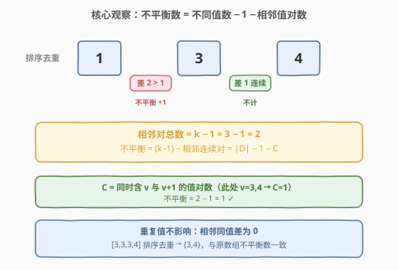
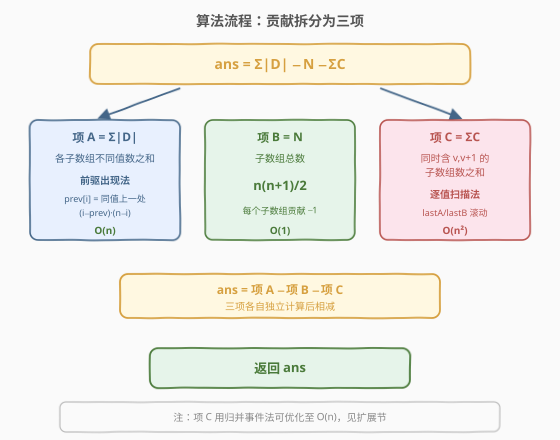

# 所有子数组中不平衡数字之和

- **题目名称**：所有子数组中不平衡数字之和
- **链接**：[2763. 所有子数组中不平衡数字之和](https://leetcode.cn/problems/sum-of-imbalance-numbers-of-all-subarrays/)
- **难度**：困难
- **标签**：数组、哈希表、枚举

## 1. 题目概述

一个长度为 $n$、下标从 $0$ 开始的整数数组 $arr$ 的**不平衡数字**定义为：在 $sarr = \mathrm{sorted}(arr)$ 中，满足 $0 \le i < n-1$ 且 $sarr[i+1] - sarr[i] > 1$ 的下标 $i$ 的数目。换言之，**排序后相邻元素之差大于 1 的相邻对数**。

给你一个下标从 $0$ 开始的整数数组 `nums`，请你返回它**所有子数组**的不平衡数字之和。子数组指数组中连续一段非空元素序列。

**示例 1**：

```text
输入：nums = [2,3,1,4]
输出：3
解释：共有 3 个子数组的不平衡数字非 0：
- 子数组 [3,1]，排序 [1,3]，3-1=2>1，不平衡数字为 1
- 子数组 [3,1,4]，排序 [1,3,4]，3-1=2>1（4-3=1 不计），不平衡数字为 1
- 子数组 [1,4]，排序 [1,4]，4-1=3>1，不平衡数字为 1
其余子数组不平衡数字均为 0，总和为 3
```

**示例 2**：

```text
输入：nums = [1,3,3,3,5]
输出：8
解释：共有 7 个子数组的不平衡数字非 0：
- [1,3]→1，[1,3,3]→1，[1,3,3,3]→1，[1,3,3,3,5]→2
- [3,3,3,5]→1，[3,3,5]→1，[3,5]→1
其余为 0，总和为 8
```

**约束条件**：

- $1 \le \text{nums.length} \le 1000$
- $1 \le \text{nums}[i] \le \text{nums.length}$

> 💡 关键约束：值域被压在 $[1, n]$ 内（$n$ 为数组长度），这暗示可按**值**而非按下标组织信息——后面的贡献拆分正是利用「按值收集出现位置」实现的。

---

## 2. 解题思路

### 2.1 暴力思路：枚举所有子数组并排序

最直接的做法：枚举所有 $O(n^2)$ 个子数组 $[l,r]$，对每个子数组排序后扫描相邻对、统计差大于 1 的数目，累加。单子数组排序 $O(k\log k)$，整体 $O(n^3\log n)$。对 $n\le 1000$ 约 $10^9$ 级，**超时**。

暴力的问题在于：它把每个子数组**独立**地从零算一遍，完全没复用信息。其实相邻子数组只差一个元素，理应能增量维护——但即便增量维护（官方提示法），仍是 $O(n^2\log n)$。我们需要一个更彻底的视角转换：**把「每个子数组的不平衡数」拆成若干可分别求和的量，对全体子数组一次性贡献求和**。

### 2.2 核心观察：等价变形与贡献拆分



**第一步：化简不平衡数的定义。** 注意到排序后**重复值彼此相邻、差为 0**，不会贡献不平衡。把子数组的值去重得到不同值集合 $D$（设 $|D|=k$，去重后升序 $d_1<d_2<\dots<d_k$）。原数组中「差大于 1 的相邻对数」恰好等于去重序列中「差大于 1 的相邻对数」：重复值只在同值之间插入差 0 的对，不改变不同值之间的间隔结构。

于是：
$$\text{imbalance}(S)=\#\{j: d_{j+1}-d_j>1\}=(k-1)-\#\{j: d_{j+1}-d_j=1\}$$

而 $d_{j+1}-d_j=1$ 当且仅当 $d_j$ 与 $d_j+1$ 都在 $D$ 中（两整数间无其它整数，故必相邻）。记 $C(S)=\#\{v: v\in D\ \text{且}\ v+1\in D\}$（子数组中**同时出现某值与其后继值**的对数），则：

$$\boxed{\text{imbalance}(S)=|D(S)|-1-C(S)}$$

> ⚠️ 此式是全文的基石。它把「排序+计数」几何操作，转成了「不同值个数」与「相邻值对数」两个**组合量**，而后者天然适合对全体子数组求和。

**第二步：对全体子数组求和。** 设 $N=\frac{n(n+1)}{2}$ 为子数组总数，对上式求和：

$$\text{ans}=\underbrace{\sum_S |D(S)|}_{\text{项 A}}\;-\;\underbrace{\sum_S 1}_{N}\;-\;\underbrace{\sum_S C(S)}_{\text{项 C}}$$

三项可**各自独立**计算：

- **项 A**（各子数组不同值数之和）：经典贡献。对每个下标 $i$，令 $\text{prev}[i]$ 为 $nums[i]$ 上一次出现的位置（无则 $-1$）。在下标 $i$ 处「作为其值在该子数组中的首次出现」的子数组，左端点必须 $>\text{prev}[i]$、右端点 $\ge i$，共 $(i-\text{prev}[i])\cdot(n-i)$ 个。逐个值用 `lastPos` 滚动即可，$O(n)$。
- **$N$**：$n(n+1)/2$，$O(1)$。
- **项 C**（同时含 $v$ 与 $v+1$ 的子数组数之和）：$\sum_v \text{countBoth}(v,v+1)$。固定一对 $(v,v+1)$，扫描右端点 $r$，维护 $lastA=$ 末次 $v$ 的位置、$lastB=$ 末次 $v+1$ 的位置。子数组 $[l,r]$ 同时含二者当且仅当 $l\le\min(lastA,lastB)$，故该 $r$ 贡献 $\min(lastA,lastB)+1$（两者都已出现时）。每对 $O(n)$，全体 $O(n^2)$。

> 💡 **另一种等价思路（官方提示法）**：固定左端点 $l$ 向右扩展 $r$，维护已出现值的有序集合；每次插入新值 $x$ 时按「前驱 $p$、后继 $s$」三段更新不平衡数：$+[x-p>1]+[s-x>1]-[s-p>1]$（重复值不变）。$O(n^2\log n)$，直观但需有序集合。本文采用上式贡献法，避开有序结构、常数更小，且 Python 友好。增量法代码见第 5 节。

### 2.3 算法流程图



三项相互独立，分别算出后做 $A-N-C$ 即得答案。其中项 A 用前驱出现法 $O(n)$；项 C 逐值扫描 $O(n^2)$（可用归并事件法优化至 $O(n)$，见第 5 节）。

### 2.4 示例演算

![示例演算：nums=[2,3,1,4] 三项分别为 20、10、7](../images/p2763_example_walkthrough.svg)

以 `nums = [2,3,1,4]`（$n=4$）为例：

**项 A**（所有 $prev[i]=-1$，因值互不相同）：
- $i=0$：$(0-(-1))\cdot(4-0)=4$
- $i=1$：$(1-(-1))\cdot(4-1)=6$
- $i=2$：$(2-(-1))\cdot(4-2)=6$
- $i=3$：$(3-(-1))\cdot(4-3)=4$
- $A=4+6+6+4=20$

**$N=4\cdot5/2=10$**

**项 C**（逐对扫描）：
- $v=1$：含 $\{1,2\}$ 的子数组有 $[2,3,1]$、$[2,3,1,4]$，共 $2$ 个
- $v=2$：含 $\{2,3\}$ 的子数组有 $3$ 个
- $v=3$：含 $\{3,4\}$ 的子数组有 $2$ 个
- $C=2+3+2=7$

$$\text{ans}=A-N-C=20-10-7=3\;\checkmark$$

> 💡 示例 2 `nums=[1,3,3,3,5]` 中全局值集为 $\{1,3,5\}$，**没有任何相邻值对** $(v,v+1)$ 同时出现，故项 $C=0$；项 $A=23$、$N=15$，$23-15-0=8\;\checkmark$。可见 $C$ 项刻画了「连续值成对出现」对不平衡数的削减作用。

---

## 3. 参考代码

### C++

```cpp
class Solution {
public:
    int sumImbalanceNumbers(vector<int>& nums) {
        int n = nums.size();
        long long termA = 0, termC = 0, N = (long long)n * (n + 1) / 2;

        // 项 A：各子数组不同值数之和（前驱出现法）
        vector<int> lastPos(n + 2, -1);          // 值域 [1, n]
        for (int i = 0; i < n; ++i) {
            int p = lastPos[nums[i]];            // 同值上一处出现下标
            lastPos[nums[i]] = i;
            termA += (long long)(i - p) * (n - i);
        }

        // 项 C：同时含 v 与 v+1 的子数组数之和
        for (int v = 1; v <= n; ++v) {
            long long both = 0;
            int lastA = -1, lastB = -1;          // lastA 追踪 v，lastB 追踪 v+1
            for (int r = 0; r < n; ++r) {
                if (nums[r] == v)       lastA = r;
                else if (nums[r] == v + 1) lastB = r;
                if (lastA >= 0 && lastB >= 0) both += min(lastA, lastB) + 1;
            }
            termC += both;
        }
        return (int)(termA - N - termC);
    }
};
```

### Python

```python
class Solution:
    def sumImbalanceNumbers(self, nums: List[int]) -> int:
        n = len(nums)

        # 项 A：各子数组不同值数之和
        last_pos = [-1] * (n + 2)
        term_a = 0
        for i, x in enumerate(nums):
            term_a += (i - last_pos[x]) * (n - i)
            last_pos[x] = i

        N = n * (n + 1) // 2

        # 项 C：同时含 v 与 v+1 的子数组数之和
        term_c = 0
        for v in range(1, n + 1):
            last_a = last_b = -1
            both = 0
            for r in range(n):
                if nums[r] == v:
                    last_a = r
                elif nums[r] == v + 1:
                    last_b = r
                if last_a >= 0 and last_b >= 0:
                    both += min(last_a, last_b) + 1
            term_c += both

        return term_a - N - term_c
```

> 💡 项 C 的内层逐值扫描是 $O(n^2)$ 的主要来源。当值域更大或追求极致时，可只对「$v$ 与 $v+1$ 均出现」的值对扫描，或改用第 5 节的归并事件法降到 $O(n)$。

---

## 4. 复杂度分析

| 维度 | 复杂度 | 说明 |
|------|--------|------|
| 时间复杂度 | $O(n^2)$ | 项 A 为 $O(n)$；项 C 逐值扫描，至多 $n$ 个值对各 $O(n)$，合计 $O(n^2)$ |
| 空间复杂度 | $O(n)$ | `lastPos` 数组与常数个标量，均随值域 $[1,n]$ 线性 |

> ⚠️ 答案规模：$\Sigma|D|\le\sum_i i(n-i)\approx n^3/6$，$n=1000$ 时约 $1.6\times10^8$，用 `long long` 累加更稳妥；最终答案 $\le N\cdot n\approx5\times10^8$，仍落在 32 位有符号整型内，返回前再转回 `int` 即可。

---

## 5. 扩展：优化与等价解法

### 5.1 项 C 优化至 O(n)：归并事件法

项 C 之所以是 $O(n^2)$，是因为每个值对都**从头扫一遍整个数组**。但每次扫描只在「$v$ 或 $v+1$ 出现的位置」才会改变 $lastA/lastB$，两事件之间贡献恒定。把每对 $(v,v+1)$ 的出现位置归并为有序事件序列，按事件间距批量累加，每对耗时 $O(|A_v|+|B_{v+1}|)$；而 $\sum_v(|A_v|+|B_{v+1}|)=2n$，故**整体 $O(n)$**。

```python
def count_both(A, B, n):
    # A, B 为值 v、v+1 的升序下标列表（互不相交）
    if not A or not B:
        return 0
    i = j = 0
    last_a = last_b = -1
    prev = 0          # 当前恒定段的左端
    ans = 0
    while i < len(A) or j < len(B):
        if j == len(B) or (i < len(A) and A[i] <= B[j]):
            p, is_a = A[i], True;  i += 1
        else:
            p, is_a = B[j], False; j += 1
        # 段 [prev, p-1] 用当前 last_a/last_b
        if last_a >= 0 and last_b >= 0:
            ans += (min(last_a, last_b) + 1) * (p - prev)
        if is_a: last_a = p
        else:    last_b = p
        prev = p
    if last_a >= 0 and last_b >= 0:
        ans += (min(last_a, last_b) + 1) * (n - prev)
    return ans
```

> 💡 关键：两个不同值不会出现在同一下标，故事件位置互异、归并不需去重。整体方案变为 $O(n)$，是本题的渐进最优解。

### 5.2 等价解法：增量维护有序集合（官方提示法）

固定左端点 $l$，向右扩展 $r$，用有序集合维护 $[l,r]$ 内**已出现的不同值**。插入新值 $x$（若已存在则不平衡数不变）时，设其前驱 $p$（小于 $x$ 的最大已出现值）、后继 $s$（大于 $x$ 的最小已出现值），按三段规则更新：

$$\Delta=[p\text{ 存在}\land x-p>1]+[s\text{ 存在}\land s-x>1]-[p,s\text{ 都存在}\land s-p>1]$$

即插入 $x$ 把原间隔 $(p,s)$ 拆成 $(p,x)$ 与 $(x,s)$：新增两段、移除一段。C++ 用 `std::set` 每次 $O(\log n)$，整体 $O(n^2\log n)$，直观易写：

```cpp
int sumImbalanceNumbers(vector<int>& nums) {
    int n = nums.size(), ans = 0;
    for (int l = 0; l < n; ++l) {
        set<int> s;
        int imb = 0;
        for (int r = l; r < n; ++r) {
            int x = nums[r];
            if (!s.count(x)) {
                auto it = s.lower_bound(x);
                int p  = (it != s.begin()) ? *prev(it) : -1;
                int su = (it != s.end())       ? *it     : -1;
                if (p != -1 && x - p > 1) ++imb;
                if (su != -1 && su - x > 1) ++imb;
                if (p != -1 && su != -1 && su - p > 1) --imb;
                s.insert(x);
            }
            ans += imb;
        }
    }
    return ans;
}
```

> ⚠️ 此法直观但带 $\log$ 因子，且 Python 缺少内置有序集合（`bisect`+列表插入为 $O(n)$，退化到 $O(n^3)$ 会超时）。故正文采用贡献法作为统一参考实现。

---

## 6. 面试要点

1. **为什么重复值不影响不平衡数？**

   > 排序后相同值彼此相邻、差为 0，只在同值之间插入「差 0」的相邻对，不改变不同值之间的间隔结构。所以去重后统计与原数组完全一致，化简 $\text{imbalance}=|D|-1-C$ 才成立。

2. **公式 $\text{imbalance}=|D|-1-C$ 中各项含义？**

   > 去重后共 $k=|D|$ 个值，相邻对总数 $k-1$；其中差恰为 1（即 $v,v+1$ 同现）的有 $C$ 对，差大于 1 的有 $(k-1)-C$ 对。后者即不平衡数。把「几何间隔」转成「组合计数」后即可对全体子数组求和。

3. **项 A 的前驱出现法为何正确？**

   > 每个子数组的不同值数，等于「在该子数组中首次出现的下标数」。下标 $i$ 是其值的首次出现，当且仅当子数组左端 $>\text{prev}[i]$（排除更早的同值）且右端 $\ge i$。满足条件的子数组数恰为 $(i-\text{prev}[i])\cdot(n-i)$，求和即项 A。

4. **项 C 为何用 $\min(lastA,lastB)+1$？**

   > 右端点固定为 $r$ 时，$[l,r]$ 含值 $v$ 当且仅当 $l\le lastA$（末次 $v$ 的位置），含 $v+1$ 当且仅当 $l\le lastB$。同时成立当且仅当 $l\le\min(lastA,lastB)$，合法左端 $l\in[0,\min]$ 共 $\min+1$ 个。两者都出现时才计数，否则该 $r$ 贡献 0。

5. **能否做到 $O(n)$？瓶颈在哪？**

   > 瓶颈在项 C 的逐值全数组扫描。每对 $(v,v+1)$ 只在事件位置改变状态，用归并事件法按事件间距批量累加，每对耗时正比于其出现次数，全体合计 $O(n)$。见 5.1。

---

## 7. 同类练习题

- [2262. 字符串的总引力](https://leetcode.cn/problems/total-appeal-of-a-string/)：求所有子串的不同字符数之和。与本题项 A 同为「不同值数对全体子串求和」的经典贡献，可对照前驱出现法
- [828. 统计子串中的唯一字符](https://leetcode.cn/problems/count-unique-characters-of-all-substrings-of-a-given-string/)：每个字符在多少子串中唯一出现。同样是「按下标贡献 + 前后出现位置夹逼」的贡献范式，与项 A 互为镜像
- [907. 子数组的最小值之和](https://leetcode.cn/problems/sum-of-subarray-minimums/)：对所有子数组求最小值之和。与本题同属「子数组聚合量求和」的贡献拆分族，用单调栈定位每个元素作为最小值的支配区间
- [2104. 子数组范围和](https://leetcode.cn/problems/sum-of-subarray-ranges/)：对所有子数组求 $\max-\min$ 之和。贡献法分别求最大、最小的支配区间再相减，与本题「拆成可分别求和的项」思路一致
- [2444. 统计定界子数组的数目](https://leetcode.cn/problems/count-subarrays-with-fixed-bounds/)：统计同时含最小值 $K$ 与最大值 $K2$ 的子数组。与项 C「同时含 $v$ 与 $v+1$」结构同构，可对照「双最近出现位置」的计数技巧
