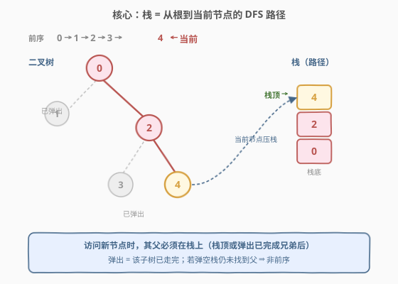
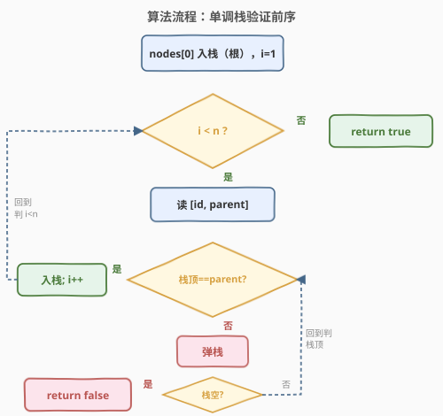
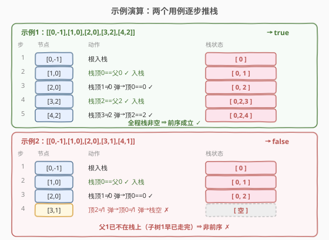

# 数组是否表示某二叉树的前序遍历

- **题目名称**：数组是否表示某二叉树的前序遍历
- **链接**：[2764. 数组是否表示某二叉树的前序遍历](https://leetcode.cn/problems/is-array-a-preorder-of-some-binary-tree/)
- **难度**：中等
- **标签**：栈、树、深度优先搜索、二叉树

## 1. 题目概述

> ⚠️ 本题为 LeetCode 付费题，题意描述根据官方示例用例与 hints 重建，可能与官方题面有出入。

给你一个二维数组 `nodes`，表示一棵**二叉树**的节点信息，其中 `nodes[i] = [id_i, parentId_i]`：

- `id_i` 是第 `i` 个节点的唯一编号；
- `parentId_i == -1` 表示该节点是**根**，否则 `parentId_i` 是其父节点的编号。

数组 `nodes` 的**给定顺序**，据称是该二叉树的某次**前序遍历**（根 → 左子树 → 右子树）。请判断这个顺序是否确实构成一棵合法二叉树的前序遍历。是则返回 `true`，否则返回 `false`。

**示例 1**：

```text
输入：nodes = [[0,-1],[1,0],[2,0],[3,2],[4,2]]
输出：true
解释：对应二叉树如下，前序遍历为 0,1,2,3,4，与给定顺序一致。
        0
       / \
      1   2
         / \
        3   4
```

**示例 2**：

```text
输入：nodes = [[0,-1],[1,0],[2,0],[3,1],[4,1]]
输出：false
解释：给定顺序 0,1,2,3,4 中，节点 3 的父是 1，但走到节点 2 时已经离开了子树 1（1 的子树已遍历完毕）。前序遍历一旦离开某棵子树就不会再回头，故 3 不可能再回到以 1 为根的子树内。
```

**约束条件**（依示例与官方 hints 推断）：

- $1 \le n \le 10^4$，`n = nodes.length`；
- 每个节点 `id` 互不相同，根恰有一个且 `parentId == -1`，且根为数组首元素；
- 输入保证描述一棵合法二叉树（每个节点最多 2 个子节点）。

> 💡 **关键信号**：题目要判定的不是「能不能**构造**出一棵树」，而是「给定顺序**是否**为已知结构树的前序」。前序遍历的精髓在于「一旦离开某棵子树就不再回头」——这恰好对应**栈**的「压栈深入、弹栈回退」行为，标签里也赫然写着 Stack。

---

## 2. 解题思路

### 2.1 暴力思路

枚举所有可能的前序遍历序列再做字符串匹配，或对树做 DFS 暴力比对节点顺序。但前序序列本就是树的天然产物，逐一比对既繁琐又丢失了「顺序」本身携带的结构信息——我们其实不需要真去遍历树，只需验证**给定顺序满足前序的结构约束**即可。

### 2.2 核心观察：栈 = 当前 DFS 路径



前序遍历用栈模拟时，**栈里始终保存着「从根到当前节点」这条路径上的全部祖先**：

- 访问一个节点 → **压栈**（深入其子树）；
- 一棵子树走完 → **弹栈**（回到父节点，准备走兄弟子树）。

因此每当我们读到数组里的下一个节点 `[id, parent]`，它的父节点 `parent` **必须此刻仍在栈上**——因为还没离开父节点所在的子树。具体地：

- 若 `parent` 恰在**栈顶**：该节点是栈顶节点的下一个孩子，合法，直接压栈；
- 若 `parent` 在栈中但**不在栈顶**：说明栈顶那些节点对应的子树已经走完，**弹出**它们直到栈顶 == `parent`，再压栈（这正是「一旦离开子树就不再回头」的体现）；
- 若一路弹到**栈空**仍未找到 `parent`：说明 `parent` 所在的子树早已遍历结束、早已弹栈，给定顺序违反了前序结构，返回 `false`。

> ⚠️ 注意「弹到栈顶 == parent 再压栈」与单调栈的联系：过程中栈里节点的入栈顺序天然是前序，弹栈相当于回退到祖先；只要中途栈变空，就意味着某节点的父已不在可达路径上。这正是官方 hints 描述的算法。

### 2.3 算法流程图



### 2.4 示例演算



对照示例可见：示例 1 中每个新节点的父都能在栈上找到（直接命中或弹掉已完成的兄弟后命中）；示例 2 中节点 3 的父 1 早已随子树 1 弹栈离开，弹到栈空仍未命中，故非法。

---

## 3. 参考代码

### C++

```cpp
class Solution {
public:
    bool isPreorder(vector<vector<int>>& nodes) {
        stack<int> st;
        st.push(nodes[0][0]);            // 根入栈
        for (int i = 1; i < (int)nodes.size(); ++i) {
            int id = nodes[i][0], parent = nodes[i][1];
            while (!st.empty() && st.top() != parent) st.pop(); // 弹掉已走完的子树
            if (st.empty()) return false;                        // 父不在路径上
            st.push(id);                                         // 深入当前节点
        }
        return true;
    }
};
```

### Python

```python
class Solution:
    def isPreorder(self, nodes: List[List[int]]) -> bool:
        st = [nodes[0][0]]                       # 根入栈
        for id_, parent in nodes[1:]:
            while st and st[-1] != parent:        # 弹掉已走完的子树
                st.pop()
            if not st:                            # 父不在路径上
                return False
            st.append(id_)                       # 深入当前节点
        return True
```

> 💡 **写法选择**：C++ 用 `std::stack` 语义直观但只能访问栈顶，正契合本题只需比较栈顶的需求；Python 直接用 `list` 当栈，`st[-1]` 访问栈顶、`pop()` 弹出。两者核心循环完全同构：`while 栈非空且栈顶≠parent: 弹栈`。

---

## 4. 复杂度分析

| 维度 | 复杂度 | 说明 |
|------|--------|------|
| 时间复杂度 | $O(n)$ | 每个节点恰好压栈、弹栈各一次，均摊 $O(1)$ 摊还 |
| 空间复杂度 | $O(n)$ | 最坏栈深 = 树高，退化为链时为 $O(n)$；平衡时 $O(\log n)$ |

$n=10^4$ 时单次线性扫描微秒级完成，无任何性能压力。

---

## 5. 扩展：为何「弹栈」天然对应「离开子树」

前序遍历的递归定义是「根 → 左 → 右」。用栈模拟时：

- 进入节点 `u`：压栈 `u`，随后递归其左子树，左子树全部处理完（栈又回到 `u` 在栈顶的状态），再递归右子树；
- 当 `u` 的右子树也处理完：弹出 `u`，回到 `u` 的父节点。

也就是说，**一个节点停留在栈中的时间，恰好等于「正在处理它及其子孙」的整段时间**。一旦弹出，意味着以它为根的整棵子树已彻底遍历完毕，后续再出现的节点绝不可能属于这棵子树。所以「父节点必须在栈上」是前序成立的充要结构约束，弹到栈空即非法——这套逻辑与 [255. 验证二叉搜索树的前序遍历序列](../0201-0300/255_验证二叉搜索树的前序遍历序列.md) 的单调栈技巧一脉相承。

---

## 6. 面试要点

1. **为什么用栈而不是直接比较父子下标？**
   - 前序的合法性依赖「子树连续」：一棵子树的全部节点必须连续出现在序列里。仅看相邻节点 `[i]` 与 `[i+1]` 的父子关系无法判断「是否已非法回到更早的子树」；栈把「当前仍处开放的路径」显式存下来，弹栈即宣告某子树关闭，才能判定后续节点无权再进入它。

2. **第一个节点为什么直接入栈、不检查 parent？**
   - 首元素是根，其 `parentId == -1`，栈为空时它就是路径的起点。官方 hints 第 2 条「Put the first node in the stack」即此意；若首元素不是根则题目输入本身不合法，不在本解法职责内。

3. **弹到栈空就一定非法吗？会不会是兄弟子树重新开始？**
   - 是的。根在栈底，栈空意味着连根都弹出了，即整棵树已遍历完。此时若还有节点要处理，它的父必然已不在任何开放路径上，违反前序结构，必为 `false`。

4. **需要额外检查「每个节点最多 2 个子节点」吗？**
   - 依官方 hints，输入保证描述一棵合法二叉树，故本题只需验证「顺序」。若放宽假设（输入可能是任意树的父子关系），可加一个 `childCount[parent]++`，超过 2 即判 `false`，仍保持 $O(n)$，但本题按 hints 不必加。

5. **如果把题改成「能否构造某二叉树使该序列为前序」呢？**
   - 那就是存在性问题了：只需验证父节点依次可达（栈非空）且每个节点孩子数 $\le 2$ 即可，骨架不变；本题更进一步要求结构与给定父子关系一致，但核心栈逻辑完全相同。

---

## 7. 同类练习题

- [255. 验证二叉搜索树的前序遍历序列](https://leetcode.cn/problems/verify-preorder-sequence-in-binary-search-tree/)（[站内题解](../0201-0300/255_验证二叉搜索树的前序遍历序列.md)）：同款单调栈验证前序，利用「弹出值上界单调递增」约束，本题的母题。
- [144. 二叉树的前序遍历](https://leetcode.cn/problems/binary-tree-preorder-traversal/)（[站内题解](../0101-0200/144_二叉树的前序遍历.md)）：前序遍历的母题，给出「栈模拟前序」的标准写法，理解了它再来看本题逆问题。
- [1008. 前序遍历构造二叉搜索树](https://leetcode.cn/problems/construct-binary-search-tree-from-preorder-traversal/)（[站内题解](../1001-1100/1008_前序遍历构造二叉搜索树.md)）：从前序序列「构造」树的姊妹题，同样是栈维护当前路径，对照「构造」与「验证」两种用法。
- [589. N 叉树的前序遍历](https://leetcode.cn/problems/n-ary-tree-preorder-traversal/)（[站内题解](../0501-0600/589_N叉树的前序遍历.md)）：前序推广到 N 叉，体会「子树连续、走完才回退」在前序中的普适性。
- [105. 从前序与中序遍历序列构造二叉树](https://leetcode.cn/problems/construct-binary-tree-from-preorder-and-inorder-traversal/)（[站内题解](../0101-0200/105_从前序与中序遍历序列构造二叉树.md)）：前序定位根、中序划分左右子树，从另一个角度加深对前序结构的理解。
